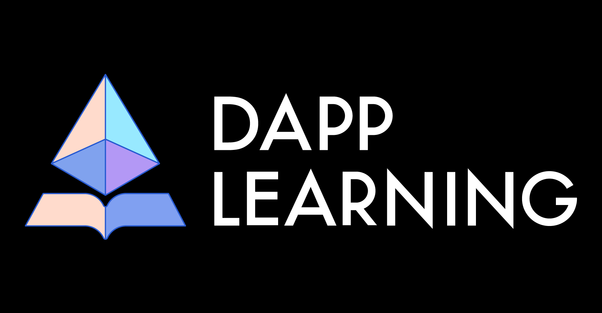
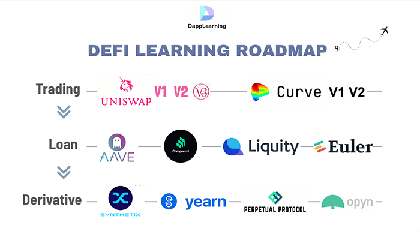
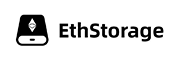

中文 / [English](https://github.com/Dapp-Learning-DAO/Dapp-Learning/blob/main/README.md)

  
  <!-- <h1>Dapp Learning</h1> -->
  <h4 align="center">
    区块链 Dapp 开发教程
  </h4>
  
通过经典项目一步一步学习区块链 Dapp 开发。

   
  

    
    
    
    
    
    <!--  -->
    <!--  -->
  

## 序 - Preface

本项目适合有一定语言基础的开发者入门区块链 DAPP 开发，由浅到深了解和开发 **DeFi, NFT, DAO, CRYPTO** 项目。

项目愿景是给**初级开发者**一个可执行且最简的区块链 **Dapp** 学习路线图，给**进阶开发者**一个可以交流和协作的平台。

本项目会成立学习小组进行任务分工，然后一起研究主流dapp项目，每周进行技术分享，输出成果会作为视频上传[Youtube](https://www.youtube.com/c/DappLearning/videos)。

项目秉持 [开源大学](https://dapplearning.org/sharing) 的理念，会以DAO治理形式管理此开源项目。本项目受[以太坊基金会](https://esp.ethereum.foundation/en/)赞助，我们会将资金奖励给项目的优秀贡献者。开源项目维护不易，欢迎[gitcoin](https://gitcoin.co/grants/3414/dapp-learning-developer-group-1)捐赠。想跟踪项目最新进展，欢迎关注我们的[推特](https://twitter.com/Dapp_Learning)和[Youtube](https://www.youtube.com/c/DappLearning/videos)。
项目由来可以阅读[《Dapp-Learning 欢迎您的加入》](https://mp.weixin.qq.com/s/xcH7b4jVIagoVby9Ci6-kA)。

此项目仍在开发中，适合各阶段的开发者加入，欢迎提 PR 来创建更多的教程项目或完善已有的教程项目🤗。项目交流可加入我们的[discord](https://discord.gg/cRYNYXqPeR) 或 [Telegram](https://t.me/joinchat/48Mp2jy4Yw40MmI1)。提交三次PR或者在[分享会](https://dapplearning.org/sharing)安排一次分享即可加入我们开发者群，持续贡献高质量PR可成为PR审核者，并参与决议项目走向。**项目管理细则**请参看[新人如何参与以及项目治理规则](./docs/dao.md)，欢迎理念相同的小伙伴加入。

Official links: 

- [Github](https://github.com/Dapp-Learning-DAO/Dapp-Learning)
- [Twitter](https://twitter.com/Dapp_Learning)
- [Discord](https://discord.gg/cRYNYXqPeR)
- [Telegram](https://t.me/joinchat/48Mp2jy4Yw40MmI1)
- [Youtube](https://www.youtube.com/channel/UCdJKZVxO55N3n2BQYXMDAcQ)
- Wechat Official Account: Dapp Learning
- [Bilibili](https://space.bilibili.com/2145417872)
- [notion](https://www.notion.so/dapplearning/Dapp-Learning-DAO-a5f7b5e29bb744578f1c1ce99783cf2d)
- [Sharing Meeting](https://dapplearning.org/sharing)
- [Gitcoin](https://gitcoin.co/grants/3414/dapp-learning-developer-group-1)
- [Project Fund Management](https://app.safe.global/matic:0x2A6D09B3b11E5455a37F907f2ec885E0Be704779/balances)
- [linktr](https://linktr.ee/dapplearning)

技术栈: 

- `web3.js`
- `ethers.js (hardhat)`
- `web3.py (Brownie)`
- `Java` （可选）
- `Rust` （可选）
- `Go` （可选）

## 项目结构

项目分为 **基础任务** 和 **项目任务** 两部分

- **基础任务**
  是熟悉和集成区块链开发所必需的基本工具组件(如ERC标准, oracle, graph, ipfs)
- **项目任务**
  是研究主流 DeFi, NFT, DAO, CRYPTO 的经典项目让开发者深入真实项目开发，我们会成立学习小组进行任务分工，一起讨论和研究项目源码。

## 准备工作 - Preparatory Work

**基础知识预备**

- 进入正式的 Dapp 开发学习前, 建议新手开发者学习 以太坊 及 Solidity 相关的基本知识。
  更多资料可参考 [基础知识预备](./docs/basic-knowledge.md) , 供各位新手小伙伴学习参考。
- 开发者进入web3技能描述大全 https://www.devpill.me/

**开发工具**

- 工欲善其事, 必先利其器。 请先熟悉基本工具的使用。
  可参考 [开发工具推荐](./docs/develop-tools.md) 查看当下主流的区块链开发工具。

**推荐阅读**

我们整理了区块链相关的经典书籍，帮助各位开发者深入了解当下区块链背后的人文思潮。

- 《[主权个人](https://www.amazon.sg/Sovereign-Individual-Mastering-Transition-Information/dp/0684832720)》（Sovereign Individuals，可观看我们的视频分享[《主权个人》读书交流会](https://www.youtube.com/watch?v=f-Hcd_Mfcxo&t=452s) 以及关注 [不懂经](https://mp.weixin.qq.com/mp/homepage?__biz=MzU4NDQwMTc3MQ==&hid=7&sn=124258360d0a530008a41ea32e7c2bf2&scene=1&devicetype=android-29&version=28000b3b&lang=en&nettype=WIFI&ascene=7&session_us=gh_353f7f41a447&wx_header=1) 公众号阅读）, [中译本下载链接](https://drive.google.com/file/d/1f113cCsSKtH_05S5gJCmoBvqItufH-_j/view?usp=sharing)
- 《[网络国家](https://thenetworkstate.com/)》 [中译本下载地址](https://nishino.gitbook.io/wang-luo-guo-jia/)
- 推荐了解奥地利学派，[Hayek生平介绍](https://mp.weixin.qq.com/s/p1UZdt5BAQVJ3kl_CniwKQ)
- 系列文章：[给区块链爱好者的奥派经济学课](https://mp.weixin.qq.com/mp/appmsgalbum?__biz=MzU0ODk1MTE1MA==&action=getalbum&album_id=1986143111768489985&scene=173&from_msgid=2247484102&from_itemidx=1&count=3&nolastread=1#wechat_redirect)
- [《货币未来》](https://weread.qq.com/web/reader/722328e071f5cee17229964) ：你应该了解的货币史

同时欢迎大家添加推荐书籍，请在此文档 [书籍推荐](./docs/books.md) 中录入

**加密课程**

我们会推荐一些国外顶尖大学和以太坊社区的加密课程，帮助开发者系统性的了解区块链和加密货币。

- [MIT Online Course: Blockchain and Money by Prof. Gary Gensler](https://ocw.mit.edu/courses/sloan-school-of-management/15-s12-blockchain-and-money-fall-2018/video-lectures/)
- [Berkeley Online Course:](https://berkeley-defi.github.io/f21)   [Defi Learning](https://defi-learning.org/)
- [Standford Online Course: CS 251 Bitcoin and Cryptocurrencies](https://cs251.stanford.edu/syllabus.html)

其他优质的课程也欢迎提 PR 在此文档[加密课程推荐](./docs/crypto-course.md) 中录入。
我们也成立翻译小组翻译这些公开课程，总结课程笔记，节省小伙伴时间。中文笔记请查看：[MIT课程笔记整理](https://mp.weixin.qq.com/mp/appmsgalbum?__biz=MzAwNTAxMzMzMA==&action=getalbum&album_id=2241099480056119298#wechat_redirect
对翻译小组感兴趣小伙伴欢迎加入，请关注我们公众号 Dapp-Learning 联系我们。

## 基础任务 - Basic Tasks

通过以下基础任务，了解开发 Dapp 的基本工具和开发知识。
DAPP架构请参考文章--[从架构维度看Web2.0与Web3.0应用之别](https://zhuanlan.zhihu.com/p/414635679?utm_source=wechat_session&utm_medium=social&utm_oi=778564687968092160&s_r=0)
学习并本地运行 前20 个task，可以升级关注**项目任务**。
欢迎提 PR 来创建更多的教程项目或完善已有的教程项目🤗

⬜ 表示任务未开始
⌛ 表示任务正在进行中
✅ 表示任务已完成

01. [deploy contract with web3.js](basic/01-web3js-deploy) ✅
02. [create transaction with web3.js](basic/02-web3js-transaction) ✅
03. [call ERC20 contract with web3.js](basic/03-web3js-erc20) ✅
04. [truffle](basic/04-web3js-truffle) ✅
05. [call ERC20 contract with ethers.js](basic/05-ethersjs-erc20) ✅
06. [test contract with waffle and ethers.js](basic/06-ethersjs-waffle) ✅
07. [hardhat](basic/07-hardhat) ✅
08. [graph](basic/08-hardhat-graph) ✅
09. [react（metamask)](basic/09-hardhat-react) ✅
10. [ERC721+ ERC1155 + ipfs](basic/10-hardhat-ipfs-erc721) ✅
11. [react + express + hardhat](basic/11-react-express-hardhat) ✅
12. [Crowdfund](basic/12-token-crowdfund) ✅
13. [decentralized exchange](basic/13-decentralized-exchange) ✅
14. [chainlink-api](basic/14-chainlink-price-feed) ✅
15. [nft-blindbox-chainlink-vrf](basic/15-nft-blindbox-chainlink-vrf) ✅
16. [nft auction & exchange](basic/16-nft-auction-exchange) ✅
17. [wallet development](basic/17-etherjs-wallet-develop) ✅
18. [web3.py](basic/18-web3py) ✅
19. [brownie](basic/19-brownie) ✅
20. [flash-loan](basic/20-flash-loan) ✅
21. [aave-uni-lender](basic/21-aave-uni-loan) ✅
22. [zk-snarkjs](basic/22-zk-snarkjs) ✅
23. [ERC865 & ERC875](basic/23-erc865-and-erc875) ✅
24. [Upgradeable-contract](basic/24-upgradeable-contract) ✅
25. [multi-sig-wallet](basic/25-multi-sig-wallet) ✅
26. [Quadratic vote & Gitcoin](basic/26-quadratic-vote%26gitcoin) ✅
27. [Arbitrum layer2](basic/27-Arbitrum-layer2) ✅
28. [Optimism layer2](basic/28-optimism-layer2) ✅
29. [Polygon(matic) layer2](basic/29-Polygon(matic)-layer2) ✅
30. [zksync layer2](basic/30-zksync-layer2) ✅
31. [StarkNet](basic/31-starkNet-layer2) ⌛
32. [chainlink-keeper](basic/32-chainlink-keeper) ✅
33. [pooltogether](basic/33-pooltogether) ⌛
34. [subgraph](basic/34-subgraph) ⬜
35. [duneanalytics & nansen](basic/35-dune-analytics-nansen) ⬜
36. [zk-rollup](https://github.com/rollupnc/RollupNC) ✅
37. [Charm.fi](basic/37-charm.fi) ✅
38. [alloy-Rust](basic/38-alloy-rust) ✅
39. [Multicall](basic/39-Multicall) ✅
40. [Flashbots provider with ethers.js](basic/38-Flashbots-and-Eden) ⬜
41. [Foundry](basic/41-foundry/README.md)
42. [Merkle-distributor airdrop](basic/42-merkle-distributor-airdrop)  ✅
43. [Ethereum Virtual Machine Opcodes](basic/43-EVM) ⌛ 
44. [JavaScript Cryptography](https://blog.sessionstack.com/how-javascript-works-cryptography-how-to-deal-with-man-in-the-middle-mitm-attacks-bf8fc6be546c) ✅
45. [Ethereum2.0](basic/45-Ethereum2.0) ⌛
46. [NFT Floor Perps](https://www.paradigm.xyz/2021/08/floor-perps/) ⬜
47. [TWAMM: Time-Weighted Average Market Maker](https://www.paradigm.xyz/2021/07/twamm/) ⬜
48. [ZK Voting](basic/48-ZK-Voting) ⌛
49. [Account Abstraction](basic/49-Account-Abstraction)  ✅
50. [solidity security](basic/50-solidity-security)  ✅
51. [sniper](https://github.com/Supercycled/cake_sniper.git) ⬜
52. [Governace](https://github.com/withtally/safeguard)  ⬜
53. [Freelancer's Smart Contract](basic/53-freelancer) ✅
54. [Cryptovoxels](https://zhuanlan.zhihu.com/p/379249411) ⬜
55. [PBFT](https://medium.com/loom-network-chinese/%E4%BA%86%E8%A7%A3%E5%8C%BA%E5%9D%97%E9%93%BE%E7%9A%84%E5%9F%BA%E6%9C%AC-%E7%AC%AC%E4%B8%80%E9%83%A8%E5%88%86-%E6%8B%9C%E5%8D%A0%E5%BA%AD%E5%AE%B9%E9%94%99-byzantine-fault-tolerance-8a1912c311ba) ⬜
56. [IDO](https://github.com/gnosis/ido-contracts) ⬜
57. [Orbit model](https://github.com/orbit-love/orbit-model) ⬜
58. [Snapshot](basic/58-Snapshot/readme.md) ⌛
59. [wagmi and nextjs](basic/59-wagmi-and-nextjs) ⌛
60. [Referral Code](https://developers.thundercore.com/docs/referral-contract/) ⬜
61. [ENS](basic/61-ENS) ✅
62. [Tenderly](https://dashboard.tenderly.co/explorer)
63. [HTLC-crosschain](basic/63-htlc-crosschain) ✅
64. [state channel](https://ethereum.org/en/developers/docs/scaling/state-channels/)  ⬜
65. [ZK-NFT](https://github.com/kevinz917/zk-NFT)
66. [Kleros](https://kleros.io/)
67. [Go-Ethereum Code Analysis](basic/67-Go-Ethereum-Code-Analysis/readme.md)
68. [Config discord with Collab.land](basic/68-config-discord-with-Collab.land)  ✅
69. [Decentralized OTC](https://github.com/DOTCPro)
70. [Arweave file upload with Bundlr Client](basic/70-arweave-file-upload-with-bundlr/README.md)
71. [NYM](https://myz1237.substack.com/p/nymwhitepaper?r=uaq4w&utm_campaign=post&utm_medium=web&utm_source=) ⬜
72. [Unlock protocol](https://docs.unlock-protocol.com/unlock/developers/unlock-platform)
73. [onchainNFT](https://github.com/Park-City-Utah/onChainNFT)
74. [erc20-meta-token](https://github.com/0xsequence/erc20-meta-token)
75. [golang-dapp](basic/75-golang-dapp) ✅
76. [Push Protocol](https://docs.epns.io/developers)

## 项目任务

**准备工作**：
此部分针对有一定基础开发者，选取主流优质项目进行源码剖析和 code review。
可采用小组协作方式将项目部署至测试网，以此为基础在dapp learning社区进行分享。大型defi项目新颖且内容庞大，我们建议分工协作方式进行，如一人看白皮书，一人负责前端，一人负责合约，一人负责数据展示。
开发者可以在开发群里发起项目研究倡议，建立小组，进行协作。

## DeFi 进阶

**建议先阅读DEFI经典书籍:**

- [How to DeFi](https://assets.coingecko.com/books/how-to-defi/How_to_DeFi_Chinese.pdf)
- [How to DeFi:Advanced](https://nigdaemon.gitbook.io/how-to-defi-advanced-zhogn-wen-b/)

**DEFI学习路线图：**

交易 -> 借贷 ->衍生品

可以参考我们学习小组的学习路线图，配合视频学习更佳：

- 交易： uniV1(task13) -> uniV2 -> uniV3 -> CurveV1 -> CurveV2
- 借贷： Aave -> Compound -> Liquity -> Euler
- 衍生品： SNX -> YFI -> Perpetual

1. [UniswapV2](defi/Uniswap-V2/readme.md) ✅
2. [UniswapV3](defi/Uniswap-V3/readme.md) ✅
3. [CurveV1](defi/Curve-V1/README.md) ⌛
4. [CurveV2](defi/Curve-V2/readme.md) ⌛
5. [Compound](defi/Compound/readme.md) ✅
6. [Aave](https://docs.aave.com/portal/)  ✅
7. [Liquity](defi/Liquity/) ⌛
8. [Euler](defi/Euler/readme.md) ⌛
9. [SNX](https://github.com/Synthetixio)⌛
10. [YFI](https://yearn.finance/)⌛
11. [Perpetual Protocol](https://www.chainnews.com/articles/163436212237.htm)⌛
12. [Sushi](https://docs.sushi.com/) ✅
13. [OPYN](https://v2.opyn.co/)⌛
14. [Alchemix](https://github.com/alchemix-finance/alchemix-protocol) ✅
15. [AMPL](https://roninchow.gitbook.io/ampleforth-cn/technology) [👉 认领这个 Task](https://github.com/rebase-network/Dapp-Learning/issues/new)
16. [RAI](defi/RAI/)⌛
17. [DYDX](https://dydx.exchange/)[👉 认领这个 Task](https://github.com/rebase-network/Dapp-Learning/issues/new)
18. [INDEX](https://mp.weixin.qq.com/s/PXOY3G6AIbhzRUptjYoWIw)[👉 认领这个 Task](https://github.com/rebase-network/Dapp-Learning/issues/new)
19. [DODO](https://dodoex.github.io/docs/zh/docs/tradeApi) [👉 认领这个 Task](https://github.com/rebase-network/Dapp-Learning/issues/new)
20. [MakerDao](https://zhuanlan.zhihu.com/p/41889079)⌛
21. [0x-protocol](defi/0x-protocol/README.md) [👉 认领这个 Task](https://github.com/rebase-network/Dapp-Learning/issues/new)
22. [Bancor](https://bancor.network/)⌛
23. [Set](https://www.tokensets.com/)
24. [Dhedge](https://docs.dhedge.org/dhedge-protocol/managing-on-v2)
25. [Element](https://app.element.fi/fixedrates)

## NFT 进阶

- 1. [OpenSea](nft/opensea/readme.md) [👉 认领这个 Task](https://github.com/Dapp-Learning-DAO/Dapp-Learning/issues/new)
- 2. [aavegotchi](https://aavegotchi.com/) [👉 认领这个 Task](https://github.com/Dapp-Learning-DAO/Dapp-Learning/issues/new)
- 3. [Loot NFT Distribute](nft/loot-nft/README.md)
- 4. [Rarible](https://docs.rarible.org/overview/union/)
- 5. [Zora](https://docs.zora.co/)
- 6. [Alchemy](https://www.alchemy.com/nft-api)

## DAO 进阶

- 1. [Aragon](dao/Aragon/readme.md)
- 2. Augur [👉 认领这个 Task](https://github.com/Dapp-Learning-DAO/Dapp-Learning/issues/new)
- 3. [DAOHaus](https://daohaus.club/)
- 4. [DAOstack](https://daostack.io/)  [👉 认领这个 Task](https://github.com/Dapp-Learning-DAO/Dapp-Learning/issues/new)
- 5. [Gnosis](https://github.com/gnosis)[👉 认领这个 Task](https://github.com/Dapp-Learning-DAO/Dapp-Learning/issues/new)

## Crypto 进阶

请先阅读书籍：
[《图解密码技术》](https://book.douban.com/subject/26822106/)
项目列表：

- 01.[ECC](./crypto/ECC)
- 02.[PLONK](./crypto/PLONK)
- 03.[tornado](https://medium.com/taipei-ethereum-meetup/tornado-cash-%E5%AF%A6%E4%BE%8B%E8%A7%A3%E6%9E%90-eb84db35de04)
- 04.[zk_snark](https://arxiv.org/pdf/1906.07221.pdf)
- 05.[js crypto](https://github.com/fireship-io/node-crypto-examples)
  [👉 认领这个 Task](https://github.com/Dapp-Learning-DAO/Dapp-Learning/issues/new)
- [MINA](https://minaprotocol.com/)
- [ZETH](https://github.com/clearmatics/zeth)

## 智能合约安全

1. 常用安全工具

- [Slither](https://github.com/crytic/slither)
- [Mythril](https://github.com/ConsenSys/mythril)
- [Securify](https://github.com/eth-sri/securify2)

2. CTF 训练营

- [Ethernaut](https://ethernaut.openzeppelin.com/)
- [Damn-Vulnerable-Defi](https://github.com/OpenZeppelin/damn-vulnerable-defi/blob/master/contracts/DamnValuableToken.sol) | [题解](security/Damn-Vulnerable-DeFi-wp.md)
- [Paradigm-ctf](https://github.com/paradigm-operations/paradigm-ctf-2021)
- [Smart Contract CTF](https://blockchain-ctf.securityinnovation.com)

3. 安全开发实践

- [Solidity 安全开发实践](https://github.com/slowmist/Knowledge-Base/blob/master/translations/solidity-security-comprehensive-list-of-known-attack-vectors-and-common-anti-patterns_zh-cn.md)

4. 学习资源合集

- [Awesome Blockchain Security](https://github.com/xxxeyJ/Awesome-Blockchain-Security)
- [Immunefi 学习资源](https://immunefi.com/learn/)

## Cryptocurrency Jobs Websites

推荐一些比较好cryptocurrency jobs网站

- https://cryptocurrencyjobs.co/
- https://angel.co/jobs
- https://www.paradigm.xyz/opportunities/
- https://web3.career/
- https://portfoliojobs.a16z.com/jobs?markets=Crypto

## Hackathons

参与黑客松增加实践经验，可参与有：

- [Gitcoin](https://gitcoin.co/hackathon/)
- [boilerplate](https://github.com/ethereum-boilerplate/ethereum-boilerplate)
- [Immunefi 漏洞赏金平台](https://immunefi.com/)
- [Code4rena 漏洞赏金平台](https://code4rena.com/)

## 如何参与以及DAO治理

新人如何参与到我们项目，请参考链接 [如何参与](./docs/dao.md)

## 项目生态

Dapp-Learning 有系列衍生项目及共同维护项目, 参考 [相关项目](./docs/relative-projects.md) 详细了解 Dapp-Learning 项目生态.

## 常见问题

测试币申请，安装和使用问题，请参考链接 [常见问题](./docs/TROUBLE_SHOOTING.md)

## 社区捐助

欢迎感兴趣的小伙伴参与共建，开源项目维护不易，我们欢迎捐助。
gitcoin grant地址： [Dapp-Learning gitcoin grant](https://gitcoin.co/grants/3414/dapp-learning-developer-group-1)

捐助地址：

- 以太坊主网/zkSync/Arbitrum：
  0x1F7b953113f4dFcBF56a1688529CC812865840e1
- Polygon[多签钱包](https://app.safe.global/matic:0x2A6D09B3b11E5455a37F907f2ec885E0Be704779 ): 0x2A6D09B3b11E5455a37F907f2ec885E0Be704779

**polygon网络上我们已生成多签钱包，由核心贡献者管理**

我们会议DAO形式治理项目，定期按 PR 提交记录分配资金给开发者，同时项目会给PR贡献者发放nft作为纪念奖品。

## 合作伙伴

 

  
  &nbsp;&nbsp;
  &nbsp;&nbsp;
  &nbsp;&nbsp;
  &nbsp;&nbsp;
  &nbsp;&nbsp;
  &nbsp;&nbsp;
  &nbsp;&nbsp;
  
  &nbsp;&nbsp;
  &nbsp;&nbsp;
  &nbsp;&nbsp;
  &nbsp;&nbsp;
  

 

  
  &nbsp;&nbsp;
  &nbsp;&nbsp;
  &nbsp;&nbsp;
  
  &nbsp;&nbsp;
  &nbsp;&nbsp;
  &nbsp;&nbsp;
  

 
 

## 赞助伙伴

感谢以下组织对本开源项目的无偿捐助(排名不分先后)。

 

  &nbsp;&nbsp;&nbsp;&nbsp;
  &nbsp;&nbsp;&nbsp;&nbsp;
  &nbsp;&nbsp;&nbsp;&nbsp;
  

  &nbsp;&nbsp;&nbsp;&nbsp;
  &nbsp;&nbsp;&nbsp;&nbsp;
  &nbsp;&nbsp;&nbsp;&nbsp;
  

  &nbsp;&nbsp;&nbsp;&nbsp;
  &nbsp;&nbsp;&nbsp;&nbsp;
  &nbsp;&nbsp;&nbsp;&nbsp;
  

  &nbsp;&nbsp;&nbsp;&nbsp;
  
  &nbsp;&nbsp;&nbsp;&nbsp;
  

 

## 贡献者

  <h4 align="center">
    感谢 Dapp Learning 的贡献者们
  </h4>
  

 
声明：DappLearning是非营利学习型组织，目前没有参与任何商业行为或为商业项目、机构背书。
