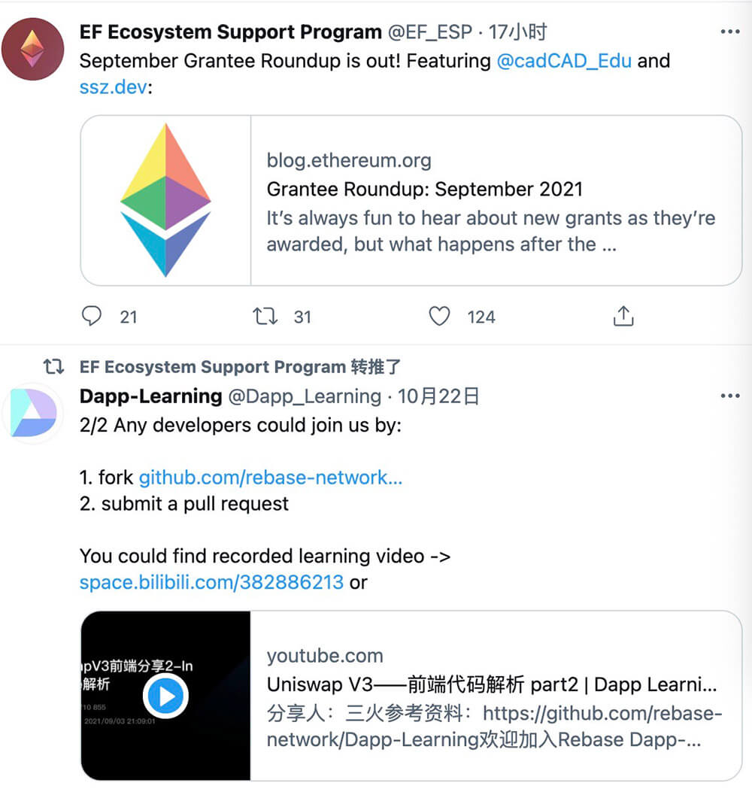

  
  <!-- <h1>Dapp Learning</h1> -->
  <h4 align="center">
    Definitive Guide for Decentralized-app(Dapp) Development on Blockchain
  </h4>
  
Step-by-step Dapp practice through actual projects.

## Preface

We are designed for developers with basic skills to step into blockchain DAPP development, where they can get close to **DeFi, NFT, DAO, CRYPTO** projects. We hope we could not only give **junior developers** an executable and simplest blockchain **DAPP** learning roadmap, but also present **advanced developers** with a platform for communication and cooperation.

We, incubated from [rebase university](https://docs.qq.com/doc/DS0hYTUJiUVlqVXVQ),  are a learning group to study the mainstream DAPP projects and share thoughts and comments every week. Here, each one is charged with specific tasks. The weekly meetups will be recorded and uploaded to  [the rebase account](https://space.bilibili.com/382886213) on Bilibili.

We adhere to the concept of [open source university](https://github.com/rebase-network/Rebase-University) and follow DAO's governance. Currently, we are sponsored by [Ethereum foundation](https://esp.ethereum.foundation/en/), and the funds will be awarded to whoever makes big contributions to us. Please follow us on Twitter [@Dapp_Learning](https://twitter.com/Dapp_Learning) or WeChat Official Account [Welcome to Dapp-Learning](https://mp.weixin.qq.com/s/79eRMtB_yz8G6H8_saCeLw) to keep track of our latest progress.

The project is still under development, and contributors are welcomed from all background. Feel free to send us pull requests to improve tutorial projects, set up more new tutorials, or even just to fix the minor typos 🤗.

Join our developer communication group by submitting PR or sharing at [rebase university](https://docs.qq.com/doc/DS0hYTUJiUVlqVXVQ). Once you submit three PRs, you will be promoted to a pull request reviewer, participating in making decisions about project future directions. For more **project management rules**, please see [how new members participate and project governance rules](https://github.com/rebase-network/Dapp-Learning/blob/main/docs/dao.md). Welcome to join us if you share the same value.

Official links

- [Github](https://github.com/rebase-network/Dapp-Learning)
- [Twitter](https://twitter.com/Dapp_Learning)
- [discord](https://discord.gg/cRYNYXqPeR)
- [Youtube](https://www.youtube.com/channel/UCdJKZVxO55N3n2BQYXMDAcQ)
- Wechat Official Account: Dapp Learning
- [Bilibili](https://space.bilibili.com/382886213)
- [notion](https://dapp-learning.notion.site/Dapp-Learning-Homepage-79545c9d4ffe4e77a8cbc1c55e77b551)
- [Sharing Meeting](https://www.notion.so/18d05e02771f4a38970d152e3ee30ff9)
- [Gitcoin](https://gitcoin.co/grants/3414/dapp-learning-developer-group-1)
- [Project Fund Management](https://polygon.gnosis-safe.io/app/#/safes/0x2A6D09B3b11E5455a37F907f2ec885E0Be704779/balances)
- [linktr](https://linktr.ee/dapplearning)

Technology Stack: 

- `web3.js`
- `ethers.js (Hardhat)`
- `web3.py (Brownie)`
- `Java` (Optional)
- `Rust` (Optional)
- `Go` (Optional)

## Project structure
The project is divided into two parts: **Basic task** and **Project task**
- **Basic task**
Basic tools to familiarize and integrate blockchain development (e.g. ERC standard, Oracle, GRAPH, IPFS)
- **Project task**
Case studies of the classics of mainstream DeFi, NFT, Dao and crypto that enlightens developers to deep dive into dapp development. We will organzie study groups to discuss and study project together.

## Preparatory Work
**Ramp up**
- Developers new to dapp are strongly encoraged to learn the basics of Ethereum and Solidity before embarking on formal development.
You can refer to [basic knowledge preparation](./docs/basic-knowledge.md) to ramp up.

**Development tool**
- Sharp tools make good work. Familiarize yourself with basic development tools.
Refer to [recommended development tools](./docs/develop-tools.md) to view the current mainstream blockchain development tools.

**Recommended reading**
We have compiled a list of classic blockchain-related books to help developers gain an in-depth understanding of the current humanities behind blockchain.
- *Sovereign Individuals*, Follow public account[Unknown Scripture](https://mp.weixin.qq.com/mp/homepage?__biz=MzU4NDQwMTc3MQ==&hid=7&sn=124258360d0a530008a41ea32e7c2bf2&scene=1&devicetype=android-29&version=28000b3b&lang=en&nettype=WIFI&ascene=7&session_us=gh_353f7f41a447&wx_header=1).
- *The Austrian School of Thought* is recommended,[Hayek Life introduction](https://mp.weixin.qq.com/s/p1UZdt5BAQVJ3kl_CniwKQ).
- Series articles [Austrian economics school of thought for blockchain enthusiasts](https://mp.weixin.qq.com/mp/appmsgalbum?__biz=MzU0ODk1MTE1MA==&action=getalbum&album_id=1986143111768489985&scene=173&from_msgid=2247484102&from_itemidx=1&count=3&nolastread=1#wechat_redirect)
- *[Political Economy](https://www.marxists.org/subject/economy/index.htm)*

At the same time, feel free to keep expanding this [book list](./docs/books.md).

**Encryption course**

We will compile some crypto courses from top universities abroad and the Ethereum community to help developers systematically understand blockchain and cryptocurrencies.
- [MIT Online Course: Blockchain and Money by Prof. Gary Gensler](https://ocw.mit.edu/courses/sloan-school-of-management/15-s12-blockchain-and-money-fall-2018/video-lectures/)
- [Berkeley Online Course:](https://berkeley-defi.github.io/f21)   [Defi Learning](https://defi-learning.org/)
- [Standford Online Course: CS 251 Bitcoin and Cryptocurrencies](https://cs251.stanford.edu/syllabus.html)

If you have other high-quality course recommendations, we hope you can make a suggestion and add it in our course repo: [Recommendations for cryptographic courses](./docs/crypto-course.md).

## Basic Tasks

Understand the basic tools and development knowledge of developing DAPP through the following basic tasks.
For DAPP architecture, please refer to the article--[the difference between Web2.0 and Web3.0 applications from the architectural dimension](https://zhuanlan.zhihu.com/p/414635679?utm_source=wechat_session&utm_medium=social&utm_oi=778564687968092160&s_r=0).
Learn and run the first 20 tasks locally and upgrade to focus on **project tasks**
You are welcome to PR improvements to existing tutorial projects or to create more tutorial projects

⬜ Task Not Start
⌛ Task Processing
✅ Task Finish

01. [deploy contract with web3.js](basic/01-web3js-deploy/README.md) ✅
02. [create transaction with web3.js](basic/02-web3js-transaction/README.md) ✅
03. [call ERC20 contract with web3.js](basic/03-web3js-erc20/README.md) ✅
04. [truffle](basic/04-web3js-truffle/README.md) ✅
05. [call ERC20 contract with ethers.js](basic/05-ethersjs-erc20/README.md) ✅
06. [test contract with waffle and ethers.js](basic/06-ethersjs-waffle/README.md) ✅
07. [hardhat](basic/07-hardhat/README.md) ✅
08. [graph](basic/08-hardhat-graph/README.md) ✅
09. [react（metamask)](basic/09-hardhat-react/README.md) ✅
10. [ERC721+ ERC1155 + ipfs](basic/10-hardhat-ipfs-erc721/README.md) ✅
11. [react + express + hardhat](basic/11-react-express-hardhat/README.md) ✅
12. [Crowdfund](basic/12-token-crowdfund/README.md) ✅
13. [decentralized exchange](basic/13-decentralized-exchange/README.md) ✅
14. [chainlink-api](basic/14-chainlink-price-feed/README.md) ✅
15. [nft-blindbox-chainlink-vrf](basic/15-nft-blindbox-chainlink-vrf/readme.md) ✅
16. [nft auction & exchange](basic/16-nft-auction-exchange/README.md) ✅
17. [wallet development](basic/17-etherjs-wallet-develop/readme.md) ✅
18. [web3.py](basic/18-web3py/README.md) ✅
19. [brownie](basic/19-brownie/README.md) ✅
20. [flash-loan](basic/20-flash-loan/readme.md) ✅
21. [scaffold-Lender](basic/21-scaffold-lender/README.md) ✅
22. [zk-snarkjs](basic/22-zk-snarkjs/readme.md) ✅
23. [ERC865 & ERC875](basic/23-erc865-and-erc875/README.md) ✅
24. [Upgradeable-contract](basic/24-upgradeable-contract/README.md) ✅
25. [multi-sig-wallet](basic/25-multi-sig-wallet/readme.md) ✅
26. [Quadratic vote](basic/26-quadratic-vote/README.md) ✅
27. [Arbitrum layer2](basic/27-Arbitrum-layer2/README.md) ✅
28. [optimism layer2](basic/28-optimism-layer2/readme.md) ⬜
29. [Polygon(matic) layer2](basic/29-Polygon(matic)-layer2/readme.md) ✅
30. [zksync layer2](basic/30-zksync-layer2/readme.md) ⬜
31. [duneanalytics & nansen](basic/31-dune-analytics-nansen/readme.md) ⬜
32. [chainlink-keeper](basic/32-chainlink-keeper/README.md) ✅
33. [pooltogether](basic/33-pooltogether/README.md) ⌛
34. [subgraph](basic/34-subgraph/readme.md) ⬜
35. [NYM](https://myz1237.substack.com/p/nymwhitepaper?r=uaq4w&utm_campaign=post&utm_medium=web&utm_source=) ⬜
36. [NFT IPFS](basic/36-nft-ipfs/README.md) ✅
37. [Charm.fi](https://github.com/charmfinance/alpha-vaults-contracts) ✅
38. [Flashbots provider with ethers.js](https://github.com/flashbots/ethers-provider-flashbots-bundle) ⬜
39. [Ethlend](https://www.youtube.com/watch?v=Pi-Qva6Fg3I) ⬜
40. [snapshot](basic/40-snapshot/README.md) ⌛
41. [NFT farming](https://superfarm.com/farms) ⬜
42. [merkle-distributor airdrop](https://github.com/Uniswap/merkle-distributor/blob/master/contracts/MerkleDistributor.sol)  ✅
43. [front running](https://github.com/Supercycled/cake_sniper)  ⬜
44. [JavaScript Cryptography](https://blog.sessionstack.com/how-javascript-works-cryptography-how-to-deal-with-man-in-the-middle-mitm-attacks-bf8fc6be546c) ⬜
45. [proxy contract](https://zhuanlan.zhihu.com/p/34690916) ⬜
46. [NFT Floor Perps](https://www.paradigm.xyz/2021/08/floor-perps/) ⬜
47. [TWAMM: Time-Weighted Average Market Maker](https://www.paradigm.xyz/2021/07/twamm/) ⬜
48. [state channel](https://ethereum.org/en/developers/docs/scaling/state-channels/)  ⬜
49. [sniper](https://github.com/Supercycled/cake_sniper.git) ⬜
50. [solidity security](basic/50-solidity-security/readme.md)  ✅
51. [alchemix](https://github.com/alchemix-finance/alchemix-protocol) ✅
52. [Governace](https://github.com/withtally/safeguard)  ⬜
53. [Freelancer's Smart Contract](https://github.com/jacksonng77/freelancer) ✅
54. [Cryptovoxels](https://zhuanlan.zhihu.com/p/379249411) ⬜
55. [PBFT](https://medium.com/loom-network-chinese/%E4%BA%86%E8%A7%A3%E5%8C%BA%E5%9D%97%E9%93%BE%E7%9A%84%E5%9F%BA%E6%9C%AC-%E7%AC%AC%E4%B8%80%E9%83%A8%E5%88%86-%E6%8B%9C%E5%8D%A0%E5%BA%AD%E5%AE%B9%E9%94%99-byzantine-fault-tolerance-8a1912c311ba) ⬜
56. [IDO](https://github.com/gnosis/ido-contracts) ⬜
57. [Orbit model](https://github.com/orbit-love/orbit-model) ⬜
58. [Ethereum Virtual Machine Opcodes](basic/58-opcode/readme.md) ⌛
60. [web3.0 dapp](basic/59-web3-dapp) ⌛
61. [ENS](https://app.ens.domains/) ⌛
62. [Referral Code](https://developers.thundercore.com/docs/referral-contract/) ⬜
63. [HTLC-crosschain](https://yuanxuxu.com/2020/08/05/%E5%8C%BA%E5%9D%97%E9%93%BE%E8%B7%A8%E9%93%BE%E6%8A%80%E6%9C%AF%E4%B9%8B%E5%93%88%E5%B8%8C%E6%97%B6%E9%97%B4%E9%94%81/) ⬜
64. [Web3-Rust](https://github.com/tomusdrw/rust-web3) ⬜

Welcome to submit pull request,[Add a new basic task or update the above task](https://github.com/rebase-network/Dapp-Learning/issues/new)

## Advanced task

**The preparatory work**:
  For developers with a certain foundation, this part selects mainstream high-quality projects for source code analysis and code review
  The project can be deployed to the test network collaboratively and shared with the Rebase community as a basis. Large DEFI projects are novel and large in content, so we suggest a division of labor and cooperation, such as one person to read the white paper, one person to be responsible for the front end, one person to be responsible for the contract, and one person to be responsible for data presentation.
  Developers can initiate project research initiatives, form groups, and collaborate within development groups. This section is recommended as a submodule introduction.

## DeFi advanced tasks
The DEFI bibles will set you up with a good fundamental understandings of the DEFI system.
  [How to DeFi](https://store.coingecko.com/collections/frontpage/products/how-to-defi-beginner)
  [How to DeFi:Advanced](https://store.coingecko.com/collections/frontpage/products/how-to-defi-advanced)

01. [UniswapV2](defi/Uniswap-V2/readme.md) ✅
02. [UniswapV3](defi/Uniswap-V3/readme.md) ✅
03. [Compound](defi/Compound/readme.md) [👉 Pick up this task](https://github.com/rebase-network/Dapp-Learning/issues/new) ⌛
04. [Aave](https://docs.aave.com/portal/)  ⌛
05. [SNX](https://github.com/Synthetixio) [👉 Pick up this task](https://github.com/rebase-network/Dapp-Learning/issues/new)
06. [Curve](defi/Curve/README.md) ⌛
07. [0x-protocol](defi/0x-protocal/README.md) [👉 Pick up this task](https://github.com/rebase-network/Dapp-Learning/issues/new)
08. [Bancor](https://bancor.network/) [👉 Pick up this task](https://github.com/rebase-network/Dapp-Learning/issues/new)
09. [YFI](https://yearn.finance/) [👉 Pick up this task](https://github.com/rebase-network/Dapp-Learning/issues/new)
10. [AMPL](https://roninchow.gitbook.io/ampleforth-cn/technology) [👉 Pick up this task](https://github.com/rebase-network/Dapp-Learning/issues/new)
11. [Perpetual Protocol](https://www.chainnews.com/articles/163436212237.htm) [👉 Pick up this task](https://github.com/rebase-network/Dapp-Learning/issues/new)
12. [DYDX](https://dydx.exchange/)[👉 Pick up this task](https://github.com/rebase-network/Dapp-Learning/issues/new)
13. [OPYN](https://v2.opyn.co/)
14. [INDEX](https://mp.weixin.qq.com/s/PXOY3G6AIbhzRUptjYoWIw)[👉 Pick up this task](https://github.com/rebase-network/Dapp-Learning/issues/new)
15. [DODO](https://dodoex.github.io/docs/zh/docs/DODO-Economics-102) [👉 Pick up this task](https://github.com/rebase-network/Dapp-Learning/issues/new)
16. [MakerDao](https://zhuanlan.zhihu.com/p/41889079)[👉 Claim this task](https://github.com/rebase-network/Dapp-Learning/issues/new)
17. [Sushi](https://docs.sushi.com/)[👉 Claim this task](https://github.com/rebase-network/Dapp-Learning/issues/new)
18. [Set](https://www.tokensets.com/)
19. [Dhedge](https://docs.dhedge.org/dhedge-protocol/managing-on-v2)
20. [Liquity](defi/Liquity/readme.md)

## NFT advanced tasks

- 01. [OpenSea](nft/opensea/readme.md) [👉 Pick up this task](https://github.com/rebase-network/Dapp-Learning/issues/new)
- 02. [aavegotchi](https://aavegotchi.com/) [👉 Pick up this task](https://github.com/rebase-network/Dapp-Learning/issues/new)
- 03. Loot NFT Distribute

## DAO advanced tasks

- 01. [Aragon](dao/Aragon/readme.md)
- 02. Augur [👉 Pick up this task](https://github.com/rebase-network/Dapp-Learning/issues/new)
- 03. [DAOHaus](https://daohaus.club/)
- 04. [DAOstack](https://daostack.io/)  [👉 Pick up this task](https://github.com/rebase-network/Dapp-Learning/issues/new)
- 05. [Gnosis](https://github.com/gnosis)[👉 Pick up this task](https://github.com/rebase-network/Dapp-Learning/issues/new)

## Crypto advanced tasks
Please read the book first:
[《Graphic encryption technology》](https://book.douban.com/subject/26822106/)
Item list:
- 01.[ECC](./crypto/ECC)
- 02.[PLONK](./crypto/PLONK)
- 03.[tornado](https://medium.com/taipei-ethereum-meetup/tornado-cash-%E5%AF%A6%E4%BE%8B%E8%A7%A3%E6%9E%90-eb84db35de04)
- 04.[zk_snark](https://arxiv.org/pdf/1906.07221.pdf)
[👉 Pick up this task](https://github.com/rebase-network/Dapp-Learning/issues/new)

## Smart Contract Security
1. Common safety tools
 - [Slither](https://github.com/crytic/slither)
 - [Mythril](https://github.com/ConsenSys/mythril)
2. CTF Training camp
 - [Ethernaut](https://ethernaut.openzeppelin.com/)
 - [Damn-Vulnerable-Defi](https://github.com/OpenZeppelin/damn-vulnerable-defi/blob/master/contracts/DamnValuableToken.sol)
 - [Paradigm-ctf](https://github.com/paradigm-operations/paradigm-ctf-2021)
 - [Smart Contract CTF](https://blockchain-ctf.securityinnovation.com)
3. Safe development practices
 - [Safety development practice of Solidity](https://github.com/slowmist/Knowledge-Base/blob/master/solidity-security-comprehensive-list-of-known-attack-vectors-and-common-anti-patterns-chinese.md)
4. Integration of learning resources
 - [Awesome Blockchain Security](https://github.com/xxxeyJ/Awesome-Blockchain-Security)

 ## Cryptocurrency Jobs Websites
Feel like a carer in cryptocurrency? The following websites are good places to find positions to start:
 - https://cryptocurrencyjobs.co/
 - https://angel.co/jobs
 - https://www.paradigm.xyz/opportunities/

## Project Ecology
Dapp-learning has a series of derivative projects and joint maintenance projects. Refer to [related projects](./docs/relative-projects.md),Learn more about the ecology of the Dapp-Learning project.

## Guide to Contribution
Intereted in participating? Check out this doc and find out how you can be a member of us: [How to contribute](./docs/dao.md).

## Frequently Asked Questions (FAQ)
Please refer to [this link](./docs/TROUBLE_SHOOTING.md) to get some answers on how to set up dev environment, how to use the project, and how to get tokens for testing etc.

## Donation Wanted
Open source projects are not easy to maintain so we'd love to see you help us thrive through donations. Dapp Learning team adapts the DAO philosophy to manage the project; your generosity would be vested to our community members as funds and/or NFTs based on their quality of contribution.

We have a Gitcoin campaign to sustain the Dapp-Learning efforts:
Gitcoin grant address: [Dapp-Learning gitcoin grant](https://gitcoin.co/grants/3414/dapp-learning-developer-group-1)

And direct donation to our dev team's fund is also appreciated:
- Ethereum main network/zkSync/Arbitrum：
0x1F7b953113f4dFcBF56a1688529CC812865840e1

**We also have created multi-signature wallets on polygon, managed by core contributors**
- Polygon[Multiple signature wallets](https://polygon.gnosis-safe.io/app/#/safes/0x2A6D09B3b11E5455a37F907f2ec885E0Be704779 ): 0x2A6D09B3b11E5455a37F907f2ec885E0Be704779

## Ethereum Foundation-sponsored projects
This project is sponsored by Ethereum foundation. Follow us on Twitter [@Dapp_Learning](https://twitter.com/Dapp_Learning) to get the latest updates.
Sponsorship grants are managed under a multi-sign-up wallet by core contributor team; the fund is available to all contributors for their stellar additions to the project. We look forward to see your contributions soon.

## Cooperative partner

 

  
  &nbsp;&nbsp;&nbsp;&nbsp;
  
  &nbsp;&nbsp;&nbsp;&nbsp;
  
  &nbsp;&nbsp;&nbsp;&nbsp;
  

 

  &nbsp;
  
  &nbsp;&nbsp;&nbsp;&nbsp;
  &nbsp;&nbsp;&nbsp;&nbsp;
  &nbsp;&nbsp;&nbsp;&nbsp;
  
  &nbsp;&nbsp;&nbsp;&nbsp;
  &nbsp;&nbsp;&nbsp;&nbsp;
  &nbsp;&nbsp;&nbsp;&nbsp;
  

 
 

## Contributors

  <h4 align="center">
    Thanks to the contributors of Dapp Learning
  </h4>
  

