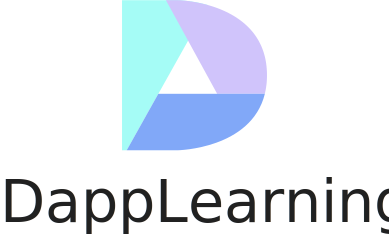

  
  <!-- <h1>Dapp Learning</h1> -->
  <h4 align="center">
    Blockchain Dapp Development Tutorial
  </h4>
  
Learn blockchain Dapp development step by step through actual projects。

## Preface

The Dapp-Learing Project, incubated by Rebase Community, is suitable for developers with certain programming language foundation to start blockchain Dapp development. It allows developers to understand and develop various projects like Defi, NFT, DAO and CRYPTO from a lower level to the higher level step by step.  

The vision of the project is not only to provide junior developers an executable and simple learning roadmap for blockchain Dapp development, but to give advanced developers a platform to communicate and collaborate.
Specifically, the project will be deeply combined with Rebase University and a learning group will be set up by community members. Through their division and cooperation, they will be able to study mainstream DAPP projects in depth together and make their own contributions. In addition, through weekly technology sharing workshops, they will have opportunities to share more about technology development and application. After the sharing session, the workshop will be recorded as videos and uploaded to the Rebase Channel in Bili Bili. https://space.bilibili.com/382886213/video

The philosophy that the project always sticks to is that developers can get access to decentralized education in Open Source University. On this basis, community members will manage this open source project with the Dao management pattern. Any member who can contribute high quality PR three times will become a PR auditor and will be involved in decision-making process for the project development. What‘s more, NFT will be given to all PR contributors as bonus.  

Technology Stack：

- `web3.js`
- `ethers.js (Hardhat)`
- `web3.py (Brownie)`
- `Java` (Optional)
- `rust` (Optional)

This tutorial is divided into two parts: basic tasks and project tasks. Basic tasks are familiar with and integrate the basic tool components necessary for blockchain development (such as ERC standard, Oracle, GRAPH). Our project tasks are preparing to study the mainstream DeFi, NFT, DAO typical projects to help developers to dive into real project development.

This tutorial is still in developing, so you are welcome to create pull request to create more tutorial projects or improve existing ones 🤗.

## Preparatory Work

**Read[《Proficient in Ethereum》](https://github.com/inoutcode/ethereum_book)Understand the fundamentals of Ethereum and smart contracts**

- Ethereum Principle Book:<https://ethbook.abyteahead.com/howto.html>
- Summary of Ethereum development tools:<https://learnblockchain.cn/article/2006>
- learning solidity <https://www.bilibili.com/video/BV1St411a7Pk?p=1> 
- Solidity by Example:<https://solidity-by-example.org/>
- Deep Dive into Rust: <https://itnext.io/deep-dive-into-rust-for-node-js-developers-5faace6dc71f?gi=5c0d5a41e7dd>

**Development tools：**

- Metamask（Browser wallet plug-in）: <https://www.jianshu.com/p/b5b2c05e9090>
- Infura（Node service）: <https://infura.io/>
- Alchemy（Node service）: <https://dashboard.alchemyapi.io/>
- All tests are connected to the Kovan test network, and Kovan tests ETH application: <https://faucet.kovan.network>,you are also free to use other test networks.
- Ethereum blockchain browser: <https://kovan.etherscan.io>
- JSON-PRC interface: <https://eth.wiki/json-rpc/API>
- Tenderly Contract validation: <https://dashboard.tenderly.co/explorer>
- Remix The local environment: <https://zhuanlan.zhihu.com/p/38309494>
- Pretty print program <https://www.cnblogs.com/kuronekonano/p/11794302.html>

**testnet**

- Rinkeby [Apply for Rinkeby test currency](https://faucet.rinkeby.io/)
- Kovan [Apply for Kovan test currency 1](https://linkfaucet.protofire.io/kovan) [Apply for Kovan test currency 2](https://faucet.kovan.network)
- Ropsten [Apply for Ropsten test currency](https://faucet.metamask.io/)

**Recommended reading**

- 《Sovereign Individuals》
- The Austrian school of thought is recommended,[Hayek Life introduction](https://mp.weixin.qq.com/s/p1UZdt5BAQVJ3kl_CniwKQ)    
- Series articles [Austrian economics school of thought for blockchain enthusiasts](https://mp.weixin.qq.com/mp/appmsgalbum?__biz=MzU0ODk1MTE1MA==&action=getalbum&album_id=1986143111768489985&scene=173&from_msgid=2247484102&from_itemidx=1&count=3&nolastread=1#wechat_redirect)
- [《Political Economy》](https://www.marxists.org/subject/economy/index.htm)

## Basic Tasks

Learn the basic tools and development knowledge of Dapp development through the following basic tasks.  
⬜ Task Not Start  
⌛ Task Processing   
✅ Task Finish

01. [use web3.js deploy contract](basic/01-web3js-deploy/README.md) ✅ 
02. [use web3.js create transaction](basic/02-web3js-transaction/README.md) ✅
03. [use web3.js call ERC20 contract](basic/03-web3js-erc20/README.md) ✅
04. [use truffle](basic/04-web3js-truffle/README.md) ✅
05. [use ethers.js call ERC20 contract](basic/05-ethersjs-erc20/README.md) ✅
06. [use waffle and ethers.js test contract](basic/06-ethersjs-waffle/README.md) ✅
07. [use hardhat](basic/07-hardhat/README.md) ✅
08. [graph](basic/08-hardhat-graph/README.md) ✅
09. [react（metamask)](basic/09-hardhat-react/README.md) ✅
10. [ERC721+ ERC1155 + ipfs](basic/10-hardhat-ipfs-erc721/README.md) ✅
11. [react + express + hardhat](basic/11-react-express-hardhat/README.md) ✅
12. [Crowdfund](basic/12-token-crowdfund/README.md) ✅
13. [decentralized exchange](basic/13-decentralized-exchange/README.md) ✅
14. [chainlink-api](basic/14-chainlink-price-feed/README.md) ✅
15. [nft-blindbox-chainlink-vrf](basic/15-nft-blindbox-chainlink-vrf/readme.md) ✅
16. [nft auction  & exchange](basic/16-nft-auction-exchange/README.md) ✅
17. [wallet develop](basic/17-etherjs-wallet-develop/readme.md) ✅
18. [web3.py](basic/18-web3py/README.md) ✅
19. [brownie](basic/19-brownie/README.md) ✅
20. [flash-loan](basic/20-flash-loan/readme.md) ✅
21. [scaffold-Lender](basic/21-scaffold-lender/README.md) ✅
22. [scaffold-zk](basic/22-scaffold-zk/readme.md) ✅
23. [ERC865 & ERC875](basic/23-erc865-and-erc875/README.md) ✅
24. [Upgradeable-contract](basic/24-upgradeable-contract/README.md) ✅
25. [multi-sig-wallet](basic/25-multi-sig-wallet/readme.md) ✅
26. [Quadratic vote](basic/27-quadratic-vote/README.md) ✅
27. [Arbitrum](https://arbitrum.io/quickstart/) ⬜
28. [optimism layer2](basic/28-optimism-layer2/readme.md) ⬜
29. [matic layer2](basic/29-layer2-matic/readme.md) ✅
30. [zksync layer2](basic/30-layer2-zksync/readme.md) ⬜
31. [duneanalytics & nansen](basic/31-dune-analytics-nansen/readme.md) ⬜
32. [chainlink-keeper](basic/32-chainlink-keeper/README.md) ✅
33. [pooltogether](basic/33-pooltogether/README.md) ⌛
34. [subgraph](basic/34-subgraph/readme.md) ⬜
35. [Merkel-Patricia Tree(MPT)](basic/35-mpt/README.md) ⬜
36. [NFT Filecoin](basic/36-nft-filecoin/README.md) ✅
37. [Charm.fi](https://github.com/charmfinance/alpha-vaults-contracts) ✅
38. [Flashbots provider for ethers.js](https://github.com/flashbots/ethers-provider-flashbots-bundle) ⬜
39. [Ethlend](https://www.youtube.com/watch?v=Pi-Qva6Fg3I) ⬜
40. [snapshot](basic/26-snapshot/README.md) ⬜
41. [NFT farming](https://superfarm.com/farms) ⬜
42. [merkle-distributor airdrop](https://github.com/Uniswap/merkle-distributor/blob/master/contracts/MerkleDistributor.sol)  ✅
43. [front running](https://github.com/Supercycled/cake_sniper)  ⬜
44. [JavaScript Cryptography](https://blog.sessionstack.com/how-javascript-works-cryptography-how-to-deal-with-man-in-the-middle-mitm-attacks-bf8fc6be546c) ⬜
45. [proxy contract](https://zhuanlan.zhihu.com/p/34690916) ⬜
46. [vyper](https://vyper.readthedocs.io/en/stable/) ⬜
47. [TWAMM: Time-Weighted Average Market Maker](https://www.paradigm.xyz/2021/07/twamm/) ⬜
48. [state channel](https://ethereum.org/en/developers/docs/scaling/state-channels/)  ⬜
49. [sniper](https://github.com/Supercycled/cake_sniper.git) ⬜
50. [solidity security](https://learnblockchain.cn/eth/dev/%E5%AE%89%E5%85%A8%E5%88%86%E6%9E%90.html)  ✅
51. [alchemix](https://github.com/alchemix-finance/alchemix-protocol) ✅
52. [Governace](https://github.com/withtally/safeguard)  ⬜
53. [Freelancer's Smart Contract](https://github.com/jacksonng77/freelancer) ⬜
54. [Cryptovoxels](https://zhuanlan.zhihu.com/p/379249411) ⬜
55. [PBFT](https://medium.com/loom-network-chinese/%E4%BA%86%E8%A7%A3%E5%8C%BA%E5%9D%97%E9%93%BE%E7%9A%84%E5%9F%BA%E6%9C%AC-%E7%AC%AC%E4%B8%80%E9%83%A8%E5%88%86-%E6%8B%9C%E5%8D%A0%E5%BA%AD%E5%AE%B9%E9%94%99-byzantine-fault-tolerance-8a1912c311ba) ⬜
56. [IDO](https://github.com/gnosis/ido-contracts) ⬜
57. [Liquity](https://github.com/liquity) ⬜
58. [Auto trigger smart contract](/basic/58-auto-smart-contract/README.md) ⬜
59. [NFT Floor Perps](https://www.paradigm.xyz/2021/08/floor-perps/) ⬜

Welcome to submit pull request,[Add a new basic task or update the above task](https://github.com/rebase-network/Dapp-Learning/issues/new)

## Advanced task

  For developers with a certain foundation, this part selects mainstream high-quality projects for source code analysis and code review
  The project can be deployed to the test network collaboratively and shared with the Rebase community as a basis. Large DEFI projects are novel and large in content, so we suggest a division of labor and cooperation, such as one person to read the white paper, one person to be responsible for the front end, one person to be responsible for the contract, and one person to be responsible for data presentation.
  Developers can initiate project research initiatives, form groups, and collaborate within development groups. This section is recommended as a submodule introduction.

## DeFi advanced task

01. [UniswapV2](defi/Uniswap-V2/readme.md) 
02. [UniswapV3](defi/Uniswap-V3/readme.md)
03. [Compound](defi/Compound/readme.md) [👉 Claim this task](https://github.com/rebase-network/Dapp-Learning/issues/new)
04. Aave [👉 Claim this task](https://github.com/rebase-network/Dapp-Learning/issues/new)
05. [SNX](https://github.com/Synthetixio) [👉 Claim this task](https://github.com/rebase-network/Dapp-Learning/issues/new)
06. [Curve](defi/Curve/README.md) [👉 Claim this task](https://github.com/rebase-network/Dapp-Learning/issues/new)
07. [0x-protocol](defi/0x-protocal/README.md) [👉 Claim this task](https://github.com/rebase-network/Dapp-Learning/issues/new)
08. [Bancor](https://bancor.network/) [👉 Claim this task](https://github.com/rebase-network/Dapp-Learning/issues/new)
09. YFI [👉 Claim this task](https://github.com/rebase-network/Dapp-Learning/issues/new)
10. AMPL [👉 Claim this task](https://github.com/rebase-network/Dapp-Learning/issues/new)
11. [Perpetual Protocol](https://www.chainnews.com/articles/163436212237.htm) [👉 Claim this task](https://github.com/rebase-network/Dapp-Learning/issues/new)
12. [DYDX](https://dydx.exchange/)[👉 Claim this task](https://github.com/rebase-network/Dapp-Learning/issues/new)
13. [OPYN](https://v2.opyn.co/)
14. [INDEX](https://mp.weixin.qq.com/s/PXOY3G6AIbhzRUptjYoWIw)[👉 Claim this task](https://github.com/rebase-network/Dapp-Learning/issues/new)
15. [DODO](https://dodoex.github.io/docs/zh/docs/DODO-Economics-102) [👉 Claim this task](https://github.com/rebase-network/Dapp-Learning/issues/new)
16. [MakerDao](https://zhuanlan.zhihu.com/p/41889079)[👉 Claim this task](https://github.com/rebase-network/Dapp-Learning/issues/new)

## NFT advanced task

- 01. [OpenSea](nft/opensea/readme.md) [👉 Claim this task](https://github.com/rebase-network/Dapp-Learning/issues/new)
- 02. [aavegotchi](https://aavegotchi.com/) [👉 Claim this task](https://github.com/rebase-network/Dapp-Learning/issues/new)
- 03. [Tools](https://mp.weixin.qq.com/s/DrLCx2L7PgjsAWoYnF8Ysw)

## DAO advanced task

- 01. [Aragon](dao/Aragon/readme.md)
- 02. Augur [👉 Claim this task](https://github.com/rebase-network/Dapp-Learning/issues/new)
- 03. [DAOHaus](https://daohaus.club/) 
- 04. [DAOstack](https://daostack.io/)  [👉 Claim this task](https://github.com/rebase-network/Dapp-Learning/issues/new)

## Crypto advanced task
- 01.[ECC](./crypto/ECC)
- 02.[PLONK](./crypto/PLONK)
- 03.[tornado](https://medium.com/taipei-ethereum-meetup/tornado-cash-%E5%AF%A6%E4%BE%8B%E8%A7%A3%E6%9E%90-eb84db35de04)
[👉 Claim this task](https://github.com/rebase-network/Dapp-Learning/issues/new)

## How to participate 

- Submit a pull request once, or follow the official account 「Rebase community」and contribute a technology sharing once, then add Maintainer WeChat account(yanyanho126) to Apply to join the group.
- In principle, Attend weekly developer meetings.
- Using market development way, anyone can submit pull requests, even just a link or document modification can submit a pull request, You don't need to complete the task 100% before committing, all developers will work with you to complete the task.
- Ensure that the test cases in the script directory can be successfully tested in the kovan test network, The test case in the test directory is successfully debugged with the local node.
- For each project readme, please add the reference link to this directory and attach the relevant references of the task.
- You are advised to use Solidity 0.6 or later

Four ways to quickly participate in the project:
1. Optimize the previous project code and readme.
2. You can claim outstanding tasks, The links below are all unfinished tasks. For completed tasks, please put the reference links under the corresponding project readme.
3. You can add tasks freely (please attach reference links).
4. Advanced projects (DEFI，DAO，NFT，CRYPTO) can initiate development initiatives within groups.

## DAO organization management project

  1. Contribute once pull request (or technology share) to join the developer group;
  2. Contribute 3 times of high-quality Pull Requests (or participate in 3 tasks) to give the PR audit authority;
  3. Pull Request reviewers can initiate study groups;
  4. The pull request reviewer can initiate a proposal, decide the project development plan, and obtain the consent of most pull request reviewers to pass the proposal;
  5. A pull request reviewer must do a pull request at least once within two weeks, otherwise remove pull request reviewer privileges, demote to a normal developer, and rejoin with a pull request.

## Group learning

 Advanced tasks, such as DEFI, DAO, and NFT project research, adopt group learning mode and have the following requirements.
 1. Developers who submit more than one PR can participate in group learning;
 2. Team members should have a clear division of labor and hold weekly meetings to share results;
 3. In principle, the number of sub-task researchers in the group shall not exceed 3.

 Output group learning results (Reference):
 The white paper: Rebase video sharing

 Contract: deployment, document, and Rebase video sharing

 Front end: deployment, document, and rebase video sharing

graph: deployment, document, and rebase video sharing
## FaQs

  For installation and use problems, please refer to the link[FaQs](./TROUBLE_SHOOTING.md)  

## Contract reference library and related projects

- Classical contract library - <https://github.com/OpenZeppelin/openzeppelin-contracts>
- Contract safe library - <https://github.com/ConsenSys/smart-contract-best-practices>
- Dapp scaffolding - <https://github.com/austintgriffith/scaffold-eth>
- Contract tutorial - <https://github.com/HQ20/contracts>
- Blockchain tutorial - <https://learnblockchain.cn/>
- Cryptography course - <https://live.csdn.net/list/Kevin_M_00>
- DeFi course - <https://github.com/OffcierCia/DeFi-Developer-Road-Map>
- Introductory tutorial about Solidity - <https://github.com/liushooter/learn-blockchain/tree/master/learning-solidity-2018>
- Awesome Solidity - <https://github.com/bkrem/awesome-solidity>

## The community to donate

Interested partners are welcome to participate in co-construction. Open source projects are not easy to maintain. We welcome donations.

Donor address：

- Ethereum main network：[0x1F7b953113f4dFcBF56a1688529CC812865840e1](https://etherscan.io/address/0x1F7b953113f4dFcBF56a1688529CC812865840e1)
- Polygon: [0x1F7b953113f4dFcBF56a1688529CC812865840e1](https://polygonscan.com/address/0x1F7b953113f4dFcBF56a1688529CC812865840e1)
- zkSync: [0x1F7b953113f4dFcBF56a1688529CC812865840e1](https://zkscan.io/explorer/accounts/0x1F7b953113f4dFcBF56a1688529CC812865840e1)

Donation fund management: we will use the multi-signature wallet to manage funds (transfer funds from the main network to thematic network, and realize multi-signature wallet management on the matic network), and regularly allocate funds to developers according to PR submission records. At the same time, the project will issue NFT as a Memorial Prize to PR contributors to manage the open-source project in the form of Dao governance.
