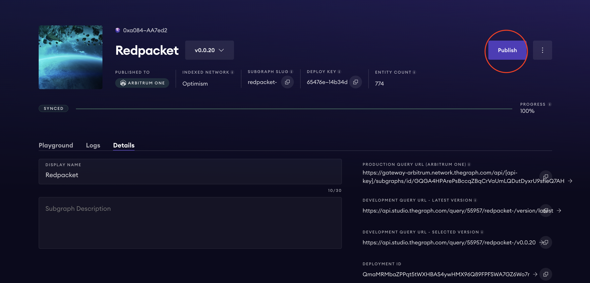
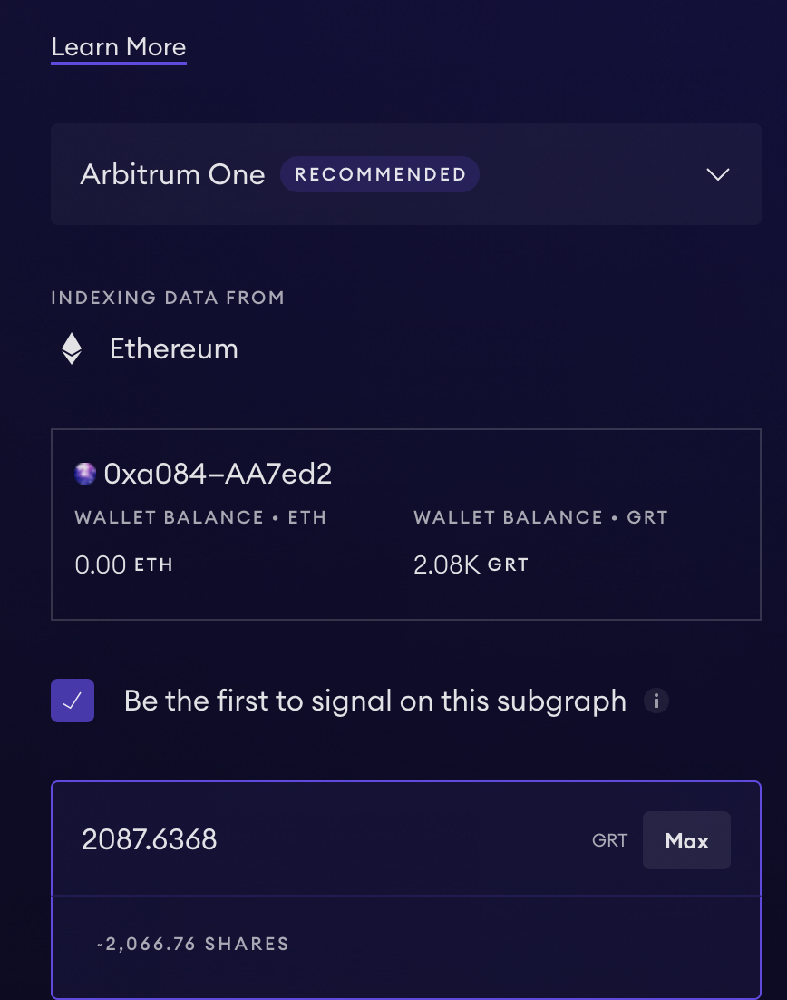
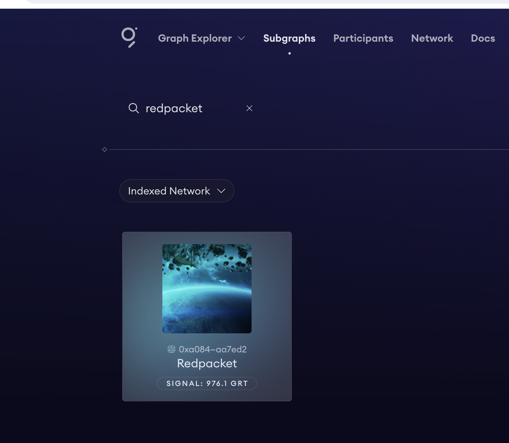
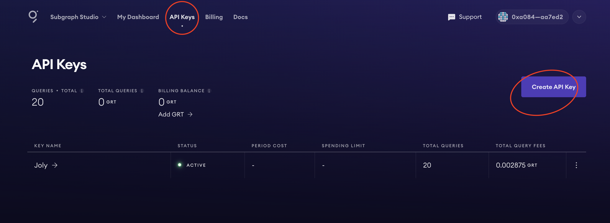
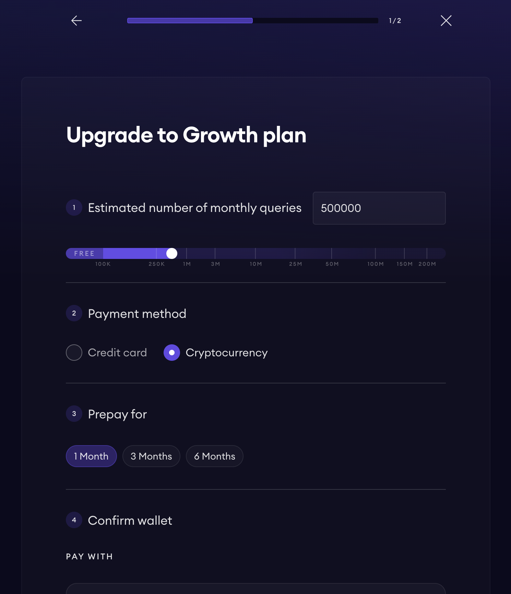

中文 / [English](./readme.md)

## Graph Network 介绍

Graph 网络是一个去中心化的索引协议，用于组织区块链数据。 应用程序使用 GraphQL 查询称为子图的开放 API，以检索网络上的索引数据。 通过Graph，开发者可以建立完全在公共基础设施上运行的无服务器应用程序。   
本章节介绍如果升级 Subgraph Studio 到 Graph Network。

## 流程概述

- 创建一个 Subgraph Studio, 具体创建流程可参考 [Dapp Learning Subgraph](https://github.com/Dapp-Learning-DAO/Dapp-Learning/tree/main/basic/08-hardhat-graph)
- 发布子图到 Graph Network
- 创建 API key
- 设置 Billing Plan

## 操作步骤

1. 创建一个 Subgraph Studio  
具体可参考 [Dapp Learning Subgraph](https://github.com/Dapp-Learning-DAO/Dapp-Learning/tree/main/basic/08-hardhat-graph) 教程，这里不再重复说明  

2. 发布子图到 Graph Network   
- 发布  
在 “My Dashboard" 中找到新创建的子图，然后点击 "Publish" 
   

- 选择发布的网络  
这里选择 "Arbitrum One"   
  

- 对子图签名   
这里勾选 "Be the first to signal on this subgraph" 
同时输入 GRT 数量，[官方文档](https://thegraph.com/docs/en/publishing/publishing-a-subgraph/) 建议至少输入 3000 GRT 
  

- 确认发布  
然后点击 "Allow GRT" & "Publish and Signal" 就可以完成最终发布  
  

发布成功后，就可以在 "Graph Explorer" 中找到刚刚发布的子图    
  

3. 创建 API key  
对于 Publish 成功的子图，后需要使用 API Key 进行查询，这里我们需要创建一个 API Key 用于后续的查询。在 "API Keys" 页面，点击 "Create API Key" 即可创建一个新的 API Key   
  

3. 设置 Billing Plan    
- Free Plan  
光有 API Key 还不行，我们还需要充值 GRT, 因为对 Graph Network 的子图查询都是需要消耗 GRT 的。 
默认情况下，我们使用的 Billing 是 "Free Plan", 有 100,000 的免费 query 额度，超出这个额度后，才需要使用 GRT 支付查询费用  
  

- 升级 Plan   
点击页面的 "Upgrade Plan" 我们就可以根据自身每月的查询量定制 Plan  
   

- 完成 Plan 升级  
点击 "Allow GRT Access" 和 "Add GRT to Billing Balance" 即可完成 Plan 升级  
  

- 查询子图 
首先找到我们在 Graph Explorer 上的子图，然后点击 "Qeury"，接着再点击 "Copy Query URL" 即得到查询使用的 URL。需要注意的是，得到 "Query URL" 后，需要使用自己的 API key 替换其中的 "api key" 部分   
   
  
