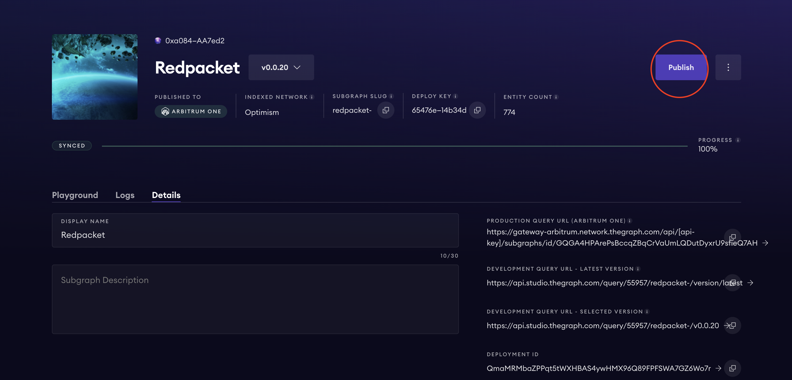
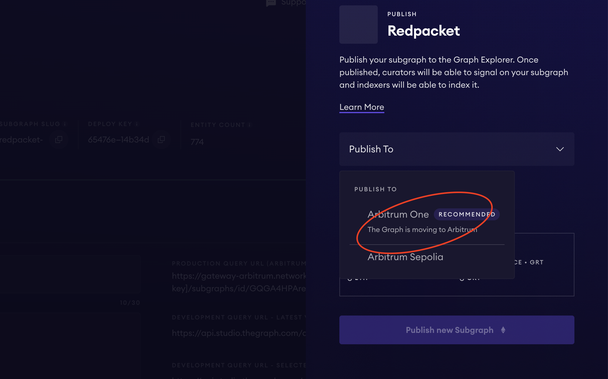
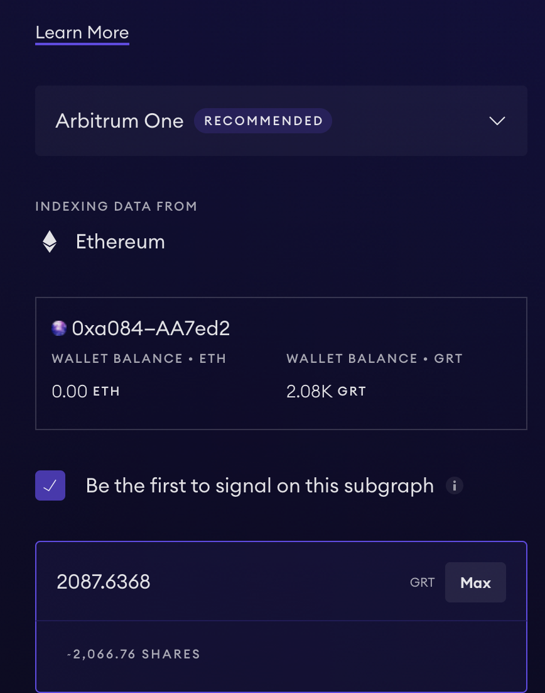
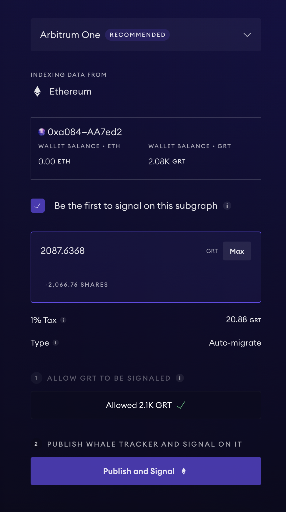
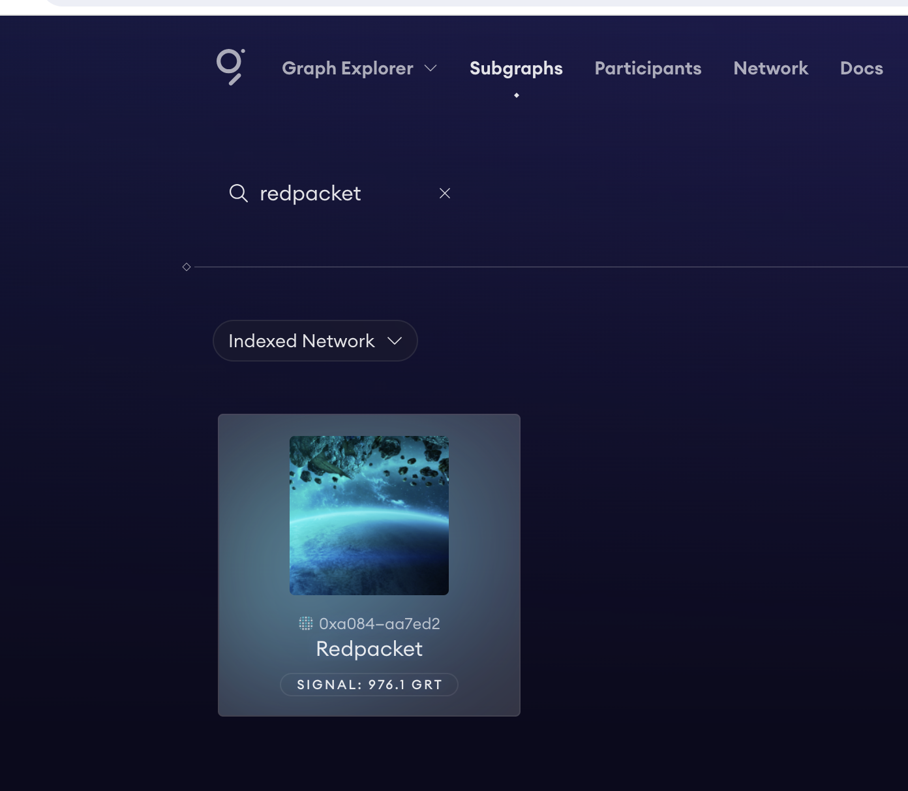
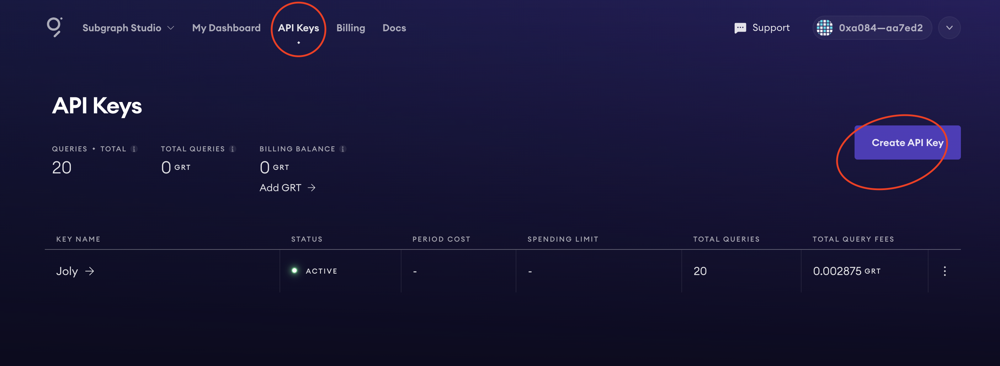
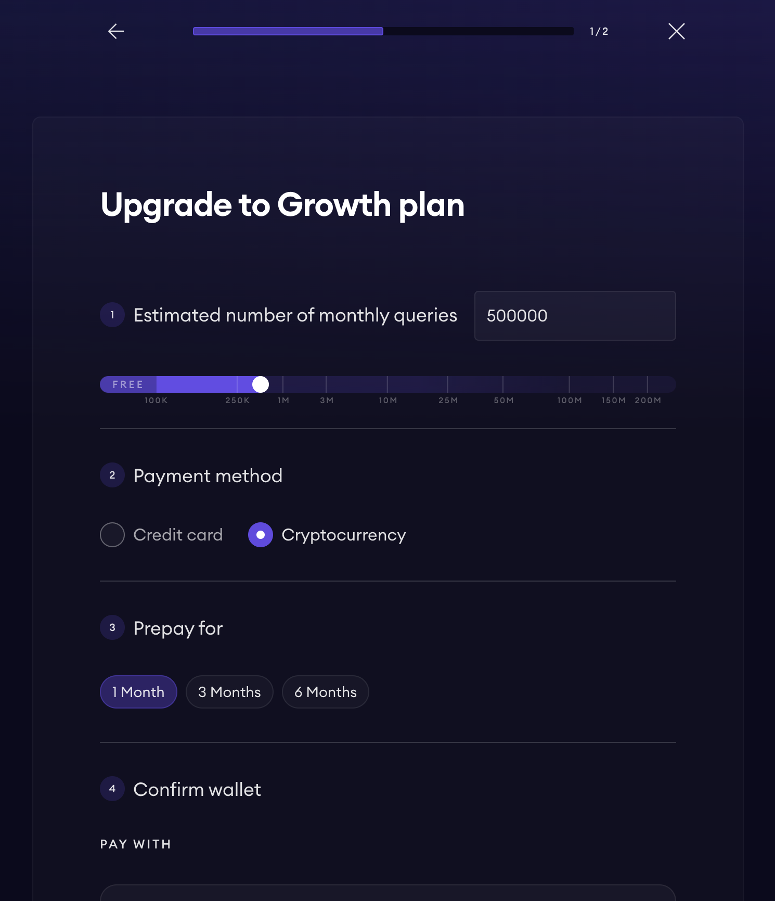
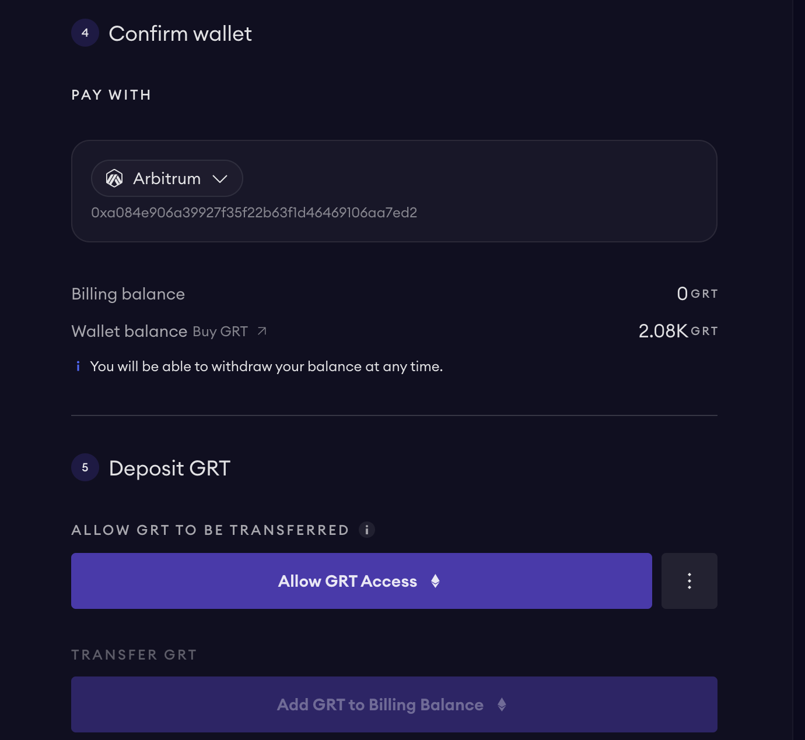
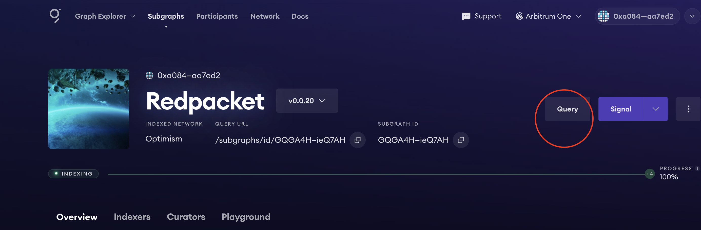
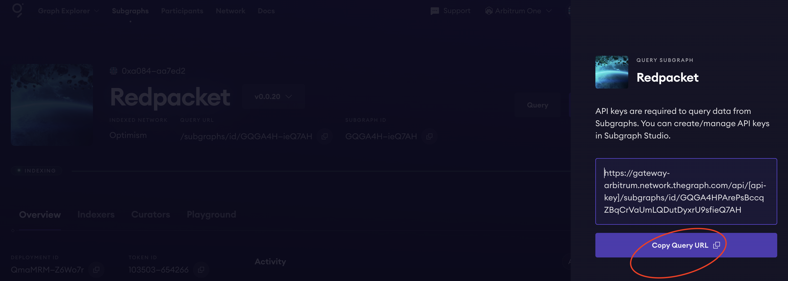

[中文](./readme-CN.md) / English

## Graph Network Introduction

The Graph network is a decentralized indexing protocol for organizing blockchain data. Applications use GraphQL to query an open API called a subgraph to retrieve indexed data on the network. With Graph, developers can build serverless applications that run entirely on public infrastructure. This section describes how to upgrade Subgraph Studio to Graph Network.

## Process Overview

- Create a Subgraph Studio. See how to create a Subgraph Studio [Dapp Learning Subgraph](https://github.com/Dapp-Learning-DAO/Dapp-Learning/tree/main/basic/08-hardhat-graph)
- Publishes subgraphs to the Graph Network
- Create an API key 
- Set up Billing Plan 

## Operating Steps

1. Create a Subgraph Studio    
Specific reference [Dapp Learning Subgraph](https://github.com/Dapp-Learning-DAO/Dapp-Learning/tree/main/basic/08-hardhat-graph)    

2. Publishes subgraphs to the Graph Network    
- Publish  
Locate the newly created subgraph in "My Dashboard" and click "Publish"   
   

- Select the network to publish on    
Here, choose "Arbitrum One"    
  

- Sign the subgraph     
Check "Be the first to signal on this subgraph" 
Enter the number of GRTS ，[official documentation](https://thegraph.com/docs/en/publishing/publishing-a-subgraph/)  You are advised to enter at least 3000 GRT  

- Confirm release   
Then click "Allow GRT" & "Publish and Signal" to complete the final publication  
  

Once published, you can find the subgraph you just published in the Graph Explorer    
  

3. Create an API key   
For the subgraph that publishes successfully, the API Key needs to be used for query later. Here, we need to create an API Key for subsequent query. On the "API Keys" page, click "Create API Key" to create a new API Key   
  

3. Set up Billing Plan    
- Free Plan  
API Key alone is not enough, we also need to recharge GRT, because the Graph Network subgraph queries need to consume GRT. By default, the Billing we use is "Free Plan", with 100,000 free queries, beyond which we need to use GRT to pay for queries   
  

- Upgrade Plan    
By clicking "Upgrade Plan" on the page, we can customize the Plan according to our monthly query volume  
   

- Completing the Plan upgrade   
Click "Allow GRT Access" and "Add GRT to Billing Balance" to complete the Plan upgrade   
  

- Query subgraph  
First find our subgraph on Graph Explorer, click "Qeury", then click "Copy Query URL" to get the URL used for the query. Note that once you get the "Query URL", you need to replace the "api key" section with your own api key     
   
  
