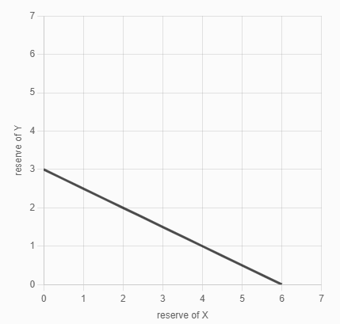

# uniswap-v1-like

> 由于源项目是用 Vyper 开发合约，这里会使用 solidity 0.8.0 仿写一个 uniswap-v1 (合约部分)。本文内容和相关代码来自于 Ivan Kuznetsov 的 《Programming DeFi: Uniswap》 系列教程，这里只节选了部分原文，翻译并加入了一点点的个人理解。原教程链接见最下方，强烈建议跟着原教程的步骤撸一遍，风味最佳。

截至 2021 年 6 月，Uniswap 已推出三个版本（`V1`, `V2`, `V3`）。

`V1` 只允许在以太币和代币之间进行交换。如果需要进行非 eth 之间的交换，则需要通过 eth 中转。
我们将尝试了解 `V1` 的经济机制，找出、分解、学习和构建它们的核心机制。

## 经济模型

### Market makers (做市商)

做市商是向市场提供流动性（交易资产）的实体。流动性使交易成为可能：如果您想出售某物但没有人购买，则不会进行交易。一些交易对具有高流动性（例如 BTC-USDT），但有些交易对的流动性很低或根本没有（例如一些骗局或山寨币）。

DEX(去中心化交易所)必须有足够（或大量）流动性才能运作并替代中心化交易所。通常需要 DEX 团队投入大量资金来提供足够的流动性(考虑到众多的代币种类，这是一笔庞大的投入)，并且这样会使得 DEX 团队成为唯一的做市商，拥有巨大的权力，有违 DEX 去中心化的初衷。

更好的解决方案是允许任何人成为做市商

### Automated market maker (AMM 自动做市商)

AMM(自动化做市商)是一个通用术语，包含不同的去中心化做市商算法，Uniswap 是其中最受欢迎的算法之一。

### Constant product market maker (恒定的产品做市商)

```math
x∗y=k
```

这是 UniswapV1 的核心公式，`x` 和 `y` 分别代表两个 token(在 V1 中其中一个必定是 eth)的储备量，两者的乘积需要保持一个恒定的值，即 `k`。当您用以太币交易代币时，您将以太币存入合约并获得一定数量的代币作为回报。Uniswap 确保在每次交易后至至 保持不变（然而并非完全不变，会存在无常损失）。

### 如何定价

#### 简单的设想，利用汇率构建价格

```math
Px = y / x,
Py = x / y
```

`x` 和 `y` 代表两个代币的储备量，`Px` 和 `Py` 代表价格。
这是一个简单且符合直觉的设想，然而存在很大的问题。

假设我们用 2000 个 token 和 1000 个 eth 创建了一个流动性池，此时 1 个 token 等于 0.5 个 eth，1 个 eth 等于 2 个 token。

```math
Ptoken = 1000 / 2000 = 0.5,
Peth = 2000 / 1000 = 2
```

一切看起来是正确的，但是如果我们利用该池子做交易，将 2000 个 token 交换成 eth 会发生什么？
我们将获得 1000 个 eth，这可是池子里所有的 eth 储备量！**池子被抽干了！**

我们再来看看定价公式，上述定价公式实际上组成了一个和为恒定值的函数。

```math
Msum  = Mx + My = Px * x + Py * y
```

`Msum` 代表两个代币的市值总和，`Mx` 和 `My` 代表两个代币的市值，市值等于 `价格 * 储备量`。

```math
Msum  = (y / x) * x + (x / y) * y = y + x = x + y
```

我们把之前的价格公式带入其中，就会发现总市值实际上就是两者的储备量之和 `x + y`。
即 `x + y = k`, `k` 为常数，其函数图形如下：



x 轴和 y 轴分别代表了两个代币的储备量，函数穿过 x 轴和 y 轴，根据图形可以很直观的看出这个公式允许`x`和`y`其中一个为 0！
这也就解释了为何我们用 2000 个 token 交换成 eth，流动性会枯竭的原因。

#### 正确的定价公式

```math
x∗y=k
```

每一笔交易都会改变两个代币的储备量，无论储备量如何变化， `k` 都应该保持不变。

<!-- $$(x + \Delta x)(y - \Delta y) = xy$$ -->


这里的意思是用 `Delta x` 数量的`token x` 交换出 `Delta y` 数量的 `token y`。所以计算 `Delta y` 的公式为：

<!-- $$\Delta y = \frac{y \Delta x} {x + \Delta x}$$ -->


请注意，我们现在得到的 `Delta y` 是数量而不是价格。计算数量的方法对应 `Exchange.getAmount()`。


由上图看出来，乘积恒定的函数是一个双曲线，不会与 x 轴或 y 轴相交，这使得储备量近乎无限。

还有一个有趣的特征，双曲线价格函数会导致价格滑点。**购买量越大，价格滑点越高，得到的越少。**
在测试文件 `./test/Exchange.test.js` 中可以看到滑点的变化：

```js
// getTokenAmount
await exchange.getTokenAmount(toWei(1)); // 1.998001998001998001
await exchange.getTokenAmount(toWei(100)); // 181.818181818181818181
await exchange.getTokenAmount(toWei(1000)); // 1000.0

// getEthAmount
await exchange.getEthAmount(toWei(2)); // 0.999000999000999
await exchange.getEthAmount(toWei(100)); // 47.619047619047619047
await exchange.getEthAmount(toWei(2000)); // 500
```

如上所示，当我们试图掏空池子的时候，却只得到预期的一半。

注意：我们最初基于汇率的定价函数没有错。事实上，当我们交易的代币数量相对储备量非常小时，这是正确的。但是要提供 AMM，我们需要更复杂的东西。

## Exchange 合约实现

V1 的 Exchange 合约包含了定价功能、交易功能，添加、删除流动性，分发 LPtoken 代币

### 增加流动性

```solidity
function addLiquidity(uint256 _tokenAmount)
    public
    payable
{
    if (getReserve() == 0) {
        // 初始添加流动性，直接添加，不需要限制
        IERC20 token = IERC20(tokenAddress);
        token.transferFrom(msg.sender, address(this), _tokenAmount);
    } else {
        // 后续新增流动性则需要按照当前的储备量比例，等比增加
        // 保证价格添加流动性前后一致
        uint256 ethReserve = address(this).balance - msg.value;
        uint256 tokenReserve = getReserve();
        uint256 tokenAmount = msg.value * (tokenReserve / ethReserve);

        require(_tokenAmount >= tokenAmount, "insufficient token amount");

        IERC20 token = IERC20(tokenAddress);
        token.transferFrom(msg.sender, address(this), tokenAmount);
    }
}
```

### 定价功能

虽然是定价功能，但实际上我们得出的是能够换取的数量。

```solidity
// This is a low-level function, so let it be private.
function getAmount(
    uint256 inputAmount,
    uint256 inputReserve,
    uint256 outputReserve
) private pure returns (uint256) {
    require(inputReserve > 0 && outputReserve > 0, "invalid reserves");

    return (inputAmount * outputReserve) / (inputReserve + inputAmount);
}

// 传入token数量得到能够换取的eth数量
function getTokenAmount(uint256 _ethSold) public view returns (uint256)

// 传入eth数量得到能够换取的token数量
function getEthAmount(uint256 _tokenSold) public view returns (uint256)
```

### 交易功能(swap)

现在，我们已准备好实现交易功能

```solidity
// 使用eth购买token
function ethToTokenSwap(uint256 _minTokens) public payable {
    uint256 tokenReserve = getReserve();
    uint256 tokensBought = getAmount(
        msg.value,
        address(this).balance - msg.value,
        tokenReserve
    );

    require(tokensBought >= _minTokens, "insufficient output amount");

    IERC20(tokenAddress).transfer(msg.value, tokensBought);
}
```

将以太币换成代币意味着将一定数量的以太币（存储在 `msg.value` 变量中）发送到可支付的合约函数并获得代币作为回报。请注意，我们需要 `msg.value` 从合约的余额中减去，因为在调用该函数时，发送的以太币已经添加到其余额中。

这里的另一个重要变量是 `_minTokens`—— 这是用户想要用以太币换取代币的最小数量。此金额在 UI 中计算,使用用户设置的最大滑点来计算，即用户发送的交易其最小成交量是 `期望的成交量 * (1 - Slippage)` 。这是一个非常重要的机制，可以保护用户免受抢跑机器人(front-running bots)的攻击。

> front-running bots 会在用户订单前面插入一个相同方向的订单，比如当用户想买时，在用户订单前面插入一个同样买入的订单，当 bots 的订单完成后，再执行用户订单，必然会导致用户承受更高的价格，而当用户订单完成后，价格又已上涨，bot 通常会将之前的订单卖出，赚取其中的利差。当用户设置了最小成交量之后，当价格偏差太大，以太坊会停止执行该交易，能有效的避免 front-running bots 攻击

```solidity
// 使用token购买eth
function tokenToEthSwap(uint256 _tokensSold, uint256 _minEth) public {
    uint256 tokenReserve = getReserve();
    uint256 ethBought = getAmount(
        _tokensSold,
        tokenReserve,
        address(this).balance
    );

    require(ethBought >= _minEth, "insufficient output amount");

    IERC20(tokenAddress).transferFrom(msg.sender, address(this), _tokensSold);
    payable(msg.sender).transfer(ethBought);
}
```

`_tokensSold`从用户的余额中转移代币，并发送以太币 `ethBought` 作为交换。

### LP token

我们需要有一种方法来奖励流动性提供者的代币。如果他们没有得到激励，他们就不会提供流动性，因为没有人会白白把他们的代币放在第三方合同中。此外，该奖励不应该由我们支付，因为我们必须获得投资或发行通货膨胀代币来为其提供资金。

唯一好的解决方案是对每次代币交易时收取少量费用，并在流动性提供者之间分配累积费用。这似乎也很公平：用户（交易者）为其他人提供的服务（流动性）付费。

为了奖励公平，我们需要按比例奖励流动性提供者，他们的贡献，即他们提供的流动性数量。如果有人提供了 50% 的池流动性，他们应该得到 50% 的手续费。

#### 定义

`LP token` 是向流动性提供者发行的 ERC20 代币，是一种权益证明：

1. 流动性提供者注入流动性，获得 `LP token`
2. 获得的代币数量与用户在流动性池中的流动性份额成正比
3. 手续费根据持有的代币数量按比例分配
4. `LP token` 可以换回 流动性 + 累计分配的手续费

#### 如何制定发行数量

首先 LP 合约需要满足两个要求

1. 由于流动性随时都可能变化，每一位用户所拥有的份额必须时刻保持正确性
2. 减少非常昂贵的写操作（例如在合约中存储新/更新数据），因此，不能频繁重新计算和更新份额

如果我们发行大量代币（比如 10 亿个）并将它们分配给所有流动性提供者。如果我们总是分发所有的代币（第一个流动性提供者得到 10 亿，第二个得到一部分，等等），我们将被迫重新计算已发行的代币，这样操作是很昂贵的。如果我们最初只分配一部分代币，那么我们就有可能达到供应限制，这最终将迫使使用重新分配现有份额。

唯一好的解决方案就是不设限制，在增加新的流动性时铸造新的代币。也就是说 `LP token` 是没有发行上限的。
不过也不用担心通货膨胀，因为铸造 `LP token` 需要提供流动性，而想要取回流动性，则必须销毁`LP token`。

下面是通过注入的流动性数量计算铸造 LP token 数量的公式：

```math
amountMinted = totalAmount * (ethDeposited / ethReserve)
```

由于 V1 的交易对都含有 eth，这里只考虑 eth 的价值和储备量比例

在修改 `addLiquidity()` 之前，需要让我们的 Exchange 合约成为 `ERC20` 合约并修改构造函数

```solidity
// 继承ERC20标准合约
contract Exchange is ERC20
{
    constructor(address _token) ERC20("Uniswap-V1-like", "UNI-V1")  {
        ...
    }
    ...
}
```

现在改造 `addLiquidity()`

```solidity
function addLiquidity(uint256 _tokenAmount)
    public
    payable
    returns (uint256)
{
    if (getReserve() == 0) {
        ...

        uint256 liquidity = address(this).balance;
        _mint(msg.sender, liquidity);   //  ERC20._mint() 向流动性提供者发送 LP token

        return liquidity;
    } else {
        // 后续新增流动性则需要按照当前的储备量比例，等比增加
        // 保证价格在添加流动性前后一致
        uint256 ethReserve = address(this).balance - msg.value;
        uint256 tokenReserve = getReserve();
        // solidity不支持浮点运算，所以运算顺序非常重要
        // 如果 msg.value * (tokenReserve / ethReserve) 的写法会产生计算误差
        uint256 tokenAmount = (msg.value * tokenReserve) / ethReserve;

        // 保证流动性按照当前比例注入，如果token少于应有数量则不能执行
        require(_tokenAmount >= tokenAmount, "insufficient token amount");

        IERC20 token = IERC20(tokenAddress);
        token.transferFrom(msg.sender, address(this), tokenAmount);

        // 根据注入的eth流动性 与 合约eth储备量 的比值分发 LP token
        uint256 liquidity = (totalSupply() * msg.value) / ethReserve;
        _mint(msg.sender, liquidity);   //  ERC20._mint() 向流动性提供者发送 LP token

        return liquidity;
    }
}
```

### 手续费

在收取手续费之前先思考几个问题：

1. 我们要收取以太币或代币的费用吗？我们想用以太币还是代币向流动性提供者支付奖励？
2. 如何从每次交易中收取少量固定费用？
3. 如何根据流动性提供者的贡献将累积费用分配给他们？

先看看问题 2 和 3，我们可以在每次交易进行时发送额外的费用，并积累到一个基金池中，任何流动性提供者都可以从中提取相应份额的手续费。

1. 每次交易，从中扣除手续费，而不是额外收取
2. 我们已经有了资金——这是外汇储备！储备金可用于积累费用。这意味着**储备会随着时间的推移而增长**，所以恒定的产品公式不是那么恒定！不过和储备金相比，支出给流动性提供者的费用是很小一部分，并因此也很难通过分配手续费的路径来影响储备金。
3. 所以，现在已经有了第一个问题的答案：费用以交易资产的货币支付(即交易对中的两种货币)

UniswapV1 从每次交易中收取 0.03% 的手续费。为了计算简单，我们收取 1%。向合约添加费用就像添加几个乘数一样简单 `Exchange.getAmount()`

```solidity
// This is a low-level function, so let it be private.
// 基础公式 outputAmount = (inputAmount * outputReserve) / (inputReserve + inputAmount)
function getAmount(
    uint256 inputAmount,
    uint256 inputReserve,
    uint256 outputReserve
) private pure returns (uint256) {
    require(inputReserve > 0 && outputReserve > 0, "invalid reserves");

    // 收取1%的手续费
    // solidity 不支持浮点运算，所以分子和分母同时 × 100
    uint256 inputAmountWithFee = inputAmount * 99;  // 100 - 1 扣除手续费
    uint256 numerator = inputAmountWithFee * outputReserve;
    uint256 denominator = (inputReserve * 100) + inputAmountWithFee;

    return numerator / denominator;
}
```

### 去除流动性 Remove liquidity

为了去除流动性，我们可以再次使用 `LP token` ：我们不需要记住每个流动性提供者存入的金额，而是根据 `LP token` 份额计算去除的流动性数量

```solidity
function removeLiquidity(uint256 _amount)
    public
    returns (uint256, uint256)
{
    uint256 ethAmount = (address(this).balance * _amount) / totalSupply();
    uint256 tokenAmount = (getReserve() * _amount) / totalSupply();

    // ERC20._burn() 销毁LP
    _burn(msg.sender, _amount);
    // 向用户返回 eth 和 token
    payable(msg.sender).transfer(ethAmount);
    IERC20(tokenAddress).transfer(msg.sender, tokenAmount);

    return (ethAmount, tokenAmount);
}
```

当流动性被移除时，它会以以太币和代币的形式返回，当然，它们的数量是平衡的。
这是造成**无常损失**(Impermanence loss)的地方：随着以美元计价的价格变化，储备比率随时间变化。当流动性被移除时，余额可能与流动性存入时的余额不同。这意味着您将获得不同数量的以太币和代币，它们的总价格可能低于您将它们放在钱包中的价格。

```math
removedAmount = reserve * (amountLP / totalAmountLP)
```

### 理解无常损失

举个栗子：

1. 假定现在 1 ETH 价值 100 DAI, 你添加了 1 ETH 和 100 DAI 流动性, 其资产总价值为 200 DAI `assets = 1 * 100 + 100`
2. 一段时间后，ETH 价格上涨到 150 DAI, 那么此时池子中两者数量的比例应为 ETH:DAI = 1:1.5 ，因为价格就是两者数量的比值
3. 然后利用 `x * y = k` 计算两者数量，`k` 是一个恒定的值，所以可以由第 1 步添加时的数值计算 k = 1 \* 100 = 100，然后根据第 2 步已知的比例计算两者数量，ETH 约 0.8165 个， DAI 约 122.47 个，两者的乘积应还是 100 （因为小数点精度的取舍，会有一点误差）
4. 这个时候你的流动性按照 DAI 来计价是 244.94 `assets = 150 * 0.816 + 122.4`，浮盈 44.94（暂时不考虑手续费的收益），看起来收获颇丰
5. 但是等一下，如果你一开始并没有添加流动性，而是一直持有 1 ETH 和 100 DAI，然后等到 ETH 价格涨到 150 的时候，你的资产按照 DAI 计价就是 250 了，比第 4 步还要多 5DAI 左右的利润。这部分收益的差距就是无常损失。

为什么会有无常损失？

向市场提供流动性，即成为做市商，实际上是和市场中的用户做对手盘。而 AMM（自动化做市商）是被动的和市场中的用户做对手盘，即当市场中大部分人看好 ETH 后市，用 DAI 买入 ETH，你的流动性池子会被动的增加 DAI 而减少 ETH.

所以，提供流动性就代表了总是和市场做反向的操作，总是倾向去持有更多的弱势资产（当 ETH 上涨为强势资产，DAI 就是弱势资产）。于是当 ETH 上涨，你的流动性会不断提前抛出 ETH，而拿到更多的 DAI，这些被提前抛出的 ETH 就成了无常损失的来源，即这个时候无常损失可以理解为你在 ETH 上的踏空损失。

如果你想更深入了解无常损失，可以看这篇博文 [淺談無常損失 (Impermanent Loss) 及其避險方式](https://medium.com/@cic.ethan/%E6%B7%BA%E8%AB%87%E7%84%A1%E5%B8%B8%E6%90%8D%E5%A4%B1-impermanent-loss-%E5%8F%8A%E5%85%B6%E9%81%BF%E9%9A%AA%E6%96%B9%E5%BC%8F-2ec23978b767)

### LP 奖励和无常损失演示

编写一个测试流程，重现增加流动性、交换代币、累计费用和去除流动性的完整流程：

1. 首先，流动性提供者存入 100 个以太币和 200 个代币。这使得 1 个代币等于 0.5 个以太币，而 1 个以太币等于 2 个代币。

   ```js
   exchange.addLiquidity(toWei(200), { value: toWei(100) });
   ```

2. 用户交换 10 个以太币并期望获得至少 18 个代币。事实上，他们得到了 18.0164 个代币。它包括滑点（交易量相对较大）和 1% 的费用。

   ```js
   exchange.connect(user).ethToTokenSwap(toWei(18), { value: toWei(10) });
   ```

3. 流动性提供者然后移除他们的流动性

   ```js
   exchange.removeLiquidity(toWei(100));
   ```

4. 流动性提供者获得 109.9 个以太币（包括交易费用）和 181.9836 个代币。如您所见，这些数字与存入的数字不同：我们获得了用户交易的 10 个以太币，但必须提供 18.0164 个代币作为交换。但是，该金额包括用户支付给我们的 1% 的费用。由于流动性提供者提供了所有流动性，他们获得了所有费用。

## 代码使用方法

### 安装

```sh
yarn install
```

### 编译合约

```sh
yarn build
```

或

```sh
npx hardhat compile
```

### 运行测试

```sh
yarn test
```

或

```sh
npx hardhat test
```

## 可能遇到的问题

### gas 费用测试不通过

如果遇到 gas 费用与预期不一致的情况，请先检查 `hardhat.config.js`。因为 hardhat 的 gasPrice 默认是 8000000000,这里我们设置 1000000000，便于计算

### 账户余额不足测试不通过

hardhat 初始化默认每个账户 100eth，这里需要给多点，设置 `accountsBalance` 1000000

```js
module.exports = {
  networks: {
    hardhat: {
      accounts: {
        accountsBalance: utils.parseEther("1000000").toString(),
      },
      gasPrice: GAS_PRICE.toNumber(),   // GAS_PRICE = BigNumber.from("1000000000")
    },
  },
  solidity: "0.8.4",
  ...
};
```

## 参考链接

### 原系列教程

Part 1 ：https://jeiwan.net/posts/programming-defi-uniswap-1/

源代码仓库 part1：https://github.com/Jeiwan/zuniswap/tree/part_1/

Part 2 ：https://jeiwan.net/posts/programming-defi-uniswap-2/

源代码仓库 part2：https://github.com/Jeiwan/zuniswap/tree/part_2/

Part 3 ：https://jeiwan.net/posts/programming-defi-uniswap-3/

源代码仓库 part3：https://github.com/Jeiwan/zuniswap/tree/part_3/

### 其他参考

Uniswap V1 文档: https://uniswap.org/docs/v1/

Uniswap V1 white paper: https://hackmd.io/@HaydenAdams/HJ9jLsfTz

Constant Function Market Makers- DeFi’s “Zero to One” Innovation: https://medium.com/bollinger-investment-group/constant-function-market-makers-defis-zero-to-one-innovation-968f77022159

Automated Market Making - Theory and Practice: http://reports-archive.adm.cs.cmu.edu/anon/2012/CMU-CS-12-123.pdf
