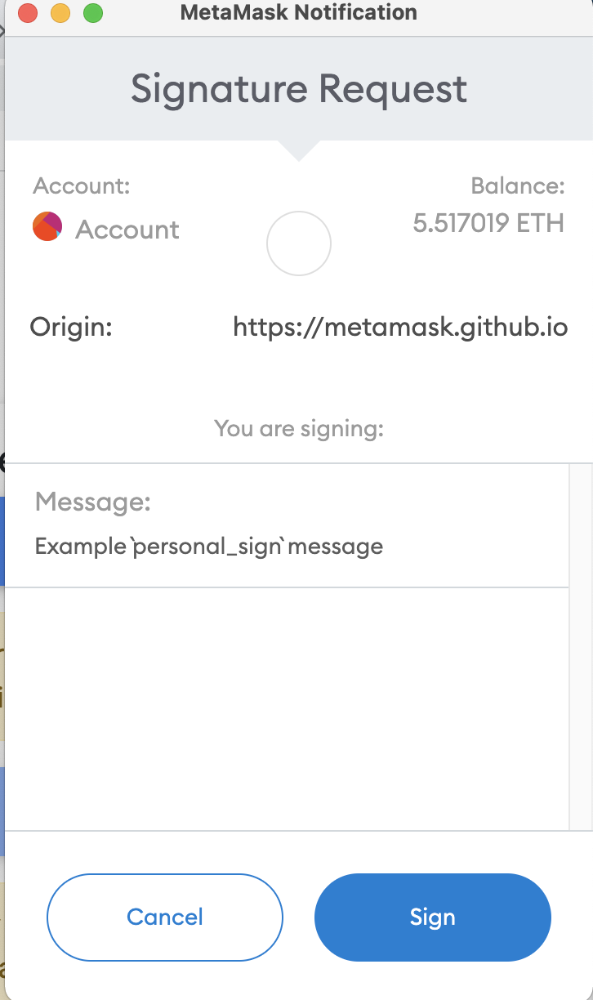
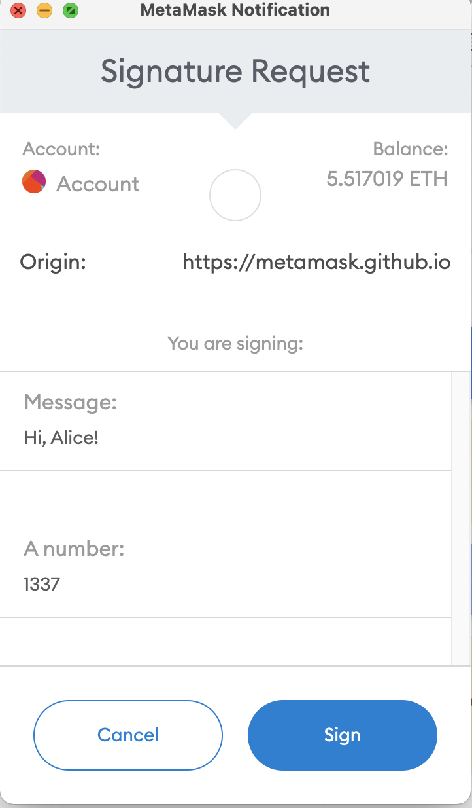

## 如何签名以及验证签名？

### 签名

1. 首先对 message 进行 hash 运算，不同格式的 message，计算 hash 的方式不一样。
2. 将 hash 结果进行签名（在链下签名，需要用到私钥，一般都是需要调用钱包插件来进行签名）；

### 验证签名

1. 对 message 重新进行 hash 运算；
1. 通过签名和 hash，来反算出 signer；这一步主要用到了`ecrecover`方法
1. 比较 signer 是不是一致的

## 签名类型

Metamask 提供了几种不同的签名方法，整个历史变化如下：

- eth_sign：最初的版本使用 eth_sign 方法，可以签名任意数据，但是很危险，已经不推荐使用。

  但是 metamask 依然支持，不过会做出危险提示：


- personal_sign： 该方法在任何签名数据前加上`\x19Ethereum Signed Message:\n`，这意味着如果有人要签署交易数据，添加的前缀字符串会使其成为无效交易。

 																


- signTypedData （现在和 signTypedData_v1 效果一样）
- signTypedData_v1：
- signTypedData_v3
- signTypedData_v4

后面出现的 signTypedData，都是基于 EIP-712 标准，专门针对于交易数据做的签名。

## 代码示例

本示例的代码都在`verifySignature.test.js`中，主要是利用私钥在链下签名。

然后通过合约方法，在链上进行签名的验证。

值得一提的是：eth-sig-util 这个 lib 库可以很好的帮助我们来进行链下签名和链下验证；

### 一、personal_sign 例子

#### 对简单的对字符串进行签名

```js
require('@nomiclabs/hardhat-waffle');
const { expect } = require('chai');

const {
  encrypt,
  recoverPersonalSignature,
  recoverTypedSignatureLegacy,
  recoverTypedSignature,
  recoverTypedSignature_v4,
} = require('eth-sig-util');

const { BigNumber, utils, provider } = ethers;
const {
  solidityPack,
  concat,
  toUtf8Bytes,
  keccak256,
  SigningKey,
  formatBytes32String,
} = utils;

describe('VerifySignature', () => {
  let contract;

  it('personal_sign', async () => {
    const [signer] = await ethers.getSigners();
    console.log('signer address = ', signer.address);
    const message = 'Example `personal_sign` message';
    // 调用ethers.utils的方法，对字符串hash
    const hashedMessage = utils.keccak256(utils.toUtf8Bytes(message));
    // const hashedMessage = `0x${Buffer.from(message, 'utf8').toString('hex')}`;
    console.log(`hashedMessage = `, hashedMessage);

    // 调用钱包的personal_sign方法，进行签名
    const signature = await provider.send('personal_sign', [
      hashedMessage,
      signer.address,
    ]);
    console.log(`signature = `, signature);

    // 调用eth-sig-util方法，验证签名
    const recoveredAddr = recoverPersonalSignature({
      data: hashedMessage,
      sig: signature,
    });
    console.log('recoveredAddr = ', recoveredAddr);
    expect(await signer.address.toUpperCase()).to.equal(
      recoveredAddr.toUpperCase()
    );

    // 调用合约的verify方法，验证签名
    const recoverResult = await contract.verify(message, signature);
    console.log('recoverResult = ', recoverResult);
    expect(await signer.address.toUpperCase()).to.equal(
      recoverResult.toUpperCase()
    );
  });
});
```

#### 对多个不同类型的参数加签

```js
//solidityKeccak256
const types = ['bytes', 'bytes', 'address', 'string', 'string', 'uint256'];
const values = [
  '0x19',
  '0x00',
  '0x8ef9f0acfef3d9ab023812bb889a8f5a214b9b82',
  '测试',
  '{}',
  1,
];
const hashedMessage = utils.solidityKeccak256(types, values);
const signature = await provider.send('personal_sign', [
  hashedMessage,
  signer.address,
]);

// 合约里需要提供接收bytes32格式的字段，来验证签名
const recover = await contract.recover2(newHash, signature);
```

`keccak256（solidityPack）` 和 `solidityKeccak256`这两种写法相同

```js
const types = [
  'address',
  'address',
  'uint256',
  'address',
  'uint256',
  'uint256',
  'uint256',
];
const values = [
  forkDelta.address,
  baseToken,
  baseAmount,
  quoteToken,
  quoteAmount,
  expires,
  orderNonce,
];
let hash = utils.keccak256(utils.solidityPack(types, values));
const hashedMessage = utils.solidityKeccak256(types, values);
console.log(hash == hashedMessage);
```

在 web3 里可以这么写

```js
const hashedMessage = web3.utils.soliditySha3(
  forkDelta.address,
  baseToken,
  baseAmount.toString(),
  quoteToken,
  quoteAmount.toString(),
  expires,
  orderNonce
);
```

Q: 对于 struct 类型的参数，怎么在合约里验证签名？

```solidity
 function prefixed(bytes32 hash) internal pure returns (bytes32) {
        return keccak256(abi.encodePacked('\x19Ethereum Signed Message:\n32', hash));
    }


    function verify(OrderSigned memory orderSigned, uint256 amount) public {
        bytes32 hash = keccak256(
            abi.encodePacked(
                address(this),
                orderSigned.baseToken,
                orderSigned.baseAmount,
                orderSigned.quoteToken,
                orderSigned.quoteAmount,
                orderSigned.expires,
                orderSigned.nonce
            )
        );
        console.logBytes32(hash);

        bytes32 messageDigest = prefixed(hash);
        // address signer = ecrecover(messageDigest, orderSigned.v, orderSigned.r, orderSigned.s);
        address signer = ECDSA.recover(messageDigest, orderSigned.signature);

        }
```

#### 合约里验证签名的方法

合约里主要是通过`ecrecover`方法，来得到签名的 address。

但是出于安全原因，推荐使用`ECDSA.recover`方法

```solidity
// SPDX-License-Identifier: MIT
pragma solidity ^0.8.0;

contract VerifySignature {
    function getMessageHash(string memory _message) public pure returns (bytes32) {
        return keccak256(abi.encodePacked(_message));
    }

    function getEthSignedMessageHash(bytes32 _messageHash) public pure returns (bytes32) {
        /*
        Signature is produced by signing a keccak256 hash with the following format:
        "\x19Ethereum Signed Message\n" + len(msg) + msg
        */
        return keccak256(abi.encodePacked('\x19Ethereum Signed Message:\n32', _messageHash));
    }


    function verify(string memory _message, bytes memory signature) public pure returns (address) {
        // 1、先生成hash
        bytes32 messageHash = getMessageHash(_message);

        // 2、生成一个eth signed 的hash
        bytes32 ethSignedMessageHash = getEthSignedMessageHash(messageHash);

        // 3、从hash里计算出signer
        // return recoverSigner(ethSignedMessageHash, signature);
        // 更安全
        return ECDSA.recover(ethSignedMessageHash, signature);

    }

    // verify2直接借用了ECDSA的方法，来返回signer
    function verify2(bytes32 _hash, bytes memory _signature) public pure returns (address) {
        return _hash.toEthSignedMessageHash().recover(_signature);
    }

    function recoverSigner(bytes32 _ethSignedMessageHash, bytes memory _signature) public pure returns (address) {
        (bytes32 r, bytes32 s, uint8 v) = splitSignature(_signature);
        return ecrecover(_ethSignedMessageHash, v, r, s);
    }

		// 计算rsv
    function splitSignature(bytes memory sig)
        public
        pure
        returns (
            bytes32 r,
            bytes32 s,
            uint8 v
        )
    {
        require(sig.length == 65, 'invalid signature length');

        assembly {
            /*
            First 32 bytes stores the length of the signature
            add(sig, 32) = pointer of sig + 32
            effectively, skips first 32 bytes of signature
            mload(p) loads next 32 bytes starting at the memory address p into memory
            */

            // first 32 bytes, after the length prefix
            r := mload(add(sig, 32))
            // second 32 bytes
            s := mload(add(sig, 64))
            // final byte (first byte of the next 32 bytes)
            v := byte(0, mload(add(sig, 96)))
        }
        // implicitly return (r, s, v)
    }
}
```

#### JS 对签名数据计算 r/s/v （做个了解）

r,s,v 是 ecreover 方法里的参数，这个是通过签名计算出来的。

也可以在合约里计算，参考上面的代码。

```js
// split signature
// 这里的r/s/v是签名算法的偏移量，会在验证签名时用到，做个了解
const r = signature.slice(0, 66);
const s = '0x' + signature.slice(66, 130);
const v = parseInt(signature.slice(130, 132), 16);
console.log({ r, s, v });
```

### 二、signTypedData_v1

v1 基于早期的 EIP-712 的协议，对数据的格式要求如下：

```
{
	  type: 'array',
		items: {
				type: 'object',
        properties: {
          name: {type: 'string'},
          type: {type: 'string'}, // Solidity type as described here: https://github.com/ethereum/solidity/blob/93b1cc97022aa01e7daa9816bcc23108bbe008b5/libsolidity/ast/Types.cpp#L182
          value: {
            oneOf: [
              {type: 'string'},
              {type: 'number'},
              {type: 'boolean'},
            ],
          },
        },
  },
}
```

早期 Web3.js 里调用方式如下，现在找不到这个 api 去支持签名 v1 版本的数据了。

```
const typedData = [
  {
    'type': 'string',
    'name': 'message',
    'value': 'Hi, Alice!',
  },
  {
    'type': 'uint',
    'name': 'value',
    'value': 42,
  },
];
// 找不到了
const signature = await web3.personal.signTypedData(typedData);
```

如果想尝试，可以用 matamask 提供的`eth_signTypedData`方法来唤起。效果如下：



通过`eth-sig-util`来验证：

```solidity
const {
  recoverTypedSignatureLegacy,
  signTypedDataLegacy,
} = require('eth-sig-util');

it('struct_sign_typed_data_v1', async () => {
    const [signer] = await ethers.getSigners();
    signer.privateKey = '10645fd201fc751be73c2d5219a2cd738418f2b15b90d1ea5fa2f422951af7a3';
    console.log('signer address = ', signer.address);
    const msgParams = [
      {
        type: 'string',
        name: 'Message',
        value: 'Hi, Alice!',
      },
      {
        type: 'uint32',
        name: 'Value',
        value: 1337,
      },
    ];
    const privateKey1Buffer = Buffer.from(signer.privateKey, 'hex');
    const signature = signTypedDataLegacy(privateKey1Buffer, { data: msgParams });

    // 如果是metmask插件，可以调用下面的方法
    // const signature = await provider.send('eth_signTypedData', [msgParams, signer.address]);
    const jsRecoveredAddr = recoverTypedSignatureLegacy({
      data: msgParams,
      sig: signature,
    });
    console.log('jsRecoveredAddr = ', jsRecoveredAddr);
    expect(signer.address.toUpperCase()).to.equal(jsRecoveredAddr.toUpperCase());
  });
```

==注：似乎过时了，我在 web3 和 etherjs 里都没有找到对应的方法调用。==

### 三、signTypedData_v3

v3 版本是基于 EIP-712 协议，除了对数组和嵌套数据结构不支持

（except that arrays and recursive data structures are not supported.）

```js
it('struct_sign_typed_data_v3', async () => {
  const [signer] = await ethers.getSigners();
  console.log('signer address = ', signer.address);
  const network = await provider.getNetwork();
  const chainId = network.chainId;
  console.log('chainId = ', network.chainId);
  console.log(`contract address = `, contract.address);
  const msgParams = {
    types: {
      Person: [
        { name: 'name', type: 'string' },
        { name: 'wallet', type: 'address' },
      ],
      Mail: [
        { name: 'from', type: 'Person' },
        { name: 'to', type: 'Person' },
        { name: 'contents', type: 'string' },
      ],
    },
    primaryType: 'Mail',
    domain: {
      name: 'Ether Mail',
      version: '1',
      chainId,
      verifyingContract: contract.address,
    },
    message: {
      from: {
        name: 'Cow',
        wallet: '0xCD2a3d9F938E13CD947Ec05AbC7FE734Df8DD826',
      },
      to: {
        name: 'Bob',
        wallet: '0xbBbBBBBbbBBBbbbBbbBbbbbBBbBbbbbBbBbbBBbB',
      },
      contents: 'Hello, Bob!',
    },
  };

  const signature = await signer._signTypedData(
    msgParams.domain,
    msgParams.types,
    msgParams.message
  );
  console.log(`signature = `, signature);
  // 如果是metmask插件，可以调用下面的方法
  // const signature = await provider.send('eth_signTypedData_v3', [signer.address, msgParams]);

  const jsRecoveredAddr = utils.verifyTypedData(
    msgParams.domain,
    msgParams.types,
    msgParams.message,
    signature
  );
  console.log('jsRecoveredAddr = ', jsRecoveredAddr);
  expect(signer.address.toUpperCase()).to.equal(jsRecoveredAddr.toUpperCase());

  const contractRecoveredResult = await contract.verify3(
    msgParams.message,
    signature
  );
  console.log('contractRecoveredResult = ', contractRecoveredResult);
  expect(await signer.address.toUpperCase()).to.equal(
    contractRecoveredResult.toUpperCase()
  );
});
```

合约上验证的方法：

```solidity
// SPDX-License-Identifier: MIT
pragma solidity ^0.8.0;
pragma experimental ABIEncoderV2;

import '@openzeppelin/contracts/utils/cryptography/ECDSA.sol';
import '@openzeppelin/contracts/utils/cryptography/draft-EIP712.sol';
import 'hardhat/console.sol';

contract VerifySignature is EIP712 {
    using ECDSA for bytes32;

    // 这里的domain version要和前端传的一致
    constructor() EIP712('Ether Mail', '1') {}

    /**
         Person: [
          { name: 'name', type: 'string' },
          { name: 'wallet', type: 'address' },
        ],
        Mail: [
          { name: 'from', type: 'Person' },
          { name: 'to', type: 'Person' },
          { name: 'contents', type: 'string' },
        ],
 */
    struct Person {
        string name;
        address wallet;
    }

    struct Mail {
        Person from;
        Person to;
        string contents;
    }
    bytes32 constant MAIL_TYPE_HASH = keccak256('Mail(Person from,Person to,string contents)Person(string name,address wallet)');
    bytes32 PERSON_TYPE_HASH = keccak256('Person(string name,address wallet)');

    function hash(Person calldata person) internal view returns (bytes32) {
        return keccak256(abi.encode(PERSON_TYPE_HASH, keccak256(bytes(person.name)), person.wallet));
    }

    function hash(Mail calldata mail) internal view returns (bytes32) {
        return keccak256(abi.encode(MAIL_TYPE_HASH, hash(mail.from), hash(mail.to), keccak256(bytes(mail.contents))));
    }

    function verify3(Mail calldata mail, bytes memory _signature) public view returns (address) {
        bytes32 structHash = hash(mail);
        bytes32 digest = _hashTypedDataV4(structHash);
        address signer = ECDSA.recover(digest, _signature);
        return signer;
    }

}

```

### 四、signTypedData_v4

v4 版本是基于 EIP-712 协议，是最新的，支持所有的数据格式，包括数组和嵌套的 struct。

```js
it('struct_sign_typed_data_v4', async () => {
  const [signer] = await ethers.getSigners();
  console.log('signer address = ', signer.address);
  const network = await provider.getNetwork();
  const chainId = network.chainId;
  console.log('chainId = ', network.chainId);
  console.log(`contract address = `, contract.address);
  const msgParams = {
    domain: {
      version: '1',
      name: 'Ether Mail',
      chainId,
      verifyingContract: contract.address,
    },
    message: {
      data: ['1', '2', '3'],
    },
    primaryType: 'Message',
    types: {
      Message: [{ name: 'data', type: 'string[]' }],
    },
  };

  const signature = await signer._signTypedData(
    msgParams.domain,
    msgParams.types,
    msgParams.message
  );
  console.log(`signature = `, signature);
  // 如果是metmask插件，可以调用下面的方法
  // const signature = await provider.send('eth_signTypedData_v4', [signer.address, msgParams]);

  const jsRecoveredAddr = utils.verifyTypedData(
    msgParams.domain,
    msgParams.types,
    msgParams.message,
    signature
  );

  console.log('jsRecoveredAddr = ', jsRecoveredAddr);
  expect(signer.address.toUpperCase()).to.equal(jsRecoveredAddr.toUpperCase());

  const contractRecoveredResult = await contract.verify4(
    msgParams.message,
    signature
  );
  console.log('contractRecoveredResult = ', contractRecoveredResult);
  expect(await signer.address.toUpperCase()).to.equal(
    contractRecoveredResult.toUpperCase()
  );
});
```

在合约上认证的方法:

```solidity
// SPDX-License-Identifier: MIT
pragma solidity ^0.8.0;
pragma experimental ABIEncoderV2;

import '@openzeppelin/contracts/utils/cryptography/ECDSA.sol';
import '@openzeppelin/contracts/utils/cryptography/draft-EIP712.sol';
import 'hardhat/console.sol';

contract VerifySignature is EIP712 {
    using ECDSA for bytes32;

    // domain version
    constructor() EIP712('Ether Mail', '1') {}


    struct Message {
        string[] data;
    }


    bytes32 constant Message_TYPE_HASH = keccak256('Message(string[] data)');


    function hash(Message calldata message) internal view returns (bytes32) {
        bytes32[] memory keccakData = new bytes32[](message.data.length);
        for (uint256 i = 0; i < message.data.length; i++) {
            keccakData[i] = keccak256(bytes(message.data[i]));
        }
        bytes32 computedHash5 = keccak256(abi.encodePacked(keccakData));
        return keccak256(abi.encode(Message_TYPE_HASH, computedHash5));
    }

    function verify4(Message calldata message, bytes memory _signature) public view returns (address) {
        console.log(message.data.length);
        bytes32 structHash = hash(message);
        bytes32 digest = _hashTypedDataV4(structHash);
        address signer = ECDSA.recover(digest, _signature);
        return signer;
    }

}

```

## 参考文档

metamask 的签名方法： https://docs.metamask.io/guide/signing-data.html#signing-data-with-metamask

Test Dapp: https://github.com/MetaMask/test-dapp

签名文章：https://medium.com/metamask/eip712-is-coming-what-to-expect-and-how-to-use-it-bb92fd1a7a26

https://github.com/ethereum/EIPs/blob/master/assets/eip-712/Example.js
