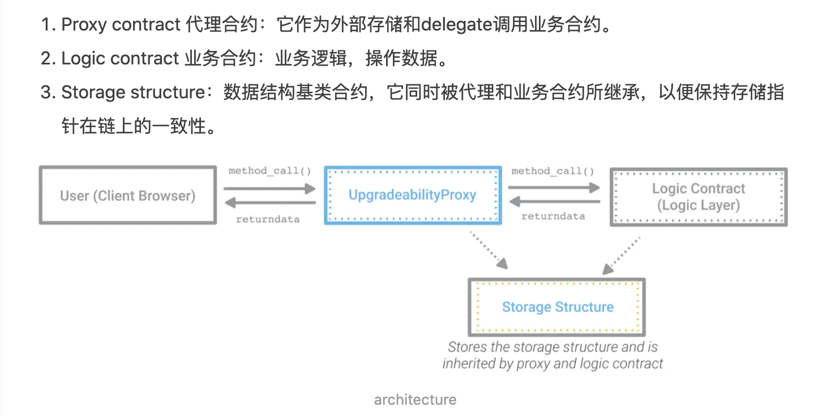

## 前言
区块链信任基础的数据不可修改的特性, 让它传统应用程序有一个很大的不同的地方是一经发布于区块链上就无法修改.  
一方面正是由于智能合约的不可修改的特性, 因为只要规则确定之后, 没人能够修改它, 大家才能够信任它. 但另一方面, 如果规则的实现有 Bug, 可能会造成代币被盗, 或是调用消耗大量的gas. 这时就需要我们去修复错误.  
这里介绍两种可升级的合约开发模式.

## 方式一合约功能说明
- DataContract  
  - platform:     权限修饰器, 指定只有拥有权限的用户才能调用此合约  
  - allowAccess:  给其他用户增加权限  
  - denyAccess:   取消其他用户的权限  
  - setBalance:    设置一个用户的余额, 同时这个接口指定了只有拥有权限的用户才能调用此接口  
  - getBalance:    这是一个公共的接口, 任何用户都可以调用此接口

- ControlContract  
  - constructor:  在部署合约的时候需要传入 DataContract 的合约地址进行加载  
  - setBalance:    内部调用 DataContract 合约的 setBalance 接口, 中间可以加入对应的业务逻辑  
  - getBalance:    调用 DataContract 合约的 getBalance 接口获取账户余额

## 测试步骤
- 安装依赖
```
yarn 
```

- 执行测试
```
npx hardhat test
```

### controlContract_test.js 主逻辑说明
controlContract_test.js 在 test 目录, 执行 "npx hardhat test" 的时候就会自动执行这个测试脚本.  
脚本中有三个单元测试用例.
- 第一个用例是 DataContract 合约的调用, 用于验证只有有权限的用户才能调用合约.
- 第二个用例是 ControlContract 调用 DataContract 合约的接口, 用于验证没有权限的用户不能调用合约.
- 第三个用例是 DataContract 合约的部署者赋权给 ControlContract 后, ControlContract 可以调用 DataContract 接口, 这样一来, 当业务逻辑有变动的时候, 只需要重新部署一个新的 ControlContract 合约, 然后进行赋权,
  就可以实现合约的升级改造.

## 方式二 OpenZeppelin Upgrades 合约功能说明
方式一如果需要对实现合约方法进行任何更改，那么我们也需要更新代理合约的方法（因为代理合约具有接口方法）。因此，用户同样需要更改代理合约地址。
```solidty 
 // Sample code, do not use in production!  
    contract TransparentAdminUpgradeableProxy {  
        address implementation;  
        address admin;  

        fallback() external payable {  
            require(msg.sender != admin);  
            implementation.delegatecall.value(msg.value)(msg.data);  
        }  

        function upgrade(address newImplementation) external {  
            if (msg.sender != admin) fallback();  
            implementation = newImplementation;  
        }  
    }  
```
要解决此问题，我们可以在代理合约中使用fallback回退函数。 fallback函数将执行任何请求，将请求重定向到实现合约并返回结果值。这与以前的方法类似，但是这里的代理合约没有接口方法，只有 fallback 回退函数，因此，如果更改合约方法，则无需更改代理地址。

**深度理解delegatecall**
```
assembly {
    // 获得自由内存指针
    let ptr := mload(0x40)
    // 复制calldata到内存中
    calldatacopy(ptr, 0, calldatasize) 
    // 使用delegatecall处理calldata
    let result := delegatecall(gas, _impl, ptr, calldatasize, 0, 0)
    // 返回值大小
    let size := returndatasize
    // 把返回值复制到内存中
    returndatacopy(ptr, 0, size)

    switch result
    case 0 { revert(ptr, size) } // 执行失败
    default { return(ptr, size) } // 执行成功，返回内存中的返回值
 }
```

1. 可以传递msg.sender
2. 可以改变同一存储槽中的内容

delegatecall并不通过变量名称来修改变量值，而是修改变量所在的存储槽。  
在solidity中，内存槽中的0x40位置是很特殊的，因为它存储了指向下一个可用自由内存的指针。每次当你想往内存里存储一个变量时，你都要检查存储在0x40的值。这就是你变量即将存放的位置。现在我们知道了我们要在哪儿存变量，我们就可以使用calldatacopy，把大小为calldatasize的calldata从0开始复制到ptr指向的那个位置了。

```
let result := delegatecall(gas, _impl,  ptr, calldatasize, 0, 0)
```
解释一下上面的参数：

- gas：函数执行所需的gas
- _impl：我们调用的逻辑合约的地址
- ptr：内存指针（指向数据开始存储的地方）
- calldatasize：传入的数据大小
- 0：调用逻辑合约后的返回值。我们没有使用这个参数因为我们还不知道返回值的大小，所以不能把它赋值给一个变量。我们可以后面可以进一步使用returndata操作码来获取这些信息。
- 0：返回值的大小。这个参数也没有被使用因为我们没有机会创造一个临时变量用来存储返回值。鉴于我们在调用其他合约之前无法知道它的大小（所以就无法创造临时变量呀）。我们稍后可以用returndatasize操作码来得到这个值。

样例参考：
```
pragma solidity ^0.4.24;

contract proxy {
    address public logicAddress;

    function setLogic(address _a) public {
        logicAddress = _a;
    }

    function delegateCall(bytes data) public {
        this.call.value(msg.value)(data);
    }

    function () payable public {
        address _impl = logicAddress;
        require(_impl != address(0));

        assembly {
            let ptr := mload(0x40) 
            calldatacopy(ptr, 0, calldatasize) 
            let result := delegatecall(gas, _impl, ptr, calldatasize, 0, 0)
            let size := returndatasize 
            returndatacopy(ptr, 0, size) 

        switch result
            case 0 { revert(ptr, size) }
            default { return(ptr, size) }
        }
  }

    function getPositionAt(uint n) public view returns (address) {
        assembly {
            let d := sload(n)
            mstore(0x80, d)
            return(0x80,32)
      }
    }
}

contract logic {
    address public a;
     function setStorage(address _a) public {
         a = _a;
     }
}
```

### 通用可升级代理
透明代理的替代，EIP1822定义了通用的可升级代理标准，或简称为“ UUPS”。该标准使用相同的委托调用模式，但是将升级逻辑放在实现合约中，而不是在代理本身中。
```
// Sample code, do not use in production!  
contract UUPSProxy {  
    address implementation;  
    fallback() external payable {  
        implementation.delegatecall.value(msg.value)(msg.data);  
    }  
}  
abstract contract UUPSProxiable {  
    address implementation;  
    address admin;  
    function upgrade(address newImplementation) external {  
        require(msg.sender == admin);  
        implementation = newImplementation;  
    }  
}  
```

### 实战demo

#### 首次部署
需要部署三个合约，分别是逻辑合约，ProxyAdmin，TransparentUpgradeProxy。  
逻辑合约就是我们自己的业务合约，需要满足OpenZeppelin可升级合约的条件。ProxyAdmin 代理持有状态，而逻辑合约实现合约提供代码
1. 业务合约 Params 部署（先不进行初始化，initialize，本方法对应的 code 为 0x8129fc1c ）
2. ProxyAdmin 管理合约部署，代理合约的管理员
3. TransparentUpgradeableProxy 代理合约，此为用户直接交互的合约地址，一直不变；

部署需要参数，如下:
- _LOGIC: 逻辑合约地址，步骤1；
- ADMIN_: 管理合约地址，步骤2；
- _DATA: 逻辑合约初始化方法调用数据，这里为 0x8129fc1c（只调用 initialize 方法，initialize 方法没有入参，如果有参数也是支持的）

合约升级：
1. 逻辑合约 Params 升级为 ParamsNew;
2. 调用 ProxyAdmin 进行升级;

ProxyAdmin 提供两个方法进行升级
- upgrade，需要传入 proxy 地址，新的逻辑实现地址;
- upgradeAndCall，需要传入 proxy 地址，新的逻辑实现地址，初始化调用数据  
  本例中，由于数据是保存在代理合约中，这份数据已经初始化过了，不需要再初始化，所以调用 upgrade 方法即可。  
  proxy: TransparentUpgradeableProxy 代理合约地址；  
  implementation: ParamsNew 合约地址

**注意事项**
- 可升级合约的存储不能乱，即：只能新增存储项，不能修改顺序。这种限制只影响状态变量。你可以随心所欲地改变合约的功能和事件。
- 不能有构造函数，使用 Initialize 合约替代，通过在方法上添加 initializer 标签，确保只被初始化一次。
- 继承的父合约也需要能满足升级，本例中的 Ownable 采用 OwnableUpgradeable，支持升级
- 可使用 OpenZeppelin 插件验证合约是否为可升级合约，以及升级时是否有冲突

### 升级到 Gonsis 合约
代理的管理员（可以执行升级）是 ProxyAdmin 合约。 只有 ProxyAdmin 的所有者可以升级代理。可以调用：proxyadmin.transferOwnership 转移到自己的多签合约地址上。

## 参考文档
- 如何编写一个可升级的智能合约(登链): <https://zhuanlan.zhihu.com/p/34690916>
- openzeppelin: <https://blog.openzeppelin.com/proxy-patterns/>
- proxy升级: https://learnblockchain.cn/article/2758
- 深度理解delegatecall: https://segmentfault.com/a/1190000015732950
- gnosis升级： https://learnblockchain.cn/article/1403
- 总览： https://www.chainnews.com/articles/042189657582.htm
- 知乎王大锤：https://zhuanlan.zhihu.com/p/40598039
- 知乎王大锤：https://zhuanlan.zhihu.com/p/40598169
- 合约代码：https://github.com/OpenZeppelin/openzeppelin-contracts-upgradeable/tree/master/contracts/proxy
- openzepplin test: https://docs.openzeppelin.com/upgrades-plugins/1.x/writing-upgradeable
- openzepplin: https://docs.openzeppelin.com/upgrades-plugins/1.x/proxies
- openzepplin: https://blog.openzeppelin.com/proxy-patterns/
- testcase: https://forum.openzeppelin.com/t/openzeppelin-upgrades-step-by-step-tutorial-for-truffle/3579
- 原理介绍：https://www.jianshu.com/p/3fa12d7ed76d
- compound: 合约升级