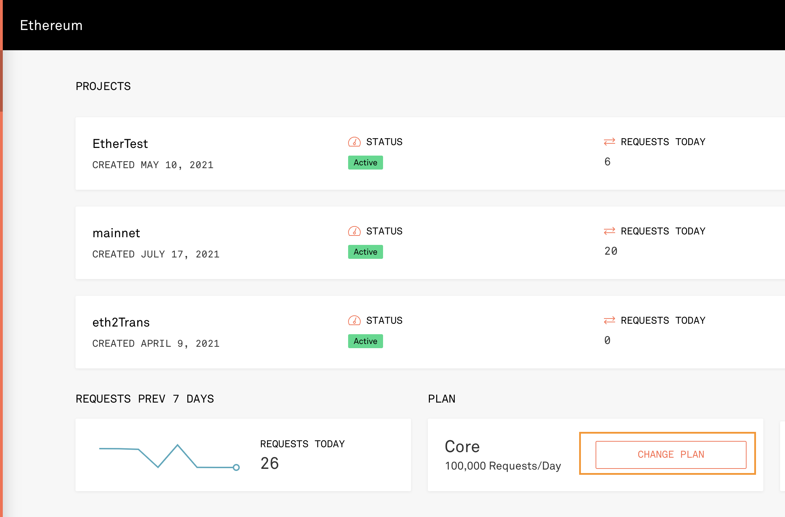
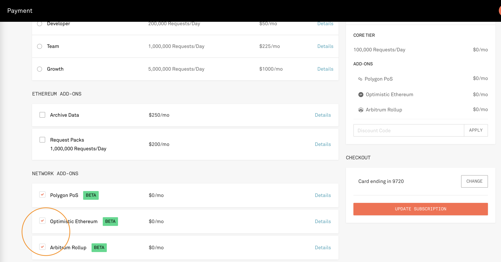
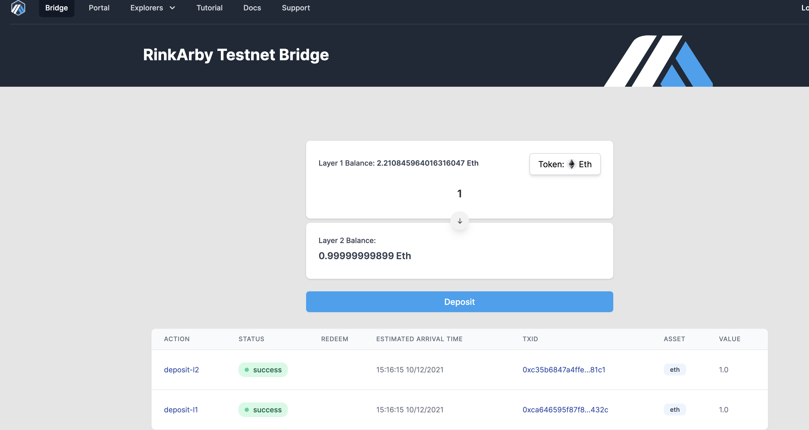
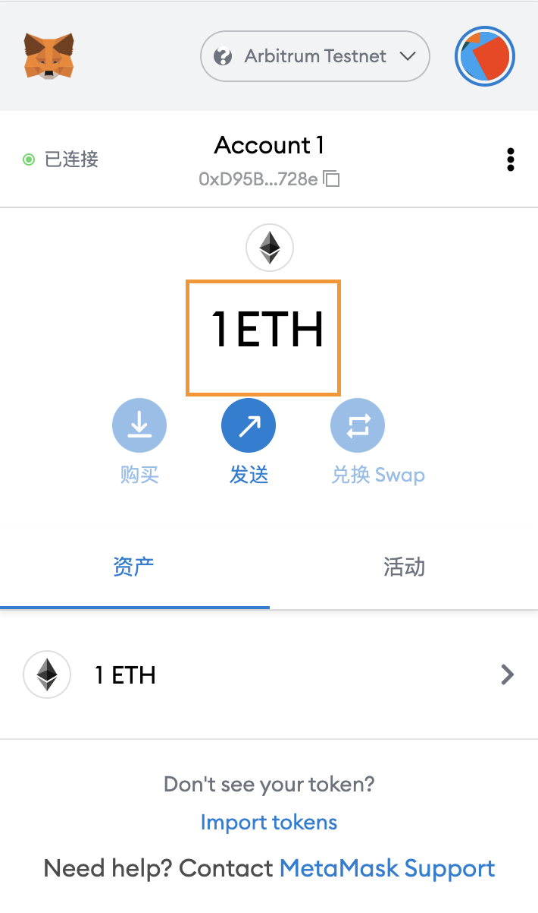

# Arbitrum

Arbitrum 桥：https://bridge.arbitrum.io/

与 optimism 差别在于： 交互式证明挑战

Optimism 的争议解决比 Arbitrum 更依赖于以太坊虚拟机 (EVM)。当有人提交关于 Optimism 的挑战时，**整个有问题的交易都通过 EVM 运行**。相比之下，**Arbitrum 使用链下争议解决流程将争议减少到一笔交易中的一个步骤**。然后，协议将这个一步断言（而不是整个交易）发送到 EVM 进行最终验证。因此，从概念上讲，Optimism 的争议解决过程比 Arbitrum 简单得多。

交互式证明的好处：

1. 在乐观情况下效率更高;
2. 在悲观情况下效率更高;
3. 每笔交易更大的 gaslimit，合约大小不受限制;

这意味着在有争议的交易的情况下，在 Arbitrum 的案例中，以太坊的最终确认比在 Optimism 的案例中延迟的时间更长。
Arbitrum 争议解决的优势在于它在链上（即以太坊）交易成本方面更便宜。

Optimism 的争议解决过程比 Arbitrum 更简单、更快捷，因为它只是通过 EVM 提供有争议的交易。这个速度在这里是 Optimism 的优势，因为争议可以快速解决，并且不会妨碍 rollup 链的未来进展。

## Pipelining

人们担心的是“多轮”争议解决程序，例如 Arbitrum 使用的一个程序。至少从理论上讲，垃圾邮件发送者可以通过发起一系列连续的挑战来阻止 Rollup 的进展，每个挑战都需要相当长的时间来解决。事实上，这是一个困扰 Arbitrum 之前迭代的问题。

然而，Arbitrum 更新的协议适用于这个问题，一种称为“流水线（Pipelining）”的优雅解决方案。 流水线允许网络验证器继续处理交易以获得最终批准，即使先前处理的交易存在争议。 这创建的是最近处理但尚未完成的交易的“管道”，而不是阻止排序器处理交易和网络各方提交挑战的瓶颈。

AVM 与 EVM 的不同：
AVM 既支持执行交易，又支持证明（L1 合约相信某个断言是真的）

## 执行测试

- 安装依赖

  ```bash
  yarn
  ```

- 配置环境变量  
  复制 .env.example 文件为 .env 文件, 然后配置其中的 PRIVATE_KEY,INFURA_ID

- 配置 Infura  
  这里我们是通过 Infura 连接到 arbitrum 的测试网络, 但有时候, 对于新出现的测试网络, Infura 会进行限制, 这里需要配置先 Infura, 以允许访问 arbitrum 网路.

  - 修改 Plan  
    在 Infura 上选择 "Ethereum" -> "PLAN"
    

  - 赋权  
    之后选择 "NETWORK ADD-ONS", 勾选 "Optimistic Ethereum" 和 "Arbitrum Rollup", 然后点击 "UPDATE SUBSCRIPTION"
    

- 转 eth 到 arbitrum 测试网络  
  因为 arbitrum 测试网络对应的是 rinkeby, 所以需要在 rinkeby 测试网络上有测试币 , 可以通过 [rinkeby 测试网](https://faucet.rinkeby.io/) 获取测试币.  
  之后需要把 rinkeby 测试币转移到 arbitrum 二层网络上, 可以通过 [arbitrum bridge](https://bridge.arbitrum.io/) 进行操作, 测试币转移需要等待 10 mins 左右
  

  测试币转移成功后, 通过 metaMask 可以看到在 arbitrum 上面的余额

  

- 执行测试脚本

  ```bash
  ❯ npx hardhat run scripts/deploy.js --network arbitrum
  Deploying contracts with the account: 0xD95Be34213b53e3eC51091a0c5De07641Fc1728e
  Account balance: 999999998990000000
  Token address: 0x33d269391b364C4fe69f92176D08A5F1B2DF9462
  ```

## 参考链接

- https://developer.offchainlabs.com/docs/inside_arbitrum
- git 代码: https://github.com/OffchainLabs
- 中文文档： https://github.com/dysquard/Arbitrum_Doc_CN
- 与 op 对比: https://medium.com/stakingbits/guide-to-arbitrum-and-setting-up-metamask-for-arbitrum-543e513cdd8b
- 很详细的原理介绍
  https://new.qq.com/omn/20210709/20210709A0CL6M00.html

- https://github.com/dysquard/Arbitrum_Doc_CN/blob/master/2_%E6%B7%B1%E5%85%A5%E7%90%86%E8%A7%A3%E5%8D%8F%E8%AE%AE/
- https://q6rsx4wom8.feishu.cn/file/boxcnu89en45JWelsoUv8nIwdRc rollup 详细解读
- https://q6rsx4wom8.feishu.cn/file/boxcnu89en45JWelsoUv8nIwdRc arbi 简介
- https://mubu.com/app/edit/clb/NIhGqZda80#m 分享
- [un.Block 周报](https://zhuanlan.zhihu.com/p/419000613) 有关 Arbitrum 的介绍。介绍了 Aribtrum 和 Optimistic Rollup 的不同，以及 Arbitrum 是如何达成 Layer1 和 Layer2 之间的通信的。
