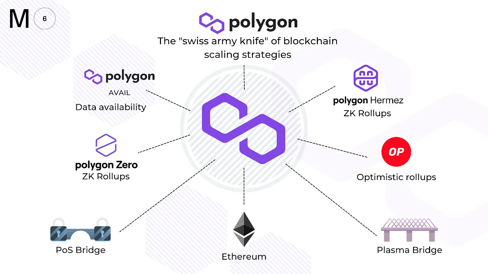

# Polygon

Polygon 的目标不是提供一两个扩展解决方案，而是创建一个生态系统，使其能够轻松连接多个不同的扩展解决方案——从具有不同共识机制的侧链到第二层网络，如 Plasma、Optimistic rollups 和 ZK rollups。

Polygon 支持与以太坊兼容的两种区块链网络：独立网络（stand-alone network）和安全链（secured chain）

- 独立网络依赖于它们自己的安全性，例如，它们可以有自己的共识模型，如权益证明（PoS）或委托权益证明（DPoS）
- 安全链使用“安全即服务”模型。它可以由以太坊直接提供，例如通过 Plasma 使用的欺诈证明（fraud proofs），或由专业验证节点提供。这些验证节点运行在 Polygon 生态系统中，可以被多个项目共享——这个概念类似于波卡的共享安全模型

当谈到 Polygon 的架构时，我们需要关注的主要要点是它被刻意地设计成通用和抽象的。这允许其他希望扩展的应用程序选择最适合其需求的扩展解决方案。

<center></center>

<br/>
<br/>

## Polygon 扩容方案

<center>
    
</center>

## Matic Plasma Chain

---

[(Polygon Plasma Chain)](https://docs.matic.network/docs/develop/ethereum-matic/plasma/getting-started) Plasma 允许使用者将交易从主链转移到子链，从而实现快速和廉价的交易。Plasma 的一个缺点是用户从第 2 层网络中提取资金需要很长的等待时间。Plasma 不能用于扩展通用的智能合约。

## Matic PoS Chain

---

[(Polygon PoS Chain)](https://docs.matic.network/docs/develop/ethereum-matic/pos/getting-started/) Matic PoS Chain 是一个未经许可的侧链，它与以太坊链并行运行。该链由具有自身验证节点的权益证明共识机制来保护。尽管 Matic PoS Chain 有自己的共识机制，但在验证节点 staking 和检查点方面，它也依赖于以太坊的安全性。

## Polygon Hermez ZKRollup

---

[(Hermez ZKEvm)](https://www.chainnews.com/articles/018319341743.htm) 基于简洁的有效性证明（又称零知识证明）的以太坊第 2 层解决方案，在以太坊上定期提交和验证。

## Polygon SDK

---

[(Polygon SDK)](https://polygon.technology/polygon-sdk/) 一个模块化和可扩展的框架，用于构建兼容 Ethereum 的区块链网络，用 Golang 编写。

## Polygon Avail

---

[(Polygon Data Avail)](https://blog.polygon.technology/introducing-avail-by-polygon-a-robust-general-purpose-scalable-data-availability-layer-98bc9814c048) Avail 是一个通用的、可扩展的、专注于数据可用性的区块链，针对独立链、侧链和链外扩展解决方案。

## maticjs-ethers例子

maticjs-ethers集成了ethers.js，可以用于交互Polygon的主链和子链，下面我们使用hardhat分别在8545端口和8546端口启动节点，来模拟Layer1和Layer2

启动L1节点

```bash
npx hardhat node
```

在另一个终端启动L2节点

```bash
npx hardhat node --port 8546
```

在L1和L2上都部署一个ERC20合约

```bash
$ npx hardhat run scripts/sample-script.js --network localhost 
# result
Compiled 34 solidity files successfully(evm target: paris).
Greeter deployed to:0x5FbDB2315678afecb367f032d93F642f64180aa3
myToken deployed to:0xe7f1725E7734CE288F8367e1Bb143E90bb3F0512

$ npx hardhat run scripts/sample-script.js --network localhost12
# result
Greeter deployed to:0x5FbDB2315678afecb367f032d93F642f64180aa3
myToken deployed to:0xe7f1725E7734CE288F8367e1Bb143E90bb3F0512
```

部署完成后，将合约地址填写到maticjs-ethers/src/config.js文件中

```javascript
ERC20: {
    parent: {
      ether: '0x0000000000000000000000000000000000000000',
      erc20: '0xe7f1725E7734CE288F8367e1Bb143E90bb3F0512'
    },
    child: {
      ether: '0x0000000000000000000000000000000000000000',
      erc20: '0xe7f1725E7734CE288F8367e1Bb143E90bb3F0512'
    },
  },
```

进入maticjs-ethers目录

```bash
cd maticjs-ethers
cp .env.example .env
```

将下面的内容填写到`.env`文件中，这里我们选择hardhat测试账户的前两个账户分别作为USER1和USER2

```
USER1_FROM=0xf39Fd6e51aad88F6F4ce6aB8827279cffFb92266
USER1_PRIVATE_KEY=0xac0974bec39a17e36ba4a6b4d238ff944bacb478cbed5efcae784d7bf4f2ff80
USER2_FROM=0x70997970C51812dc3A010C7d01b50e0d17dc79C8
PARENT_RPC=http://localhost:8545
CHILD_RPC=http://localhost:8546
```

测试余额和转账操作，可能由于浮点数的问题，erc20TokenL1Balance0fTo在第一次的结果不为0，但是之后就正常了。
```bash
$ node src/index.js
# result
erc20TokenL1Balance:10000
erc20TokenL2Balance:10000
erc20TokenL1Balance0fTo:1e-16
txHash 0x00a78e8b274c491a2ace68c51f021b5fff5bce4e165cad58ca8ac4d6035b26ac
erc20TokenL1Balance0fTo after transfer:10
erc20TokenL1Balance after transfer:9990
```
如果希望在L1和L2之间实现资产的跨链，还需要部署相关的bridge合约，maticjs-ethers也支持相关的deposit操作和withdraw操作，有兴趣可以尝试下。

<br/>
<br/>

# 参考资源

## 1 综合资源

---

### Polygon 介绍

- [Polygon 精简介绍](https://biquan365.com/12636.html)
- [Polygon 基础介绍和使用教程](https://www.yuque.com/docs/share/8e737364-c380-418e-af21-0f07095fe900)
- [Polygon 架构](https://docs.matic.network/docs/contribute/matic-architecture)
- [Polygon 上的 Meta-transactions](https://docs.matic.network/docs/develop/metatransactions/getting-started)
- [Matic Network 白皮书中文版](https://www.chainnews.com/articles/022315243415.htm)

### 官方网站

- [Polygon 官网](https://polygon.technology/)
- [Polygon 网络浏览器](https://polygonscan.com/)
- [Polygon 文档](https://docs.matic.network/)
- [Awesome Polygon (所有在 Polygon 网络上部署的项目)](http://awesomepolygon.com/)

### 开发者入口

- [Polygon 开发入门](https://docs.matic.network/docs/develop/getting-started)
- [Matic 主网](https://rpc-mainnet.maticvigil.com)
- [Mumbai 测试网](https://rpc-mumbai.maticvigil.com)
- [Polygon 测试币](https://faucet.matic.network/)

## 2 Polygon 申请

---

- [Polygon 官宣申请表](https://airtable.com/shrDaWf1UYNzkhTbg)
- [Polygon Grant 申请](https://polygon.technology/developer-support-program/)

## 3 Polygon 开发者资源

---

### How to

- [如何使用预言机](https://docs.matic.network/docs/develop/oracles/getting-started)
- [如何使用 Chainlink](https://docs.matic.network/docs/develop/oracles/chainlink)
- [如何接入支付工具](https://docs.matic.network/docs/develop/fiat-on-ramp)
- [如何使用 TheGraph](https://docs.matic.network/docs/develop/graph)
- [如何使用 hardhat](https://docs.matic.network/docs/develop/hardhat/)
- [如何设置 Infura RPC](https://www.youtube.com/watch?v=jz6idHfMGvk)

### 工具

- [Gas 费预测](https://docs.matic.network/docs/develop/tools/matic-gas-station/#usage)
- [Polygon 网络浏览器的 APIs](https://polygonscan.com/apis)
- [Matic.js SDK](https://github.com/maticnetwork/matic.js)
- [Alchemy 开发者工具套件](https://www.alchemy.com/)
- [Decentology Dapp 模版](https://dappstarter.decentology.com/)

### 教程

- [在 Polygon 上创建 NFT，资产部署在 IPFS 上](https://medium.com/pinata/how-to-create-layer-2-nfts-with-polygon-and-ipfs-aef998ff8ef2)
- [以太坊二层 Polygon 网络 NFT 开发教程](https://cloud.tencent.com/developer/article/1828250)
