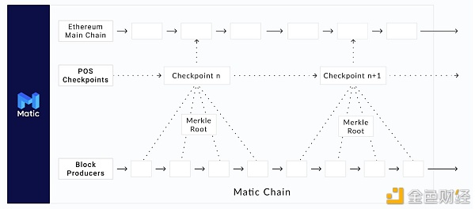

# Polygon

Polygon的目标不是提供一两个扩展解决方案，而是创建一个生态系统，使其能够轻松连接多个不同的扩展解决方案——从具有不同共识机制的侧链到第二层网络，如Plasma、Optimistic rollps和ZK rollps。
Polygon支持与以太坊兼容的两种区块链网络：独立网络（stand-alone network）和安全链（secured chain）
独立网络依赖于它们自己的安全性，例如，它们可以有自己的共识模型，如权益证明（PoS）或委托权益证明（DPoS）
安全链使用“安全即服务”模型。它可以由以太坊直接提供，例如通过Plasma使用的欺诈证明（fraud proofs），或由专业验证节点提供。这些验证节点运行在Polygon生态系统中，可以被多个项目共享——这个概念类似于波卡的共享安全模型。
当谈到Polygon的架构时，我们需要关注的主要要点是它被刻意地设计成通用和抽象的。这允许其他希望扩展的应用程序选择最适合其需求的扩展解决方案。

    

 
 

# Polygon 扩容方案

    

## Matic Plasma Chain
---
[(Polygon Plasma Chain)](https://docs.matic.network/docs/develop/ethereum-matic/plasma/getting-started) Plasma允许使用者将交易从主链转移到子链，从而实现快速和廉价的交易。Plasma的一个缺点是用户从第2层网络中提取资金需要很长的等待时间。Plasma不能用于扩展通用的智能合约。

## Matic PoS Chain
---
[(Polygon PoS Chain)](https://docs.matic.network/docs/develop/ethereum-matic/pos/getting-started/) Matic PoS Chain是一个未经许可的侧链，它与以太坊链并行运行。该链由具有自身验证节点的权益证明共识机制来保护。尽管Matic PoS Chain有自己的共识机制，但在验证节点staking和检查点方面，它也依赖于以太坊的安全性。

## Polygon Hermez ZKRollup
---
[(Hermez ZKEvm)](https://www.chainnews.com/articles/018319341743.htm) 基于简洁的有效性证明（又称零知识证明）的以太坊第2层解决方案，在以太坊上定期提交和验证。

## Polygon SDK
---
[(Polygon SDK)](https://polygon.technology/polygon-sdk/) 一个模块化和可扩展的框架，用于构建兼容Ethereum的区块链网络，用Golang编写。

## Polygon Avail
---
[(Polygon Data Avail)](https://blog.polygon.technology/introducing-avail-by-polygon-a-robust-general-purpose-scalable-data-availability-layer-98bc9814c048) Avail是一个通用的、可扩展的、专注于数据可用性的区块链，针对独立链、侧链和链外扩展解决方案。

 
 

# 参考资源

## 1 综合资源
---

### Polygon介绍
- [Polygon精简介绍](https://biquan365.com/12636.html)
- [Polygon基础介绍和使用教程](https://www.yuque.com/docs/share/8e737364-c380-418e-af21-0f07095fe900)
- [Polygon架构](https://docs.matic.network/docs/contribute/matic-architecture)
- [Polygon上的Meta-transactions](https://docs.matic.network/docs/develop/metatransactions/getting-started)
- [Matic Network白皮书中文版](https://www.chainnews.com/articles/022315243415.htm)

### 官方网站
- [Polygon官网](https://polygon.technology/)
- [Polygon网络浏览器](https://polygonscan.com/)
- [Polygon文档](https://docs.matic.network/)
- [Awesome Polygon (所有在Polygon网络上部署的项目)](http://awesomepolygon.com/)

### 开发者入口
- [Polygon开发入门](https://docs.matic.network/docs/develop/getting-started)
- [Matic主网](https://rpc-mainnet.maticvigil.com)
- [Mumbai测试网](https://rpc-mumbai.maticvigil.com)
- [Polygon测试币](https://faucet.matic.network/)

## 2 Polygon申请
---

- [Polygon 官宣申请表](https://airtable.com/shrDaWf1UYNzkhTbg)
- [Polygon Grant申请](https://polygon.technology/developer-support-program/)

## 3 Polygon开发者资源
---

### How to
- [如何使用预言机](https://docs.matic.network/docs/develop/oracles/getting-started)
- [如何使用Chainlink](https://docs.matic.network/docs/develop/oracles/chainlink)
- [如何接入支付工具](https://docs.matic.network/docs/develop/fiat-on-ramp)
- [如何使用TheGraph](https://docs.matic.network/docs/develop/graph)
- [如何使用hardhat](https://docs.matic.network/docs/develop/hardhat/)
- [如何设置Infura RPC](https://www.youtube.com/watch?v=jz6idHfMGvk)

### 工具
- [Gas费预测](https://docs.matic.network/docs/develop/tools/matic-gas-station/#usage)
- [Polygon网络浏览器的APIs](https://polygonscan.com/apis)
- [Matic.js SDK](https://github.com/maticnetwork/matic.js)
- [Alchemy开发者工具套件](https://www.alchemy.com/)
- [Decentology Dapp模版](https://dappstarter.decentology.com/)

### 教程
- [在Polygon上创建NFT，资产部署在IPFS上](https://medium.com/pinata/how-to-create-layer-2-nfts-with-polygon-and-ipfs-aef998ff8ef2)
- [以太坊二层Polygon网络NFT开发教程](https://cloud.tencent.com/developer/article/1828250)
