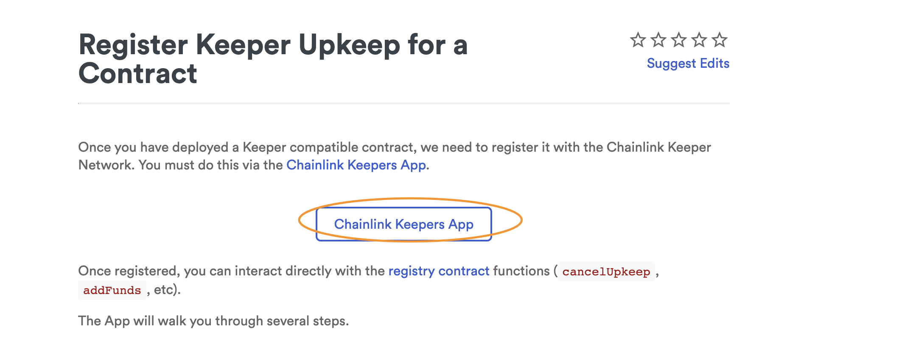

## 前言

在区块链的网络中, 智能合约无法自动调用他们自己的合约方法, 只能通过外部调用进行触发.  
为此, ChainLink 提供了自动调度服务, 通过注册 ChainLink 的 Keeper, 就可以自动触发合约中的接口.

为方便代码测试, 在 .env 中放入的私钥 和 INFURA_ID，样例文件可参考 .env.example

## 合约功能说明

- KeeperCompatibleInterface  
  checkUpkeep: ChainLink 用于判断是否触发接口调用的检查函数. 当此函数返回为 true 时, ChainLink 会自动调用合约的 performUpkeep 接口  
  performUpkeep: ChainLink 自动调度的执行接口, 具体的业务逻辑在这个接口里面进行封装

- Counter  
  样例合约, 实现了 KeeperCompatibleInterface 接口合约中定义的接口. 为了测试方便, 这里设置 checkUpkeep 判断条件为每 10s 执行一次

## 操作流程

- 获取测试 LINK 币
  使用 Keeper 功能需要支付 LINK 代币, 因为使用 kovan 测试网路进行测试, 这里可以前往 (Testnet LINK)[https://kovan.chain.link/] 进行获取

- 安装依赖

  ```bash
  yarn
  ```

- 合约编译

  ```bash
  npx hardhat compile
  ```

- 执行合约部署

  ```bash
  npx hardhat run scripts/deployCounter.js --network kovan
  ```

- 注册 keeper  
  前往 [ChainLink 官网](https://docs.chain.link/docs/chainlink-keepers/register-upkeep/) 上点击 "ChainLink Keeper App", 然后根据提示进行注册即可.  
  这里需要注意的是, 运行 keeper 最少需要注入 75 的 LinK 测试币
  

- 检查结果  
  keeper 运行一段时间后, 就可以检查结果. 执行如下脚本, 检查输出是否正确

  ```bash
  npx hardhat run scripts/checkCounterResult.js --network kovan
  ```

## deployCounter.js 主逻辑说明

- 合约部署
  如下, 进行 Counter 合约部署, 同时传入参数为 10, 表示后续 keeper 每 10s 自动触发执行

  ```js
  const counterFactory = await ethers.getContractFactory('Counter');
  const counterContract = await counterFactory.deploy(10);
  ```

- 保存合约地址  
  如下, 保存成功部署的合约地址到 .json 文件, 供后续 checkCounterResult.js 脚本使用

  ```js
  const contractAddressFile = __dirname + '/CounterContractaddress.json';
  fs.writeFileSync(contractAddressFile, JSON.stringify({ address: counterContract.address }, undefined, 2));
  ```

## checkCounterResult.js 主逻辑说明

- 加载合约实例
  使用 deployCounter.js 脚本部署成功的合约地址加载 Counter 合约实例

  ```js
  const providerContract = new ethers.Contract(counterContractAddress.address, artifact.abi, provider);
  ```

- 检查结果  
  检查 Counter 合约中 counter 变量的值.
  这里可以现在 keeper 上停止 keeper 运行, 然后统计 keeper 执行的次数, 最后对比输出是否正确

  ```js
  const counterVal = await providerContract.counter();
  console.log('The value of counter is :', parseInt(counterVal));
  ```

## 参考文档
chainlink-keepers 文档:  https://docs.chain.link/docs/chainlink-keepers/introduction/   
gelato.finance 官网: http://gelato.finance/ 

