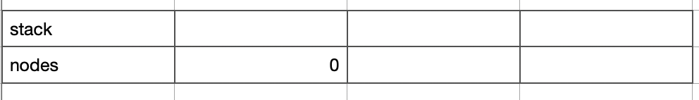

## SortitionSumTreeFactory 介绍  
SortitionSumTreeFactory 是一个记录用户质押值, 并进行了数值统计的库类.  

## 主要接口介绍  
- createTree    
用于初始化树, 其中传入参数 _key 为每个树的键值, _K 为每个节点最多含有的子节点个数. 
```solidity
/**
     *  @dev Create a sortition sum tree at the specified key.
     *  @param _key The key of the new tree.
     *  @param _K The number of children each node in the 截屏2021-11-16 上午10.59.08tree should have.
     */
    function createTree(SortitionSumTrees storage self, bytes32 _key, uint _K) internal {
        SortitionSumTree storage tree = self.sortitionSumTrees[_key];
        require(tree.K == 0, "Tree already exists.");
        require(_K > 1, "K must be greater than one.");
        tree.K = _K;  // 设置最大子节点个数
        tree.stack = new uint[](0);  // 初始化 stack
        tree.nodes = new uint[](0);  // 初始化 nodes
        tree.nodes.push(0);  // 放入根节点
    }
```

- set  
根据传入的 _key 修改对应的树中的数据, 一下将具体举例进行介绍这个函数的功能. 
假设 tree.K = 2 ,  nodes 和 stak 初始状态为如下, 其中 nodes 只存入了一个根节点.
  

场景1: 调用 set, 设置用户 A 的值   
set("0x001", 15 , bytes32 _ID)  
