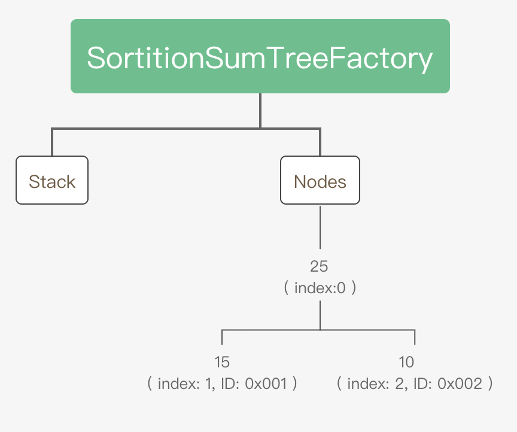
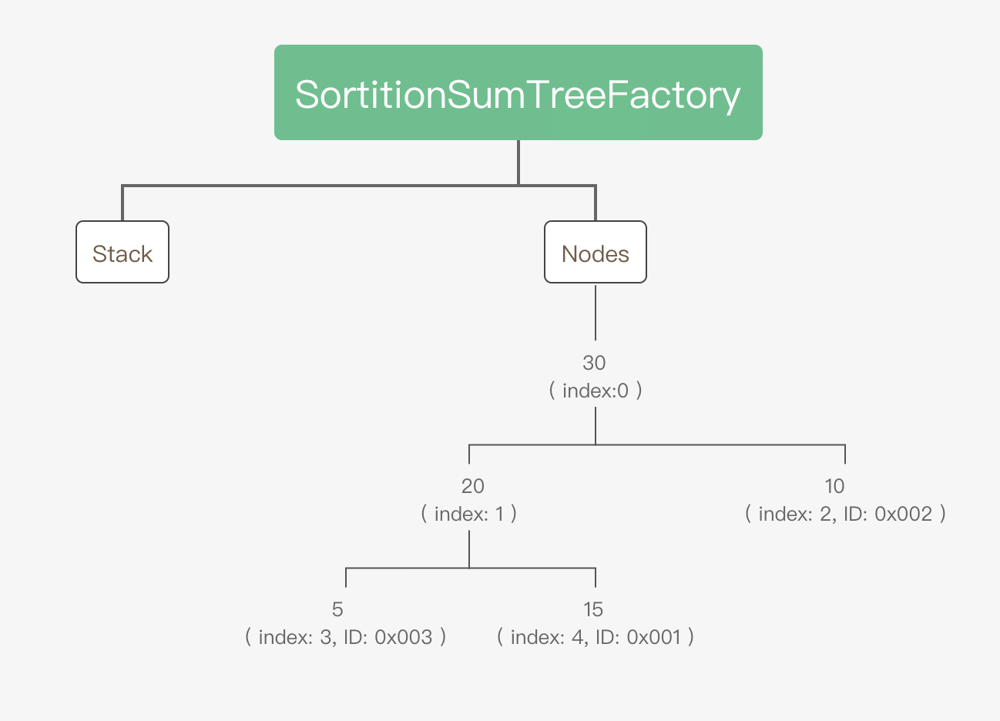
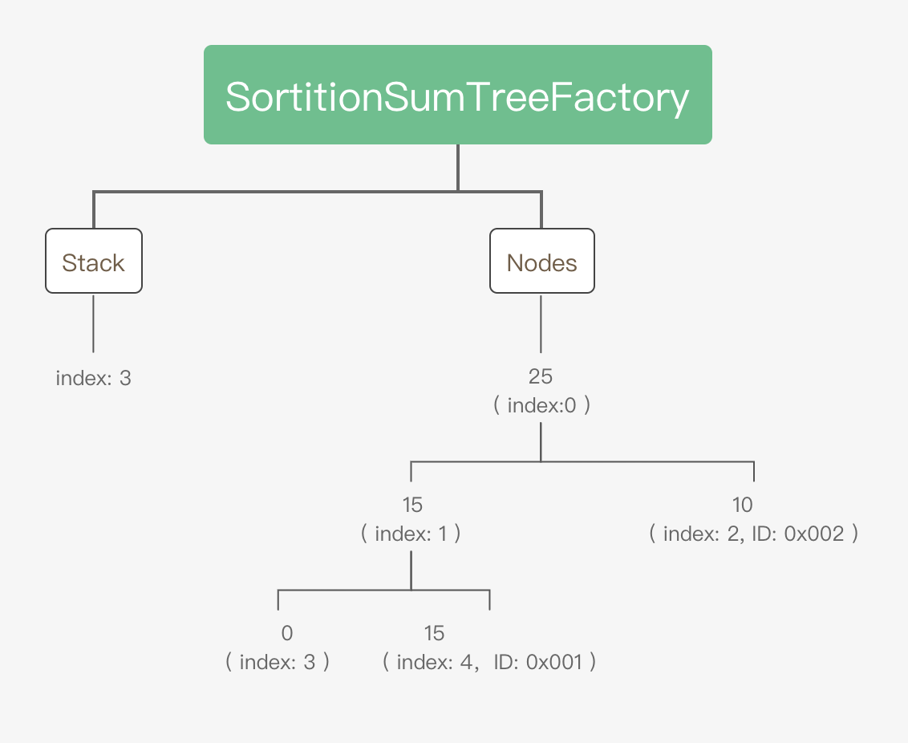
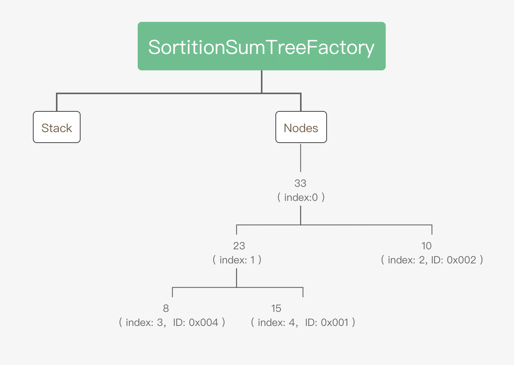
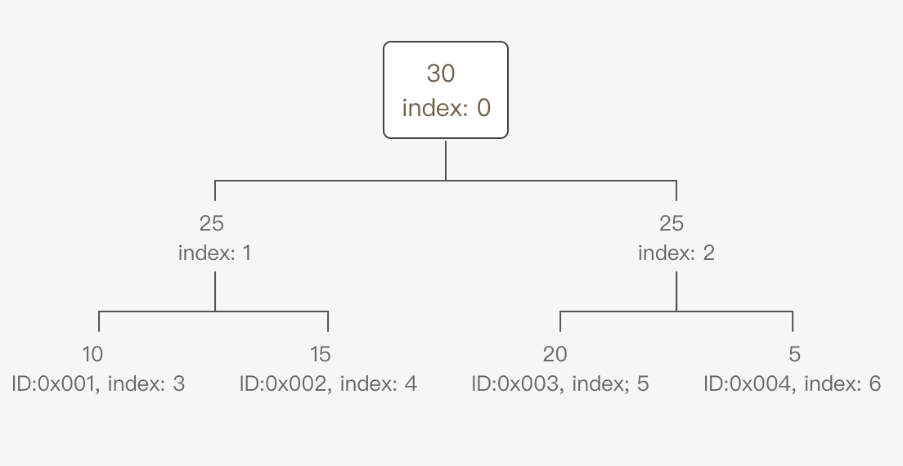

## SortitionSumTreeFactory 介绍  
SortitionSumTreeFactory 是一个记录用户质押值, 并进行了数值统计的库类.  

## 主要接口介绍  
- createTree    
用于初始化树, 其中传入参数 _key 为每个树的键值, _K 为每个节点最多含有的子节点个数. 
```solidity
/**
     *  @dev Create a sortition sum tree at the specified key.
     *  @param _key The key of the new tree.
     *  @param _K The number of children each node in the 截屏2021-11-16 上午10.59.08tree should have.
     */
    function createTree(SortitionSumTrees storage self, bytes32 _key, uint _K) internal {
        SortitionSumTree storage tree = self.sortitionSumTrees[_key];
        require(tree.K == 0, "Tree already exists.");
        require(_K > 1, "K must be greater than one.");
        tree.K = _K;  // 设置最大子节点个数
        tree.stack = new uint[](0);  // 初始化 stack
        tree.nodes = new uint[](0);  // 初始化 nodes
        tree.nodes.push(0);  // 放入根节点
    }
```

- set  
根据传入的 _key 修改对应的树中的数据, 一下将具体举例进行介绍这个函数的功能. 
```solidity
/**
     *  @dev Set a value of a tree.
     *  @param _key The key of the tree.
     *  @param _value The new value.
     *  @param _ID The ID of the value.
     *  `O(log_k(n))` where
     *  `k` is the maximum number of childs per node in the tree,
     *   and `n` is the maximum number of nodes ever appended.
     */
    function set(SortitionSumTrees storage self, bytes32 _key, uint _value, bytes32 _ID) internal {
        SortitionSumTree storage tree = self.sortitionSumTrees[_key];
        uint treeIndex = tree.IDsToNodeIndexes[_ID];

        if (treeIndex == 0) { // No existing node.
            if (_value != 0) { // Non zero value.
                // Append.
                // Add node.
                if (tree.stack.length == 0) { // No vacant spots.
                    // Get the index and append the value.
                    treeIndex = tree.nodes.length;
                    tree.nodes.push(_value);

                    // Potentially append a new node and make the parent a sum node.
                    if (treeIndex != 1 && (treeIndex - 1) % tree.K == 0) { // Is first child.
                        uint parentIndex = treeIndex / tree.K;
                        bytes32 parentID = tree.nodeIndexesToIDs[parentIndex];
                        uint newIndex = treeIndex + 1;
                        tree.nodes.push(tree.nodes[parentIndex]);
                        delete tree.nodeIndexesToIDs[parentIndex];
                        tree.IDsToNodeIndexes[parentID] = newIndex;
                        tree.nodeIndexesToIDs[newIndex] = parentID;
                    }
                } else { // Some vacant spot.
                    // Pop the stack and append the value.
                    treeIndex = tree.stack[tree.stack.length - 1];
                    tree.stack.pop();
                    tree.nodes[treeIndex] = _value;
                }

                // Add label.
                tree.IDsToNodeIndexes[_ID] = treeIndex;
                tree.nodeIndexesToIDs[treeIndex] = _ID;

                updateParents(self, _key, treeIndex, true, _value);
            }
        } else { // Existing node.
            if (_value == 0) { // Zero value.
                // Remove.
                // Remember value and set to 0.
                uint value = tree.nodes[treeIndex];
                tree.nodes[treeIndex] = 0;

                // Push to stack.
                tree.stack.push(treeIndex);

                // Clear label.
                delete tree.IDsToNodeIndexes[_ID];
                delete tree.nodeIndexesToIDs[treeIndex];

                updateParents(self, _key, treeIndex, false, value);
            } else if (_value != tree.nodes[treeIndex]) { // New, non zero value.
                // Set.
                bool plusOrMinus = tree.nodes[treeIndex] <= _value;
                uint plusOrMinusValue = plusOrMinus ? _value - tree.nodes[treeIndex] : tree.nodes[treeIndex] - _value;
                tree.nodes[treeIndex] = _value;

                updateParents(self, _key, treeIndex, plusOrMinus, plusOrMinusValue);
            }
        }
    }
```


假设 tree.K = 2 ,  nodes 和 stak 初始状态为如下, 其中 nodes 只存入了一个根节点.


1) 场景1: 调用 set, 设置用户 A 的值       
set("Alice", 15 ,  "0x001"):    其中第一个参数为树的 ID, 表示操作哪个树 , 第二个参数为节点值, 第三个值为节点 ID       

2) 场景2: 调用 set, 设置用户 B 的值  
set("Alice", 10 ,  "0x002")  
 

3) 场景3: 调用 set, 设置用户 C 的值  
set("Alice", 5 ,  "0x003")   
 

4) 场景4: 调用 set, 设置用户 C 的值为 0  
set("Alice", 0 ,  "0x003")  
 

5) 场景5: 调用 set, 设置用户 D 的值为 8
set("Alice", 8 ,  "0x004")  
  

### 总结   
根据如上的分析, 每次 Set 时，如果对应的节点 ID 不存在当前 tree 中，则会在当前的树中插入对应的节点, 如果节点下有子节点, 则把节点下移, 当前节点修改为聚合节点, 节点值修改为下面所有叶子结点的值总和.  
如果 Set 时, 输入的 value 为 0 , 并且对应的节点 ID 已经存在当前的树中，则移除对应的节点 ID, 并把节点 Index 存入 Stack 中.  当后面有新的节点加入时, 先查看 Stack 中是否存在数据, 如果有, 则从 Stack 中取出对应的 Index, 把新的节点放入到这个对应的 Index 中.


- draw  
从树中返回一个节点 ID 
```
/**
     *  @dev Draw an ID from a tree using a number. Note that this function reverts if the sum of all values in the tree is 0.
     *  @param _key The key of the tree.
     *  @param _drawnNumber The drawn number.
     *  @return ID The drawn ID.
     *  `O(k * log_k(n))` where
     *  `k` is the maximum number of childs per node in the tree,
     *   and `n` is the maximum number of nodes ever appended.
     */
    function draw(SortitionSumTrees storage self, bytes32 _key, uint _drawnNumber) internal view returns(bytes32 ID) {
        SortitionSumTree storage tree = self.sortitionSumTrees[_key];
        uint treeIndex = 0;
        uint currentDrawnNumber = _drawnNumber % tree.nodes[0];

        while ((tree.K * treeIndex) + 1 < tree.nodes.length)  // While it still has children.
            for (uint i = 1; i <= tree.K; i++) { // Loop over children.
                uint nodeIndex = (tree.K * treeIndex) + i;
                uint nodeValue = tree.nodes[nodeIndex];

                if (currentDrawnNumber >= nodeValue) currentDrawnNumber -= nodeValue; // Go to the next child.
                else { // Pick this child.
                    treeIndex = nodeIndex;
                    break;
                }
            }
        
        ID = tree.nodeIndexesToIDs[treeIndex];
    }
```  

以下图数据为例
当调用 draw 接口, 传入 drawnNumber 为 30 时, 接口判断 30 大于 index=1 的节点，接口更新 drawnNumber = 30 - 25 = 5  后，继续从兄弟节点 （ index=2 ）判断。
之后, 接口判断 drawnNumber < 25 ( index:2 ）, 然后继续迭代节点 （ index=2 ）子节点, 最终得到叶子节点 20 ( index=5 )
  

- stakeOf
根据传入的节点 ID, 获取这个 ID 对应的值
```solidity
/** @dev Gets a specified ID's associated value.
     *  @param _key The key of the tree.
     *  @param _ID The ID of the value.
     *  @return value The associated value.
     */
    function stakeOf(SortitionSumTrees storage self, bytes32 _key, bytes32 _ID) internal view returns(uint value) {
        SortitionSumTree storage tree = self.sortitionSumTrees[_key];
        uint treeIndex = tree.IDsToNodeIndexes[_ID];

        if (treeIndex == 0) value = 0;
        else value = tree.nodes[treeIndex];
    }
```