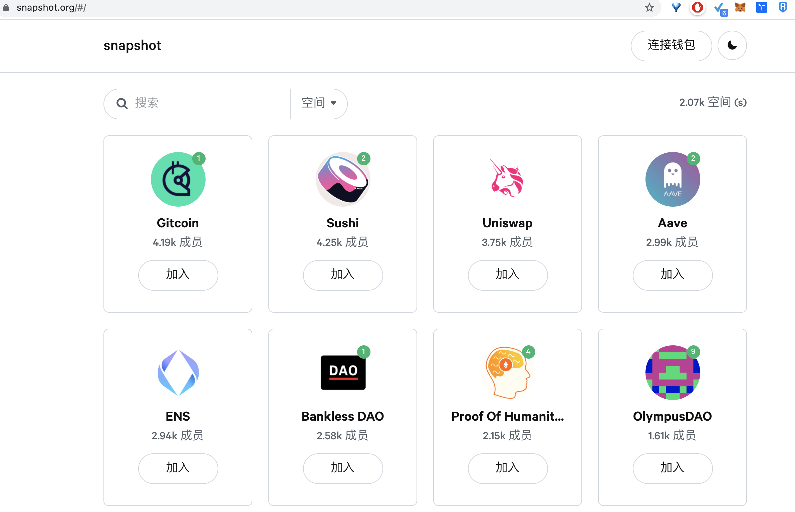

## SNAPSHOT
+ Snapshot is a off-chain, gasless, multi-governance community polling dashboard.
+ Decentralized society, we need make decisions also, so you can try snapshot.
+ Gasless
+ Offchain
+ Multi joined
+ When I test the https://snapshot.org/ website...meet 502 error...
## 概述
+ Snapshot 是一个为 ERC20 代币提供社区提案投票的聚合治理平台，由 Balancer 团队开发在今年 8 月推出。
+ 作为一个 off-chain 的治理工具，用户使用 Snapshot 进行签名投票和社区提案而无需要消耗 GAS 费。
+ 不同于 Aragon 的从创建到治理全覆盖，Snapshot 目前仅提供提案和投票这两项功能，它更倾向于是一个治理投票的平台型工具，而不是一个提供搭建、治理投票、质押、链上法庭等复杂功能的平台。
+ 用户绑定钱包中的**相应代币数量决定投票权重**，根据以太坊区块快照，提案和投票是存储在 IPFS 上的签名消息。
+ 

## 其他
+ Snapshot 并不反对其他项目复制代码、另起炉灶。Curve 就 fork 了 Snapshot 的代码新建了一个专有的治理网站（https://signal.curve.fi/#/curve）。
+ 因此国内如果不熟悉英语和习惯的，可以魔改，我准备空了魔改一个，不依赖于代币数量，依赖其他更合理，更避免资本掌控社区的一些机制。
## 参考链接
https://www.chainnews.com/articles/389308842491.htm
https://www.theblockbeats.com/news/19570
[Twitter](https://twitter.com/SnapshotLabs)
[Discord](https://discord.com/invite/yHrYMzyyY9)
https://commonwealth.im/uniswap/proposals

