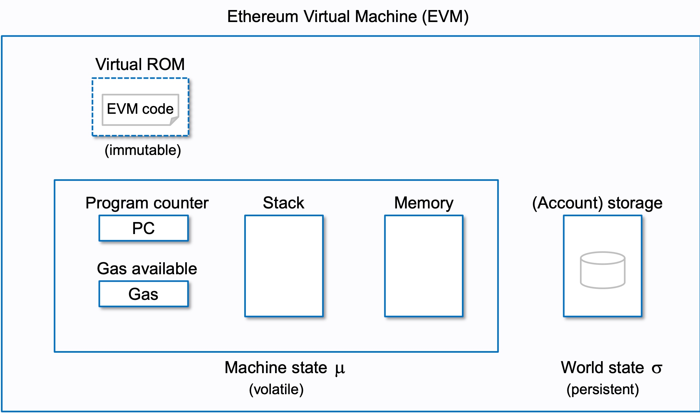

# Ethereum Virtual Machine 
opcode码：https://www.ethervm.io/

EVM是无寄存器、基于栈的虚拟机，是合约的执行环境, 解释器中需要操作五大组件：
- PC：类似于 CPU 中的 PC 寄存器，指向当前执行的指令
- Stack：执行堆栈，位宽为 256 bits，最大深度为 1024
- Memory：内存空间
- Gas：gas池，耗光gas则交易执行失败
- Storage: key value 存储
## EVM 存储空间
EVM 的存储空间有三类，stack、memory、storage
- stack 和 memory 都是临时存储，在智能合约运行时有效，当运行结束后回收。memory 主要是临时存储数组、字符串等较大的交易时的数据，按 8 位或者 256 位读取，更加灵活；
- 栈最多 1024 层，每层 32 字节（也就是每个变量用 uint256 类型储存，以太坊是 256 位的虚拟机），这样可以方便地应用 256 位 Keccak 哈希计算和椭圆曲线计算。
- storage 是永久性存储，采用映射的形式存储 uint256 的 Key 和 uint256 的 Value，因此它的操作更消耗计算资源，gas 也高得多。这样的储存空间分类，同样在 Solidity 中有所体现。

## 全局变量的存储
### 一般的静态类型
全局变量紧凑地存储在 storage，这样多个变量可能存储在同一个 slot (一个 solt 32 个字节) 里面。除了动态数组和映射类型，数据都是从 slot[0] 开始，连续地（如果不够32字节也不会扩充 0）存储在 slots 里。每个变量所需的字节由变量类型确定。多个变量打包在一个 slot 的规则如下：
- 这些变量所占空间之和不超过 32 字节。
- 大端存储，也就是第一个变量的存储位置从该 slot 的低位开始存储。
- 如果当前 slot 剩余空间无法容纳下一个变量，则下一个变量将存储在下一个 slot
- 结构体和数组总是分配新的 slot 给它们，其中的成员紧凑存储。
- 结构体或者数组的下一个全局变量，也往往不会与结构体或者数组在同一个 slot，而是在下一个 slot 中。
- 如果合约由继承关系，那么全局变量的存储的先后，遵循 C3 线性化顺序规则。
**设计思路说明**
EVM 是 32 字节为基础操作单位的虚拟机，如果元素不够 32 个字节，EVM 需要执行额外的操作去读写这个元素。因此读写小于 32 个字节的变量会比 32 个字节的变量消耗的 gas 更多，如果变量需要多次读写的话，compact 的方式可能会起反作用。

全局变量的声明顺序也应当注意，uint128, uint128, uint256 的顺序会比 uint128, uint256, uint128 更好。

### MAP和动态数组的存储
映射和动态数组所需的空间是无法预计的，因此它们不是整个的放在某个位置，而是首先按照上面的规则占用 32 字节，然后将具体的值存储在其他的 slot，通过 keccak256 哈希来查找
规则参考：https://twitter.com/blainemalone/status/1597352375593078784
假设MAP类型或者动态数组占用了 slot[p]，对于动态数组，slot[p] 存储元数个数（除了特殊的 byte[] 和 string）；对于MAP，slot[p] 为空。动态数组元素的位置将从 keccak256(p) 开始，按照上述规则排列。如果是map， 那么存储值的 slot 为 keecak256(key,p)

## Memory 的存储方式
Solidity保留了前 4 个特殊用途的32字节的 slot，内部二进制的序列的范围不同，代表的功能也不同：

- 0x00 - 0x3f (前面64 字节，占用 2 个slot): 计算哈希时临时存储数据的空间，在语句之间使用。
- 0x40 - 0x5f (32 字节，占用 1 个 slot): 当前分配的内存大小 ，或者说是内存指针所在位置（因为可以通过内存空间大小计算内存指针位置）。
- 0x60 - 0x7f (32 字节，占用 1 个 slot): slot[0]，正式内存，用于保存动态 memory 数组的初始值，而且只读。然后下一个位置 0x80 是开始写入的位置。

## 合约调用
处理交易的inputdata主要有以下四个指令：
- CALLDATALOAD：把输入数据加载到 Stack 中
- CALLDATACOPY：把输入数据加载到 Memory 中
- CODECOPY：把当前合约代码拷贝到 Memory 中
- EXTCODECOPY：把外部合约代码拷贝到 Memory 中
调用者把调用参数存储在内存中，然后执行 CALL 指令。
CALL 指令执行时会创建新的 Contract 对象，并以内存中的调用参数作为其 Input。
解释器会为新合约的执行创建新的 Stack 和 Memory，从而不会破环原合约的执行环境。
新合约执行完成后，通过 RETURN 指令把执行结果写入之前指定的内存地址，然后原合约继续向后执行。

## 合约互相调用
library 中不允许定义任何 storage 类型的变量，这就意味着 library 不能修改合约的状态。
合约内部调用另外一个合约，有 4 种调用方式：
- CALL
- DELEGATECALL
- STATICALL
CALL，DELEGATECALL代码执行的上下文环境不同。
编译器层面计划以后把调用 view 和 pure 类型的函数编译成 STATICCALL 指令。
view 类型的函数表明其不能修改状态变量，而 pure 类型的函数则更加严格，连读取状态变量都不允许。
以前是在编译阶段来检查这一点的，如果不符合规定则会出现编译错误。如果将来换成 STATICCALL 指令，就可以完全在运行时阶段来保证这一点了，你可能会看到一个执行失败的交易。
## 固定gasfee
每笔交易过来，不管三七二十一先需要收取一笔固定油费，计算方法如下：
1. 如果你的交易不带额外数据（Payload），比如普通转账，那么需要收取 21000 的油费。
2. 如果你的交易携带额外数据，那么这部分数据也是需要收费的，具体来说是按字节收费：
    - 字节为 0 的收 4 块，
    - 字节不为 0 收 68 块，
所以你会看到很多做合约优化的，目的就是减少数据中不为 0 的字节数量，从而降低油费  gas 消耗。
## Solidity Bytecode and Opcode Basics

简单了解 bytecode 和 opcode。

Solidity Bytecode and Opcode Basics <https://medium.com/@blockchain101/solidity-bytecode-and-opcode-basics-672e9b1a88c2>

## Deconstructing a Solidity Contract

Openzeppelin blog 的系列文章，非常棒的科普文。学习笔记参见 :point_right: [DeconstructingSolidityContract.md](./DeconstructingSolidityContract.md)

## 实际项目中手写Opcode的示范：
[sudoswap](https://github.com/sudoswap/lssvm/blob/main/src/lib/LSSVMPairCloner.sol), 它自己手写了Opcode，主要实现的是EIP-1167. 但是比EIP-1167要更复杂一点，复杂之处在于proxy在每一次调用delegatecall的时候都会将创建该proxy的一些参数，例如factory address, nft address等直接concat到calldata后面。关于EIP-1167，可以参考[这篇文章](https://learnblockchain.cn/article/2663)

## 推荐用的手写Opcode的工具
[etk](https://quilt.github.io/etk/ch02-lang/ch03-labels.html), 它可以帮助你计算offset和length。
在Opcode.etk文件中，使用该工具定义的etk格式手写了`cloneETHPair`函数，可以对比sudoswap.lob.sol文件进行查看

### 减少合约size
参阅[libary介绍](./libary.md)
https://ethereum.org/zh/developers/tutorials/downsizing-contracts-to-fight-the-contract-size-limit 

## 参考链接
- EVM 详解: https://learnblockchain.cn/2019/04/09/easy-evm
- geth-analyze: https://github.com/learnerLj/geth-analyze/tree/main/analyzeSourceCode
- Ethereum Signature Database: https://www.4byte.directory/
- EVM内存布局: https://mirror.xyz/xyyme.eth/GNVcUgKAOEiLyClKeqkmD35ctLu6_XomT3ZDIfV3tz8?s=09
- [深入理解EVM - Part 1 - 从字节码到函数选择器](https://learnblockchain.cn/article/4253)  
- [evm_illustrated](https://takenobu-hs.github.io/downloads/ethereum_evm_illustrated.pdf)
- [EVM Deep Dives](https://noxx.substack.com/p/evm-deep-dives-the-path-to-shadowy?s=r)
- EVM源码解析: http://yangzhe.me/2019/08/12/ethereum-evm/

