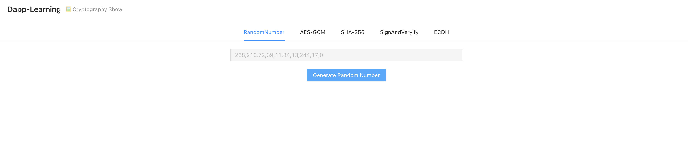
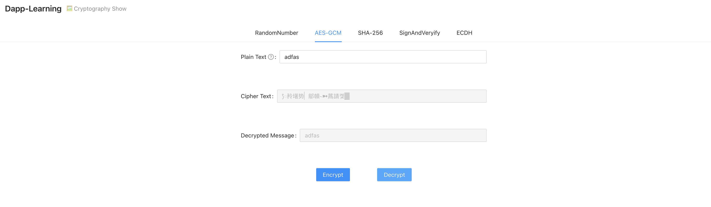
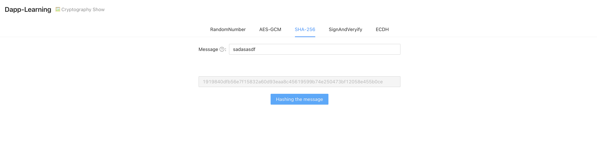
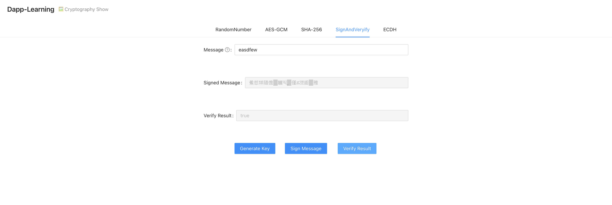
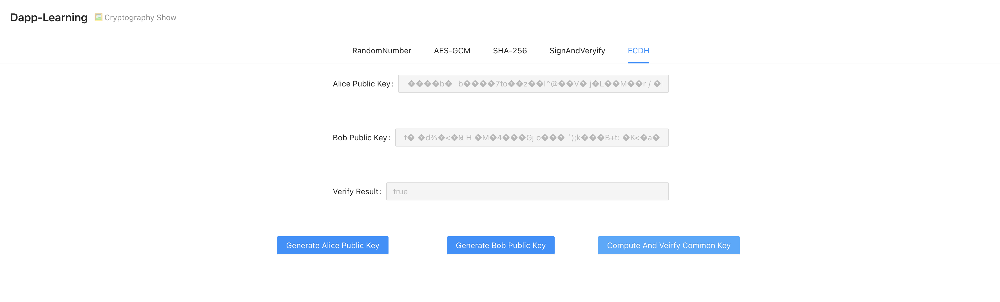

## 介绍  
JavaScript 在互联网安全应用中扮演着极其重要的作用, 网页信息的发送, 交互中都使用了 JavaScript 进行加密解密.  
本 Task 通过页面和文档的方式展示了如何使用 JavaScript 进行加密解密, 希望通过这些展示使各位开发者了解 JavaScript 密码库的使用.

## 操作步骤  
- 安装依赖  
```
yarn
```

- 启动前端  
```
yarn start
```

- 随机数生成验证  
```
点击 RandomNumber 标签页, 然后点击 "Generate Random Number" 按钮, 就可以看到生成的随机数
``` 


- AES-GCM 算法   
点击 AES-GCM 标签页  
```
1) 在 "Plain Text" 输入框中输入原始信息
2) 点击 "Encrypt"  
3) 点击 "Decrypt"
```  
   

- SHA-256  
点击 SHA-256 标签页  
```
1) 在 "Message" 输入框中输入原始信息
2) 点击 "Hashing the message" 
```  
 


- Sign && Verify   
点击 SignAndVeryify 标签页  
```
1) 在 "Message" 输入框中输入原始信息
2) 点击 "Generate Key"
3)  点击 "Sign Message"
3)  点击 "Verify Result"
```  
 

- ECDH  
点击 ECDH 标签页  
```
1) 点击 "Generate Alice Public Key"
2)  点击 "Generate Bob Public Key"
3)  点击 "Compute And Verify Key"
```  
  

## 参考文档  
Medium 原文: https://blog.sessionstack.com/how-javascript-works-cryptography-how-to-deal-with-man-in-the-middle-mitm-attacks-bf8fc6be546c    
Web Crypto API 样例:  https://roubin.me/web-crypto-api-introduction/     
ECDH 使用: https://itbilu.com/nodejs/core/41iXzVot.html    
SubtleCrypto.encrypt 用法介绍:  https://developer.mozilla.org/zh-CN/docs/Web/API/SubtleCrypto/encrypt    
