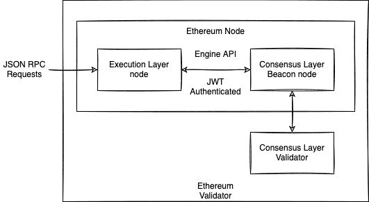

# Ethereum2.0

## Introduction

Ethereum 2.0，即 Ethereum 的升级版，其主要目的主要有两个：

1. 降低能源消耗，即共识从 PoW 转为 PoS；
2. 扩容，也称为分片（sharding），即提高 Ethereum 的 TPS（Transactions Per Second）。

为实现这两个目的，分三个阶段：

- The Beacon Chain
- The Merge
- Sharding

目前（2022-09-20），已经进入到第二阶段，其中 The Merge
完成了第一个目标，第二个目标在第三阶段 sharding 中实现，
预计是在 2023 年完成。

## The Beacon Chain

The Beacon Chain 于 2020 年 12 月 01 日上线，简单的来说就是
Ethereum 2.0 的先行网，PoW 转 PoS 以及 sharding 都先在
Beacon Chain 上测试，最终于 2022 年 09 月 15 日和 Ethereum
主网合并，即 The Merge。

## The Merge

北京时间 2022 年 09 月 15 日下午 03:00，Ethereum 合并成功，
即 Beacon Chain 和之前的 PoW 的 Ethereum 合并成功，Ethereum
正式从 PoW 转为了 PoS。这就是 The Merge 的带来的改变，Ethereum
不再需要消耗比较多的的能源来进行挖矿了，由 PoW 共识转为了 PoS 共识，
大概减少了 99.95% 的能源消耗。

这次升级，除了降低了挖矿的能源消耗，还带来了以下两个改变：
1. ETH token 开始进入通缩
2. 节点架构改变

### ETH 通缩

在 The Merge 前，每天 PoW（Ethereum Mainnet）上大概可以挖出
13,000 ETH，PoS（Beacon Chain）大概可以挖出 1,600 ETH。
Merge 之后，PoW 去除，只保留了 PoS 上的奖励，即每天 ETH 的新
增量变为原来的 $\frac{1600}{13000 + 16000} \approx 10.96\%$，
减少了 $\frac{13000}{13000 + 16000} \approx 89.04\%$。
而 London Upgrade 之后，即 [EIP-1159][eip-1159] 之后，每个 tx
都会销毁一定数量的 ETH。假设 gas 的平均价格最低为 16 gwei，那么
一天销毁的 gas 会大于或等于 1,600 ETH，即每天销毁的 ETH 会大于或
等于新增的 ETH。所以 The Merge 之后 ETH 会进入通缩的阶段，如果
gas 的平均价格超过 16 gwei 的话，那么 ETH 的通缩就会加速。

> P.S 通过 https://ultrasound.money/#burn 的数据来看，在 gas
> 的平均价格为 11 gwei 时，每分钟会销毁大概 0.80 ETH，即一天大概
> 会销毁 0.80 * 60 * 24 = 1,152 ETH。如果 gas 的平均价格为 16
> gwei 的话，则 ETH 一天的销毁量大概为：1,152 * (16 / 11) = 1,675。

[eip-1159]: https://github.com/ethereum/EIPs/blob/master/EIPS/eip-1559.md

具体详细的数据都可以在 https://ultrasound.money 这个网站上查看。

### 节点架构改变

#### 客户端
执行层客户端及其采用的编程语言：

@go_ethereum(Go), @NethermindEth(C#), @HyperledgerBesu(Java), @ErigonEth(Go),  reth - alpha 阶段 (Rust), silkwarm - pre-alpha 阶段 (C++), ethereumjs - alpha 阶段 (TypeScript)

共识层客户端及其采用的编程语言：

@prylabs(go), lighthouse@sigp_io(Rust), @Teku_Consensys(Java), @ethnimbus(Nim), @lodestar_eth(TypeScript)

因为共识机制的改变，所以节点架构也就不得不变了。The Merge 前
只需要执行一个程序，就能进行挖矿。The Merge 后需要执行两个程序：
一个执行层，一个共识层。其中执行层的是原有的 PoW 的软件的，用来
执行验证 tx，共识层是新增的，用来出块的。如下图：

以下是对应的节点的软件：
- 执行层：
  - [Besu](https://github.com/hyperledger/besu/releases)
  - [Erigon](https://github.com/ledgerwatch/erigon#usage)
  - [Geth](https://geth.ethereum.org/downloads/)
  - [Nethermind](https://downloads.nethermind.io/)
- 共识层：
  - [Lighthouse](https://github.com/sigp/lighthouse/releases/latest)
  - [Lodestar](https://chainsafe.github.io/lodestar/install/source/)
  - [Nimbus](https://github.com/status-im/nimbus-eth2/releases/latest)
  - [Prysm](https://github.com/prysmaticlabs/prysm/releases/latest)
  - [Teku](https://github.com/ConsenSys/teku/releases)

各个软件的使用占比参考：https://clientdiversity.org/#distribution

> **NOTE**：如果自己不想跑节点的话，可以直接使用第三方的节点，比较知名的有三个：
> [Infura][infura]，[Alchemy][alchemy] 和 [QuickNode][quicknode]。其中
> Infura 支持主网和所有的测试网，但 Alchemy 只支持主网和 Goerli 测试网。更多
> 三方的节点供应商可到 https://ethereumnodes.com/ 查看。
>
> 如果想自己跑节点的话，现在也有集成的环境，[DappNode][dapp-node] 和 [Avado][avado]。
> 其中 DappNode 可以自己安装，也可以直接购买预装好的硬件，Avado 是软硬件一体
> 化，只能购买，不能自己安装配置。

[infura]: https://infura.io/
[alchemy]: https://www.alchemy.com/
[quicknode]: https://www.quiknode.io/
[dapp-node]: https://github.com/dappnode/DAppNode
[avado]: https://ava.do/

### 开发者须知

既然共识变了，block 也会做出对应的改变。The Merge 后区块主要有三个
变化：block 结构，OPCODE 和 区块的出块时间与状态

#### Block 结构

The Merge 后，区块结构变得更复杂了，增加了以共识层的一些字段，同时
对于原有的共识层（现在的执行层）的一些字段做了一些改变。下图是 The
Merge 之后一个区块的结构图：

在 PoW 的共识中，是有一定的概率出现叔块（ommer/uncle block）的，
所以之前的区块结构中会有 ommer block 的相关字段。但是在 PoS 中，
出块是确定的，不可能出现 ommer block，因此 The Merge 之后区块
执行层生成的区块的中 `ommers` 为空数组 `[]`，封装成 tx 就是：
`RLP([]) = 0xc0`，即 `ommers` 字段的值为 `0xc0`。因此
`ommersHash` 的值为 `0x1dcc4de8dec75d7aab85b567b6ccd41ad312451b948a7413f0a142fd40d49347`
（`Keccak256(RLP([]))`）。

同时，PoW 中最关键的两个字段 `difficulty` 和 `nonce` 也都设置
为零，即 `difficulty` 的值为 0，`nonce` 的值为
`0x0000000000000000`（`nonce` 类型为`uint64`，8 bytes）。
汇总起来如下表：

| FIELD | CONSTANT VALUE | COMMENT |
| :--   | :---- | :---- |
| `ommers` | `[]`/ `0xc0` | `RPL([]) = 0xc0` |
| `ommersHash` | `0x1dcc4de8dec75d7aab85b567b6ccd41ad312451b948a7413f0a142fd40d49347` | `= Keccak256(RLP([]))` |
| `difficulty` | `0` | |
| `nonce` | `0x0000000000000000` | |

又因为出块由共识层出，所以在 PoW 中用来验证是否具有出块权的
`mixHash` 字段用来存储上一个出块者选出的这一轮的出块者，
用来证明自己有出块权，并命名为 `prevRandao`。`prevRandao`
是根据 slot number 算出来的随机数。具体的可参见：
[EIP-4399][eip-4399] 及其讨论
[EIP-4399: Supplant DIFFICULTY opcode with RANDOM][eip-4399-discuss]
和 [EIP-4788][eip-4788]。

**注**：Ethereum 2.0 中 slot 可对应 1.0 中的 block，但
严格来说 slot 是 block 的超集，因为 slot 可以包含 block，
也可以没有 block。32 Slots = 1 Epoch，这是在为后续的
sharding 做准备。

[eip-4399]: https://eips.ethereum.org/EIPS/eip-4399
[eip-4399-discuss]: https://ethereum-magicians.org/t/eip-4399-supplant-difficulty-opcode-with-random/7368
[eip-4788]: https://ethereum-magicians.org/t/eip-4788-beacon-state-root-in-evm/8281

#### OPCODEs

The Merge 只改动了两个 OPCODE：

- `BLOCKHASH(0x40)`：准备弃用，虽然还可以正常执行，但是其安全程度
  变得很低，因为不是由 PoW 来算 Hash 了。

- `DIFFICULTY(0x44)`：改名为 `PREVRANDAO`，可以用来获取随机数。

#### Block Time and states

因为 PoS 出块时就是由一个质押者（Staker）来出，所以时间 PoW 的更
具有确定性，PoS 每 12s 出一个块，PoW 是平均 13s 出一个块。

同时 PoS 中没有 PoW 的 confirm 状态，而是将区块分为四中：

- head，就是刚出的块，状态为 `unfinalized`
- safe head，出块一段时间后，有超过 2/3 的验证者验证过，状态为 `safe`
- confirmed，由 `safe` 状态转为 `finalized` 过渡类型，在被其他的节点
  添加到链上
- finalized，有超过 2/3 的验证者将这个区块添加到链上，状态变为 `finalized`

状态为 `finalized` 的区块被视为可信任区块，即对应 PoW 中的 `confirmed`
的区块。

### 常见误区

- Ethereum 2.0 的 token 为 ETH2：错。不论是 PoW 的 Ethereum 和 PoS 的
  Ethereum，其 token 都是 ETH，从来都没有 ETH2 的 token，ETHW 也不是
  Ethereum 之前的 token，而是有人在 The Merge 时进行分叉，利用大量矿工
  手里的显卡。在术语中，eth1 指代的是 Ethereum 中的执行层（execution layer），
  eth2 指代的是 Ethereum 中的共识层（consensus layer）。

- 运行一个节点需要质押 32 ETH：错。不质押 ETH 也可以运行一个节点，只是没有出块权。

- The Merge 降低了 gas fee：错。The Merge 是共识的替换，并没有降低 gas fee。

- The Merge 提高了 TPS：错。The Merge 后 Ethereum 的 TPS 并没有显著的提高，
  出块的速度只是从原来的平均 13s 一个块到每 12s 一个块。提高 TPS 是 sharding
  的目标，而不是 The Merge 的目标。

- The Merge enabled staking withdrawal：错。取消质押需要等 Shanghai Upgrade
  后才能操作。The Merge 时 Shanghai Upgrade 还没完成，所以 The Merge 后
  不能马上取消质押。

- 验证者不能收到出块奖励直到 Shanghai Upgrade：错。只要出块，就能得到出块奖励。

- 如果可以取消质押，所以的质押者（验证者）会同时取消质押：错。每个 epoch（6.4 mins）
  内最多允许 6 个质押者退出，如果退出者过多，会动态调节每个 epoch 的最大退出数，同时
  还在质押的人的 APR 提高，以吸引更多的人进行质押。

## Sharding

Sharding，称为分片，即在水平方向拆分数据库，分散数据库的负载，以达到扩容的目的。
Ethereum 2.0 的 sharding 和 Layer 2 一起来分摊负载，这样就可以减少网络拥堵，
提高 Ethereum 的 TPS。

Sharding 的特性可以让运行 Ethereum 节点的门槛降低，让更多的人运行节点，构建
更稳定的共识网络。

Sharding 的实现分两步：

1. Data availability
2. Code execution

Data availability 是在提高 TPS 的同时，保证之前的数据（即 state）是可用的；
Code execution 是在 state 都可用的情况下执行执行智能合约（Smart Contract），
这一步需要引入 zk-snarks（零知识证明）。

## Conclusion

总的来说，这次 Ethereum 的 Merge 并没有完全的升级为 Ethereum 2.0，最多
算是 Ethereum 1.5，毕竟目前 Ethereum 或者说整个区块链都在突破“不可能三角”[^impossible-triangle]，
其中已经有其他的公链走在 Ethereum 前面。但是只能说 Ethereum 在前期积累了
较多的 dapp 和 用户，形成了聚集效应，但是 Ethereum 能否赶在其他新的公链
之前突破这个三角，这个没人能预测。从这次 Merge 来看，我们能知道的是 ETH 的
供应有通缩的趋势，同时 PoW 转为 PoS 变成了有钱的更有钱，没钱的会更没钱，会逐渐
形成两极分化。而且因为 PoS，运行节点的矿工会减少，虽然有机制来保证质押者不会
一次性大量撤出，但是没有质押的人不太会去维护一个节点。

Anyway，去中心化是一种趋势，最终谁能胜出，让我们拭目以待吧。

[^impossible-triangle]:区块链不可能三角指的是目前区块链不能同时实现去中心化、可拓展性和安全性。

(reference)=
## Reference

1. The Beacon Chain. https://ethereum.org/en/upgrades/beacon-chain/
2. The Merge. https://ethereum.org/en/upgrades/merge/
3. How The Merge impacts ETH supply. https://ethereum.org/en/upgrades/merge/issuance/
4. Tim Beiko. 2021. How The Merge Impacts Ethereum's Application Layer. https://blog.ethereum.org/2021/11/29/how-the-merge-impacts-app-layer
5. Tim Beiko. 2022. Shanghai Planning. https://github.com/ethereum/pm/issues/450
6. Wackerow. 2022. SPIN UP YOUR OWN ETHERUM NODE. https://ethereum.org/en/developers/docs/nodes-and-clients/run-a-node/
7. Ethereum 2.0 Knowledge Base. https://kb.beaconcha.in/glossary
8. EIP4844： https://bicoin8.com/152740.html
9. 一文了解以太坊的“扩容杀手锏”danksharding: https://www.defidaonews.com/article/6727438
10. V神科普的“Danksharding”到底是什么: https://mp.weixin.qq.com/s/6SaXnZtSHN-pb7rvCm7B9g
11. 認識 Danksharding -以太未來擴容的新方案： https://medium.com/taipei-ethereum-meetup/%E7%9E%AD%E8%A7%A3%E7%A5%9E%E7%A7%98%E7%9A%84-zk-starks-ee56a697af76
12. beaconcha. https://prater.beaconcha.in/block/3641948

## Appendix

### Appendix A. Shanghai Upgrade

Shanghai Upgrade 需要实现以下的 EIP：

- EIP-1153: Transient storage opcodes
- EIP-2537: Precompile for BLS12-381 curve operations
- EIP-2935: Save historical block hashes in state
- EIP-3651: Warm COINBASE
- EIP-3540: EVM Object Format (EOF) v1 + EIP-3670, EIP-3690, EIP-4200
- EIP-3855: PUSH0 instruction
- EIP-3860: Limit and meter initcode
- EIP-4396: Time-Aware Base Fee Calculation
- EIP-4444: Bound Historical Data in Execution Clients
- EIP-4488: Transaction calldata gas cost reduction with total calldata limit
- Statelessness gas cost changes (Verkle Tree HF1) and the groundwork necessary for it (unhashed state + sync)

### Appendix B. EIP-4844

Proto-danksharding（又名 EIP-4844）是一个以太坊改进提议（EIP）.
EIP-4844 提案是在以太坊 2.0 更新完成之前作为临时解决方案。该提案解释了一种新方法来帮助划分交易中所需的信息，例如验证规则和交易格式，而无需实际实施任何分片.
EIP-4844 包括以下内容：

- 一种新的交易类型，是“全分片”所需要的
- 全分片所需的所有执行层逻辑
- 全分片所需的所有执行/共识交叉验证逻辑
- 信标块验证和数据可用性采样 blob 之间的层分离
- 完全分片需要信标块逻辑。
- blob 的自我调整和独立的 gas 价格。

EIP-4844 最重要的特性是 blob，它是一种新型事务。blob 类似于常规事务，但它只携带一个额外的数据——称为 blob。数据片段或 blob 是大型数据包（大约 125 KB），但执行此类事务会比执行具有相同数据的 calldata 更便宜。但是，存储在 blob 中的数据无法被 EVM 访问，它只能看到它，而不能验证它。

这些 blob 可以由验证者和用户下载。proto-danksharding 中插槽的数据带宽限制为 1 MB（而不是 16 MB）。数据传输方式的这种变化产生了巨大的影响，解决了我们在以太坊方面都非常熟悉的可扩展性问题。通过采用 EIP-4844 提案，来自 blob 的这些数据不是普通以太坊交易的 gas 使用量。

为了向前兼容，EIP-4844 还引入了对块中包含的最大 blob 数量的限制。这些存储在共识层（信标节点）上，而不是执行层。它们只需要来自 EVM 的确认。

Danksharding会把以太坊转变为一个统一的结算和数据可用性（DA）层。将结算和数据可用性抽样（data availability sampling）统一起来。

**PBS**
提议者-构建者（数据生成者）分离 (PBS:proposer/builder separation PBS)
Builders（数据生成者）是一种新角色，它会聚合所有以太坊L1交易以及来自rollup的原始数据。使用crList，区块提议者可以强制Builders包含交易。

MEV
https://mevboost.pics/

**纠删码(Erasure coding)**

**DA证明数据层**

**RANDO**
主要为信标链提供随机性
随机性是通过使用 RANDAO 算法实现的，该算法将区块提议者的哈希与每个区块更新的种子混合。这个值用于从总验证者集合中选择特定的验证者。验证者的选择在两个纪元前就固定下来，以此作为防止某些种子操纵的方式。
https://github.com/randao/randao

**Celestia**
模块化区块链分成三部分：执行、安全性以及数据可用性。

**BLS**
Justin Drake 关于 BLS 实用签名聚合的研究：https://ethresear.ch/t/pragmatic-signature-aggregation-with-bls/2105

**verkel**
https://notes.ethereum.org/@domothy/verkle_links
https://www.youtube.com/watch?v=Q7rStTKwuYs 
https://www.youtube.com/watch?v=F1Ne19Vew6w

**KZG承诺**
https://hackmd.io/yqfI6OPlRZizv9yPaD-8IQ
https://scroll.io/blog/kzg

### Appendix C. EIP-4488

EIP-4488降低calldata费用。

## lido
https://cnlido.notion.site/cnlido/Lido-d62ed54902d74f48b6ac139112d8bf89 

## 参考链接：
- Data Availability Sampling: From Basics to Open Problems: https://www.paradigm.xyz/2022/08/das
- Teku: https://www.youtube.com/watch?v=1PHZHpVPLk4
- eth2book: https://eth2book.info/
- 以太坊技术实现： https://learnblockchain.cn/books/geth/part3/sign-and-valid.html