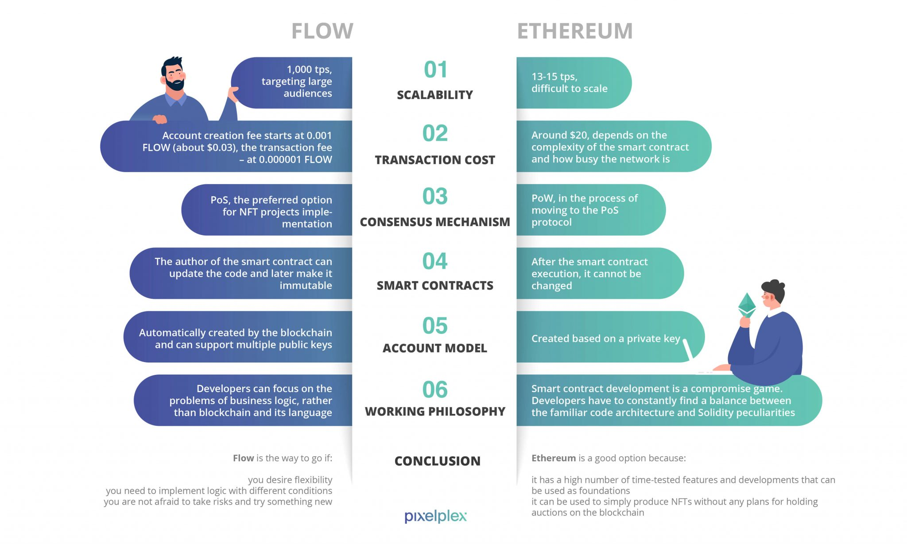
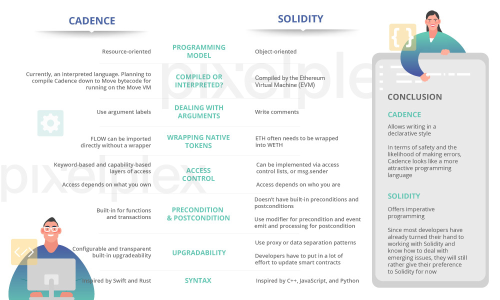
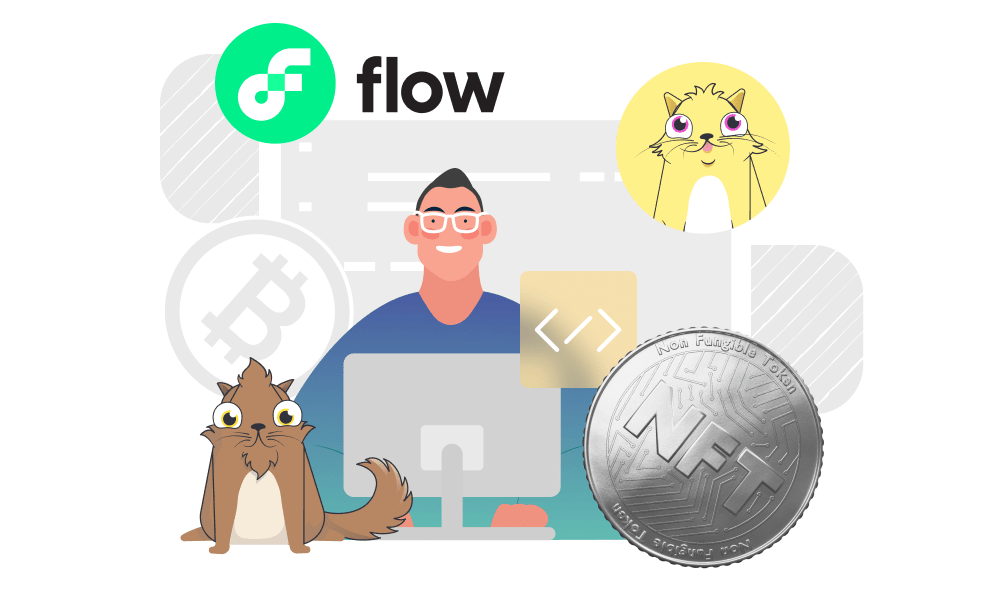

# Flow Vs 以太坊：深度对比两条公链以及合约开发语言

**随着区块链技术的发展，我们看到了越来越多的平台、开发语言以及应用。而最新的发展趋势莫过于将艺术品和收藏品打包成非同质化代币（NFT）来进行链上的展示和流通。尽管当前大部分的NFT市场依然由以太坊生态统治，但快速崛起的Flow链也很有希望赶上以太坊的脚步。**

**原文**：Flow vs Ethereum: the Ultimate Comparison of Blockchains and Their Programming Languages
**作者**：Anastasiya Haritonova 
https://pixelplex.io/blog/flow-vs-ethereum-comparison-best-platforms-for-nft/
**翻译**：raye

自2015年成立以来，以太坊已经确立了自己主流区块链平台的地位，被开发者们用来开发智能合约并构建去中心化应用程序，而以太坊的创始人也正是意识到区块链技术将大有可为，而非仅仅服务于加密货币交易，才创建了以太坊。

以太坊正在不断发展并逐渐成为很多区块链项目的首选公链。与此同时，一个基于以太坊开发的游戏，加密猫，因为其过于火爆而一度造成了以太坊网络的拥堵，这也恰恰说明了以太坊依然存在明显的不足，我们需要一个更加先进的区块链系统。

这也正是为什么加密猫的创造者们选择推出一条他们自己的区块链，名叫Flow。让我们仔细研究一下这条新的链，看看到底它与以太坊到底有何差别，而又为什么它会更加适合NFT项目。

## **以太坊和Solidity**

如果你熟悉区块链技术并紧跟加密世界潮流，那么你一定听说过以太坊。这个开源的区块链平台早已凭借其出色的智能合约设计，在区块链历史上写下属于它的一笔。

以太坊的创造者曾一度醉心于比特币协议，并决心创造下一代的区块链。他们打算拓展区块链的功能并将这一技术应用到更广阔的的商业场景中去。这也促使他们发明了以太坊，并创建了自己的货币系统以太(ETH)以及编程语言Solidity。

Solidity是一套用于开发智能合约的高级编程语言。受到来自C++，Python和JavaScript的启发，Solidity也是基于面向对象的思想设计的。另外，Solidity也是是为以太坊虚拟机(EVM)所定制的编程语言。

但为什么以太坊开发者希望创造一套新的语言呢？要回答这个问题，我们不妨重新回顾一些基本概念。

当开发者正在为搭建以太坊而努力时，比特币仍然是最为成功的区块链系统（甚至到现在为止，比特币依然是佼佼者）。比特币网络创造了一个点对点的货币交易系统。而以太坊则是为了将任何有价值的事物进行数字化并使其能够高效流通，而非仅仅是加密货币。

另一个主要问题在于，比特币自己的脚本语言很难被开发者用来构建通用的智能合约，因为比特币脚本过于复杂，而且也缺乏灵活性，这迫使以太坊开发者们创造了自己的系统，和自己的编程语言。

最终，以太坊团队打破了比特币系统的固有模式，用一套更为灵活的Solidity语言创造了一个崭新的系统。

以太坊目前被用作众多去中心化应用程序的底层平台，NFT项目也不例外。统计数据显示，以太坊在已启动的去中心化应用和日活跃用户数量上处于领先地位。

## Flow和Cadence

虽然Flow区块链最近才推出，但许多人已经称其为以太坊的潜在的接班人。

Flow是由Dapper Labs开发的，Dapper Labs是一家加拿大公司，也是创建CryptoKitties的团队。该公司的开发人员发现，当他们以太坊上运行的收藏品游戏用户数刚刚来到1万人时，网络就崩溃了。这让他们意识到需要一个新的区块链。Dapper Labs的愿景是吸引多达10亿人使用他们的DApp，然而没有任何区块链平台具备这样的扩展能力。

所以他们构建了Flow，一个更快的去中心化网络，可以为整个去中心化应用生态赋能，尤其是游戏和数字收藏品。Flow的核心架构保证了在不牺牲去中心化的前提下，提升了网络性能，以满足主流应用的需求。有了Flow之后，开发者们可以轻松构建足以应付亿万级别用户的应用程序。

例如，NBA Top Shot已经在Flow网络上成功运行。据Dapper Labs首席执行官Roham Gharegozlou称，NBA Top Shot已经得到了NBA的正式授权，其交易量超过了所有其他NFT项目的总和。自推出测试版以来，NBA Top Shot已经吸引了80多万用户，产生了近5亿美元的销售额。

与其他区块链一样，Flow有其原生货币，名为FLOW。它是网络上的主要储备资产，也是用于质押、治理和支付交易费用的代币。本着与以太坊创建者相同的理念，Flow的团队还推出了一种名为Cadence的新语言。

Cadence是一种面向资源的编程语言，并且创造了一些应用于智能合约的新特性。这些特性包括一个强大的静态类型系统，内置的函数和交易的前置和后置条件，以及基于能力的安全属性。Cadence的语法受到Swift和Rust的影响。资源类型可以与Move语言相匹配（Move由Libra团队开发的合约语言）。

## Flow vs Ethereum:哪一个更适合NFT开发

在了解了Flow和以太坊的基本情况后，是时候来一场对决了。让我们比较一下这两个平台，看看哪一个目前更方便，更有效，经济上更可行，更有利可图。

### 可扩展性

任何曾经尝试过使用以太坊来开发Dapp的开发者，都知道以太坊存在可扩展性问题：以太坊网络的吞吐量大约只有每秒13-15个交易，这使得它难以应付大规模使用场景。

CryptoKitties的开发者也经历过这种低效。他们的游戏一度火爆到以太坊都无法处理大量涌入的用户。在创建Flow时，开发者的主要目标是解决可扩展性问题，同时也保持网络的去中心化和高安全性。

以太坊将分片视为横向扩展区块链的一种方式，而Flow则使用其多节点架构来实现纵向扩展。节点之间根据工作来划分职责，确保整体的并发效率。

采集节点为DApps提高网络连接性和数据可用性，而执行节点执行与每个交易相关的计算。这两种节点是为了提高吞吐量和网络可扩展性。

验证节点对执行节点正在进行的工作进行双重检查，而共识节点决定交易的顺序。实际上，共识节点和验证节点确保了网络的可追责性，并负责安全。

整合四种不同类型的节点确保了节点的分散性和网络的去中心化。

在交易吞吐量方面，早在2019年，Flow原型能够每秒执行约1,000次交易。现在的目标是达到10,000 tps。

### 交易成本

为了进行交易和成功执行智能合约，以太坊用户必须支付燃料费(Gas)。这是一种特殊的费用，它的具体数额取决于合同的复杂性和网络的拥堵程度。在以太坊上，燃气费以ETH支付，有些时候的平均价格超过20美元。

Flow的开发者并不满足于天然气的成本。但他们是否能够减少自己平台上的交易费用？到目前为止，他们似乎已经成功了。适用于交易的费用有两项：一项是创建账户的费用，从0.001FLOW（约0.03美元）开始，另一项是交易费用，从0.000001FLOW开始计价。

### 共识机制

以太坊目前使用工作量证明（proof-of-work）共识协议。有了这样的共识，矿工便会进入 "战斗 "状态：他们抢着创造新的区块。这场加密战斗的赢家将是那些比其他人更快地解决数学谜题（以此建立区块间联系）的人。赢家与网络中的其他人分享新区块，并获得ETH奖励。

同时，以太坊开发者正计划转向股权证明（proof-of-stake）共识协议。在这种情况下，该过程将涉及验证者，他们将投放ETH参与交易验证。验证者是随机选择的，以创建新的区块，与网络分享并获得奖励。这种变化将有可能减少能源消耗和燃料费。

Flow区块链则已经在PoS共识模型上运行。它是由最初由VMware Research开发的HotStuff共识算法驱动的。

它们之间的关键区别在于关键参与者如何获利。在PoS中，玩家从提升货币价值中获利，而PoW则让他们倾向于提高佣金。实际上，PoW也是以太坊的可扩展性问题的主要原因。

由于以太坊仍在向PoS协议转变的过程中，对于那些迫不及待推出NFT项目的创作者来说，Flow是一个很好的选择。

### 智能合约

谈到智能合约，往往会想到以太坊，因为它是专门为使用智能合约的应用程序而设计的。以太坊也是一直以来最受欢迎的智能合约创建平台。

以太坊智能合约最值得注意的是，在其执行后，网络状态将不能被改变。在智能合约之上进行的任何交易都被记录在区块链上，并成为亘古不变的信息留存下来。这无疑提高了以太坊平台的可信度。

然而，一些开发者认为，应该可以在智能合约部署后进行更改，因为智能合约可能存在缺陷，而且经常需要测试。

Flow允许在其主网上发布处于 "测试状态 "的智能合约，这样合约的原作者就可以一步一步地更新代码。用户则可以选择在某一时间点使用该代码，或者等待代码完成后再对其建立真正的信任。

一旦智能合约的作者确信代码是安全的，他们就不再需要控制代码，从那一刻起，智能合约就变得不可更改。通过检查和修复代码，开发者有机会为终端用户大幅提高智能合约的安全性。

### 账户模型

以太坊账户是基于私钥创建的。私钥是一个长度为64（256位/32字节）的十六进制数字。私钥成功生成后，对其加以特定的运算便可以得出公钥。然后，公钥再经过几次数学运算，以获得一个有效的地址。这个过程是单向的，即不可能从一个给定的地址生成一个私钥。

至于Flow，账户是由区块链自动创建的，可以支持多个公钥。要在Flow上创建一个账户，首先必须使用ECDSA（椭圆曲线数字签名算法）P-256或secp256k1曲线生成公钥和私钥对，然后将交易发送到区块链上。通过这个交易，新的账户存储被初始化，然后生成的密钥被分配给该账户。

Flow上的每个账户可以有1到n个与之相关的公钥。对于每个公钥，将有一个由账户持有人直接拥有的私钥。

在以太坊区块链上，智能合约被部署到独立的账户中去，这些账户没有私钥。然而，在Flow区块链上，账户可以同时部署多个智能合约。

另一个区别是跟踪代币和智能合约的能力。从技术上讲，一个以太坊账户可以使用以太坊日志追踪它与之互动的所有代币和智能合约，但以太坊并没有为智能合约中的账户资产提供一个统一的存储。然而，Flow做到了这一点：资源在某种意义上是Flow区块链上的 "一等公民"，你可以跟踪你的资源与之互动的所有智能合约。

### 工作理念

以太坊开发者的理念包括几个原则：简洁性、通用性、模块化、非歧视性和敏捷性。理想情况下，即便是普通程序员也能够轻松地构建预期的去中心化应用。至于普遍性，以太坊的创造者将该平台设定为各种上层应用的基础：你可以发明自己的金融工具，创造自己的货币，将真实资产代币化等等。此外，以太坊开发者不断寻找机会来提高其区块链的安全性和可扩展性。

在现实中，智能合约的开发看起来像一个折中游戏。开发人员必须不断地在既定的应用程序架构和Solidity的特殊性之间找到平衡。实现合约是一项复杂的任务，需要考虑到大量的场景。同时，每一个不必要的行动的成本都非常高。一个小小的失误就有可能让开发者眼睁睁地看着他们的钱消失，但却无能为力。

Flow创造者的理念来自于他们自己与其他区块链合作的经验，特别是与以太坊的合作。他们分析了开发者遇到的所有问题，并创建了一个新的区块链，让用户获得更轻松的使用体验。有了Flow区块链，开发者现在可以专注于商业逻辑的问题，而不是复杂的区块链具体问题。

Flow是一个新的区块链，有一个新的编程语言，所以它自然会带来一定的学习曲线。幸运的是，它有大量的文档，创造者也在不断寻找简化开发的方法。

尽管如此，以太坊仍然是最受欢迎的区块链之一，并已经发行了大量的代币和稳定币。看看目前的统计数据就知道了。74%的稳定币是在以太坊区块链上发行的。此外，以太坊协议有很多经过时间考验的功能和模板，可以作为基础，而非新技术，因为新技术总是有漏洞的风险。

基本上，如果你倾向于轻松地构建一个NFT，并且不打算在区块链上举行拍卖，使用以太坊将是一个不错的选择。它可能有点贵，但这同时也是一个优势和劣势，因为交易的高成本也表明对区块链及其流动性的需求。另一方面，如果你渴望灵活性，你需要在不同的条件下实现逻辑，而且你不害怕承担风险并且乐于尝试新事物，那么Flow就是你的选择。

仅仅是CryptoKitties和NBA Top Shot的成功，就足以激励开发者开始探索Flow及其功能。

## Solidity vs Cadence: 它们的区别

Solidity和Cadence是专门为其平台设计的智能合约语言。Ethereum和Flow是完全不同的两条区块链，那么它们的语言有什么主要特点和区别？让我们来了解一下!

### 编程模型

首先，Solidity是一种面向对象的编程语言，而Cadence是面向资源的。这意味着什么呢？

一般来说，面向对象的编程意味着围绕数据（对象）而不是逻辑和函数来组织软件开发。除了Solidity之外，还有许多其他流行的面向对象语言。JavaScript, Python, C ++, Ruby, 等等。

在面向资源的编程中，当某个东西被标记为 "资源 "时，编程环境被告知这个数据结构是有形的东西，所有与这个数据结构交互的代码都必须遵循一系列的规则，以维护这个数据结构的价值。这种编程模型非常适用于数字资产。

Cadence实际上是第一个可供使用的面向资源的高级编程语言。另一个面向资源语言的例子是Move，但它与Cadence的不同之处在于它注重性能和效率。Move有一个虚拟机和压缩的字节码，可以有效地执行代码。同时，它的语法遵循最小化设计，容易被计算机解释，但可读性较差。另一方面，Cadence有一个符合人体工程学的语法，优先考虑了可读性和清晰性。

### 编译还是解释

另一个区别是，Solidity是经过编译后执行的，而Cadence目前是一种解释语言。Cadence开发人员正在努力寻找方法，将Cadence编译成Move字节码，以便在Move虚拟机上运行。该团队还没有为何时完成这一更新设定任何期限。

值得注意的是，编译语言和解释语言都有各自的优点和缺点。例如，编译程序通常比解释代码快，但在测试前需要额外的时间来完成整个编译步骤，而且平台需要依靠生成的二进制代码来运行，所以这类代码往往跨平台性较差。

而另一边，解释型语言通常更加灵活。此外，由于解释型语言自己执行源代码，代码本身是独立于平台的。然而，有一个严重的缺点，就是与编译语言相比，执行速度较低。

### 参数处理

Cadence允许你使用参数标签来描述一个函数的参数的含义。使用Solidity语言，你可以使用注释。写注释可以是解释一个函数的目的和每个参数的用途的方法。

### 包装原生代币

FLOW代币本身就是一个智能合约，可以直接导入，不需要额外的包装器。Solidity的原生货币是以太币（ETH），它经常需要被包装成wETH来用于智能合约。

为什么Solidity会这样运作？为了成功完成用户之间的交易，每个用户必须对他们交易的每个代币有相同的标准化格式。在这种情况下，我们谈论的其实是ERC-20格式。而ETH是在这个标准出台之前建立的，所以它并不符合这个标准。因此，我们需要对ETH进行 "包装"，将其变成WETH。这简化了不同代币之间互动时的合约工作。然而，这并不是一个要求，因为你依然可以使用原生ETH编写智能合约，只是这样逻辑会更复杂。

### 访问控制

访问控制的功能很容易理解：它允许程序的某些部分被访问，而其他部分则不被访问。Cadence内置两个不同层次的访问控制能力：基于**关键字**和基于**能力（capability）**。第二种安全模式并不经常使用。

许多其他智能合约编程语言根据”你是谁“来提供或限制访问，但**能力安全**关心的是”你有什么“。用户会收到他们存储在账户中的特殊资源对象，这些对象决定了用户被允许访问哪些功能。本质上，这里没有什么是默认公开的。如果其他账户想要读取或写入对象，必须由账户的所有者通过提供对其对象的引用来授予他们访问权。

而在Solidity编程语言中，开发人员指出，以太坊是一个公共区块链，所以你永远无法阻止一个人或计算机阅读你的交易内容和查看你的合同的状态。如果你愿意，你可以通过使用加密或简单地限制对你与其他合约的状态的读取访问，而这使这项任务变得更加复杂。

Solidity 中的访问取决于您是谁，并通过访问控制列表或使用 "msg.sender "变量来管理，该变量包含与合同互动的用户的地址。

### 前置条件&后置条件

当使用Cadence软件时，合约设计允许开发者声明函数和接口的前提条件和后置条件，这样调用者就可以对他们调用的方法的行为更有信心。前提条件和后置条件是函数和交易的内置条件。

Solidity 没有内置的前条件和后条件，但有一个办法。开发者可以使用函数修改器作为前提条件的变通方法，并使用'eventEmitter'方法和'ethereum-event-processor'模块来实现后置条件。

### 可升级性

Cadence模块具有可配置的和透明的内置升级能力，这使得项目在使代码不可变之前可以进行测试和迭代。

而另一边，Solidity允许开发人员使用代理或数据分离模式。因此，他们必须投入大量的精力来更新智能合约。

顺便说一句，如果你在Flow区块链上的代码变得不可变之后，意识到你犯了一个错误，那么你仍然要处理在Ethereum上面临的同样问题。

Solidity和Cadence之间的其他区别是它们的语法。Cadence受到Swift和Rust的启发，而Solidity受到C++、JavaScript和Python的影响。Cadence通常允许你以声明式的方式编写，而Solidity则提供命令式编程。

就安全性和出错的可能性而言，Cadence看起来是一种更具吸引力的编程语言。然而，由于大多数开发人员已经用Solidity工作过，知道如何处理新出现的问题，许多人仍然会坚持使用Solidity。

Solidity是一种静态类型的语言，这意味着你需要指定每个变量的类型。Cadence也有一个强大的静态类型系统。面向资源的编程范式使Cadence开发者能够创建具有对象能力的线性类型。

## 以太坊和NFTs

现在我们已经研究了以太坊、Flow及其编程语言的技术参数，让我们看看这些区块链平台如何运作的真实案例，以及它们在当前的NFT热潮中扮演什么角色。

稍微提醒一下什么是NFT：这些是非同质化代币，这意味着它们是不可直接交换的，代表独特的数字艺术品、图像、短片、动态图，甚至是诗歌。NFTs在网上出售，有时会以极其庞大的金额出售。

以太坊上运行着非常多NFT项目，以下是其中一些。

### KnownOrigin

KnownOrigin是Web 3.0中发展最快的以太坊艺术平台之一。该平台允许数字创作者轻松认证、发布和销售他们的艺术作品。通过KnownOrigin，该平台的作者努力使来自世界各地的数字艺术家能够将他们的作品和才华货币化，并帮助他们以有意义、透明和公平的方式接近他们的粉丝和收藏家。

以太坊智能合约和ERC-721标准结合起来，提供了非常高的透明度和安全性。由于采用了以太坊智能合约，KnownOrigin的创建者能够提供一种可靠和安全的方式，来为该平台上出售的数字艺术品进行溯源和供应链管理。

该平台目前拥有1000多位艺术家的作品，并已售出11000多件数字艺术品，总金额达130万美元。

### Palm

Palm是数字创作者的最新平台之一。它由ConsenSys开发，以以太坊的侧链形式运行，但能够兼容MetaMask钱包。这个新的创意工作室和NFT生态系统承诺比PoW区块链的能源效率高99%。

Palm最终将由自己的$PALM代币驱动，并将为艺术家提供一个可持续发展的平台，他们可以以NFT的形式发布和销售艺术作品，而不必担心对生态的潜在影响。

Damien Hirst是最早使用Palm将其作品代币化的人之一，名为 "The Currency Project."。达米安计划以NFT的形式出售10000幅纸上油画，该系列作品探讨了 "艺术与财富的融合"。他认为Palm是最适合他的平台，因为它以艺术为导向，更环保，更快捷，而且使用成本更低。

### Decentraland

Decentraland是一种由其用户所拥有的虚拟世界。基于以太坊区块链，该平台使用了两种代币：MANA和LAND。前者是一种ERC-20代币，有多种用途：例如，使用MANA可以购买世界上的商品和服务，亦或者它也可以被烧掉以获得LAND ERC-721代币。

LAND地块的变化在以太坊LAND智能合约中登记，并由区块链验证。一切工作几乎与现实生活中一样：如果你成为LAND的所有者，你将完全控制你在那里创造的生活和环境。

## Flow和NFTs

Flow仍然是一个 "年轻 "的区块链，但它成功地为几个极其流行的游戏、应用程序和交易市场提供了支持。

### CryptoKitties

CryptoKitties最初于2017年在以太坊上发布，并迅速走红。然而，CryptoKitties的繁荣暴露了以太坊网络的可扩展性问题，大量涌入的用户使其发生了严重的拥堵。

在推出自己的Flow区块链后，Dapper Labs的开发人员开始将数字收藏品从以太坊网络迁移到Flow。预计CryptoKitties将获得新的功能，如动画的3D 效果。随着时间的推移，也将有可能在Flow的其他游戏中使用这些数字资产。

Dapper Labs首席执行官Roham Gharegozlou指出，任何使用以太坊的人都将能够把他们的猫带到Flow。因此，对于所有的加密猫爱好者来说——不用担心，你将保留你的猫咪收藏，并享受随之而来的更多新功能。

### NBA Top Shot

我们在之前提到过这款应用，但其中仍大有乾坤值得我们深入探索。NBA Top Shot从诞生便获得非同一般的反响，频频霸占新闻头条。

Dapper Labs从好莱坞、体育和金融投资领域的巨头那获得了3.05亿美元的资金。据媒体报道，新一轮融资对该公司的估值为26亿美元——这表明今天的NFT领域是多么的繁荣。

该公司的融资由金融服务公司Coatue牵头，与NBA传奇人物和知名球员等高调人士联合，包括迈克尔-乔丹、凯文-杜兰特、安德烈-伊戈达拉、凯尔-洛瑞、斯宾塞-丁威迪、安德烈-德拉蒙德、亚历克斯-卡鲁索、迈克尔-卡特-威廉姆斯、约什-哈特等人。

该公司表示，他们将利用这些资金继续开发NBA Top Shot，并将更新的球星卡平台扩展到其他体育项目。

### VIV3 NFT marketplace

2021年1月，VIV3——流媒体上第一个旨在赋予数字艺术家和创作者权力的共享市场问世。VIV3目前正处于测试阶段。VIV3的早期用户主要是一些知名艺术家，如Anne Spalter，她因在香港和纽约的大型公共作品而闻名。

VIV3的创造者还宣布了他们与著名概念设计艺术家Ben Mauro的合作。他曾参与电影《霍比特人三部曲》、《蜘蛛侠2》、《极乐世界》，以及《使命召唤》和《光环》游戏。Ben Mauro的卡牌游戏《EVOLUTION》即将登陆Flow。

Dapper Labs最近还与UFC签订了一份新协议。该公司正在与UFC合作，在Flow区块链上为世界各地的MMA粉丝创建加密货币数字资产和配套游戏。

除了列出的名字和品牌外，Dapper还有许多著名的合作伙伴，如苏斯博士企业、三星、育碧和华纳音乐集团。

## 未来可期

以太坊已经坐稳了第一个也是最受欢迎的区块链的宝座。它允许你使用智能合约，将资产代币化，发行独特的代币（包括NFT）并创建复杂的DApps。以太坊的受欢迎程度也因其统一的标准而持续增长，这使得现有应用很容易集成到以太坊网络中。

尽管开发人员已经谈论以太坊的可扩展性问题很长时间了，但其工程团队承诺，这个问题将在即将到来的ETH 2.0更新中得到解决。它承诺将引入分片，并使之从PoW过渡到PoS共识。目前还没有给出过渡的确切日期，但可能会在2021年至2023年之间发生。

以太坊2.0承诺解决主要的可扩展性问题，这可能会把开发人员重新拉拢过来，并使它保持大规模NFT项目的头部公链的地位。

另一方面，Flow的创造者站在了当前NFT热潮的最前沿。成功的NFT项目和NBA Top Shot等加密货币游戏可能会使开发商在未来的项目中使用Flow，并为该平台带来全球曝光。

Flow的功能远远超出了这些趋势性应用。截至目前，开发人员不断建立工具和服务，使Flow成为具有改进的可扩展性、可组合性和用户体验的最佳消费者应用程序平台。作为一个支持DeFi的通用区块链，它最有可能发展成自己的生态系统。

## 结论

Flow和Ethereum都是普适各类应用的平台。它们都有各自的优点和缺点，特别是在涉及到NFT项目开发时。

谈到可扩展性问题，Ethereum认为分片是解决这个问题的方法。一旦分片得到实施，它将减少网络拥堵，提高交易速度。Flow在这方面比Ethereum更好，因为它已经提供了多节点架构和更快的交易。此外，以太坊目前使用的是PoW共识协议，而Flow是在PoS模型上运行。PoW不是NFT项目的最佳选择，因为它也会导致可扩展性问题。因此，就可扩展性而言，Flow可能会是一个更好的选择。

以太坊的交易成本相当高，而Flow允许用户支付更少的费用。看起来，低交易成本显然是一个好处。但在对于以太坊而言，高成本表明对平台的强烈需求和信任。关于智能合约的开发，一旦你在以太坊上部署了一个智能合约，它将变得不可改变，而Flow上的智能合约是可以升级的。有能力修复问题绝对是一个优势。

考虑所有描述的两种区块链的优点和缺点，并决定哪一个将给你带来最大的好处。选择权在你手中，但笔者提醒你：每个项目都是独一无二的，有自己的特殊性。你必须必须仔细考虑来做出谨慎的选择。只有经验丰富的区块链公司才能分析你的情况，就技术选型提供详细的咨询，并从头开始开发你的项目。

不要错过NFT的浪潮，今天就开始建立你自己的应用程序吧!