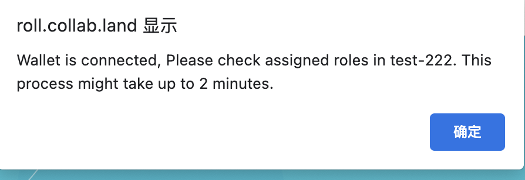

## Collab.land 使用教程  
### 简介  
Collab.land是由Abridged.io 团队创建的一个Discord和Telegram机器人, 它会创建代币许可的聊天群. 如果你没有持有一定数量或特定的代币, 你就会在几分钟内被踢出该群, 因为它会链接到你的MetaMask钱包, 检查你当前钱包中的余额是否满足入群要求.  
本样例将演示如何在 discord 中配置 Collab 机器人

### 操作步骤  
#### 1. 登陆 discord 软件 

#### 2. 创建一个测试服务器  

#### 3. 添加 Collab.Land  
- 点击 [Add Collab](https://discord.com/login?redirect_to=%2Foauth2%2Fauthorize%3Fclient_id%3D704521096837464076%26scope%3Dbot%26permissions%3D8) 从中选择需要添加 bot 机器人的服务器, 这里选择刚才创建的 test-222 这个服务器    

 

- 授权管理员权限    

 

#### 4. 创建身份组 
这里我们创建一个名为 NFT_ROLE 的身份组, 只有

 

#### 5. 创建频道 
- 这里创建一个私密频道 

 

- 设置只有 NFT 用户才能访问该频道 

  

#### 6. 配置 Collab.Land  
- 在 collabland-config 频道中输入 "!setup role" 进行角色配置  

 

- 选择网络类型  
以 matic 网络为例, 选择 5 

 

- 选择 Token 类型  
已 ERC721 为例

 

- 输入详细的代币信息  
根据提示输入详细的代币信息  

  

- 确认  
点击 "Add Role" 进行确认

  

### 身份认证  
下面演示普通用户登陆后, 如何进行身份认证 

- collabland-join 认证  
默认下, 普通用户进入频道后, 可以看到 collabland-join 频道, 无法看到 collabland-config , 只有 admin 才能看到 collabland-config. 
点击其中的 "Let's go!" 按钮.    

  

- 连接钱包  

  

- 选择钱包类型  

  

- 进行签名    

  

- Collabland 弹出提示    
 

  

- 重新进入 Discord 检查身份  
这时用户就会被赋予 NFT_ROLE 这个角色, 同时也可以看到 nft 这个频道 

   

### 参考链接  
Collab.land 官方文档: https://collabland.freshdesk.com/support/solutions/articles/70000036689-discord-bot-walkthrough  
Youtube 视频介绍: https://www.youtube.com/watch?v=7KTYmpZlHqU 