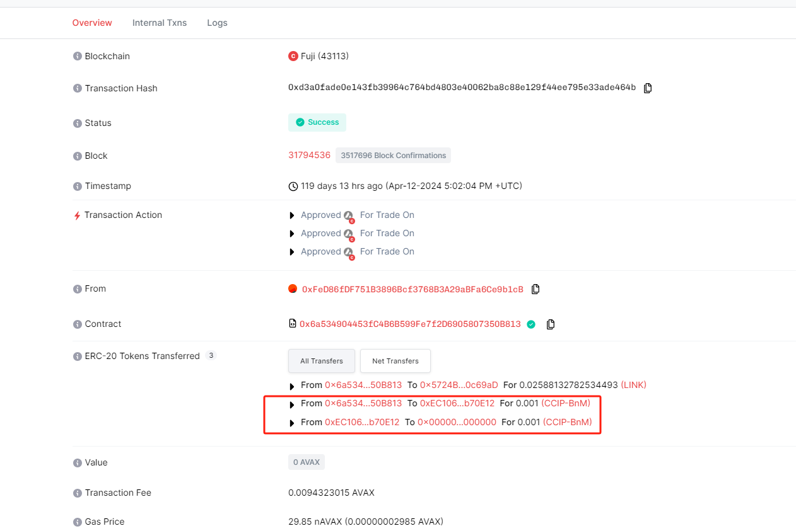
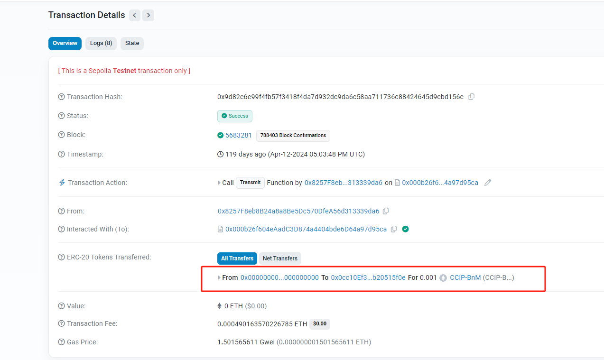

中文 / [English](./README.md)

# Chainlink CCIP 跨链

中文 / [English](./README.md)

## 概览

Chainlink CCIP 提供了一个简单的接口，dApp 和 web3 企业家可以通过它安全地满足他们所有的跨链需求。用户可以使用 CCIP 传输数据，代币，或是二者一起传输。

## 原理

用户调用源链上的 Router 合约，将代币 lock 或 burn ，然后在目标链上将代币 unlock 或 mint 出来，具体取决于需要 Transfer 的代币。比如 ETH，它不能在源链上被 burn, 所以只能被 lock 在代币池中，之后在目标链上 mint 出包装后的 WETH。但是对于 USDT，则采用 burn and mint 的方式，即在源链上 burn 掉 USDT，然后在目标链上 mint 出对应的 USDT。

具体过程包括三个步骤：

源域上的链上组件发出消息。
Chainlink CCIP 的链下证明服务对消息进行签名。
目的域上的链上组件接收消息，并将消息体转发给指定的接收者。

下面是一个跨链交易，可以看到跨链转移代币流程




## 准备测试环境

- 安装依赖

```
npm install
```

- 配置 env

```
cp .env.example .env
## 然后在 .env 中配置正确的环境变量
```

- 获取测试 link token

```
访问如下 web 获取 sepolia 测试网测试 link token
https://faucets.chain.link/
```

- 获取测试 CCIP-BnM Token

```
访问如下 web 获取 CCIP-BnM 测试 token
https://docs.chain.link/ccip/test-tokens#mint-test-tokens
```

- 获取测试 Polygon Mumbai 测试 Matic

```
访问如下 web 获取 Polygon Mumbai 测试网测试 Matic
https://faucet.polygon.technology/
```

## 执行跨链 Data 传输

#### 部署 Sender 合约到 Sepolia

```
npx hardhat run scripts/sendCrossChainData/1-deploySenderOnSepolia.js --network sepolia
```

发送者部署合约参数

- s_router: 路由地址，请于[支持的网络](https://docs.chain.link/ccip/supported-networks)查询；
- s_linkToken： 对应链的[LINK地址](https://docs.chain.link/resources/link-token-contracts)

#### 发送 link token 到部署的合约

```
npx hardhat run scripts/sendCrossChainData/2-transferLinkToSenderOnSepolia.js --network sepoli
```

#### 部署 Receiver 合约到 Polygon Mumbai

```
npx hardhat run scripts/sendCrossChainData/3-deployReceiverOnMumbai.js --network mumbai
```

接收者部署合约参数
s_router: 路由地址，请于[支持的网络](https://docs.chain.link/ccip/supported-networks)查询；

#### 发送跨链 Data

```
npx hardhat run scripts/sendCrossChainData/4-sendCrossChainDataOnSepolia_PayByLinkToken.js --network sepolia
```

发送消息函数sendMessage参数：

- destinationChainSelector： 目标区块链的 CCIP 链标识符。您可以在[支持的网络](https://docs.chain.link/ccip/supported-networks)页面上找到每个网络的链选择器
- receiver： 接受合约地址
- txt: 消息

#### 接受跨链消息

```
## 访问 https://ccip.chain.link/，输入 tx hash, 确认消息已经处理完毕后，再执行以下脚本
npx hardhat run scripts/sendCrossChainData/5-receiveCrossChainDataOnMumbai.js --network mumbai
```

## 执行Token 跨链

token跨链的网络是sepolia和arbitrum-sepolia，请准备好对应的原生币，link token 和 CCIP-BnM Token

#### 在 arbitrum-sepolia 使用link 支付跨链

```sh
  npx hardhat sendToken --network arbitrumSepolia --type link
```

拿到交易hash后可以访问https://ccip.chain.link/ 查看交易状态，当交易成功后sepolia链就能收到转账的CCIP-BnM Token

#### 在 arbitrum-sepolia 使用原生币 支付跨链

```sh
  npx hardhat sendToken --network arbitrumSepolia --type token
```

#### 脚本解读

1. 在 arbitrum-sepolia 部署合约， 合约参数为router和link token
2. 向合约地址转账转账0.1 CCIP-BnM Token
3. 调用 allowlistDestinationChain 函数许可转账 参数destinationChainSelector 目标区块链的 CCIP 链标识符
4. 判断脚本参数type 是否是link， 如果是执行步骤5,否则执行步骤7
5. 向合约地址转账转账0.5 LINK
6. 调用函数transferTokensPayLINK
7. 向合约转账0.01 arbitrum-sepolia eth
8. 调用函数transferTokensPayNative

## 执行 Token和数据 跨链

这里是token和数据一起跨链，所以需要部署在两条链部署合约，一方是发送者，一方是接收者

#### 在 sepolia 上部署 Transfer 合约

```
npx hardhat run scripts/sendCrossChainToken/1-deployTokenTransferorOnSepolia.js --network sepolia
```

#### 发送 link 到部署的合约上

```
npx hardhat run scripts/sendCrossChainToken/2-transferLinkToTokenTransferorOnSepolia.js --network sepolia
```

#### 在 mumbai 上部署 Transfer 合约

```
npx hardhat run scripts/sendCrossChainToken/3-deployTokenTransferorOnMumbai.js --network mumbai
```

#### 执行 token 跨链

```
npx hardhat run scripts/sendCrossChainToken/4-sendCrossChainTokenOnSepolia_PayByLinkToken.js --network sepolia
```

#### 检查跨链结果

```
## 访问 https://ccip.chain.link/，输入 tx hash, 确认消息已经处理完毕后，再执行以下脚本
npx hardhat run scripts/sendCrossChainData/5-receiveCrossChainDataOnMumbai.js --network mumbai
```

以上流程是采用LINK支持跨链费用， 还可以采用原生币支持跨链费用

## 参考文档

- 官方 doc: https://docs.chain.link/ccip/tutorials/programmable-token-transfers
- 支持的跨链 token list: https://docs.chain.link/ccip/supported-networks/v1_2_0/mainnet
