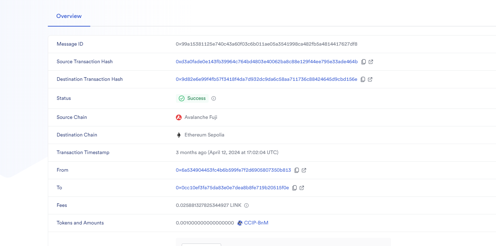
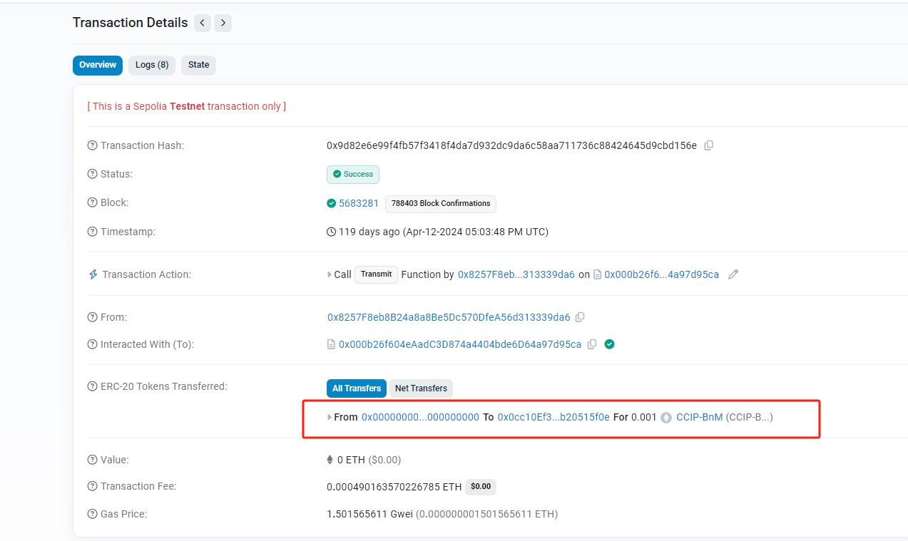

[中文](./README-cn.md) / English

# Chainlink CCIP Cross chain Transfer

## Overview  
The Chainlink CCIP provides a straightforward interface through which dApp and web3 entrepreneurs can securely meet all their cross-chain needs. Users can utilize CCIP to transfer data, tokens, or a combination of both.

## How it works    
Users call the Router contract on the source chain to either lock or burn tokens, and then unlock or mint the tokens on the target chain, depending on the specific token transfer needs. For example, ETH cannot be burned on the source chain, so it can only be locked in the token pool and later minted as wrapped WETH on the target chain. However, for USDT, a burn-and-mint approach is used, where USDT is burned on the source chain and the corresponding USDT is minted on the target chain.

The specific process includes three steps:

- The on-chain component on the source domain sends a message.
- The off-chain proof service of Chainlink CCIP signs the message.
- The on-chain component on the destination domain receives the message and forwards the message body to the specified recipient.

Below is a cross-chain transaction, you can see the process of cross-chain token transfer




## Prepare 
- Install  
```
npm install
```

- Config  
```
cp .env.example .env
## Then configure the correct environment variables in the .env file 
```

- Get test link token 
```
Visit the following website to get test LINK tokens on the Sepolia testnet.
https://faucets.chain.link/
```

- Get CCIP-BnM Test Token 
```
Visit the following website to get CCIP-BnM Test Token on the testnet
https://docs.chain.link/ccip/test-tokens#mint-test-tokens
```

- Obtain test Matic  
```
Visit the following website to obtain test Matic on the Polygon Mumbai
https://faucet.polygon.technology/
```


## Execute cross-chain data transfer.  
#### Deploy the Sender contract to Sepolia  
```
npx hardhat run scripts/sendCrossChainData/1-deploySenderOnSepolia.js --network sepolia
```
Sender deployment contract parameters
- s_router: Router address, please check [Supported Networks](https://docs.chain.link/ccip/supported-networks);
- s_linkToken: Corresponding chain [LINK address](https://docs.chain.link/resources/link-token-contracts)

#### Send link tokens to the deployed contract   
```
npx hardhat run scripts/sendCrossChainData/2-transferLinkToSenderOnSepolia.js --network sepoli
```

#### Deploy the Receiver contract to Polygon Mumbai  
```
npx hardhat run scripts/sendCrossChainData/3-deployReceiverOnMumbai.js --network mumbai
```
Receiver deployment contract parameters
s_router: Routing address, please check [Supported Networks](https://docs.chain.link/ccip/supported-networks);

#### Send cross-chain data  
```
npx hardhat run scripts/sendCrossChainData/4-sendCrossChainDataOnSepolia_PayByLinkToken.js --network sepolia
```
SendMessage function parameters:
- destinationChainSelector: The CCIP chain identifier of the target blockchain. You can find the chain selector for each network on the [Supported Networks](https://docs.chain.link/ccip/supported-networks) page
- receiver: receiving contract address
- txt: message

#### Receive cross-chain messages 
```
## Visit https://ccip.chain.link/, enter the transaction hash, make sure that the message has been processed, and then execute the following script
npx hardhat run scripts/sendCrossChainData/5-receiveCrossChainDataOnMumbai.js --network mumbai
```

## Execute Token Cross-Chain

The token cross-chain networks are sepolia and arbitrum-sepolia. Please prepare the corresponding native coins, link tokens and CCIP-BnM Tokens.

#### Using link to pay cross-chain in arbitrum-sepolia
```sh
  npx hardhat sendToken --network arbitrumSepolia --type link
```
After getting the transaction hash, you can visit https://ccip.chain.link/ to check the transaction status. When the transaction is successful, the sepolia chain will receive the transferred CCIP-BnM Token.

#### Using native currency to pay for cross-chain in arbitrum-sepolia
```sh
  npx hardhat sendToken --network arbitrumSepolia --type token
```

#### Script Interpretation
1. Deploy the contract in arbitrum-sepolia, the contract parameters are router and link token
2. Transfer 0.1 CCIP-BnM Token to the contract address
3. Call the allowlistDestinationChain function to allow the transfer. The parameter destinationChainSelector is the CCIP chain identifier of the target blockchain
4. Determine whether the script parameter type is link. If it is, execute step 5, otherwise execute step 7
5. Transfer 0.5 LINK to the contract address
6. Call the function transferTokensPayLINK
7. Transfer 0.01 arbitrum-sepolia eth to the contract
8. Call the function transferTokensPayNative

## Execute Token and Data Cross-Chain
This is cross-chain with token and data, so the contract needs to be deployed on two chains, one for the sender and the other for the receiver.

#### Deploy the Transfer contract on Sepolia 
```
npx hardhat run scripts/sendCrossChainToken/1-deployTokenTransferorOnSepolia.js --network sepolia
```  

#### Send LINK to the deployed contract 
```
npx hardhat run scripts/sendCrossChainToken/2-transferLinkToTokenTransferorOnSepolia.js --network sepolia
``` 

#### Deploy the Transfer contract on Mumbai 
```
npx hardhat run scripts/sendCrossChainToken/3-deployTokenTransferorOnMumbai.js --network mumbai
``` 

#### Execute token cross-chain 
```
npx hardhat run scripts/sendCrossChainToken/4-sendCrossChainTokenOnSepolia_PayByLinkToken.js --network sepolia
``` 

#### Check the cross-chain result

```
## Visit https://ccip.chain.link/, enter the transaction hash, confirm that the message has been processed, and then execute the following script
npx hardhat run scripts/sendCrossChainData/5-receiveCrossChainDataOnMumbai.js --network mumbai
```

The above process uses LINK to support cross-chain fees. You can also use native coins to support cross-chain fees.


## Reference 
- Official Documentation: https://docs.chain.link/ccip/tutorials/programmable-token-transfers
- Supported Cross-Chain Token List: https://docs.chain.link/ccip/supported-networks/v1_2_0/mainnet 
