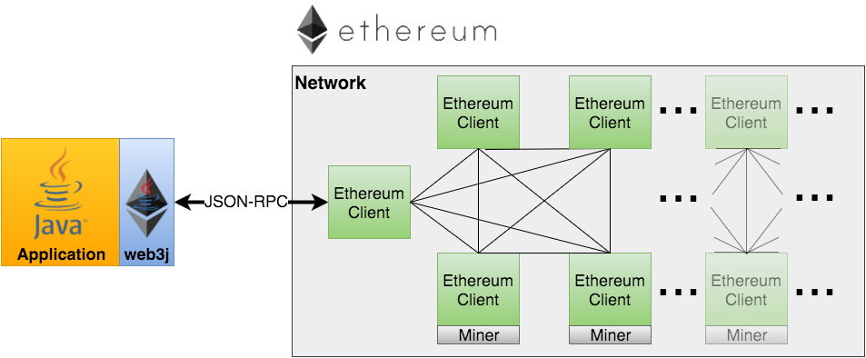

中文 

## 前言

Web3j是一个高度模块化、反应式、类型安全的Java和Android库，用于处理智能合约并与以太坊网络上的客户端（节点）集成：



这使您能够在以太坊区块链上进行工作，而无需额外编写自己的平台集成代码。

本样例演示了利用web3j部署和调用 ERC20 合约, 帮助开发者了解快速上手web3j。


## 项目创建流程
以下以Mac系统为例，介绍对应的安装流程。

为了大幅降低web3j的使用门槛，官方提供了Web3j Cli来提升用户体验，并且提供了一个脚手架的功能。

1. 安装依赖

```sh
  brew install jq
```

由于web3j生成的项目，默认兼容jdk17，建议安装好jdk17的环境。

2. 安装Web3j客户端

   ```sh
   curl -L get.web3j.io | sh && source ~/.web3j/source.sh
   ```

3. 创建新的erc20项目

   ```sh
   web3j new erc20
   ```
会依次要求输入项目的token name/symbol/totalSupply:

```sh
↑2 ~/tmp → web3j new erc20
              _      _____ _
             | |    |____ (_)
__      _____| |__      / /_
\ \ /\ / / _ \ '_ \     \ \ |
 \ V  V /  __/ |_) |.___/ / |
  \_/\_/ \___|_.__/ \____/| |
                         _/ |
                        |__/
by Web3Labs
Please enter the token name [ERC20]:
byd
Please enter the token symbol [erc20]:
byd
Please enter the token initial supply in Wei [1000000000]:

[ ― ] Creating and building ERC20 project ... Subsequent builds will be faster

Project Created Successfully
```

执行成功后，会在当前目录自动创建Web3App的项目。

可以使用IDE导入这个java项目。

## 项目路径说明
我们可以发现，通过Web3j Cli创建的项目，已经被正确初始化，且合约已经被正确编译，和生成了对应的Java Wrapper文件。
该文件位于build/generated目录下面。

```
4688	./node_modules/@openzeppelin ##依赖的合约库代码
4696	./node_modules
120	./gradle
189968	./.gradle
48	./build/generated  #自动生成的合约java代码
184	./build/classes
232	./build/resources
8	./build/kotlin
88	./build/libs
8	./src/test #测试代码
24	./src/main #项目代码
```

## 部署Erc20合约
1. 配置环境变量
打开`./Web3App/src/main/java/org/web3j/Web3App.java`文件，编辑对应的环境变量.（可以直接在文件上替换为自己的，也可以通过在操作系统或IDE中配置环境变量的方式）
```
    // node url既可以被配置为本地的evm peer，也可以被配置为infura的peer
    private static final String nodeUrl = System.getenv().getOrDefault("WEB3J_NODE_URL", "<node_url>");
    private static final String pk1 = System.getenv().getOrDefault("PK_ACCT1", "<private_key>");
```

在本实例中，配置了Sepolia的测试网络的Infura peer.

2. 执行代码
运行Web3App的main函数，代码自动执行。我们可以看到合约被自动部署成功。日志如下：

```
13:48:14: Executing ':Web3App.main()'...

> Task :compileKotlin NO-SOURCE
> Task :nodeSetup UP-TO-DATE
> Task :npmSetup SKIPPED
> Task :resolveSolidity UP-TO-DATE
> Task :npmInstall UP-TO-DATE
> Task :compileSolidity UP-TO-DATE
> Task :generateContractWrappers UP-TO-DATE
> Task :compileJava UP-TO-DATE
> Task :processResources NO-SOURCE
> Task :classes UP-TO-DATE
> Task :jar UP-TO-DATE
> Task :inspectClassesForKotlinIC UP-TO-DATE

> Task :Web3App.main()
nodeUrl is: https://sepolia.infura.io/v3/[your_infura_id]
private key is: [your_private_key]
Deploying ERC20 contract ...
13:48:14.980 [main] DEBUG org.web3j.protocol.http.HttpService -- --> POST https://sepolia.infura.io/v3/[your_infura_id]
13:48:14.980 [main] DEBUG org.web3j.protocol.http.HttpService -- Content-Type: application/json; charset=utf-8
13:48:14.980 [main] DEBUG org.web3j.protocol.http.HttpService -- Content-Length: 125
13:48:14.980 [main] DEBUG org.web3j.protocol.http.HttpService -- 
13:48:14.981 [main] DEBUG org.web3j.protocol.http.HttpService -- {"jsonrpc":"2.0","method":"eth_getTransactionCount","params":["0xaa0087f012d788a11369c2a211f14f767aafdb16","pending"],"id":0}
13:48:14.981 [main] DEBUG org.web3j.protocol.http.HttpService -- --> END POST (125-byte body)
SLF4J(W): Class path contains multiple SLF4J providers.
SLF4J(W): Found provider [ch.qos.logback.classic.spi.LogbackServiceProvider@3bf7ca37]
SLF4J(W): Found provider [org.apache.logging.slf4j.SLF4JServiceProvider@79079097]
SLF4J(W): See https://www.slf4j.org/codes.html#multiple_bindings for an explanation.
SLF4J(I): Actual provider is of type [ch.qos.logback.classic.spi.LogbackServiceProvider@3bf7ca37]
13:48:18.352 [main] DEBUG org.web3j.protocol.http.HttpService -- <-- 200 https://sepolia.infura.io/v3/[your_infura_id] (3371ms)
13:48:18.353 [main] DEBUG org.web3j.protocol.http.HttpService -- date: Sat, 06 Apr 2024 05:48:18 GMT
13:48:18.353 [main] DEBUG org.web3j.protocol.http.HttpService -- content-type: application/json
13:48:18.353 [main] DEBUG org.web3j.protocol.http.HttpService -- content-length: 39
13:48:18.353 [main] DEBUG org.web3j.protocol.http.HttpService -- vary: Origin
13:48:18.353 [main] DEBUG org.web3j.protocol.http.HttpService -- vary: Accept-Encoding
13:48:18.353 [main] DEBUG org.web3j.protocol.http.HttpService -- 
13:48:18.353 [main] DEBUG org.web3j.protocol.http.HttpService -- {"jsonrpc":"2.0","id":0,"result":"0x0"}
13:48:18.353 [main] DEBUG org.web3j.protocol.http.HttpService -- <-- END HTTP (39-byte body)
13:48:18.406 [main] DEBUG org.web3j.protocol.http.HttpService -- --> POST https://sepolia.infura.io/v3/[your_infura_id]
13:48:18.406 [main] DEBUG org.web3j.protocol.http.HttpService -- Content-Type: application/json; charset=utf-8
13:48:18.406 [main] DEBUG org.web3j.protocol.http.HttpService -- Content-Length: 6880
13:48:18.406 [main] DEBUG org.web3j.protocol.http.HttpService -- 
13:48:18.407 [main] DEBUG org.web3j.protocol.http.HttpService -- {"jsonrpc":"2.0","method":"eth_sendRawTransaction","params":["0xf90d488084f4610900838954408080b90cf6608060405234801561001057600080fd5b50604051610c16380380610c1683398101604081905261002f916102d7565b8282600361003d83826103e7565b50600461004a82826103e7565b50505061005d338261006560201b60201c565b5050506104e6565b6001600160a01b0382166100ad576040517fec442f05000000000000000000000000000000000000000000000000000000008152600060048201526024015b60405180910390fd5b6100b9600083836100bd565b5050565b6001600160a01b0383166100e85780600260008282546100dd91906104a6565b909155506101739050565b6001600160a01b03831660009081526020819052604090205481811015610154576040517fe450d38c0000000000000000000000000000000000000000000000000000000081526001600160a01b038516600482015260248101829052604481018390526064016100a4565b6001600160a01b03841660009081526020819052604090209082900390555b6001600160a01b03821661018f576002805482900390556101ae565b6001600160a01b03821660009081526020819052604090208054820190555b816001600160a01b0316836001600160a01b03167fddf252ad1be2c89b69c2b068fc378daa952ba7f163c4a11628f55a4df523b3ef836040516101f391815260200190565b60405180910390a3505050565b7f4e487b7100000000000000000000000000000000000000000000000000000000600052604160045260246000fd5b600082601f83011261024057600080fd5b81516001600160401b038082111561025a5761025a610200565b604051601f8301601f19908116603f0116810190828211818310171561028257610282610200565b816040528381526020925086602085880101111561029f57600080fd5b600091505b838210156102c157858201830151818301840152908201906102a4565b6000602085830101528094505050505092915050565b6000806000606084860312156102ec57600080fd5b83516001600160401b038082111561030357600080fd5b61030f8783880161022f565b9450602086015191508082111561032557600080fd5b506103328682870161022f565b925050604084015190509250925092565b600181811c9082168061035757607f821691505b602082108103610390577f4e487b7100000000000000000000000000000000000000000000000000000000600052602260045260246000fd5b50919050565b601f8211156103e2576000816000526020600020601f850160051c810160208610156103bf5750805b601f850160051c820191505b818110156103de578281556001016103cb565b5050505b505050565b81516001600160401b0381111561040057610400610200565b6104148161040e8454610343565b84610396565b602080601f83116001811461044957600084156104315750858301515b600019600386901b1c1916600185901b1785556103de565b600085815260208120601f198616915b8281101561047857888601518255948401946001909101908401610459565b50858210156104965787850151600019600388901b60f8161c191681555b5050505050600190811b01905550565b808201808211156104e0577f4e487b7100000000000000000000000000000000000000000000000000000000600052601160045260246000fd5b92915050565b610721806104f56000396000f3fe608060405234801561001057600080fd5b50600436106100935760003560e01c8063313ce56711610066578063313ce567146100fe57806370a082311461010d57806395d89b4114610136578063a9059cbb1461013e578063dd62ed3e1461015157600080fd5b806306fdde0314610098578063095ea7b3146100b657806318160ddd146100d957806323b872dd146100eb575b600080fd5b6100a061018a565b6040516100ad919061056a565b60405180910390f35b6100c96100c43660046105d5565b61021c565b60405190151581526020016100ad565b6002545b6040519081526020016100ad565b6100c96100f93660046105ff565b610236565b604051601281526020016100ad565b6100dd61011b36600461063b565b6001600160a01b031660009081526020819052604090205490565b6100a061025a565b6100c961014c3660046105d5565b610269565b6100dd61015f36600461065d565b6001600160a01b03918216600090815260016020908152604080832093909416825291909152205490565b60606003805461019990610690565b80601f01602080910402602001604051908101604052809291908181526020018280546101c590610690565b80156102125780601f106101e757610100808354040283529160200191610212565b820191906000526020600020905b8154815290600101906020018083116101f557829003601f168201915b5050505050905090565b60003361022a818585610277565b60019150505b92915050565b600033610244858285610289565b61024f85858561030c565b506001949350505050565b60606004805461019990610690565b60003361022a81858561030c565b610284838383600161036b565b505050565b6001600160a01b03838116600090815260016020908152604080832093861683529290522054600019811461030657818110156102f757604051637dc7a0d960e11b81526001600160a01b038416600482015260248101829052604481018390526064015b60405180910390fd5b6103068484848403600061036b565b50505050565b6001600160a01b03831661033657604051634b637e8f60e11b8152600060048201526024016102ee565b6001600160a01b0382166103605760405163ec442f0560e01b8152600060048201526024016102ee565b610284838383610440565b6001600160a01b0384166103955760405163e602df0560e01b8152600060048201526024016102ee565b6001600160a01b0383166103bf57604051634a1406b160e11b8152600060048201526024016102ee565b6001600160a01b038085166000908152600160209081526040808320938716835292905220829055801561030657826001600160a01b0316846001600160a01b03167f8c5be1e5ebec7d5bd14f71427d1e84f3dd0314c0f7b2291e5b200ac8c7c3b9258460405161043291815260200190565b60405180910390a350505050565b6001600160a01b03831661046b57806002600082825461046091906106ca565b909155506104dd9050565b6001600160a01b038316600090815260208190526040902054818110156104be5760405163391434e360e21b81526001600160a01b038516600482015260248101829052604481018390526064016102ee565b6001600160a01b03841660009081526020819052604090209082900390555b6001600160a01b0382166104f957600280548290039055610518565b6001600160a01b03821660009081526020819052604090208054820190555b816001600160a01b0316836001600160a01b03167fddf252ad1be2c89b69c2b068fc378daa952ba7f163c4a11628f55a4df523b3ef8360405161055d91815260200190565b60405180910390a3505050565b60006020808352835180602085015260005b818110156105985785810183015185820160400152820161057c565b506000604082860101526040601f19601f8301168501019250505092915050565b80356001600160a01b03811681146105d057600080fd5b919050565b600080604083850312156105e857600080fd5b6105f1836105b9565b946020939093013593505050565b60008060006060848603121561061457600080fd5b61061d846105b9565b925061062b602085016105b9565b9150604084013590509250925092565b60006020828403121561064d57600080fd5b610656826105b9565b9392505050565b6000806040838503121561067057600080fd5b610679836105b9565b9150610687602084016105b9565b90509250929050565b600181811c908216806106a457607f821691505b6020821081036106c457634e487b7160e01b600052602260045260246000fd5b50919050565b8082018082111561023057634e487b7160e01b600052601160045260246000fdfea264697066735822122080acf06e1b95d43c83c8428e0609fb7d11ff29753a63f5676f876109fc574dae64736f6c63430008190033000000000000000000000000000000000000000000000000000000000000006000000000000000000000000000000000000000000000000000000000000000a0000000000000000000000000000000000000000000000000000000003b9aca0000000000000000000000000000000000000000000000000000000000000000036279640000000000000000000000000000000000000000000000000000000000000000000000000000000000000000000000000000000000000000000000000362796400000000000000000000000000000000000000000000000000000000001ba0040c5c6a2b8c88fdd4752f1d57b688720c47660152a2dcc44dd88a08ed293f4fa01a2c8a5dc9acd27b9c5bc0c0951d3f51a7e69c5ce90b2453d8b8acb250009a8a"],"id":1}
13:48:18.407 [main] DEBUG org.web3j.protocol.http.HttpService -- --> END POST (6880-byte body)
13:48:18.752 [main] DEBUG org.web3j.protocol.http.HttpService -- <-- 200 https://sepolia.infura.io/v3/[your_infura_id] (345ms)
13:48:18.753 [main] DEBUG org.web3j.protocol.http.HttpService -- date: Sat, 06 Apr 2024 05:48:18 GMT
13:48:18.753 [main] DEBUG org.web3j.protocol.http.HttpService -- content-type: application/json
13:48:18.753 [main] DEBUG org.web3j.protocol.http.HttpService -- content-length: 102
13:48:18.753 [main] DEBUG org.web3j.protocol.http.HttpService -- vary: Origin
13:48:18.753 [main] DEBUG org.web3j.protocol.http.HttpService -- vary: Accept-Encoding
13:48:18.753 [main] DEBUG org.web3j.protocol.http.HttpService -- 
13:48:18.754 [main] DEBUG org.web3j.protocol.http.HttpService -- {"jsonrpc":"2.0","id":1,"result":"0x56ea32823805a3a7f46fe1af0214d809e53e8a1b4228c1b187d015b8de0905be"}
13:48:18.754 [main] DEBUG org.web3j.protocol.http.HttpService -- <-- END HTTP (102-byte body)
13:48:18.764 [main] DEBUG org.web3j.protocol.http.HttpService -- --> POST https://sepolia.infura.io/v3/[your_infura_id]
13:48:18.765 [main] DEBUG org.web3j.protocol.http.HttpService -- Content-Type: application/json; charset=utf-8
13:48:18.765 [main] DEBUG org.web3j.protocol.http.HttpService -- Content-Length: 141
13:48:18.765 [main] DEBUG org.web3j.protocol.http.HttpService -- 
13:48:18.765 [main] DEBUG org.web3j.protocol.http.HttpService -- {"jsonrpc":"2.0","method":"eth_getTransactionReceipt","params":["0x56ea32823805a3a7f46fe1af0214d809e53e8a1b4228c1b187d015b8de0905be"],"id":2}
13:48:18.765 [main] DEBUG org.web3j.protocol.http.HttpService -- --> END POST (141-byte body)
13:48:19.047 [main] DEBUG org.web3j.protocol.http.HttpService -- <-- 200 https://sepolia.infura.io/v3/[your_infura_id] (282ms)
13:48:19.047 [main] DEBUG org.web3j.protocol.http.HttpService -- date: Sat, 06 Apr 2024 05:48:18 GMT
13:48:19.048 [main] DEBUG org.web3j.protocol.http.HttpService -- content-type: application/json
13:48:19.048 [main] DEBUG org.web3j.protocol.http.HttpService -- content-length: 38
13:48:19.048 [main] DEBUG org.web3j.protocol.http.HttpService -- vary: Origin
13:48:19.048 [main] DEBUG org.web3j.protocol.http.HttpService -- vary: Accept-Encoding
13:48:19.048 [main] DEBUG org.web3j.protocol.http.HttpService -- 
13:48:19.048 [main] DEBUG org.web3j.protocol.http.HttpService -- {"jsonrpc":"2.0","id":2,"result":null}
13:48:19.048 [main] DEBUG org.web3j.protocol.http.HttpService -- <-- END HTTP (38-byte body)
13:48:34.075 [main] DEBUG org.web3j.protocol.http.HttpService -- --> POST https://sepolia.infura.io/v3/[your_infura_id]
13:48:34.076 [main] DEBUG org.web3j.protocol.http.HttpService -- Content-Type: application/json; charset=utf-8
13:48:34.076 [main] DEBUG org.web3j.protocol.http.HttpService -- Content-Length: 141
13:48:34.076 [main] DEBUG org.web3j.protocol.http.HttpService -- 
13:48:34.076 [main] DEBUG org.web3j.protocol.http.HttpService -- {"jsonrpc":"2.0","method":"eth_getTransactionReceipt","params":["0x56ea32823805a3a7f46fe1af0214d809e53e8a1b4228c1b187d015b8de0905be"],"id":3}
13:48:34.076 [main] DEBUG org.web3j.protocol.http.HttpService -- --> END POST (141-byte body)
13:48:34.427 [main] DEBUG org.web3j.protocol.http.HttpService -- <-- 200 https://sepolia.infura.io/v3/[your_infura_id] (350ms)
13:48:34.428 [main] DEBUG org.web3j.protocol.http.HttpService -- date: Sat, 06 Apr 2024 05:48:34 GMT
13:48:34.428 [main] DEBUG org.web3j.protocol.http.HttpService -- content-type: application/json
13:48:34.428 [main] DEBUG org.web3j.protocol.http.HttpService -- vary: Origin
13:48:34.428 [main] DEBUG org.web3j.protocol.http.HttpService -- vary: Accept-Encoding
13:48:34.428 [main] DEBUG org.web3j.protocol.http.HttpService -- 
13:48:34.428 [main] DEBUG org.web3j.protocol.http.HttpService -- {"jsonrpc":"2.0","id":3,"result":{"blockHash":"0x966c3a8a35999ea01615bea15e449968c78c2999253ee11de12bb19c1cd0b661","blockNumber":"0x560c23","contractAddress":"0x70cbbb4f4f51a392a68aaffc3aae4fda6eb89081","cumulativeGasUsed":"0x9a0d6","effectiveGasPrice":"0xf4610900","from":"0xaa0087f012d788a11369c2a211f14f767aafdb16","gasUsed":"0x886ad","logs":[{"address":"0x70cbbb4f4f51a392a68aaffc3aae4fda6eb89081","blockHash":"0x966c3a8a35999ea01615bea15e449968c78c2999253ee11de12bb19c1cd0b661","blockNumber":"0x560c23","data":"0x000000000000000000000000000000000000000000000000000000003b9aca00","logIndex":"0x2","removed":false,"topics":["0xddf252ad1be2c89b69c2b068fc378daa952ba7f163c4a11628f55a4df523b3ef","0x0000000000000000000000000000000000000000000000000000000000000000","0x000000000000000000000000aa0087f012d788a11369c2a211f14f767aafdb16"],"transactionHash":"0x56ea32823805a3a7f46fe1af0214d809e53e8a1b4228c1b187d015b8de0905be","transactionIndex":"0x2"}],"logsBloom":"0x00000000000000000000000000000000000000000000000000000000000000000000000000000000000000000000000000000000000000000000000000000000000000000000000000000008000000000000000200000000000000000000000000000000020000000000000000000800000000000000000000000010000000000000000000000000000000000000000000000000000000800000000000000000000000010000000000000000000000000000000000000000000000000000000000000002000000000000000001000000000000000000000000000000000020000000000000000100000000000000000000000100000000000000000000000000","status":"0x1","to":null,"transactionHash":"0x56ea32823805a3a7f46fe1af0214d809e53e8a1b4228c1b187d015b8de0905be","transactionIndex":"0x2","type":"0x0"}}
13:48:34.428 [main] DEBUG org.web3j.protocol.http.HttpService -- <-- END HTTP (1629-byte body)
Contract address: 0x70cbbb4f4f51a392a68aaffc3aae4fda6eb89081

Deprecated Gradle features were used in this build, making it incompatible with Gradle 8.0.

You can use '--warning-mode all' to show the individual deprecation warnings and determine if they come from your own scripts or plugins.

See https://docs.gradle.org/7.6/userguide/command_line_interface.html#sec:command_line_warnings

BUILD SUCCESSFUL in 20s
9 actionable tasks: 1 executed, 8 up-to-date
13:48:34: Execution finished ':Web3App.main()'.

```


## 部署合约的代码逻辑说明
在[Web3App.java](./Web3App/src/main/java/org/web3j/Web3App.java)中，定义详细的部署Erc20合约的逻辑。

1. 读取节点或代理服务的url 
   同时需要注意的是, 这里我们通过 infura 向对应的区块链网络发送交易, 而 INFURA_ID 这个变量值也需要配置在环境变量文件中, 具体如何获取 infura_id, 可自行搜索查找相关文档

   ```java
   String nodeUrl = System.getenv().getOrDefault("WEB3J_NODE_URL", "<node_url>");
   ```

2. 读取私钥  
   处于安全考虑, 私钥没有进行硬编码, 而是通过环境变量的方式进行获取. 启动测试时, dotenv 插件自动读取 .env 配置文件中的配置项, 然后加载为环境变量, 之后在代码中可以通过 process.env 读取私钥 ( 也包括其他环境变量 )

   ```java
   private static final String pk1 = System.getenv().getOrDefault("PK_ACCT1", "<private_key>");
   Credentials credentials = Credentials.create(pk1);
   ```

3. 构造 web3j 对象  
   通过 web3j 对象可以很方便的发送相应的交易到区块链网络, 同时获取区块链的处理结果.
   构造 web3j 对象时, 主要需要传入一个参数, 就是对应的区块链网络, 包括 sepolia 等测试网络, 或是 mainnet 主网.
   这里我们使用 sepolia 测试网络. 如果没有 sepolia 网络的测试币, 可以切换到其他的测试网络.

   ```java
   Web3j web3j = Web3j.build(new HttpService(nodeUrl));
   ```

4. 部署合约  
    这里发送签名后的交易到区块链网络, 同时得到返回的交易回执. 从返回的交易回执中可以得到此次部署的合约的地址

    ```java
    ERC20Token erc20Token = ERC20Token.deploy(web3j, credentials, new DefaultGasProvider(), NAME, SYMBOL, INITIAL_SUPPLY).send();
    ```


## 载入和查询合约
根据已部署的合约，可以自行编写代码，实现对合约的查询。
在[Erc20Query.java](./Web3App/src/main/java/org/web3j/Erc20Query.java)
可以参考Erc20Query文件，以下为核心的代码：
```
   //刚才所部署的合约的地址
   private static final String erc20Addr = System.getenv().getOrDefault("ERC20_ADDR", "0x70cbbb4f4f51a392a68aaffc3aae4fda6eb89081");


    public static void main(String[] args) throws Exception {
        Web3j web3j = Web3j.build(new HttpService(nodeUrl));
        Credentials credentials = Credentials.create(pk1);
        ERC20Token eRC20Token= ERC20Token.load(erc20Addr, web3j, credentials, new DefaultGasProvider());
        //检查合约是否载入成功
        if (eRC20Token.isValid()) {
            String name = eRC20Token.name().send();
            System.out.println("token name is " + name);
            String symbol = eRC20Token.symbol().send();
            System.out.println("token symbol is " + symbol);
            BigInteger totalSupply = eRC20Token.totalSupply().send();
            System.out.println("total supply is " + totalSupply);
        }
        web3j.shutdown();
    }
```

执行的结果如下：

```
14:38:46.954 [main] DEBUG org.web3j.protocol.http.HttpService -- --> POST https://sepolia.infura.io/v3/[your_infura_id]
14:38:46.955 [main] DEBUG org.web3j.protocol.http.HttpService -- Content-Type: application/json; charset=utf-8
14:38:46.955 [main] DEBUG org.web3j.protocol.http.HttpService -- Content-Length: 112
14:38:46.955 [main] DEBUG org.web3j.protocol.http.HttpService -- 
14:38:46.955 [main] DEBUG org.web3j.protocol.http.HttpService -- {"jsonrpc":"2.0","method":"eth_getCode","params":["0x70cbbb4f4f51a392a68aaffc3aae4fda6eb89081","latest"],"id":0}
14:38:46.956 [main] DEBUG org.web3j.protocol.http.HttpService -- --> END POST (112-byte body)
SLF4J(W): Class path contains multiple SLF4J providers.
SLF4J(W): Found provider [ch.qos.logback.classic.spi.LogbackServiceProvider@4cb2c100]
SLF4J(W): Found provider [org.apache.logging.slf4j.SLF4JServiceProvider@6fb554cc]
SLF4J(W): See https://www.slf4j.org/codes.html#multiple_bindings for an explanation.
SLF4J(I): Actual provider is of type [ch.qos.logback.classic.spi.LogbackServiceProvider@4cb2c100]
14:38:48.725 [main] DEBUG org.web3j.protocol.http.HttpService -- <-- 200 https://sepolia.infura.io/v3/[your_infura_id] (1769ms)
14:38:48.727 [main] DEBUG org.web3j.protocol.http.HttpService -- date: Sat, 06 Apr 2024 06:38:48 GMT
14:38:48.727 [main] DEBUG org.web3j.protocol.http.HttpService -- content-type: application/json
14:38:48.727 [main] DEBUG org.web3j.protocol.http.HttpService -- vary: Origin
14:38:48.727 [main] DEBUG org.web3j.protocol.http.HttpService -- vary: Accept-Encoding
14:38:48.728 [main] DEBUG org.web3j.protocol.http.HttpService -- 
14:38:48.728 [main] DEBUG org.web3j.protocol.http.HttpService -- {"jsonrpc":"2.0","id":0,"result":"0x608060405234801561001057600080fd5b50600436106100935760003560e01c8063313ce56711610066578063313ce567146100fe57806370a082311461010d57806395d89b4114610136578063a9059cbb1461013e578063dd62ed3e1461015157600080fd5b806306fdde0314610098578063095ea7b3146100b657806318160ddd146100d957806323b872dd146100eb575b600080fd5b6100a061018a565b6040516100ad919061056a565b60405180910390f35b6100c96100c43660046105d5565b61021c565b60405190151581526020016100ad565b6002545b6040519081526020016100ad565b6100c96100f93660046105ff565b610236565b604051601281526020016100ad565b6100dd61011b36600461063b565b6001600160a01b031660009081526020819052604090205490565b6100a061025a565b6100c961014c3660046105d5565b610269565b6100dd61015f36600461065d565b6001600160a01b03918216600090815260016020908152604080832093909416825291909152205490565b60606003805461019990610690565b80601f01602080910402602001604051908101604052809291908181526020018280546101c590610690565b80156102125780601f106101e757610100808354040283529160200191610212565b820191906000526020600020905b8154815290600101906020018083116101f557829003601f168201915b5050505050905090565b60003361022a818585610277565b60019150505b92915050565b600033610244858285610289565b61024f85858561030c565b506001949350505050565b60606004805461019990610690565b60003361022a81858561030c565b610284838383600161036b565b505050565b6001600160a01b03838116600090815260016020908152604080832093861683529290522054600019811461030657818110156102f757604051637dc7a0d960e11b81526001600160a01b038416600482015260248101829052604481018390526064015b60405180910390fd5b6103068484848403600061036b565b50505050565b6001600160a01b03831661033657604051634b637e8f60e11b8152600060048201526024016102ee565b6001600160a01b0382166103605760405163ec442f0560e01b8152600060048201526024016102ee565b610284838383610440565b6001600160a01b0384166103955760405163e602df0560e01b8152600060048201526024016102ee565b6001600160a01b0383166103bf57604051634a1406b160e11b8152600060048201526024016102ee565b6001600160a01b038085166000908152600160209081526040808320938716835292905220829055801561030657826001600160a01b0316846001600160a01b03167f8c5be1e5ebec7d5bd14f71427d1e84f3dd0314c0f7b2291e5b200ac8c7c3b9258460405161043291815260200190565b60405180910390a350505050565b6001600160a01b03831661046b57806002600082825461046091906106ca565b909155506104dd9050565b6001600160a01b038316600090815260208190526040902054818110156104be5760405163391434e360e21b81526001600160a01b038516600482015260248101829052604481018390526064016102ee565b6001600160a01b03841660009081526020819052604090209082900390555b6001600160a01b0382166104f957600280548290039055610518565b6001600160a01b03821660009081526020819052604090208054820190555b816001600160a01b0316836001600160a01b03167fddf252ad1be2c89b69c2b068fc378daa952ba7f163c4a11628f55a4df523b3ef8360405161055d91815260200190565b60405180910390a3505050565b60006020808352835180602085015260005b818110156105985785810183015185820160400152820161057c565b506000604082860101526040601f19601f8301168501019250505092915050565b80356001600160a01b03811681146105d057600080fd5b919050565b600080604083850312156105e857600080fd5b6105f1836105b9565b946020939093013593505050565b60008060006060848603121561061457600080fd5b61061d846105b9565b925061062b602085016105b9565b9150604084013590509250925092565b60006020828403121561064d57600080fd5b610656826105b9565b9392505050565b6000806040838503121561067057600080fd5b610679836105b9565b9150610687602084016105b9565b90509250929050565b600181811c908216806106a457607f821691505b6020821081036106c457634e487b7160e01b600052602260045260246000fd5b50919050565b8082018082111561023057634e487b7160e01b600052601160045260246000fdfea264697066735822122080acf06e1b95d43c83c8428e0609fb7d11ff29753a63f5676f876109fc574dae64736f6c63430008190033"}
14:38:48.728 [main] DEBUG org.web3j.protocol.http.HttpService -- <-- END HTTP (3688-byte body)
14:38:48.765 [main] DEBUG org.web3j.protocol.http.HttpService -- --> POST https://sepolia.infura.io/v3/[your_infura_id]
14:38:48.765 [main] DEBUG org.web3j.protocol.http.HttpService -- Content-Type: application/json; charset=utf-8
14:38:48.765 [main] DEBUG org.web3j.protocol.http.HttpService -- Content-Length: 188
14:38:48.765 [main] DEBUG org.web3j.protocol.http.HttpService -- 
14:38:48.765 [main] DEBUG org.web3j.protocol.http.HttpService -- {"jsonrpc":"2.0","method":"eth_call","params":[{"from":"0xaa0087f012d788a11369c2a211f14f767aafdb16","to":"0x70cbbb4f4f51a392a68aaffc3aae4fda6eb89081","data":"0x06fdde03"},"latest"],"id":1}
14:38:48.765 [main] DEBUG org.web3j.protocol.http.HttpService -- --> END POST (188-byte body)
14:38:49.049 [main] DEBUG org.web3j.protocol.http.HttpService -- <-- 200 https://sepolia.infura.io/v3/[your_infura_id] (283ms)
14:38:49.050 [main] DEBUG org.web3j.protocol.http.HttpService -- date: Sat, 06 Apr 2024 06:38:49 GMT
14:38:49.050 [main] DEBUG org.web3j.protocol.http.HttpService -- content-type: application/json
14:38:49.050 [main] DEBUG org.web3j.protocol.http.HttpService -- content-length: 230
14:38:49.050 [main] DEBUG org.web3j.protocol.http.HttpService -- vary: Origin
14:38:49.050 [main] DEBUG org.web3j.protocol.http.HttpService -- vary: Accept-Encoding
14:38:49.050 [main] DEBUG org.web3j.protocol.http.HttpService -- 
14:38:49.050 [main] DEBUG org.web3j.protocol.http.HttpService -- {"jsonrpc":"2.0","id":1,"result":"0x000000000000000000000000000000000000000000000000000000000000002000000000000000000000000000000000000000000000000000000000000000036279640000000000000000000000000000000000000000000000000000000000"}
14:38:49.050 [main] DEBUG org.web3j.protocol.http.HttpService -- <-- END HTTP (230-byte body)
token name is byd
14:38:49.072 [main] DEBUG org.web3j.protocol.http.HttpService -- --> POST https://sepolia.infura.io/v3/[your_infura_id]
14:38:49.072 [main] DEBUG org.web3j.protocol.http.HttpService -- Content-Type: application/json; charset=utf-8
14:38:49.072 [main] DEBUG org.web3j.protocol.http.HttpService -- Content-Length: 188
14:38:49.072 [main] DEBUG org.web3j.protocol.http.HttpService -- 
14:38:49.072 [main] DEBUG org.web3j.protocol.http.HttpService -- {"jsonrpc":"2.0","method":"eth_call","params":[{"from":"0xaa0087f012d788a11369c2a211f14f767aafdb16","to":"0x70cbbb4f4f51a392a68aaffc3aae4fda6eb89081","data":"0x95d89b41"},"latest"],"id":2}
14:38:49.072 [main] DEBUG org.web3j.protocol.http.HttpService -- --> END POST (188-byte body)
14:38:49.422 [main] DEBUG org.web3j.protocol.http.HttpService -- <-- 200 https://sepolia.infura.io/v3/[your_infura_id] (349ms)
14:38:49.422 [main] DEBUG org.web3j.protocol.http.HttpService -- date: Sat, 06 Apr 2024 06:38:49 GMT
14:38:49.422 [main] DEBUG org.web3j.protocol.http.HttpService -- content-type: application/json
14:38:49.422 [main] DEBUG org.web3j.protocol.http.HttpService -- content-length: 230
14:38:49.422 [main] DEBUG org.web3j.protocol.http.HttpService -- vary: Origin
14:38:49.422 [main] DEBUG org.web3j.protocol.http.HttpService -- vary: Accept-Encoding
14:38:49.423 [main] DEBUG org.web3j.protocol.http.HttpService -- 
14:38:49.423 [main] DEBUG org.web3j.protocol.http.HttpService -- {"jsonrpc":"2.0","id":2,"result":"0x000000000000000000000000000000000000000000000000000000000000002000000000000000000000000000000000000000000000000000000000000000036279640000000000000000000000000000000000000000000000000000000000"}
14:38:49.423 [main] DEBUG org.web3j.protocol.http.HttpService -- <-- END HTTP (230-byte body)
token symbol is byd
14:38:49.425 [main] DEBUG org.web3j.protocol.http.HttpService -- --> POST https://sepolia.infura.io/v3/[your_infura_id]
14:38:49.425 [main] DEBUG org.web3j.protocol.http.HttpService -- Content-Type: application/json; charset=utf-8
14:38:49.425 [main] DEBUG org.web3j.protocol.http.HttpService -- Content-Length: 188
14:38:49.425 [main] DEBUG org.web3j.protocol.http.HttpService -- 
14:38:49.425 [main] DEBUG org.web3j.protocol.http.HttpService -- {"jsonrpc":"2.0","method":"eth_call","params":[{"from":"0xaa0087f012d788a11369c2a211f14f767aafdb16","to":"0x70cbbb4f4f51a392a68aaffc3aae4fda6eb89081","data":"0x18160ddd"},"latest"],"id":3}
14:38:49.425 [main] DEBUG org.web3j.protocol.http.HttpService -- --> END POST (188-byte body)
14:38:49.728 [main] DEBUG org.web3j.protocol.http.HttpService -- <-- 200 https://sepolia.infura.io/v3/[your_infura_id] (302ms)
14:38:49.728 [main] DEBUG org.web3j.protocol.http.HttpService -- date: Sat, 06 Apr 2024 06:38:49 GMT
14:38:49.728 [main] DEBUG org.web3j.protocol.http.HttpService -- content-type: application/json
14:38:49.728 [main] DEBUG org.web3j.protocol.http.HttpService -- content-length: 102
14:38:49.728 [main] DEBUG org.web3j.protocol.http.HttpService -- vary: Origin
14:38:49.728 [main] DEBUG org.web3j.protocol.http.HttpService -- vary: Accept-Encoding
14:38:49.728 [main] DEBUG org.web3j.protocol.http.HttpService -- 
14:38:49.729 [main] DEBUG org.web3j.protocol.http.HttpService -- {"jsonrpc":"2.0","id":3,"result":"0x000000000000000000000000000000000000000000000000000000003b9aca00"}
14:38:49.729 [main] DEBUG org.web3j.protocol.http.HttpService -- <-- END HTTP (102-byte body)
total supply is 1000000000

```


## Erc20 合约功能说明

- IERC20
  totalSupply: 获取该合约内总的 ERC20 Token 总量  
  balanceOf: 获取特定账户的 ERC20 Token 总量  
  transfer: 向目标账户转移特定数量的 ERC20 Token  
  allowance: 获取目标账户能够使用的源账户的 ERC20 Token 数量  
  approve: 向目标账户授权, 可以转移指定额度的 ERC20 Token 数量  
  transferFrom: ( 第三方调用 ) 从源账户向目标账户转移制定数量的 ERC20 Token

- IERC20Metadata  
  name: 返回 Token 的名称  
  symbol: 返回 Token 的符号  
  decimals: 返回 Token 所支持的精度


## 参考文档
- Web3j 项目地址： https://github.com/web3j/web3j
- Web3j docs: https://docs.web3j.io/4.11.0/
- Web3j Client 说明： https://docs.web3j.io/4.8.7/command_line_tools/
- ERC20 接口及合约说明：https://docs.openzeppelin.com/contracts/2.x/api/token/erc20
