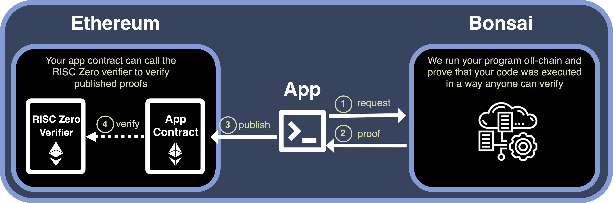

## RISC Zero

RISC Zero 为全球开发人员创建利用 ZK 技术的软件所需的基础设施和工具。

## 安装 

### 准备
RISC Zero zkVM 需要先安装 rust， 请参考[RUST安装教程](https://www.rust-lang.org/tools/install)自行安装。

### 安装 rzup
rzup 管理RISC Zero的安装

1. 使用下面命令安装 rzup

```
curl -L https://risczero.com/install | bash

```
2. 运行 rzup 安装 RISC Zero

```
rzup
```
使用 --version 参数 安装指定版本的 RISC Zero

```
rzup --version 1.1.0-alpha.1
```


## 创建zkVM Application

--guest-name guest是程序名字，zkVM 运行 guest程序，生成执行证明。

```
cargo risczero new my_project --guest-name guest_code_for_zk_proof
```

### 目录结构

```
├── host
│   ├── Cargo.toml
│   └── src
│       └── main.rs
├── methods
│   ├── guest
│   │   └── src
│   │       └── main.rs
│   └── src
│       └── lib.rs
```
**host** 就是主机， 他给 guest 程序传入数据，调用执行 guest 并获得执行结果和生成执行证明，代码在 **host/src/main.rs** 文件中

**guest** 是需要 zkVM 来执行的程序，接收 host 传入的数据，然后执行计算并返回执行结果， 代码在 **methods/guest/src/main.rs**文件中


### 生成证明

执行 host 代码，运行 host/src/main.rs 文件

```
cargo run --release
```

## 使用Bonsai 生成 proofs 
Bonsai 是一个zk coprocessor，是RISC Zero 官方的 一个远程的 zk 证明计算服务。它能帮助 zk Application 低成本快速的生成证明。


## 与区块链集成
链下生成证明，链上验证证明



详情参见官方脚手架 [risc0-foundry-template](https://github.com/risc0/risc0-foundry-template)


## 相关链接

1. 官方文档。https://dev.risczero.com/
2. Bonsai。 https://www.risczero.com/blog/a-guide-to-zk-coprocessors-for-scalability