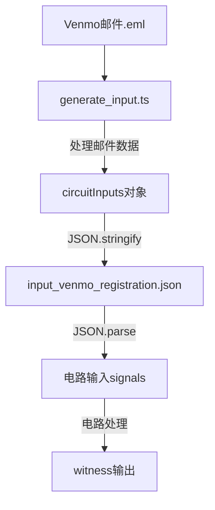
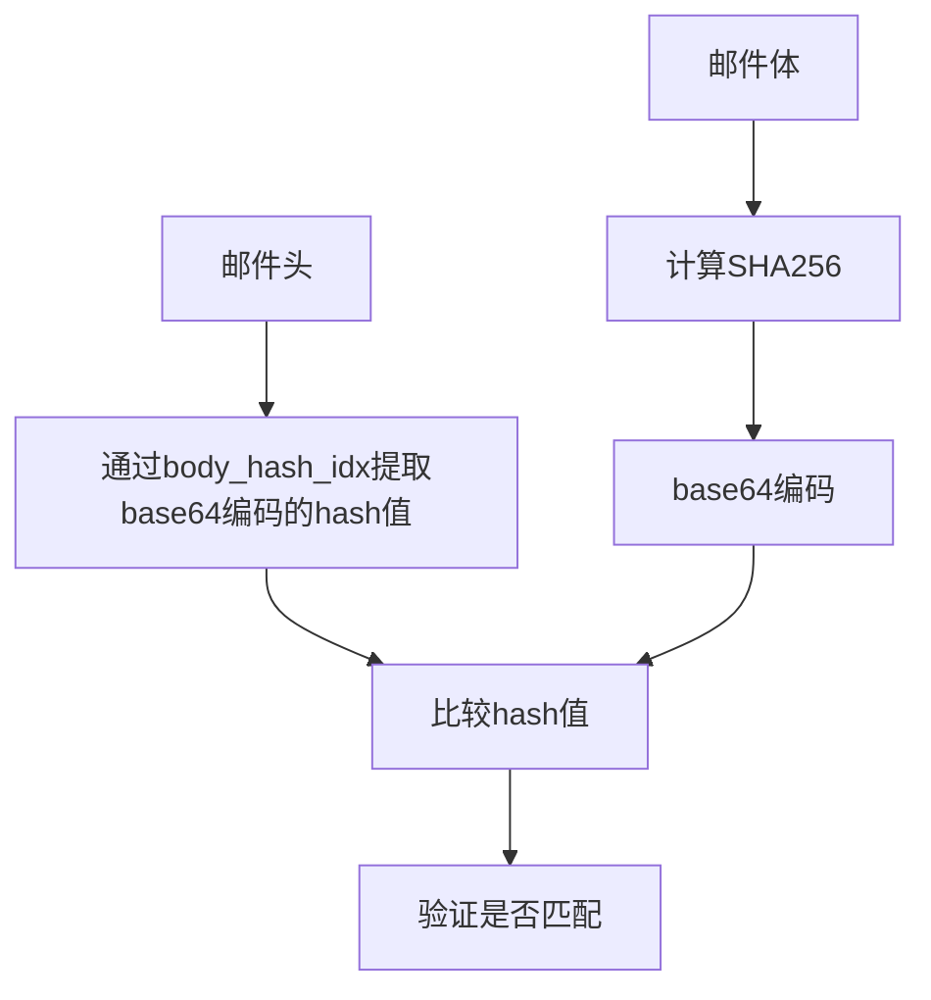
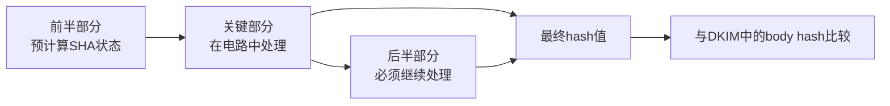
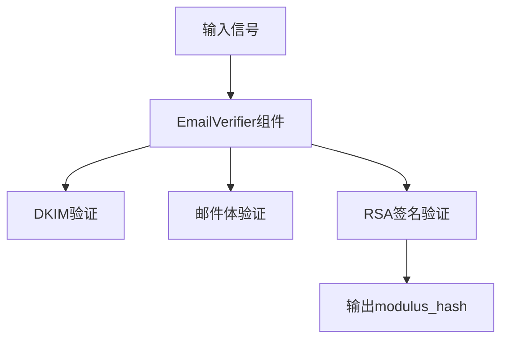
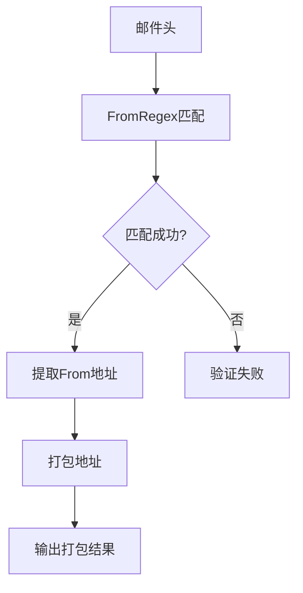
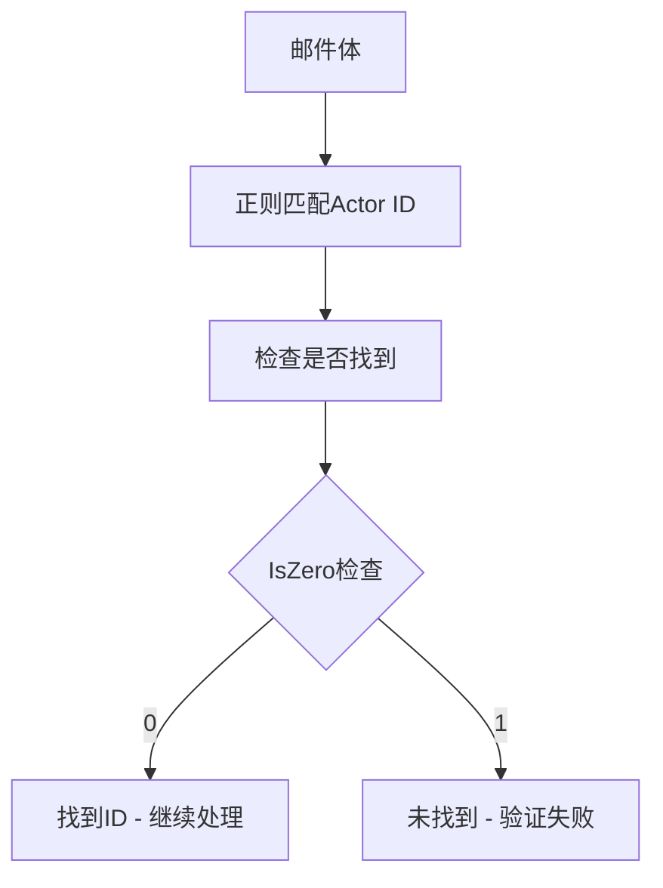

## Venmo V2

### 合约

#### 基础数据结构

首先来看基础数据结构，各个数据项是如何定义的。

**AccountInfo**

```rust
struct AccountInfo {
        bytes32 venmoIdHash;                // Poseidon hash of account's venmoId
        uint256[] deposits;                 // Array of open account deposits
    }

mapping(address => AccountInfo) internal accounts;

accounts[msg.sender].venmoIdHash = venmoIdHash;
accounts[msg.sender].deposits.push(depositId);
```

Account 实际上是指以太坊地址和 Venmo 账户的绑定关系。每个 AccountInfo 代表一个以太坊地址与 Venmo 账户的关联。可以看到一个accounts只能对应一个`venmoIdHash`，不过可以有多个以太坊地址都指向同一个`venmoIdHash`。然后每个 AccountInfo 最多可以有 5 个活跃的存款。

**Deposit**

```rust
struct Deposit {
	address depositor;                  // Off-ramp的以太坊地址
	uint256[3] packedVenmoId;          // 打包的 Venmo ID
	uint256 depositAmount;              // 存入的 USDC 总量
	uint256 remainingDeposits;          // 剩余可用的 USDC 数量
	uint256 outstandingIntentAmount;    // 当前被锁定在意图中的 USDC 数量
	uint256 conversionRate;             // USDC/USD 的转换率
	bytes32[] intentHashes;             // 所有未完成意图的哈希值数组
}
```

举一个例子来看Deposit数据变化情况，假设 Alice 想要出售 1000 USDC，期望获得 1010 USD（Venmo）。

字段的动态变化：

- 当 Bob 发起购买 500 USDC 的意图时：

```
remainingDeposits: 1000 -> 500
outstandingIntentAmount: 0 -> 500
intentHashes: [] -> [bobIntentHash]
```

- 如果 Bob 的意图过期并被清除：

```
remainingDeposits: 500 -> 1000
outstandingIntentAmount: 500 -> 0
intentHashes: [bobIntentHash] -> []
```

- 如果 Bob 成功完成交易：

```
remainingDeposits: 500（不变）
outstandingIntentAmount: 500 -> 0
intentHashes: [bobIntentHash] -> []
```

重要概念：
1. depositAmount 永远不变，表示最初存入的金额
2. remainingDeposits + outstandingIntentAmount 总是小于等于 depositAmount
3. conversionRate 决定了买方需要通过 Venmo 支付多少美元
4. 每个意图都会锁定一定数量的 USDC，直到意图完成或过期

至于`packedVenmoId`字段为什么用一个长度为3的数组存储而不是用一个uint256存储是因为hash的输入是一个数组形式，是因为Venmo Id一共有19个数据，后续需要算Poseidon hash，如果把这个Venmo Id直接转换成有限域数值，会超出circom 限制，所以要先拆成3个小块，之后再转换。        

```ts
interface IPoseidon {
    function poseidon(uint256[3] memory _a) external pure returns(uint256);
}
```

**DepositWithAvailableLiquidity**

```rust
struct DepositWithAvailableLiquidity {
	uint256 depositId;                  // ID of the deposit
	bytes32 depositorIdHash;            // Depositor's venmoIdHash 
	Deposit deposit;                    // Deposit struct
	uint256 availableLiquidity;         // Amount of liquidity available to signal intents (net of expired intents)
}
```

这个结构实际上是一个辅助结构，主要用于查询和展示目的。它把一个 Deposit 的核心信息和当前可用流动性打包在一起。

让我们通过一个例子来理解：
- 假设有一个存款：
- 总存款额(depositAmount) = 1000 USDC
- 剩余存款(remainingDeposits) = 400 USDC
- 未完成意图金额(outstandingIntentAmount) = 500 USDC
- 其中有一个过期的意图锁定了 300 USDC
那么这个 DepositWithAvailableLiquidity 会是：

```js
{
    depositId: 1,
    depositorIdHash: "0x...",  // 存款人的 venmoIdHash
    deposit: {
        depositor: "0x...",
        packedVenmoId: [...],
        depositAmount: 1000,
        remainingDeposits: 400,
        outstandingIntentAmount: 500,
        conversionRate: ...,
        intentHashes: [...]
    },
    availableLiquidity: 700    // 400 (remainingDeposits) + 300 (expired intent)
}
```

**Intent**

```rust
struct Intent {
	address onRamper;                   // On-ramper's address
	address to;                         // Address to forward funds to (can be same as onRamper)
	uint256 deposit;                    // ID of the deposit the intent is signaling on（seller）
	uint256 amount;                     // Amount of USDC the on-ramper signals intent for on-chain
	uint256 intentTimestamp;            // Timestamp of when the intent was signaled
}
```

Intent 代表了买方(on-ramper)想要购买 USDC 的意向。`onRamper`字段表示买方的以太坊地址，用于验证和权限控制，例如：只有 onRamper 可以取消自己的 intent。`deposit`表示目标存款的 ID，方便链接到特定的 Deposit 结构。`intentTimestamp`是intent 创建的时间戳，用于判断 intent 是否过期，过期计算：intentTimestamp + intentExpirationPeriod < 当前时间。

一个用户同时只能有一个活跃的 intent，这个限制是基于 venmoId 的，而不是以太坊地址。这个限制的设计来自如下结构：

```rust
struct GlobalAccountInfo {
	bytes32 currentIntentHash;          // Hash of the current open intent (if exists)
	uint256 lastOnrampTimestamp;        // Timestamp of the last on-ramp transaction used to check if cooldown period elapsed
	DenyList denyList;                  // Deny list of the account
}

mapping(bytes32 => GlobalAccountInfo) internal globalAccount;   // Mapping of venmoIdHash to information used to enforce actions across Ethereum accounts
```


#### Registration

首先是注册函数，买方和卖方都需要registration：

```js
 *
 * @param _a        Parameter of zk proof
 * @param _b        Parameter of zk proof
 * @param _c        Parameter of zk proof
 * @param _signals  Encoded public signals of the zk proof, contains mailserverHash, fromEmail, userIdHash
 */
function register(
	uint[2] memory _a,
	uint[2][2] memory _b,
	uint[2] memory _c,
	uint[5] memory _signals
)
	external
{
	require(getAccountVenmoIdHash(msg.sender) == bytes32(0), "Account already associated with venmoId");
	bytes32 venmoIdHash = _verifyRegistrationProof(_a, _b, _c, _signals);

	accounts[msg.sender].venmoIdHash = venmoIdHash;

	emit AccountRegistered(msg.sender, venmoIdHash);
}
```

可以看到注册过程就是建立 AccountInfo 过程。注册流程的主要步骤：

1. 用户提供 ZK 证明，证明他们拥有某个 Venmo 账户
2. 合约验证这个证明
3. 如果验证通过，将用户的以太坊地址与 Venmo ID 的哈希值关联起来

看一下`_verifyRegistrationProof`函数如何构造

```js
function _verifyRegistrationProof(
	uint256[2] memory _a,
	uint256[2][2] memory _b,
	uint256[2] memory _c,
	uint256[5] memory _signals
)
	internal
	returns(bytes32)
{
	bytes32 venmoIdHash = registrationProcessor.processProof(
		IRegistrationProcessorV2.RegistrationProof({
			a: _a,
			b: _b,
			c: _c,
			signals: _signals
		})
	);

	return venmoIdHash;
}

IRegistrationProcessorV2 public registrationProcessor; // Address of registration processor contract, verifies registration e-mails
import { IRegistrationProcessorV2 } from "./interfaces/IRegistrationProcessorV2.sol";
```

可以看到具体的proof非常简单，是调用一个接口，说明实现不在venom里面，这样设计是一种解耦，venom合约里面就专注于该合约本身的事情，证明逻辑放在其他地方。

来看一下引入的这个接口代码

```ts
interface IRegistrationProcessorV2 {

    struct RegistrationProof {
        uint[2] memory a,         // 证明的 α 点
        uint[2][2] memory b,      // 证明的 β 点
        uint[2] memory c,         // 证明的 γ 点
        uint[5] memory signals    // 公开输入信号
    }

    function processProof(
        RegistrationProof calldata _proof
    )
        external
    returns (bytes32);
}
```

`RegistrationProof`数据结构传入的前3个参数都是 Groth16 算法本身产生的一些验证参数，signals 是公开输入，包含了可以公开验证的信息。在这个具体的实现中，signals 包含了以下信息：

```js
signals[0]: mailserverKeyHash     // Venmo 邮件服务器的公钥哈希
signals[1:4]: fromEmail          // 打包的邮件地址（用了3个uint256存储）
signals[4]: userIdHash           // Venmo 用户 ID 的哈希值
```

接下来看一下具体的proof函数是如何编写的

```js
function processProof(
	IRegistrationProcessorV2.RegistrationProof calldata _proof
)
	public
	override
	onlyRamp
	returns(bytes32 userIdHash)
{
	require(this.verifyProof(_proof.a, _proof.b, _proof.c, _proof.signals), "Invalid Proof"); // checks effects iteractions, this should come first

	require(isMailServerKeyHash(bytes32(_proof.signals[0])), "Invalid mailserver key hash");

	// Signals [1:4] are the packed from email address
	string memory fromEmail = _parseSignalArray(_proof.signals, 1, 4);
	require(keccak256(abi.encodePacked(fromEmail)) == keccak256(emailFromAddress), "Invalid email from address");

	_validateAndAddNullifier(keccak256(abi.encode(_proof)));

	// Signals [4] is the packed onRamperIdHash
	userIdHash = bytes32(_proof.signals[4]);
}
```

该函数的作用如下：

```
链下：
1. 用户收到 Venmo 邮件
2. 使用 ZK 电路生成证明（a, b, c）
3. 准备公开输入（signals）

链上：
1. 调用 verifyProof 验证证明
2. 验证邮件服务器密钥
3. 验证邮件地址
4. 提取用户 ID
```

为什么电路验证完合约还要验证？在于proof可能是假的proof，然后输入的public数据也是假的，联合起来一起欺骗验证电路就可以通过验证，所以需要合约再验证一下输入的public信息是否是真的。

`this.verifyProof`函数使用的是继承自`Groth16Verifier`函数的方法，该方法是由snarkjs生成的，我们不需要去管。

继续向后看`_parseSignalArray()`函数，

```js
import { StringUtils } from "@zk-email/contracts/utils/StringUtils.sol";
using StringUtils for uint256[];

function _parseSignalArray(uint256[5] calldata _signals, uint8 _from, uint8 _to) internal pure returns (string memory) {
	uint256[] memory signalArray = new uint256[](_to - _from);
	for (uint256 i = _from; i < _to; i++) {
		signalArray[i - _from] = _signals[i];
	}

	return signalArray.convertPackedBytesToString(signalArray.length * PACK_SIZE, PACK_SIZE);
}
```

回到`_parseSignalArray()`函数，这个函数的主要目的是从 ZK 电路输出的信号中提取和解码特定的字符串数据（在这个场景中是邮件地址）。每个信号包含了 7 个字节的打包数据，需要被解包并转换为可读的字符串。

假设邮件地址是 "test@example.com"，这个字符串会被分成每 7 个字节一组进行打包，每组被打包成一个 uint256 数字存储在信号数组中，`convertPackedBytesToString` 负责将这些打包的数字重新转换回原始字符串。

`emailFromAddress`字段数据来自BaseProcessorV2 的构造函数，并且可以通过 setEmailFromAddress 函数更新

```js
emailFromAddress = bytes(_emailFromAddress);

function setMailserverKeyHashAdapter(IKeyHashAdapter _mailserverKeyHashAdapter) external onlyOwner {
	mailserverKeyHashAdapter = _mailserverKeyHashAdapter;
}
```

这个邮件地址实际上是 Venmo 的官方通知邮件地址，用于验证邮件确实来自 Venmo。当处理证明时，会验证邮件的发送者是否匹配这个地址。

`_validateAndAddNullifier`函数的作用是确保一个证明只能使用一次，当使用过后，就把proof的hash值放进`_nullifier` mapping里面

```js
mapping(bytes32 => bool) public isNullified;

function _validateAndAddNullifier(bytes32 _nullifier) internal {
    // 检查这个 nullifier 是否已经被使用过
    require(!nullifierRegistry.isNullified(_nullifier), "Nullifier has already been used");
    // 如果没有被使用过，将其标记为已使用
    nullifierRegistry.addNullifier(_nullifier);
}
```

#### Off-ramp

off-ramp是指用户想要将链上的USDC转换为链下的美元。举一个例子来看看Off-ramp函数，

```js
IERC20 public immutable usdc;

function offRamp(
	uint256[3] memory _packedVenmoId,
	uint256 _depositAmount,
	uint256 _receiveAmount
)
	external
	onlyRegisteredUser
{
	bytes32 venmoIdHash = bytes32(poseidon.poseidon(_packedVenmoId));

	require(getAccountVenmoIdHash(msg.sender) == venmoIdHash, "Sender must be the account owner");
	require(accounts[msg.sender].deposits.length < MAX_DEPOSITS, "Maximum deposit amount reached");
	require(_depositAmount >= minDepositAmount, "Deposit amount must be greater than min deposit amount");
	require(_receiveAmount > 0, "Receive amount must be greater than 0");

	uint256 conversionRate = (_depositAmount * PRECISE_UNIT) / _receiveAmount;
	uint256 depositId = depositCounter++;

	accounts[msg.sender].deposits.push(depositId);

	deposits[depositId] = Deposit({
		depositor: msg.sender,
		packedVenmoId: _packedVenmoId,
		depositAmount: _depositAmount,      // 1000 USDC
		remainingDeposits: _depositAmount,  // 初始时等于 depositAmount
		outstandingIntentAmount: 0,         // 初始时为 0
		conversionRate: conversionRate,     // (1000 * 1e18) / 1010
		intentHashes: new bytes32[](0)      // 初始时为空数组
	});
	usdc.transferFrom(msg.sender, address(this), _depositAmount);

	emit DepositReceived(depositId, venmoIdHash, _depositAmount, conversionRate);
```

数据变更示例已经在之前的Deposit部分有过分析，`onlyRegisteredUser`保证只有register才能使用off ramp。

```js
userIdHash = bytes32(_proof.signals[4]);

bytes32 venmoIdHash = bytes32(poseidon.poseidon(_packedVenmoId));
require(getAccountVenmoIdHash(msg.sender) == venmoIdHash, "Sender must be the account owner");
```


#### On-ramp

想要on ramp的用户首先需要做 signalIntent 表明想要 on-ramp 的意图

```js
function signalIntent(uint256 _depositId, uint256 _amount, address _to) external onlyRegisteredUser {
	bytes32 venmoIdHash = getAccountVenmoIdHash(msg.sender);
	Deposit storage deposit = deposits[_depositId];
	bytes32 depositorVenmoIdHash = getAccountVenmoIdHash(deposit.depositor);

	...

	bytes32 intentHash = _calculateIntentHash(venmoIdHash, _depositId);

	if (deposit.remainingDeposits < _amount) {
		(
			bytes32[] memory prunableIntents,
			uint256 reclaimableAmount
		) = _getPrunableIntents(_depositId);

		require(deposit.remainingDeposits + reclaimableAmount >= _amount, "Not enough liquidity");

		_pruneIntents(deposit, prunableIntents);
		deposit.remainingDeposits += reclaimableAmount;
		deposit.outstandingIntentAmount -= reclaimableAmount;
	}

	intents[intentHash] = Intent({
		onRamper: msg.sender,
		to: _to,
		deposit: _depositId,
		amount: _amount,
		intentTimestamp: block.timestamp
	});

	globalAccount[venmoIdHash].currentIntentHash = intentHash;

	deposit.remainingDeposits -= _amount;
	deposit.outstandingIntentAmount += _amount;
	deposit.intentHashes.push(intentHash);

	emit IntentSignaled(intentHash, _depositId, venmoIdHash, _to, _amount, block.timestamp);
}
```

看一下`_calculateIntentHash`函数

```js
function _calculateIntentHash(
	bytes32 _venmoId,
	uint256 _depositId
)
	internal
	view
	virtual
	returns (bytes32 intentHash)
{
	// Mod with circom prime field to make sure it fits in a 254-bit field
	uint256 intermediateHash = uint256(keccak256(abi.encodePacked(_venmoId, _depositId, block.timestamp)));
	intentHash = bytes32(intermediateHash % CIRCOM_PRIME_FIELD);
}
```

该函数的作用就是想要on ramp的用户的venmo id和和一些信息计算出来`intentHash`。

继续往后看代码，注意到`_getPrunableIntents`和`_pruneIntents`，看来如果deposit的资金量不够，去做deposit的过期intent修剪工作是由on ramp来承担。

然后用户需要在链下通过 Venmo 向 off-ramper 发送资金。

完成链下支付后,可以调用 onRamp 函数完成 on-ramp。

```js
// signanal: Encoded public signals of the zk proof, contains mailserverHash, fromEmail, timestamp, onRamperIdHash,

* nullifier, intentHash
function onRamp(
	uint256[2] memory _a,
	uint256[2][2] memory _b,
	uint256[2] memory _c,
	uint256[12] memory _signals
)
	external
{
	(
		Intent memory intent,
		Deposit storage deposit,
		bytes32 intentHash
	) = _verifyOnRampProof(_a, _b, _c, _signals);

	_pruneIntent(deposit, intentHash);

	deposit.outstandingIntentAmount -= intent.amount;
	globalAccount[getAccountVenmoIdHash(intent.onRamper)].lastOnrampTimestamp = block.timestamp;
	_closeDepositIfNecessary(intent.deposit, deposit);

	_transferFunds(intentHash, intent);
}
```

首先来看一下`_verifyOnRampProof`函数，

```js
function _verifyOnRampProof(
	uint256[2] memory _a,
	uint256[2][2] memory _b,
	uint256[2] memory _c,
	uint256[12] memory _signals
)
	internal
	returns(Intent memory, Deposit storage, bytes32)
{
	(
		uint256 amount,
		uint256 timestamp,
		bytes32 offRamperIdHash,
		bytes32 onRamperIdHash,
		bytes32 intentHash
	) = sendProcessor.processProof(
		ISendProcessor.SendProof({
			a: _a,
			b: _b,
			c: _c,
			signals: _signals
		})
	);

	Intent memory intent = intents[intentHash];
	Deposit storage deposit = deposits[intent.deposit];

	require(intent.onRamper != address(0), "Intent does not exist");
	require(intent.intentTimestamp <= timestamp, "Intent was not created before send");
	require(getAccountVenmoIdHash(deposit.depositor) == offRamperIdHash, "Offramper id does not match");
	require(getAccountVenmoIdHash(intent.onRamper) == onRamperIdHash, "Onramper id does not match");
	require(amount >= (intent.amount * PRECISE_UNIT) / deposit.conversionRate, "Payment was not enough");

	return (intent, deposit, intentHash);
}
```

`sendProcessor.processProof`是一个外部实现，具体实现代码位于`venmo-v1/VenmoSendProcessor.sol`。进入到这个代码里面去看看，可以发现这里面首先做了Groth16的验证工作，以及其他验证工作，然后把on ramp和off ramp的venmo id以及其他数据返回。

回到`_verifyOnRampProof`函数，deposit的venmo id需要和off ramp id一样，intent venmo id需要和上链 off ramp id一样。

回到`onRamp()`函数，随后是对intent做一些修剪工作。deposit被锁定金额做一些修改。更新globalAccount信息表示该venmo id在一段时间之内不能做其他操作了。

全部处理完之后做资金转移`_transferFunds`。

### 电路

主电路是下面两个，这其中又涉及到很多辅助分支电路，接下来以主电路为核心做展开分析。电路代码位于`circuits/venmo/venmo_registration.circom`以及该路径下的其他文件。

#### Registration 测试代码

这次通过测试代码来学习电路，测试代码位于`circuits/venmo/test/venmo_registration.spec.ts`

`it("Should return the correct modulus hash", async () => {`

这个测试用例,它验证了电路计算的modulus hash是否正确。modulus是指DKIM(DomainKeys Identified Mail)验证中的RSA公钥模数。

[DKIM](https://www.youtube.com/watch?v=IBhO0akhMlQ&ab_channel=PowerDMARC)是一种电子邮件认证方法，它允许组织对发送的电子邮件进行数字签名。每个签名包含：

- RSA公钥(通常存储在DNS记录中)
- 使用相应私钥创建的签名

在RSA签名算法具体流程是：

$$
\begin{align*}
& \text{1) 选择两个大素数 } p \text{ 和 } q \\
& \text{2) 计算模数 } n = p \times q \\
& \text{3) 计算欧拉函数 } \phi(n) = (p-1) \times (q-1) \\
& \text{4) 选择公钥 } e\text{，满足 } 1 < e < \phi(n) \text{ 且 } \gcd(e, \phi(n)) = 1 \\
& \text{5) 计算私钥 } d\text{，满足 } d \times e \equiv 1 \pmod{\phi(n)}
\end{align*}
$$


签名过程为

$$
\begin{align*}
& \text{1) 计算消息哈希：} h = \text{Hash}(m) \\
& \text{2) 计算签名：} s = h^d \bmod n
\end{align*}
$$

签名验证流程为

$$
\begin{align*}
& \text{1) 验证计算：} h' = s^e \bmod n \\
& \text{2) 计算消息哈希：} h = \text{Hash}(m) \\
& \text{3) 验证：若 } h' = h \text{，则签名有效}
\end{align*}
$$

RSA签名中，mod n和public key都是公开是值，而且这个mod n不是一个钉死的值，是可以随着public key一起变的，但是每次签名的时候都要用一个生成的固定的n。RSA公钥由两部分组成:

- modulus (n): 两个大素数p和q的乘积
- public exponent (e): 通常是65537

在这些测试中,我们可以看到modulus的处理过程:

```ts
const poseidon = await buildPoseidon();
const modulus = chunkedBytesToBigInt(input["modulus"], 121);
const pubkeyChunked = bigIntToChunkedBytes(modulus, 242, 9);
const expected_hash = poseidon(pubkeyChunked);
```

这段代码显示:

- modulus被分成121字节的块
- 然后转换成9个242位的块
- 最后计算这些块的Poseidon哈希值

```js
const modulus_hash = witness[1];
assert.equal(JSON.stringify(mimcSponge.F.e(modulus_hash)), JSON.stringify(expected_hash), true);
```

这里不是用mimcSponge来计算hash，而是`mimcSponge.F.e()` 这个函数是将数字转换为MiMC使用的有限域表示，`witness[1]` 和 expected_hash 可能有不同的数字表示形式，通过将它们都转换到相同的有限域表示，我们可以正确比较它们的值。

`it("Should return the correct packed from email", async () => {`

该测试的作用是验证电路是否正确提取和打包了发件人邮箱地址。邮件发件人格式通常是`from:<venmo@venmo.com>`，我们期望从json中在固定位置能够提取出来`venmo@venmo.com`信息，并且和witness对应的数据是一样的。

```js
const packed_from_email = witness.slice(2, 5);
```

从`witness[2]`到`witness[4]`获取电路计算的打包邮箱地址。注释说明这是因为15/7≈3,所以需要3个witness值来存储（字符串要先转成ASCII码，之后转成数值，如果数据太大就超过有限域范围了，所以要做分割）。

`from_email_array`最终会得到`venmo@venmo.com`，`venmo@venmo.com`字符串总长度是15，我们按照尺寸7对这个15做一下划分，一共会分成3块。这样最后一个数据划分之后就只有一个值，不够7，所以就在后面补0，`chunkArray()`就是计算得到划分数组。

随后比较每个划分是否相同

```js
export function bytesToPacked(arr) {
    // Convert into bigint from string
    let arrInt = arr.map(BigInt);
    let n = arrInt.length;
    let out = BigInt(0);
    for (let k = 0; k < n; k++) {
        out += arrInt[k] * BigInt(2 ** (8 * k));  // little endian
    }
    return out;
}

chunkedArrays.map((arr, i) => {
	// Pack each chunk
	let expectedValue = bytesToPacked(arr);

	// Check packed email is the same
	assert.equal(expectedValue, packed_from_email[i], true);
});
```

可以看到`bytesToPacked()`实际上是对上述拆分的3个数组里面的每一个字符按照小端序拼接成一个数字，举个例子假设我们有字符串 "ab":

```
'a' = 97  = 01100001
'b' = 98  = 01100010
打包结果 = 98 * 2⁸ + 97 = 25185
```

为什么在电路里面比较的是数字而不是ascii值？因为ZK电路中的每个操作都会产生约束，如果直接比较ASCII码，对于n个字符就需要n次比较，每次比较都会产生约束，增加证明的大小和验证时间。所以比较数字会减小计算开销。另外一个问题是比较数字是否是安全的，也就是说是否会有另外一个字符串也能算出来相同的数字？答案是不可能的，上述例子通过一个指数计算方式保证'a' (ASCII 97) 会被放在 0-7 位，'b' (ASCII 98) 会被放在 8-15 位，以此类推。字符通过幂指运算固定下来，不可能存在不同的字符串可以算相同的结果。所以比较数字是安全的。

通过上述的计算和比较确保`packed_from_email`里面的内容确实是`venmo@venmo.com`。

`it("Should return the correct hashed actor id", async () => {`

这个测试验证电路是否正确计算了actor_id的哈希值。

```js
poseidonContract = await C6.deploy();
```

首先设置了Poseidon合约，这部分代码在本地网络上部署了Poseidon哈希函数的智能合约。

actor_id 是 Venmo 邮件中的一个用户标识符，应该就是Venmo id。

```js
const actor_id_selector = Buffer.from('&actor_id=3D');
```

`Buffer.from()` 不是从缓冲区获取数据，而是创建一个新的 Buffer 对象。在 Node.js 中，Buffer 类是用来处理二进制数据的。这里 Buffer.from() 的作用是：

1. 将字符串 '&actor_id=3D' 转换成字节数组
2. 这样就可以在二进制层面处理这个字符串
3. 主要用于在邮件正文中进行二进制匹配

为什么要用 Buffer？

1. 邮件数据是以二进制形式存储的
2. 特别是在处理编码问题时（如 3D 是 Base64 编码的 = 符号）
3. Buffer 提供了更好的二进制数据处理能力

举个例子：

```js
// 字符串方式
"&actor_id=3D" 

// Buffer方式（十进制ASCII码）
[38, 97, 99, 116, 111, 114, 95, 105, 100, 61, 51, 68]
```

这在后面的代码中用于查找位置：

```js
const venmo_actor_id_start_idx = (Buffer.from(input['in_body_padded']).indexOf(actor_id_selector) + actor_id_selector.length);
const venmo_actor_id_end_idx = (Buffer.from(input['in_body_padded']).indexOf(Buffer.from('"', 'ascii'), venmo_actor_id_start_idx));
```

这两行代码使用 Buffer 在邮件正文中精确定位 actor_id 的起始和结束位置。使用 Buffer 可以确保在处理各种编码的邮件时都能正确工作。

深入看一下这个具体设计构造，这两行代码在做字符串匹配，但使用 Buffer 是为了处理二进制数据。

```js
Buffer.from(input['in_body_padded'])  // 将邮件正文转换为二进制buffer
    .indexOf(actor_id_selector)       // 查找 "&actor_id=3D" 的位置
    + actor_id_selector.length        // 跳过这个标识符本身

Buffer.from(input['in_body_padded'])           // 同样转换为buffer
    .indexOf(                                  // 查找位置
        Buffer.from('"', 'ascii'),            // 查找引号字符
        venmo_actor_id_start_idx              // 从起始位置开始查找
    )
```

最终得到的`actor_id_array`是长度为21的字符串，然后同样的`chunkArray()`对其进行划分。看起来很奇怪，为什么要写成`"&actor_id=3D"` 这样的形式？这里的 "=3D" 在邮件传输过程中实际上代表了 "=" 符号。这是因为：

1. 邮件协议历史上只支持 7-bit ASCII
2. 为了安全传输特殊字符，使用 Quoted-Printable 编码

3. 编码规则：
	- "=" 符号被编码为 "=3D"
	- 其他特殊字符也有类似编码（如空格可能被编码为 "=20"）

所以当我们在代码中写：

```js
const actor_id_selector = Buffer.from('&actor_id=3D');
```

我们是在寻找邮件中的 "&actor_id=" 这个字符串，但由于邮件编码的原因，我们需要查找 "&actor_id=3D"。

这就是为什么我们使用 Buffer 来处理这些数据，因为它能正确处理这种编码情况，而不是简单的字符串匹配。

接下来同样的，对得到的数据转换成数字形式，然后计算Poseidon hash结果。

```js
const expected_hash_contract = await poseidonContract["poseidon(uint256[3])"](packed_actor_id);
```

最后的验证操作进行了两个验证：

1. 验证电路输出的哈希值与本地 JS 计算的哈希值相同
2. 验证电路输出的哈希值与智能合约计算的哈希值相同

为什么需要这样的双重验证？

1.  一致性验证：
	- 确保在不同环境（JS、智能合约、ZK 电路）中 Poseidon 哈希的实现是一致的

2. 安全性保证：
	- 本地 JS 验证提供了快速的测试反馈
	- 合约验证确保了链上验证的正确性

3. 互操作性：
	- 在实际应用中，这些哈希值需要在链上和链下环境中保持一致
	- 比如用户在前端生成的哈希值必须能被智能合约正确验证

```js
assert.equal(JSON.stringify(poseidon.F.e(hashed_actor_id)), JSON.stringify(expected_hash), true);
assert.equal(JSON.stringify(poseidon.F.e(hashed_actor_id)), JSON.stringify(poseidon.F.e(expected_hash_contract.toString())), true);
```

#### Registration 电路代码

电路代码位于`circuits/venmo/venmo_registration.circom`，接下来开始学习电路内容。

```c
template VenmoRegistration(max_header_bytes, max_body_bytes, n, k, pack_size) 
```

max_header_bytes: 邮件头部最大字节数(768)，max_body_bytes: 邮件体最大字节数(6912)，n: RSA模数每个块的位数(121)，k: RSA模数的块数(17)，pack_size: 信号打包大小(7)。

这里的 n 和 k 参数与RSA加密系统的公钥处理有关：

1. 为什么需要分块?
	- RSA公钥通常是很大的数字(1024位或2048位)
	- Circom中的信号(signal)有位数限制,通常不能直接处理这么大的数字
	- 因此需要将大数字分成多个小块来处理
2. 参数选择
	- n * k = 121 * 17 = 2057 > 2048: 确保能处理2048位的RSA密钥
3. 选择n=121的原因
	- Circom中信号通常用254位有限域
	- 121位是在保证安全性的同时,能在254位字段中安全进行算术运算的合适大小

继续向后看代码，`ceil()`函数的作用是数字向上取整，比如说

```js
var max_email_from_len = ceil(21, pack_size);
```

假如`pack_size`是7，最终得到的`max_email_from_len`长度是21。

接着继续向后看，先补充一点相关的操作和语法

```js
signal input in_padded[max_header_bytes];
```

在Circom中，`in_padded[max_header_bytes]` 是声明一个长度为 `max_header_bytes` 的信号数组，而不是取数组中的某个元素。所以这里不是拿一个元素而是要整个数组。

另外一个问题是这个输入到底从哪里来？在circom中只是定义了signal作为电路的输入，但是这个输入到底是从哪里来？

实际的signal输入是在外部定义的，具体在`circuits/package/generate_input.ts`

```js
// JavaScript/TypeScript中
const circuitInputs = {
    in_padded: [...],           // 必须与circom中的signal名称完全匹配
    modulus: [...],             // 必须匹配
    signature: [...],           // 必须匹配
    in_len_padded_bytes: 123    // 必须匹配
};
```

名字命名必须要和circom中对应的代码名称完全匹配才行，这是snarkjs库用来映射输入的依据。

```c
// Circom中
template VenmoRegistration(...) {
    signal input in_padded[max_header_bytes];     // 名称必须匹配
    signal input modulus[k];                      // 名称必须匹配
    signal input signature[k];                    // 名称必须匹配
    signal input in_len_padded_bytes;            // 名称必须匹配
}
```

`in_padded[max_header_bytes]`实际上可以看成是一个数组长度的检查，具体实际把js输入和电路串联起来的代码是这样的

```js
it("Should generate witnesses", async () => {
    // 加载预处理的输入数据
    const venmo_path = path.join(__dirname, "../inputs/input_venmo_registration.json");
    const jsonString = fs.readFileSync(venmo_path, "utf8");
    const input = JSON.parse(jsonString);
    
    // 使用输入数据计算witness
    const witness = await cir.calculateWitness(
        input,
        true
    );
```

这也是之前分析过的代码构造，整个数据处理流程大概是这样的：



另外一个问题是为什么要用signal传数据，用传参的方式不行吗？答案是这两个有比较大的区别，参数的最大特点是不参与约束系统，所以也不能用于证明。但是signal是实际参与整个约束系统的，如

```c
template Multiply() {
    signal input a;
    signal input b;
    signal output c;

    c <== a * b;  // 创建约束：c必须等于a*b
}
```

参数更像是电路的"配置"，而信号是电路的"数据"。这就是为什么我们使用signal而不是参数来处理实际的输入输出数据。

接下来逐个看看这些电路的输入内容都是做什么的。

```js
signal input in_padded[max_header_bytes]; // prehashed email data
```

这是邮件头部数据,包含：

- 原始邮件头数据
- SHA256需要的填充(512 + 64字节)
- 额外的0填充

数据结构示意：

```
[原始邮件头][SHA256填充][额外0填充]
|<- 实际数据 ->|<- 512+64 ->|<- 剩余填充 ->|
```

```js
signal input modulus[k]; // rsa pubkey
```

这是RSA公钥的模数：

- 被分成k(17)个块
- 每个块n(121)位
- 用于DKIM签名验证

```js
signal input signature[k]; // rsa signature
```

这是RSA签名：

- 同样分成k(17)个块
- 每块n(121)位
- 是邮件的DKIM签名
- 用于验证邮件真实性

```js
signal input in_len_padded_bytes; // length of in email data including padding
```

这是填充后的总长度：

- 包含原始邮件数据长度
- 包含SHA256填充长度
- 用于SHA256块长度计算

一个可能的数据处理流程大概是这样的

```js
// 1. 准备邮件数据
const emailData = fs.readFileSync('venmo_email.eml');
const headerData = extractHeader(emailData);

// 2. SHA256填充
const paddedHeader = addSHA256Padding(headerData);

// 3. RSA公钥处理
const publicKey = getRSAPublicKey();
const modulusChunks = splitIntoChunks(publicKey, k, n);

// 4. RSA签名处理
const signature = getDKIMSignature(emailData);
const signatureChunks = splitIntoChunks(signature, k, n);

// 5. 创建电路输入
const circuitInputs = {
    in_padded: paddedHeader,
    modulus: modulusChunks,
    signature: signatureChunks,
    in_len_padded_bytes: paddedHeader.length
};
```

实际处理由zk-Email的package来实现，具体代码在`circuits-circom/package/generate_inputs.ts`

```ts
import { dkimVerify } from "@zk-email/helpers/dist/dkim";

console.log("DKIM verification starting");
result = await dkimVerify(processed_email);
// console.log("From:", result.headerFrom);
console.log("Results:", result.results[0]);
if (!result.results[0]) {
throw new Error(`No result found on dkim output ${result}`);
} else {
if (!result.results[0].publicKey) {
  if (result.results[0].status.message) {
	throw new Error(result.results[0].status.message);
  } else {
	throw new Error(`No public key found on generate_inputs result ${JSON.stringify(result)}`);
  }
}
}
const _ = result.results[0].publicKey.toString();
console.log("DKIM verification successful");

let sig = BigInt("0x" + Buffer.from(result.results[0].signature, "base64").toString("hex"));
let message = result.results[0].status.signature_header;
let body = result.results[0].body;
let body_hash = result.results[0].bodyHash;

let pubkey = result.results[0].publicKey;
const pubKeyData = pki.publicKeyFromPem(pubkey.toString());
// const pubKeyData = CryptoJS.parseKey(pubkey.toString(), 'pem');
let modulus = BigInt(pubKeyData.n.toString());
let fin_result = await getCircuitInputs(sig, modulus, message, body, body_hash, intent_hash, type);
return fin_result.circuitInputs;
```

直接就可以把raw-email的数据处理，得到比较规整的数据用于circom的zk证明生成。

```js
signal input body_hash_idx;  // Base64 body hash的索引位置
```

这是用来指示在邮件头中Base64编码的body hash的位置。

- 在DKIM验证中用于定位body hash
- 帮助验证邮件体的完整性

在DKIM签名的邮件中，邮件头部包含了一个 bh= 字段，这个字段存储了邮件体的Base64编码哈希值。body_hash_idx 就是用来指示这个哈希值在邮件头中的位置。

实际邮件示例

```
DKIM-Signature: v=1; a=rsa-sha256; c=relaxed/relaxed; d=venmo.com;
    s=s1; t=1634567890;
    bh=47DEQpj8HBSa+/TImW+5JCeuQeRkm5NMpJWZG3hSuFU=;  <-- 这是body hash
    h=From:To:Subject:Date;
    b=A8d4K...
```

一个定位index的代码示例：

```js
function processEmail(emailData: string) {
    // 1. 查找body hash的位置
    const bodyHashMatch = emailData.match(/bh=([^;]*)/);
    const bodyHashIndex = bodyHashMatch.index + 3; // "bh="后的位置
    
    return {
        body_hash_idx: bodyHashIndex,
        // ... 其他输入
    };
}
```

这个字段数据的作用是我们会通过body_hash_idx提取一个hash值，这个hash值是邮件体用base64编码之后再hash之后得到的具体数值。然后同时我们还有邮件的body本身，我们会在电路里面对这个body数据自己做一下hash计算，同样处理之后比较两个hash值是否一致来判断邮件正文是否被篡改。后面我们会看到`in_body_padded[max_body_bytes]`就是邮件体正文的实际数据。



```js
signal input precomputed_sha[32];  // Merkle-Damgard状态
```

这是一个优化设计：

- SHA256是基于Merkle-Damgard构造的
- 存储了SHA计算到第一个正则匹配位置的中间状态
- 32个元素对应SHA256的中间状态
- 通过预计算来节省电路约束

工作原理：

```
原始邮件体: [前半部分][需要验证的部分][后半部分]
                ↓
预计算SHA状态: precomputed_sha[32] 存储前半部分的SHA状态
                ↓
只需要继续处理: [需要验证的部分]
```

为什么要划分呢？划分的作用是什么？怎么划分？举一个例子来说明一下。

```
You paid John Smith $50.00
October 15, 2023

To: John Smith
Transaction ID: 3994422940193824  <- 这是我们需要提取的Actor ID
Message: Thanks for lunch!

Need to split a purchase with friends? Use Venmo to pay them back instantly.
Download Venmo for iOS or Android

... (更多营销文本和页脚)
```

比如这个是一个可能的 Venmo 邮件，actor id之前的部分可以通过预计算出来hash的方式得到，这样可以一定程度节省整个电路的计算量。




SHA256的hash计算是每处理完一个块，SHA256 会产生一个 256 位(32字节)的中间状态这个状态包含了之前所有块的信息，合并过程是

```
// 假设这是邮件内容的示意
[前半部分(已预计算)][关键部分(需验证)][后半部分]
     ↓                    ↓              ↓
  state1  ----→  state2  ----→  state3  ----→  最终hash
```

一个假设的代码示例可能是这样

```js
// 简化的代码示意
function sha256Update(previousState: bytes32, newBlock: bytes64): bytes32 {
    return compress(previousState, newBlock);
}

// 实际处理流程
let state = precomputed_sha; // 这是前半部分处理后的状态
state = sha256Update(state, importantPart); // 处理关键部分
state = sha256Update(state, remainingPart); // 处理剩余部分
let finalHash = state; // 这就是最终的 hash
```

```js
signal input in_body_padded[max_body_bytes];  // 预计算SHA之后的邮件体部分
```

这是邮件体的后续部分：

- 从第一个正则匹配位置开始
- 包含需要验证的关键信息
- 已经进行了必要的填充（填充规则来自zk-email，直接导入zk-Email提供的`sha256Pad`即可）

数据结构：

```
[实际邮件体数据][填充数据]
|<- 实际数据 ->|<- 填充 ->|
```

```js
signal input in_body_len_padded_bytes;  // 填充后的长度
```

表示 in_body_padded 的实际长度：

- 包含实际数据长度
- 包含填充长度
- 用于SHA256计算

继续向后看，

```js
signal output modulus_hash;
```

和实际的witness（就是之前分析的测试代码）的对应关系是怎么样的？

在Circom中，witness数组的组织方式是：

```js
witness = [
    1,                    // witness[0] 始终是1，表示约束满足
    modulus_hash,         // witness[1] 第一个输出信号
    packed_actor_id_hashed, // witness[2] 第二个输出信号
    // ... 其他中间信号值
]
```

在 venmo_registration.circom 中的输出信号：

```js
template VenmoRegistration(...) {
    signal output modulus_hash;              // witness[1]
    signal output packed_actor_id_hashed;    // witness[2]
}
```

接下来进入 **DKIM VERIFICATION**

分析一下信号输入情况

```js
// 邮件头部数据
EV.in_padded <== in_padded;                          // 填充后的邮件头
EV.in_len_padded_bytes <== in_len_padded_bytes;      // 邮件头长度

// RSA相关数据
EV.pubkey <== modulus;                               // RSA公钥
EV.signature <== signature;                          // RSA签名

// 邮件体相关数据
EV.body_hash_idx <== body_hash_idx;                  // body hash位置
EV.precomputed_sha <== precomputed_sha;              // 预计算的SHA状态
EV.in_body_padded <== in_body_padded;                // 邮件体数据
EV.in_body_len_padded_bytes <== in_body_len_padded_bytes;  // 邮件体长度
```

整个电路计算流程大致是这样




继续向后看，接下来进入 **FROM HEADER REGEX**

这段代码是在处理和验证邮件的 From 头部。

```js
var max_email_from_packed_bytes = count_packed(max_email_from_len, pack_size);
```

这是一个编译时的计算，用于确定需要多少个打包信号，编译时计算就像普通的 JavaScript 计算一样，只是得到一个结果，不会进入电路约束系统。

- var 和函数调用 → 类似普通 JavaScript 计算
- signal 和 component → 生成零知识证明的约束

它用于计算存储发件人地址需要多少个打包信号，确保不超过邮件头的最大长度。

接着声明信号：

```js
signal input email_from_idx;  // From字段在邮件头中的位置
signal output reveal_email_from_packed[max_email_from_packed_bytes]; // 打包后的From邮件值
```

然后去做正则匹配和验证：

```js
signal (from_regex_out, from_regex_reveal[max_header_bytes]) <== FromRegex(max_header_bytes)(in_padded);
from_regex_out === 1;  // 确保正则匹配成功
```

这里FromRegex 组件在邮件头中查找 From 字段返回两个值：

- from_regex_out: 匹配是否成功(1=成功)
- from_regex_reveal: 匹配到的内容的掩码

掩码(mask)在这里是一个二进制数组，用来标记哪些字符是我们想要提取的。让我用一个具体例子来解释：

假设我们有一个邮件头：

```
From: venmo@venmo.com
To: user@example.com
```

当 FromRegex 匹配 "From:" 之后的内容时，会生成这样的掩码：

```
原始文本:  F r o m : v e n m o @ v e n m o . c o m \n T o :
掩码数组:  0 0 0 0 0 1 1 1 1 1 1 1 1 1 1 1 1 1 1 1 1 0 0 0 0
          |--不要--||---------要提取的部分---------||-不要-|
```

其中：

- 1 表示这个位置的字符需要被提取
- 0 表示这个位置的字符需要被忽略


然后打包处理

```js
reveal_email_from_packed <== ShiftAndPackMaskedStr(max_header_bytes, max_email_from_len, pack_size)
    (from_regex_reveal, email_from_idx);
```

这一步使用 email_from_idx 定位到正确位置

- 提取 From 地址
- 将地址打包成更紧凑的格式

这里面有一个比较奇怪的地方是`ShiftAndPackMaskedStr`使用了两个括号，在 Circom 中，这种 ()() 的语法表示先创建模板实例，然后立即调用它。比较完整的写法大概可能是这样：

```js
// 1. 创建组件实例
component packer = ShiftAndPackMaskedStr(max_header_bytes, max_email_from_len, pack_size);

// 2. 连接输入信号
packer.in <== from_regex_reveal;
packer.shift <== email_from_idx;

// 3. 连接输出信号
reveal_email_from_packed <== packer.out;
```

完整流程：



实际处理示例：

```
1. 原始邮件头:
From: venmo@venmo.com
To: ...

2. 正则匹配:
找到: "venmo@venmo.com"

3. 打包处理:
"venmo@venmo.com" -> [packed_bytes1][packed_bytes2][packed_bytes3]
```

这样做的目的是：

- 验证邮件确实来自 venmo@venmo.com
- 以紧凑的方式存储这个信息
- 为后续验证提供必要的数据

继续向后看，**VENMO SEND AMOUNT REGEX**

这段代码是在验证邮件格式，确保这是一个 Venmo 的付款邮件。只能是你向别人付钱，而不能反过来，举例来说

```
有效邮件格式：
"You paid John Smith $50.00"  ✅ 
- amount_regex_out = 1

无效邮件格式：
"John Smith paid you $50.00"  ❌
- amount_regex_out = 0
```

实际代码

```js
// 1. 声明输出信号
signal amount_regex_out;

// 2. 正则匹配
// _ 表示我们不关心匹配到的具体内容（掩码），只关心是否匹配成功
(amount_regex_out, _) <== VenmoSendAmountRegex(max_header_bytes)(in_padded);

// 3. 验证匹配成功
amount_regex_out === 1;  // 必须匹配成功
```

继续向后看，**VENMO EMAIL ACTOR ID REGEX**

这段代码是在提取和验证 Venmo 的 Actor ID（交易ID）。

```js
// 计算存储Actor ID需要多少个打包信号
var max_actor_id_packed_bytes = count_packed(max_actor_id_len, pack_size);

signal input venmo_actor_id_idx;          // Actor ID在邮件体中的位置
signal reveal_actor_packed[max_actor_id_packed_bytes];  // 打包后的Actor ID
```

 这里有一个事情是 reveal_actor_packed 既没有写input 也没有写 output，在 Circom 中，如果一个 signal 没有指定 input 或 output，它就是一个中间信号（intermediate signal）。

signal的三种类型：

```js
// 1. 输入信号
signal input x;           // 从外部输入的值

// 2. 输出信号
signal output y;         // 电路的输出值

// 3. 中间信号
signal z;               // 内部计算过程中的中间值
```

中间信号特点是内部使用：
- 只在电路内部使用
- 不能从外部输入
- 不会作为电路输出

接下来是正则匹配和验证。

```js
// 使用正则表达式匹配Actor ID
signal (actor_id_regex_out, actor_id_regex_reveal[max_body_bytes]) <== VenmoActorIdRegex(max_body_bytes)(in_body_padded);    

// 检查是否找到Actor ID
signal is_found_actor_id <== IsZero()(actor_id_regex_out);
is_found_actor_id === 0;  // 确保找到了Actor ID（IsZero输出为0表示找到）
```

流程说明



实际例子：

```
邮件内容:
"Transaction ID: 3994422940193824"

1. 正则匹配:
- actor_id_regex_out = 1 (找到匹配)
- actor_id_regex_reveal = 掩码标记ID位置

2. IsZero检查:
- is_found_actor_id = 0 (因为找到了ID)
- 验证通过
```

继续向后看，**PACKING**

这行代码是在处理之前匹配到的 Actor ID，将其打包成更紧凑的格式。

```js
reveal_actor_packed <== ShiftAndPackMaskedStr(
    max_body_bytes,          // 输入数组的最大长度
    max_actor_id_len,        // Actor ID的最大长度
    pack_size                // 每组打包的字节数(7)
)(
    actor_id_regex_reveal,   // 包含Actor ID位置的掩码数组
    venmo_actor_id_idx       // Actor ID的起始位置
);
```

具体示例是

```
原始数据:
"Transaction ID: 3994422940193824"

1. 掩码标记:
[0,0,0,0,1,1,1,1,1,1,1,1,1,1,1,1,1,1,1,0,0]
           |--Actor ID部分--|

2. 打包处理:
"3994422940193824" -> [packed1][packed2][packed3]
每个packed信号包含7个字节的数据
```

继续向后看，**HASH ACTOR ID**

这段代码是在对打包后的 Actor ID 进行哈希处理，提供一定程度隐私保护。

```js
// 1. 创建Poseidon哈希组件
component hash = Poseidon(max_actor_id_packed_bytes);  // 参数是输入数量

// 2. 安全检查
assert(max_actor_id_packed_bytes < 16);  // 确保输入数量在安全范围内

// 3. 输入打包数据
for (var i = 0; i < max_actor_id_packed_bytes; i++) {
    hash.inputs[i] <== reveal_actor_packed[i];  // 将每个打包块输入到哈希函数
}

// 4. 输出哈希结果
signal output packed_actor_id_hashed <== hash.out;  // 最终的哈希值
```

一个实际例子：

```
打包数据:
reveal_actor_packed = [packed1, packed2, packed3]

哈希处理:
Poseidon(packed1, packed2, packed3) -> packed_actor_id_hashed

最终输出:
一个单一的哈希值，可以安全地在链上使用
```

全流程的流程图大概如下

```mermaid
graph TD
    subgraph 输入验证
        A[输入邮件数据] --> B[DKIM验证]
        B --> C[验证邮件格式]
        C --> D[验证是付款邮件]
    end

    subgraph From处理
        D --> E[提取From地址]
        E --> F[正则匹配venmo@venmo.com]
        F --> G[打包From地址]
    end

    subgraph ActorID处理
        D --> H[提取ActorID]
        H --> I[正则匹配Transaction ID]
        I --> J[验证ID存在]
        J --> K[打包ActorID]
        K --> L[Poseidon哈希]
    end

    subgraph 验证
        B --> M[验证modulus_hash]
        G --> O[验证packed_email]
        L --> N[验证packed_actor_id_hashed]
    end

    style 输入验证 fill:#f9f,stroke:#333
    style From处理 fill:#bbf,stroke:#333
    style ActorID处理 fill:#bfb,stroke:#333
    style 验证 fill:#fbb,stroke:#333
```


正则表达式部分组件生成 [ZK Regex](https://prove.email/blog/zkregex)

#### Send Circuit

基本主要是一些正则表达式的电路集成，和register部分基本一致。


## Revolut

整个 Revolut交互流程是

1. 账户注册阶段 (AccountRegistrationProcessor & AccountRegistry)

```
用户 -> 注册 Revolut 账户 -> 生成 TLS 证明 -> 验证身份 -> 注册到系统
```

2. 意图声明 (RevolutRamp)

```
用户 -> 声明交易意图 -> 系统生成存款ID
```

3. 支付执行 (RevolutRamp & RevolutSendProcessor)

```
用户 -> 通过 Revolut 发送支付 -> 生成支付证明 -> 提交证明
```

用户通过 Revolut 发送指定金额
- 生成支付完成的 TLS 证明
- 提交证明到链上验证

4. 完成交易 (RevolutRamp)

```
系统 -> 验证支付证明 -> 释放对应的代币
```


### 合约

#### Account Registration Processor

从这个`verifyProof`函数设计上面来看，所有的签名和验证工作都是由一个公正的第三方作为Verifier来去实现签名。

所以整个流程是：

1. 用户提供 Revolut 账户信息
2. verifier 验证信息的真实性
3. verifier 对信息进行签名
4. 用户将签名后的信息提交给合约
5. 合约验证签名是否来自授权的 verifier

这里引入了第三方Verifier来作为实际数据真实性的签名方是因为

1. Revolut 使用 API 调用而不是邮件验证
2. MPC-TLS 需要可信第三方来执行 TLS 握手和验证
3. 用户无法自己生成有效的 API 响应证明

所以这里采用了一个折衷方案:
- 由可信的 verifier 来验证 API 响应
- verifier 对验证过的数据进行签名
- 合约验证 verifier 的签名来确保数据真实性

####  Account Registry

这是一个用于管理 Revolut 账户注册和权限的合约。

主要功能包括:

账户注册

- 用户可以通过 register() 函数注册账户
- 注册时需要提供注册证明(proof)
- 每个以太坊地址只能关联一个 Revolut 账户ID

以及黑白名单管理功能。

我们重点看看注册这方面的能力。

```js
function register(
	IRevolutAccountRegistrationProcessor.RegistrationProof calldata _proof
)
	external
{
	require(msg.sender == _proof.public_values.userAddress, "Caller must be address specified in proof");
	require(accounts[msg.sender] == bytes32(0), "Account already associated with accountId");
	bytes32 accountId = _verifyRegistrationProof(_proof);

	accounts[msg.sender] = accountId;

	emit AccountRegistered(msg.sender, accountId);
}
```

这个函数用于将用户的以太坊地址与其 Revolut 账户进行绑定。每个以太坊地址只能绑定一个 Revolut 账户。

我们在register里面可以更详细的看到整个注册流程：

- 用户准备注册信息(endpoint, host, profileId, userAddress)
- 用户将这些信息发送给verifier(可信第三方)
- verifier验证这些信息的真实性(通过TLS连接到Revolut API验证)
- verifier对验证过的信息进行签名
- verifier将签名(proof)返回给用户
- 用户调用register函数,提交注册信息和verifier的签名

后续的`_verifyRegistrationProof`可以验证一些公开信息，比如说Revolut 的endpoint，host等信息，最重要的是验证签名就是验证这个签名是否是verifier签的。验证完之后就把用户Revoult的profileId作为 accountId，和用户以太坊地址绑定，一个以太坊地址只能对应一个Revoult的profileId。

#### Ramp

首先看一下`struct Deposit`

- depositor: 存款人的以太坊地址
- revolutTag: Revolut 用户的标签，用于离链支付识别
- verifierSigningKey: 验证者的公钥，用于签署 TLS 证明
- notaryKeyHash: 公证人公钥的哈希值

金额相关:
- depositAmount: 存入的 USDC 总量
- remainingDeposits: 剩余可用的存款量
- outstandingIntentAmount: 当前未完成意图的总金额
- conversionRate: USDC/USD 的转换率

交易相关:
- receiveCurrencyId: 接收方希望收到的货币类型（Revolut 货币代码的哈希值）
- intentHashes: 所有未完成意图的哈希值数组

Intent部分和Venmo之间没有什么不同，看一下OnRamp

```js
function onRamp(
	IRevolutSendProcessor.SendData calldata _sendData,
	bytes calldata _verifierSignature
)
	external
{
	(
		Intent memory intent,
		Deposit storage deposit,
		bytes32 intentHash
	) = _verifyOnRampProof(_sendData, _verifierSignature);

	_pruneIntent(deposit, intentHash);

	deposit.outstandingIntentAmount -= intent.amount;
	globalAccount[accountRegistry.getAccountId(intent.onRamper)].lastOnrampTimestamp = block.timestamp;
	_closeDepositIfNecessary(intent.deposit, deposit);

	_transferFunds(intentHash, intent);
}
```

输入数据是这样的结构

```js
subjectSendData = {
  endpoint: "GET https://app.revolut.com/api/retail/transaction/asdfsd-asdfasd-oidafda",
  host: "app.revolut.com",
  transferId: "asdfsd-asdfasd-oidafda",
  recipientId: "johndo8egm",
  amount: "46.00",
  currencyId: "EUR",
  status: "outgoing_payment_sent",
  timestamp: currentTimestamp.toString(),
  intentHash: BigNumber.from(intentHash),
  notaryKeyHash: BigNumber.from(ethers.utils.solidityKeccak256(["string"], ["notary_signing_key"]))
}
subjectNotarySignature = "0x";
```

可以看到之前说的Verify signature就是此处的subjectNotarySignature。

OnRamp的核心就是`_verifyOnRampProof`，实际上就是做数字签名的一个验证工作。`deposit.verifierSigningKey`是公钥，`public_values`是签名消息，`proof`是签名信息，提供这些信息就可以实现数字签名的验证工作。从而确保OnRamp的提交信息没有作弊。

```js
function _verifyOnRampProof(
	IRevolutSendProcessor.SendData calldata _data,
	bytes calldata _verifierSignature
)
	internal
	returns(Intent storage intent, Deposit storage deposit, bytes32 intentHash)
{
	intentHash = bytes32(_data.intentHash);
	intent = intents[intentHash];
	require(intent.onRamper == msg.sender, "Caller must be the on-ramper");

	deposit = deposits[intent.deposit];

	(
		uint256 amount,
		uint256 timestamp,
		bytes32 offRamperId,
		bytes32 currencyId,
		bytes32 notaryKeyHash
	) = sendProcessor.processProof(
		IRevolutSendProcessor.SendProof({
			public_values: _data,
			proof: _verifierSignature
		}),
		deposit.verifierSigningKey
	);
}
```

## 插件

### Background/index

首先是一些网络请求的触发机制，

```js
urls: [
'https://app.revolut.com/api/retail/user/current',
'https://app.revolut.com/api/retail/transaction/*' 
],
```

`onSendHeaders`，`onBeforeRequest`，`onResponseStarted`这三个阶段分别有对应的消息监听。

他们的触发顺序是

```js
// 请求生命周期顺序：
1. onBeforeRequest
↓
2. onBeforeSendHeaders (这个在代码中没有使用)
↓
3. onSendHeaders
↓
4. onHeadersReceived (这个在代码中没有使用)
↓
5. onResponseStarted
↓
6. onCompleted/onErrorOccurred (这个在代码中没有使用)
```

`onBeforeRequest`是在请求即将发送之前触发，可以访问和修改请求体(body)，可以取消或重定向请求。（收集请求体数据）

`onSendHeaders`是在请求头即将发送时触发，可以查看最终的请求头，包含了所有修改后的头信息。（收集请求头信息）

`onResponseStarted`是在收到响应头后触发，可以访问响应头信息，在响应体开始传输前。（收集响应信息并重放请求）

这些具体的操作都在`Background/handlers`定义。

随后对RPC做初始化

```js
const { initRPC } = await import('./rpc');
await createOffscreenDocument();
initRPC();
```


### Background/handlers

**onSendHeaders**

首先是互斥锁和基本检查，使用互斥锁确保并发安全

```js
return mutex.runExclusive(async () => {
  const { method, tabId, requestId } = details;

  const fetchUrl = new URL(details.url);
  // 如果是重放请求则跳过
  if (fetchUrl.searchParams.has('replay_request')) return;
```

虽然 JavaScript 是单线程的,但浏览器的网络请求是异步的,可能同时触发多个请求回调，这些回调都需要访问和修改共享的缓存数据(cache)

如果不加锁,可能导致:
- 数据竞争(Race Condition)
- 缓存状态不一致
- 请求处理顺序混乱

然后过滤请求方法:

```js
if (method !== 'OPTIONS' && method !== 'HEAD') {
```

只处理非 OPTIONS 和非 HEAD 请求。

然后是请求类型判断:

这里根据URL判断请求类型:

- /api/retail/user/current -> PAYMENT_PROFILE
- /api/retail/transaction/* -> TRANSFER_DETAILS

最后缓存请求信息。

**onBeforeRequest**

首先解释两个标识符，`tabId`和`requestId`

`tabId`:

```js
// 每个浏览器标签页都有唯一的 tabId
const tabId: number = 12345; // 示例
```

- 是Chrome分配给每个标签页(tab)的唯一标识符
- 当打开新标签页时，Chrome会自动分配一个新的tabId
- 用于追踪和管理不同标签页的状态和请求

实际使用

```js
// 获取当前活动标签页
chrome.tabs.query({active: true, currentWindow: true}, function(tabs) {
    const currentTabId = tabs[0].id;  // 获取tabId
});

// 使用tabId发送消息给特定标签页
chrome.tabs.sendMessage(tabId, {
    message: "hello"
});

// 使用tabId管理缓存
const cache = getCacheByTabId(tabId); // 每个标签页独立的缓存
```

`requestId`：

```js
// 每个网络请求都有唯一的 requestId
const requestId: string = "12345.1"; // 示例
```

是Chrome为每个网络请求分配的唯一标识符
- 用于追踪单个请求的完整生命周期
- 在所有请求事件中保持一致

实际使用

```js
// onBeforeRequest 中记录请求开始
cache.set(requestId, {
    status: 'started',
    timestamp: Date.now()
});

// onSendHeaders 中记录请求头
cache.set(requestId, {
    ...existing,
    headers: details.requestHeaders
});

// onResponseStarted 中记录响应
cache.set(requestId, {
    ...existing,
    response: details.responseHeaders
});
```

他们的关系

```js
RequestsLogs: {
    [tabId]: {        // 每个标签页
        [requestId]: {  // 该标签页的每个请求
            method: 'GET',
            url: '...',
            headers: {...},
            // 其他请求信息
        }
    }
}
```

回到`onBeforeRequest`实际的应用例子可能是这个样子的：

```js
// POST 请求的 JSON 数据
requestBody.raw = {
  bytes: Buffer.from('{"username": "test"}')
}
// 转换后存储: requestBody = '{"username": "test"}'

// 表单提交
requestBody.formData = {
  username: ['test'],
  file: [File]
}
// 直接存储 formData 对象
```

**onResponseStarted**

首先是请求类型判断，根据URL判断是支付配置还是转账详情请求。

接着创建新的请求日志。

随后重放请求获取响应体。

```js
const response = await replayRequest(newLog);
const newLogWithResponseBody: RequestLog = {
  ...newLog,
  responseBody: response.text,  // 添加响应体内容
};
```

如何理解“重放请求”？

- 在 `onResponseStarted` 事件中，Chrome只提供响应头信息
- 但插件需要获取完整的响应体(response body)
- 所以需要重新发送一次相同的请求来获取完整响应

具体来说就是使用原始请求的所有信息(方法、头部、请求体)，构建一个新的请求配置。

同时标记重放请求：

```js
const replayUrl = new URL(req.url);
replayUrl.searchParams.append('replay_request', '1');
```

- 添加 replay_request=1 参数
- 用于在拦截器中识别重放请求，避免无限循环

最后更新缓存并通知其他组件

```js
chrome.runtime.sendMessage({
  type: BackgroundActiontype.push_action,
  data: {
    tabId: details.tabId,
    request: newLogWithResponseBody,
  },
  action: addRequest(newLogWithResponseBody),
});
```

实际应用案例：

```js
// 例如捕获到一个支付配置请求
{
  method: 'GET',
  url: 'https://app.revolut.com/api/retail/user/current',
  requestType: 'PAYMENT_PROFILE',
  responseBody: '{"userId": "123", "balance": "100"}',
  timestamp: 1234567890,
  // ... 其他信息
}

// 或捕获一个转账详情请求
{
  method: 'GET',
  url: 'https://app.revolut.com/api/retail/transaction/abc123',
  requestType: 'TRANSFER_DETAILS',
  responseBody: '{"amount": "50", "status": "completed"}',
  timestamp: 1234567890,
  // ... 其他信息
}
```


### Background/rpc

RPC (Remote Procedure Call) 在这个浏览器扩展中是用来处理不同组件之间通信的机制。

可以认为RPC的作用就是将重要的监听事件集中起来，然后集中处理任务。

```
Content Script  ─┐
Popup          ─┼─► runtime.sendMessage ─► Background Script (RPC监听器) ─► 处理函数
Options Page   ─┘
```

主要的RPC操作包括:

- 请求管理:
```
- get_requests: 获取请求日志
- clear_requests: 清除请求缓存
- push_action: 推送新的操作
```

- 证明(Prove)相关:
```
- prove_request_start: 开始证明请求
- process_prove_request: 处理证明请求
- finish_prove_request: 完成证明请求
- verify_prove_request: 验证证明请求
```

### pages/Revolut/index

提交Notary的核心逻辑在`handleNotarizePressed()`函数里面

主要流程分为以下几个步骤：

1. 请求有效性检查：

```js
const handleNotarizePressed = async() => {
if (selectedIndex === null) {
  return;
};

// Grab selected RequestLog
const requestLog = filteredRequests[selectedIndex];

// Check for session expiration
const requestTimestamp = requestLog.timestamp;
const now = Date.now();
const timeDifference = now - requestTimestamp;
if (timeDifference > REQUEST_LOG_EXPIRATION_MINUTES * 60 * 1000) {
  dispatch(
	deletedSingleRequestLog(requestLog.requestId) as any
  );
```

- 检查是否选择了请求
- 检查请求是否过期（3分钟内有效）
- 如果过期则删除请求并显示过期模态框

2. 准备公证参数

```js
// Build notarization parameters
const responseBody = requestLog.responseBody;
const responseHeaders = requestLog.responseHeaders;
if (!responseBody || !responseHeaders) return;

// Add "ALL" headers to secretHeaders, So all of them will be redacted
const secretHeaders = requestLog.requestHeaders
  .map((headers) => {
	return `${headers.name.toLowerCase()}: ${headers.value || ''}` || '';
  })
  .filter((d) => !!d);
```

- 获取响应体和响应头
- 收集所有请求头作为需要隐藏的敏感数据

3. 处理敏感响应数据：

```js
actionSettings.bookmark_data.secretResponseSelector.forEach((secretResponseSelector) => {
      const regex = new RegExp(secretResponseSelector, 'g');

      // console.log(responseBody);
      const matches = responseBody.match(regex);
      // console.log('secretResponseSelector', secretResponseSelector);

      if (matches) {
        const hidden = matches[0];

        const selectionStart = responseBody.indexOf(hidden);
        const selectionEnd = selectionStart + hidden.length;

        if (selectionStart !== -1) {
          secretResps.push(responseBody.substring(selectionStart, selectionEnd));
        }
        // console.log('secretResps', secretResps);
      }
    });
    // Filter out any empty strings
```

- 使用配置的 secretResponseSelector 正则表达式
- 匹配并收集需要在响应中隐藏的敏感数据

4. 处理请求头和 Cookies：

```js
// Skip the headers to make the request in MPC-TLS lighter
const headers: { [k: string]: string } = requestLog.requestHeaders.reduce(
  (acc: any, h) => {
	if (!actionSettings.bookmark_data.skipRequestHeaders.includes(h.name)) {
	  acc[h.name] = h.value;
	}
	return acc;
  },
  { Host: hostname },
);

// Include only the cookies that are specified in config
let cookies = parseCookie(headers['Cookie']);
const filteredCookies = actionSettings.bookmark_data.includeRequestCookies.map(cookie => {
  return `${cookie}=${cookies[cookie]}`;
}).join(`; `);

headers['Cookie'] = filteredCookies;
headers['Accept-Encoding'] = 'identity';
headers['Connection'] = 'close';

// Add filtered cookies to secretHeaders
secretHeaders.push(`cookie: ${headers['Cookie'] || ''}`);
```

- 过滤掉不需要的请求头
- 只包含配置中指定的 cookies
- 添加必要的请求头设置

5. 提取元数据：

```js
const metadataResp = [] as string[];

// Add date of request if exists
const requestDate = responseHeaders.find((h) => h.name === 'date' || h.name === 'Date');
if (requestDate && requestDate.value) {
  metadataResp.push(requestDate.value);
}
actionSettings.bookmark_data.metaDataSelector.forEach((metaDataSelector) => {
  const regex = new RegExp(metaDataSelector, 'g');

  // console.log(requestLog.responseBody);
  const matches = responseBody.match(regex);
  // console.log('metaDataSelector', metaDataSelector);

  if (matches) {
	const revealed = matches[0];

	const selectionStart = responseBody.indexOf(revealed);
	const selectionEnd = selectionStart + revealed.length;

	if (selectionStart !== -1) {
	  metadataResp.push(responseBody.substring(selectionStart, selectionEnd));
	}
	// console.log('metadataResp', metadataResp);
  }
});
```

- 收集请求日期
- 使用配置的 metaDataSelector 提取关键信息

6. 创建并发送公证请求：

- 构建完整的公证请求参数
- 通过 Redux dispatch 发送公证请求


### reducers/requests

Notarize 请求的处理在 reducers 中，`notarizeRequest()`

- 获取 notary API URL
- 获取 websocket proxy URL
- 发送 prove_request_start 消息到后台

notaryUrl和websocketProxyUrl的定义如下

```js
const notaryUrl = await get(NOTARY_API_LS_KEY);
const websocketProxyUrl = await get(PROXY_API_LS_KEY);
```

之所以使用websocket是因为浏览器无法直接建立TCP连接，所以用浏览器先和proxy服务器建立websocket连接，随后proxy服务器再和server服务器建立TCP连接。

主要流程是：

- 用户点击 Notarize 按钮

- 检查请求有效性

- 处理请求数据（过滤敏感信息）

- 提取必要元数据

- 发送到后台进行公证

- 后台与 notary 服务通信

- 完成公证并存储结果

### Background/rpc

dispatch之后来到了`handleProveRequestStart()`这里，执行过程中会发生`BackgroundActiontype.process_prove_request`调用，具体执行在`Offscreen()`这个函数，这里的关键是 `prove` 函数调用，它接收所有敏感数据并发送到 notary 服务器

```js
import { prove, verify } from 'tlsn-js';
  const proof = await prove(url, {
	method,
	headers,
	body,
	maxSentData,
	maxRecvData,
	notaryUrl,
	websocketProxyUrl: websocketProxyUrl + `?token=${token}`,
	secretHeaders,
	secretResps,
  });
```

这个 prove 函数应该是实际与外部 notary 服务器通信的地方，它通过 websocketProxyUrl 发送数据。从参数可以看出：

- notaryUrl: 公证服务器地址
- websocketProxyUrl: WebSocket 代理地址
- secretHeaders: 需要隐藏的请求头（包括 cookies）
- secretResps: 需要隐藏的响应数据

服务器处理完数据后返回 proof，然后 Offscreen 组件通过 `BackgroundActiontype.finish_prove_request` 消息通知后台。

后台接收到这个消息后，会在 `handleFinishProveRequest` 函数中处理（rpc中定义）

## tlsn-js

以这个example使用为例，做源代码分析。

```ts
// app.ts
import { NotaryServer } from 'tlsn-js';
const { init, Prover, NotarizedSession, TlsProof }: any = Comlink.wrap(
  new Worker(new URL('./worker.ts', import.meta.url)),
);

// To create a proof
await init({ loggingLevel: 'Debug '});
const notary = NotaryServer.from(`http://localhost:7047`);
const prover = await new Prover({ serverDns: 'swapi.dev' });

// Connect to verifier
await prover.setup(await notary.sessionUrl());

// Submit request
await prover.sendRequest('ws://localhost:55688', {
  url: 'https://swapi.dev/api/people/1',
  method: 'GET',
  headers: {
    'Content-Type': 'application/json',
  },
  body: {
    hello: 'world',
    one: 1,
  },
});

// Get transcript and precalculated ranges
const transcript = await prover.transcript();

// Select ranges to commit 
const commit: Commit = {
  sent: [
    transcript.ranges.sent.info!,
    transcript.ranges.sent.headers!['content-type'],
    transcript.ranges.sent.headers!['host'],
    ...transcript.ranges.sent.lineBreaks,
  ],
  recv: [
    transcript.ranges.recv.info!,
    transcript.ranges.recv.headers!['server'],
    transcript.ranges.recv.headers!['date'],
    transcript.ranges.recv.json!['name'],
    transcript.ranges.recv.json!['gender'],
    ...transcript.ranges.recv.lineBreaks,
  ],
};

// Notarize selected ranges
const serializedSession = await prover.notarize(commit);

// Instantiate NotarizedSession
// note: this is necessary because workers can only post messages in serializable values
const notarizedSession = await new NotarizedSession(serializedSession);


// Create proof for commited ranges
// note: this will reveal the selected ranges
const serializedProof = await notarizedSession.proof(commit);

// Instantiate Proof
// note: necessary due to limitation with workers
const proof = await new TlsProof(serializedProof);

// Verify a proof
const proofData = await proof.verify({
  typ: 'P256',
  key: await notary.publicKey(),
});
```

```ts
const { init, Prover, NotarizedSession, TlsProof }: any = Comlink.wrap(
  new Worker(new URL('./worker.ts', import.meta.url)),
);
```

首先建立web worker，将计算密集任务都交给web worker执行，防止阻塞主线程（主线程主要用于ui渲染），这些函数都是来自于Rust编译后转的wasm，是来自tlsn的主仓库，不在tlsn-js里定义。

```js
await prover.setup(await notary.sessionUrl());
```

向notary服务器请求websocket session id，然后由prover正式建立同notary服务器之间的websocket连接。

当 Prover 调用 setup(verifierUrl) 时，WASM 模块会使用这个 URL 建立 WebSocket 连接，并开始 MPC-TLS 协议的初始化过程。

```js
await prover.sendRequest('ws://localhost:55688', {
```

是向代理服务器发送请求，让代理服务器建立TCP连接，因为websocket本身无法建立TCP连接，所以需要代理服务器。

```
Browser -> WebSocket -> Proxy(55688) -> TCP -> swapi.dev:443
```

数据发送给代理服务器之前已经经过加密处理，所以代理服务器应该只是做一个通信转换，没有办法真的知道通信具体内容。具体的发送代码逻辑还是在wasm里面

```js
async sendRequest(wsProxyUrl: string, request: {...}) {
    // 当 Prover 发送请求时
    const resp = await this.#prover.send_request(wsProxyUrl, {
        uri: url,
        method,
        headers: headerMap,
        body,
    });
}
```

这个过程中：
- Prover 和 Notary 共同参与 TLS 握手
- 所有的通信数据都会被 Notary 见证
- Notary 获得部分 TLS 密钥信息

实际架构应该是这样

```
Prover (Browser/WASM) <--WebSocket--> Notary
