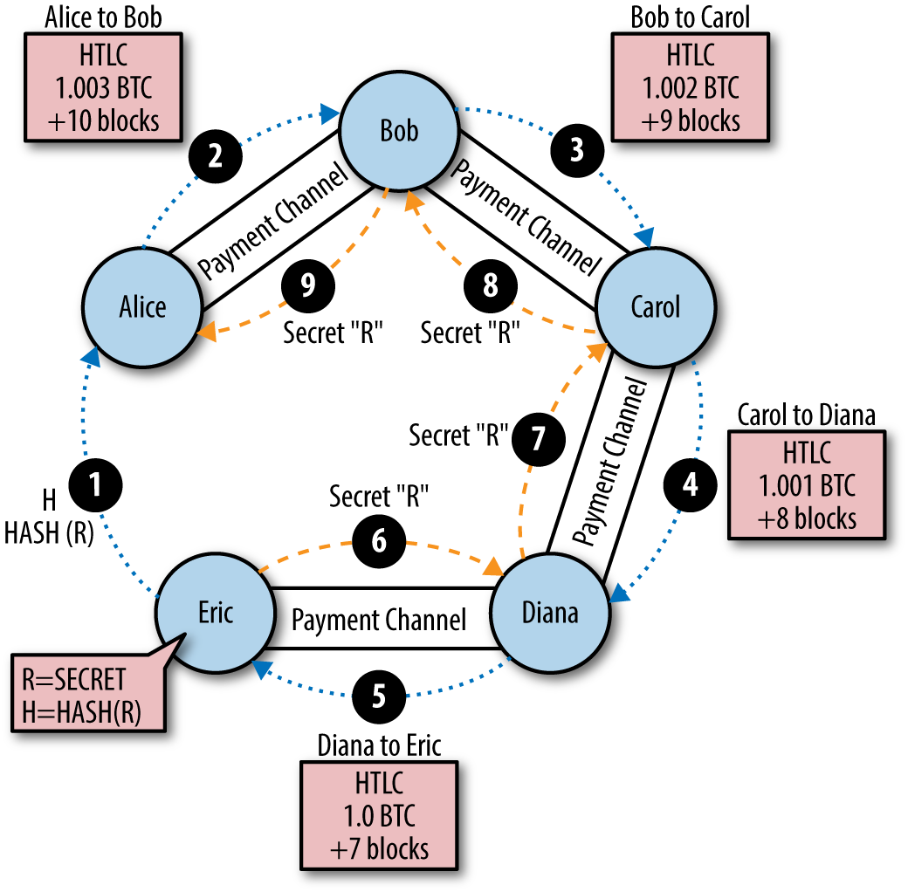
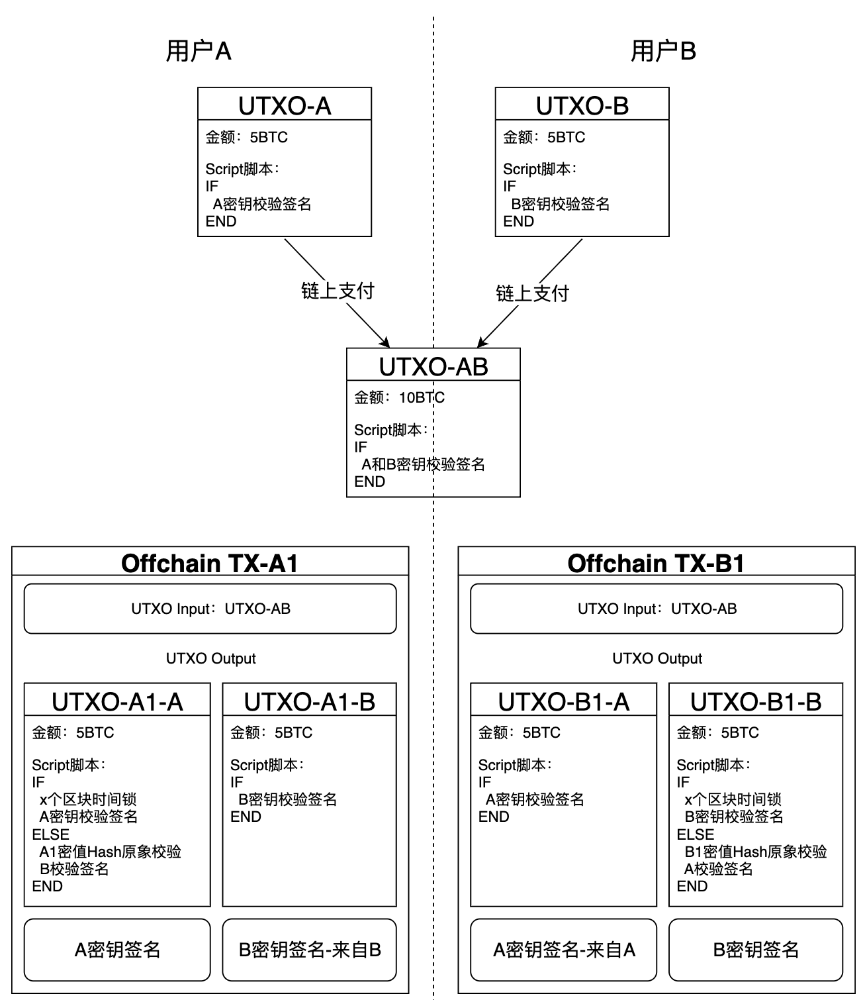
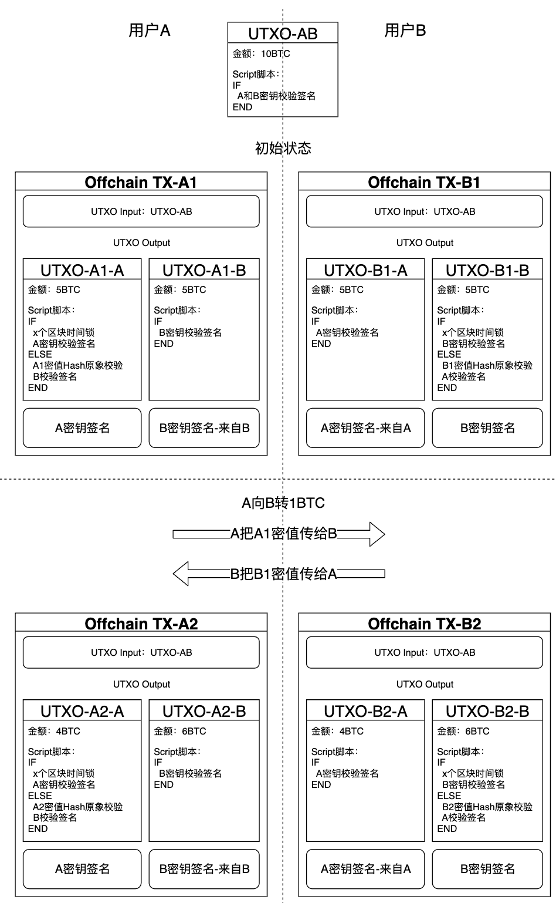

闪电网络（Lightning Network，LN）是一种基于比特币区块链的**第二层支付协议**，旨在解决比特币主网的可扩展性和交易效率问题。它通过引入**支付通道**和**离线交易机制**，极大地减少了对链上交易的依赖，从而提升交易速度和降低成本。以下是闪电网络的主要技术原理。

### 1. **支付通道的概念**

支付通道是指两个用户之间创建的**链下交易**路径，允许双方在通道内多次转账，而无需每笔交易都记录在主链上。只在开通和关闭通道时需要链上交易，以确保资金安全。这种方式被称为“链下交易”，通过支付通道，双方可以在不影响区块链的情况下快速、安全地互相转账。

- **开通通道**：用户 A 和用户 B 向一个多重签名地址存入比特币，该地址需要两方的签名才能支出资金。
- **更新余额**：两方可以通过交换新的余额分配签名，来更新支付通道的余额，而不进行链上记录。
- **关闭通道**：当用户希望关闭通道时，最后的余额分配会提交到链上，进行最终结算。

### 2. **哈希时间锁定合约（HTLC）**

HTLC 是闪电网络中的关键技术，用于确保链下交易的安全性。它通过**哈希锁定和时间锁定**的组合，让资金只有在特定条件满足时才会被转移，从而防止一方在交易完成前恶意撤回资金。

- **哈希锁定**：支付者生成一个随机数，并将其哈希值发送给接收者。接收者只有在知道该哈希值的原始输入时，才能解锁资金。
- **时间锁定**：如果接收者未在指定时间内解锁资金，支付者可以撤销交易。这防止了接收者长时间不领取资金的情况。

HTLC 使闪电网络能够跨越多个节点转账，从而形成**跨通道的支付路径**，实现了网络的互联。

### 3. **路由支付**

在闪电网络中，支付不需要直接的支付通道。即使没有直接的链下通道，用户也可以通过多个中介节点实现转账。闪电网络中的节点将自动寻找**最优路径**来完成支付，这一过程被称为路由。

- **多跳支付**：通过多个节点传递支付，用户可以利用其他节点作为中转站发送资金。
- **路径发现和路由选择**：闪电网络使用路由协议（如 Onion 路由）找到最佳路径，确保资金在最短路径内传输，并提高了交易隐私性。

### 4. **即时交易与低费用**

与比特币区块链的**确认时间**相比，闪电网络中的链下交易几乎是即时的，因为交易只需双方签名并在通道中达成一致。而且，闪电网络的交易费用通常较低，仅需支付通道的维护费用或微量的路由费用，这使得其适合处理**小额支付**和**高频支付**。

### 5. **去中心化网络结构**

闪电网络的设计是去中心化的，节点自由加入和退出，且不依赖于单一服务器或第三方。用户既可以选择与其他节点建立通道，也可以选择关闭通道。每个节点都可以自主设置路由费用，以激励更多节点参与进来，从而扩大网络的支付能力和覆盖范围。

### 6. **链下结算和通道关闭**

闪电网络中的所有链下交易都是基于承诺的状态更新协议。只有当通道关闭时，链下的最后交易状态才会记录在链上：

- **双向承诺**：在链下交易的过程中，任何一方都可以选择关闭通道，最后的余额状态将提交到链上，并进行结算。
- **惩罚机制**：如果一方试图在链上提交过期的余额分配，另一方可以提交最新的状态，没收对方的余额。这种机制保证了用户不会恶意提交无效交易。

### 7. **闪电网络的优点和挑战**

**优点**：
- **扩展性**：通过链下交易和支付通道，大大减轻了区块链的负担。
- **低费用**：只在开通、关闭通道时支付链上交易费用，其余链下交易几乎无费用。
- **隐私性**：交易不直接记录在区块链上，增强了交易隐私性。
- **实时交易**：链下交易几乎是即时完成的。

**挑战**：
- **通道流动性**：当通道内的资金耗尽时，需要重新注资或重新开通新通道。
- **网络连通性**：尽管闪电网络允许通过多跳支付进行路由，但找到稳定的路径可能会变得复杂。
- **脱机风险**：由于是链下交易，断开网络或节点意外退出可能会影响交易的正常进行。

### 示例：使用闪电网络支付流程

1. **Alice 和 Bob 开通支付通道**：Alice 和 Bob 创建一个多重签名地址，并将 5 BTC 存入其中。

2. **支付流程**：Alice 想给 Charlie 支付 1 BTC。Alice 和 Charlie 没有直接的通道，但 Bob 与 Charlie 之间有一个通道。因此，Alice 可以通过 Bob 将这笔金额转给 Charlie。
3. **HTLC 保护**：Alice 创建一个 HTLC，将 1 BTC 锁定到 Bob，要求 Charlie 提供随机数来解锁。Bob 通过 Charlie 完成支付。
4. **支付完成**：Charlie 提供随机数，Bob 获得资金解锁权，并最终完成 Alice 到 Charlie 的支付。

### 总结

闪电网络通过支付通道和 HTLC 实现了离线链下交易，同时通过去中心化的路由机制保证了可扩展性和交易隐私。尽管其实现和配置稍显复杂，但闪电网络为比特币和其他区块链提供了一种有效的扩容解决方案，极大地提升了区块链的应用潜力。