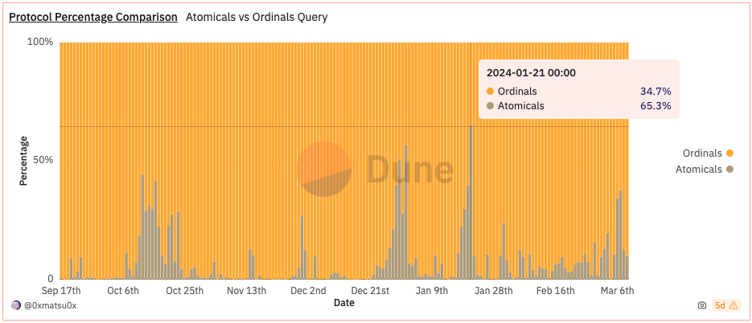
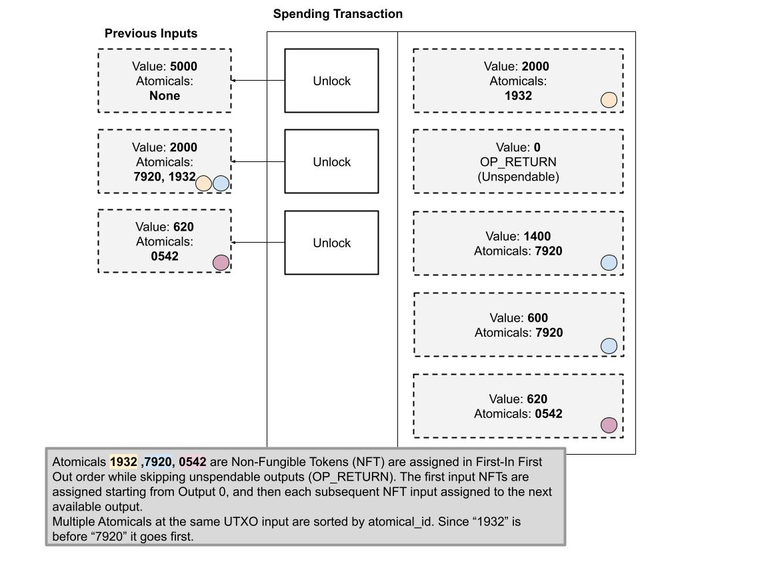
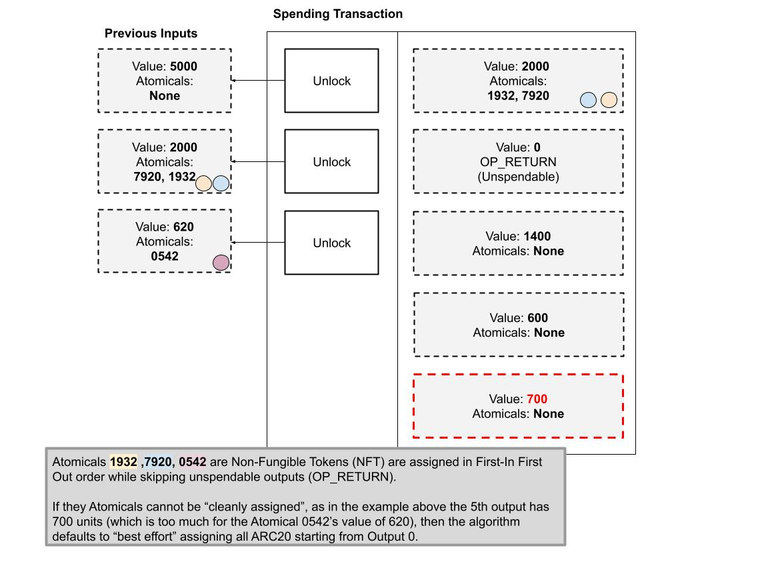

# ARC-20 简介
## Atomical
Atomicals 协议是一种简单而灵活的协议，用于为比特币等未花费的交易输出 (UTXO) 区块链铸造、传输和更新数字对象 （传统上称为不可替代代币）。原子（或“原子”）是一种组织数字对象的创建、传输和更新的方式——它本质上是根据一些简单规则定义的数字所有权链。  
### Atomicals 与其他流行的不可替代代币 (NFT) 协议进行比较。  
| 功能                 | Atomicals                                      | Ordinals                                         | Ethereum ERC721                             |
|---------------------|------------------------------------------------|--------------------------------------------------|--------------------------------------------|
| 价值主张              | 数字对象、数字工件、数字收藏品                     | 数字对象、数字工件、数字收藏品                      | 数字对象、数字工件、数字收藏品                |
| 区块链                | 比特币及所有 UTXO 区块链                          | 比特币及所有 UTXO 区块链                           | 兼容以太坊 EVM 的区块链                       |
| 铸币技术              | 比特币：提交和显示，使用 "atom" 封套               | 比特币：提交和显示，使用 "ord" 封套                 | 资金和部署合约账户                           |
| 数据存储              | 在铸造时存储一个或多个文件                         | 在铸造时仅存储一个文件                             | 未定义                                      |
| 动态状态              | 定义和更新基本和任何复杂文件类型的应用状态         | 未定义 - 可以基于应用特定来定义                    | 未定义 - 可以预先编程                        |
| 验证                  | 目前通过索引服务 "electrumx" 验证 - 理论上可以客户端全部验证 | 目前通过索引服务 "ord" 验证 - 理论上可以客户端全部验证 | 信任以太坊 EVM 节点或实际上信任 Metamask 或 Infura |
| 索引                  | 目前依赖于 elecrumx atomicals 索引器 (Python) 进行追踪序号系统 | 目前依赖于 ord 索引器 (Rust) 进行追踪序号系统        | 使用原生以太坊 EVM 节点或实际上信任 Metamask 或 Infura |
| 地址格式              | 铸造和更新需要 P2TR (Taproot) 地址                | 所有使用如铸造和转移都需要 P2TR (Taproot) 地址    | 使用原生以太坊账户地址                        |
| 集合                  | 首次的 "容器" NFT 用于更新集合，可以永久封闭        | 未定义但正在进展中的父子关系                       | 定义为单独的 ERC                            |
| 原子交换              | 部分签名比特币交易 (PBSTs)                        | 部分签名比特币交易 (PBSTs)                        | 定义为单独的 ERC                            |
| 可替代代币            | 首次 "ARC20" 使用 Satoshi 作为计量单位。去中心化和直接铸造模式可用。内置 Ticker 名称服务 | 基本协议中未提供。"BRC20" 通过铸造在铭文中创建 JSON 协议来定义去中心化铸造规则和 Ticker 名称。 | 定义为 ERC20 类型代币                         |
| 域名服务              | Realms 作为首次的 NFT，代表域名和数字身份。一种新的无域名后缀的命名标准，以加号 "+" 开头，如 +username | 基本协议中未提供。".names" 和 ".sats" 协议作为铭文中的 JSON 协议存在，定义声明和更新规则。 | 现有服务如 ENS 和 Unstoppable Domains      |


## ARC-20
Atomicals 协议解决了如何在比特币区块链上表示任意可替代代币资产的长期存在的问题。ARC-20 可替代代币标准最终为比特币带来了彩色硬币，并使用每个 Satoshi 来代表已部署代币的所有权单位。这意味着每个单位的代币永远由 1 聪支持。它充当一种支撑代币价值的“数字黄金含量”。这也意味着根据定义，每个代币的价值永远不会低于 1 聪。

ARC-20 使用原生 Satoshi 单位来表示每个代币，它们可以像普通比特币一样拆分和组合。ARC-20 代币可以由任何人铸造，并转移到任何比特币地址类型，并可与支持 UTXO 选择的钱包配合使用，例如 Sparrow Wallet （外部链接）。有两种部署模式：直接部署和分散部署。下面详细了解 ARC-20 的不同铸造方式及其优点。

据 Dune 链上数据统计，截止2023 年 3 月 6 日, 巅峰期 Atomical 交易占比超过铭文市场交易的六成之多，是继Ordinal之外BTC生态采用度最高的协议。

## 协议详情
Atomicals 协议使用原子交换的方案进行 Atomical 的铸造，并在交易输出环节融入了 Commit-Reveal 方案，以此来确保用户铸造 Atomical 过程的不可篡改性和隐私性。此外，它还在铸造过程中添加了唯一标识符来为 Atomical 的安全性和可追溯性提供保障。

### Deploy
去中心化部署是通过ticker、每铸币奖励、允许的总铸币数、起始块高度和元数据来初始化的

| 参数名        | 描述                                                   |
|-------------|------------------------------------------------------|
| tick        | 全局唯一的代币名称（ticker name）                              |
| per_mint_amt| 每次成功铸造时授予的代币数量。以 Satoshi 为单位。                     |
| mint_count  | 在额度耗尽之前允许的铸造总次数，达到后将成为“完全铸造”状态。             |
| start_height| 可以开始铸造的起始区块高度。可以设置为 0 或任何未来的区块高度。              |
| image       | 代表代币的图像图标。文件名将出现在代币中。在引入文件时使用 "image.jpg" 或 "image.png" 并请谨慎重命名。|


### Mint
```js
npm run cli mint-dft <tick>

Optional flags:
--satsbyte=<number>
```
去中心化的铸币功能mint-dft允许从start_height区块高度开始铸造tick

所需参数：

tick：全全局唯一的代币名称（ticker name）

可选标志：

--satsbyte=<数字>

设置交易的每字节聪并覆盖默认值，用来加速

### Transform

ARC20 代币传输的正常操作是所有输入值的总和应完全或干净地分配到可用输出中。如果没有足够的输出值，或者后续输出之一会导致过度分配（即：代币单位的通货膨胀），则剩余余额将被永久销毁或烧毁。

#### 完全分配
使用 FIFO 规则将所有输入干净地分配给输出。
原子 1932、7920、0542 是不可替代代币 (NFT)，按先进先出顺序分配，同时跳过不可花费的输出 (OP_RETURN)。第一个输入 NFT 从输出 0 开始分配，然后每个后续 NFT 输入分配给下一个可用输出。同一 UTXO 输入中的多个 Atomical 按atomical_id 排序。由于“1932”在“7920”之前，因此它排在第一位。


#### 未完全分配
在无法完全（或“干净”）分配输出的情况下，算法会尝试从输出 0 开始分配所有 ARC20 令牌，无论是否已分配另一个 ARC20。做出这一决定是为了在开发人员或钱包意外未能跟踪多个输入 ARC20 的情况下给予宽大处理 - 换句话说，将“尽最大努力”尝试进行补偿和分配。
原子 1932、7920、0542 是不可替代代币 (NFT)，按先进先出顺序分配，同时跳过不可花费的输出 (OP_RETURN)。如果它们无法“干净地分配”，如上面的示例中，第 5 个输出有 700 个单位（这对于 Atomical 0542 的 620 值来说太多了），则算法默认为“尽力而为”，从输出开始分配所有 ARC20 0。
