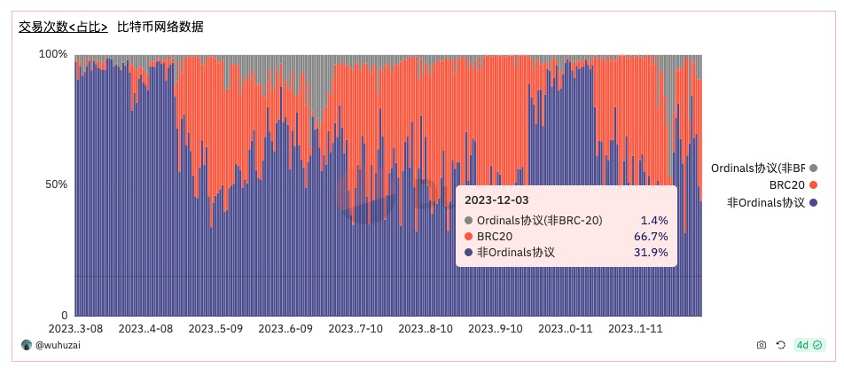
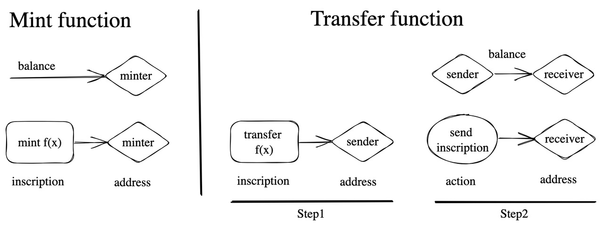

# BRC-20 简介
## Ordinals
Ordinals是Satoshi比特币的最小单位，同下文聪）的一种编号方案，允许跟踪和传输单个聪。这些数字称为序数。聪按照开采的顺序进行编号，并以先进先出的方式从交易输入转移到交易输出。编号方案和转移方案都依赖于 order，编号方案取决于开采聪的顺序，转移方案取决于交易输入和输出的顺序。Ordinals协议允许在比特币的单个聪上“铸造”或附加数据（称为铭文），这意味着每个聪可以成为一个独特的、非同质化的资产。同时基于聪上携带的铭文我们可以发行同质化资产和非同质资产类似于以太坊上的ERC20和NFT，而 BRC-20 就是 Ordinals 协议知名度最高的资产发行方案。

## BRC-20
2023 年 3 月 11 日，domo在Twitter上发起了一项实验，该实验基于Ordinal协议，并定义了一种新的Token标准：“BRC-20”。这个实验性的协议专注于在比特币网络上资产的铸造和转移，意外地打开了潘多拉魔盒，激发了人们多年来对于在比特币网络上发行资产的强烈兴趣。  

据 Dune 链上数据统计，截止2023 年 12 月 3 日, 巅峰期 BRC-20 交易占比超过比特币网络交易的六成之多，是迄今为止BTC生态采用度最高的协议。Ordinal和BRC-20协议从技术层面来说并不是一个优秀的技术，但其是去掉智能合约的资产发行足够简单以及Fair Mint的特点，让用户更加容易参与进来。  
这次实验不仅点燃了市场的热情，还引发了一场广泛的“铭文潮流”，也就是在比特币网络上铸造和交易各种Token的潮流。接着，类似于BRC-20的铭文协议如雨后春笋般涌现，不仅在比特币网络上蓬勃发展，还迅速扩散到其他公链平台。这次实验中的一种Token——ordi，已经取得了显著的市场成就。截至目前，ordi的市值已经超过了10亿美元，成为了加密资产市场中的一颗新星，稳居市值排行榜前50位。这个成就不仅证明了BRC-20和类似协议的潜力，也显示了区块链技术在资产Token化领域的巨大应用前景。  
总的来说，domo的这次实验不仅是一个技术上的突破，也是一个市场和社区层面的重大事件。它不仅为比特币网络上的资产发行开辟了新天地，还为整个加密资产生态系统的发展注入了新的活力和创新。


## 协议详情
### Deploy
```js
{"p":"brc-20","op":"deploy","tick":"ordi","max":"21000000","lim":"1000"}
```
| Key  | Required? | Description                                                                                   |
|------|-----------|-----------------------------------------------------------------------------------------------|
| p    | Yes       | Protocol: Helps other systems identify and process BRC-20 events                              |
| op   | Yes       | Operation: Type of event (Deploy, Mint, Transfer)                                             |
| tick | Yes       | Ticker: 4 letter identifier of the BRC-20                                                     |
| max  | Yes       | Max supply: set max supply of the BRC-20                                                      |
| lim  | No        | Mint limit: If letting users mint to themselves, limit per ordinal (unisat not validate)     |
| dec  | No        | Decimals: set decimal precision, default to 18                                               |

### Mint
```js
{"p":"brc-20","op":"mint","tick":"ordi","amt":"100000"}
```
| Key  | Required? | Description                                                       |
|------|-----------|-------------------------------------------------------------------|
| p    | Yes       | Protocol: Helps other systems identify and process brc-20 events   |
| op   | Yes       | Operation: Type of event (Deploy, Mint, Transfer)                 |
| tick | Yes       | Ticker: 4 letter identifier of the brc-20                         |
| amt  | Yes       | Amount to mint: States the amount of the brc-20 to mint. Has to be less than "lim" above if stated |

### Transform
- 铸造transfer铭文
```js
{"p":"brc-20","op":"transfer","tick":"ordi","amt":"10"}
```
- 将transfer铭文通过PSBT的方法转移给receiver