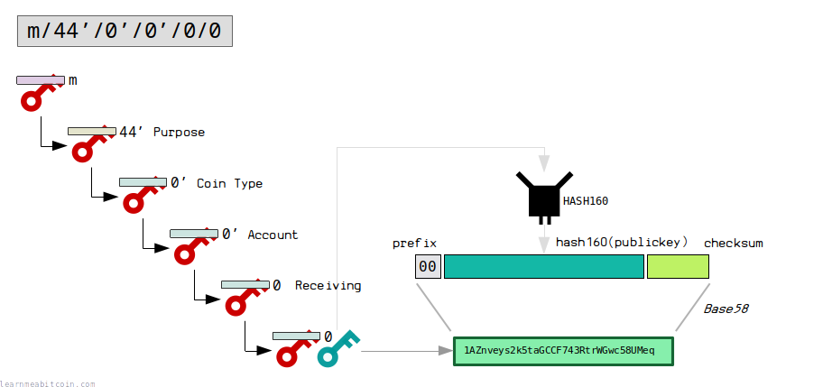
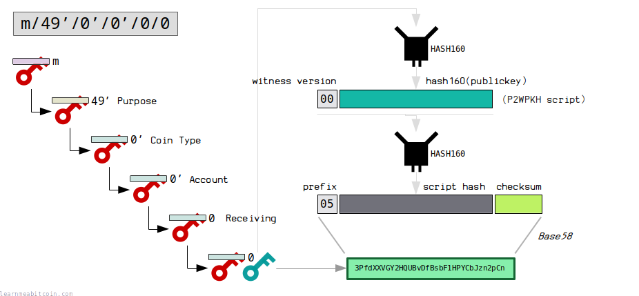
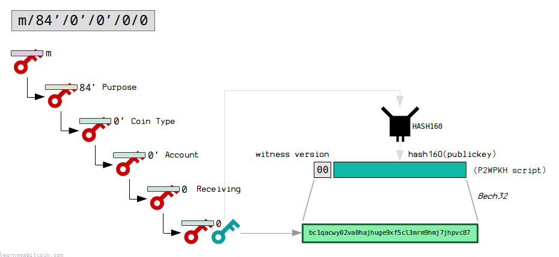

HD钱包（Hierarchical Deterministic Wallet）通过分层确定性结构生成和管理密钥对。其核心在于通过种子生成主密钥，然后通过分层推导生成多个子密钥。这种方式使得密钥管理变得简单、安全，用户只需备份种子即可恢复整个钱包。以下是HD钱包的详细技术细节和子密钥推导过程。

### 1. **HD钱包结构概述**
- **种子（Seed）**：HD钱包从一个随机生成的种子开始，该种子通过助记词（BIP39）表示。
- **主密钥（Master Key）**：由种子生成，包含主私钥、主公钥和链码。
- **链码（Chain Code）**：用于生成子密钥，是密钥派生过程中的关键成分。
- **子密钥**：从主密钥派生而来，每个子密钥都有自己的私钥、公钥和链码。

### 2. **种子生成**
- **助记词**：助记词由熵（随机位数）通过哈希和校验生成。例如，一个128位的熵可以生成12个助记词。
- **种子生成算法**：
  - 助记词经过PBKDF2（Password-Based Key Derivation Function 2）算法与一个盐值（通常是 `mnemonic` + 密码短语）组合，生成512位种子。

### 3. **主密钥生成**
- 使用HMAC-SHA512算法，以种子作为输入，和常量字符串“Bitcoin seed”作为HMAC密钥来生成512位输出。
- 输出前256位为主私钥（`m`），后256位为链码（`c`）。
  
  **HMAC计算公式**：
  ```
  I = HMAC-SHA512(key="Bitcoin seed", data=seed)
  ```
  ```
  master_private_key = I[0:32]
  master_chain_code = I[32:64]
  ```

### 4. **子密钥推导过程**
子密钥推导是HD钱包中生成子密钥的核心过程，可以通过**标准派生**和**硬化派生**来实现。

#### a. **标准派生（Non-hardened derivation）**
- 使用父公钥和链码推导子公钥，公钥和链码可以生成下一级的公钥链，但无法推导出私钥。
- 算法：
  ```
  I = HMAC-SHA512(key=cpar, data=serP(Kpar) || ser32(i))
  ```
  - `cpar`：父链码。
  - `serP(Kpar)`：父公钥的序列化形式。
  - `ser32(i)`：索引值的32位表示。
  - `I` 分成两部分：`IL`（左半部分）和 `IR`（右半部分）。

- 子私钥计算公式：
  ```
  ki = (IL + kpar) % n
  ci = IR
  ```
  - `ki`：子私钥。
  - `n`：椭圆曲线的阶。

#### b. **硬化派生（Hardened derivation）**
- 使用父私钥生成子私钥。硬化派生增加了安全性，不能从子公钥推导出父密钥。
- 算法：
  ```
  I = HMAC-SHA512(key=cpar, data=0x00 || ser256(kpar) || ser32(i))
  ```
  - `0x00` 前缀用于表示该派生使用的是私钥。
  - `kpar` 是父私钥。
  - `ci = IR` 是子链码。

- 子私钥计算公式：
  ```
  ki = (IL + kpar) % n
  ci = IR
  ```

### 5. **路径表示**
BIP44引入了用于多币种和多账户的标准路径表示：
```
m / purpose' / coin_type' / account' / change / address_index
```
- **`purpose'`**：通常为44'，表示使用BIP44规范。
- **`coin_type'`**：用于区分不同的加密货币，比如0'代表比特币，60'代表以太坊。
- **`account'`**：账户编号，用于分离不同的账户。
- **`change`**：0表示外部地址，1表示找零地址。
- **`address_index`**：地址在账户中的索引。

同时在BIP49和BIP84中也基于BIP44做了扩展，形成我们现在经常见到的BTC多个地址

#### Legacy地址 - BIP44


#### P2SH地址 - BIP49


#### P2WPKH地址 - BIP84



### 6. **ECC与HD钱包**
HD钱包使用椭圆曲线加密（Elliptic Curve Cryptography, ECC）来确保公钥和私钥的安全性。公钥由私钥通过椭圆曲线点乘生成。标准加密算法如 `secp256k1` 在HD钱包中被广泛使用。

**公钥生成公式**：
```
P = k * G
```
- `P` 是公钥，`k` 是私钥，`G` 是椭圆曲线的生成点。

### 7. **实现细节示例**
使用JavaScript库实现HD钱包的生成和子密钥推导：

```javascript
const bip32 = require('bip32');
const bip39 = require('bip39');

// 生成助记词和种子
const mnemonic = bip39.generateMnemonic();
const seed = bip39.mnemonicToSeedSync(mnemonic);

// 从种子生成HD钱包根节点
const root = bip32.fromSeed(seed);

// 派生路径：m/44'/0'/0'/0/0
const child = root.derivePath("m/44'/0'/0'/0/0");

console.log('助记词:', mnemonic);
console.log('子公钥:', child.publicKey.toString('hex'));
console.log('子私钥:', child.toWIF());
```

### 8. **安全性与注意事项**
- **助记词备份**：确保助记词安全存储，一旦丢失或泄露，可能导致资产永久损失或被盗。
- **硬化派生的使用**：硬化派生确保公钥无法推导出父级私钥，提高了安全性，建议在生成重要的子密钥时使用。

### **总结**
HD钱包通过分层结构和确定性算法，为用户提供了简单的密钥管理方式。其分层树结构和子密钥推导机制使得一个种子就能生成无限数量的私钥和公钥，极大地提高了用户体验和安全性。