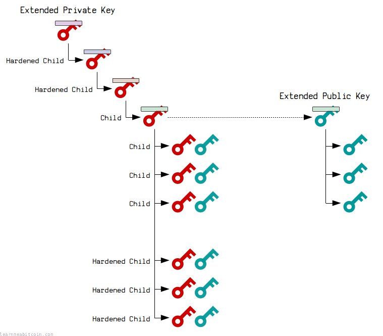
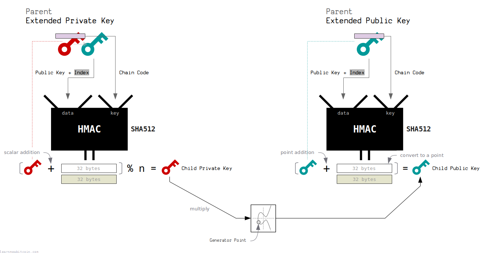

HD钱包中的**扩展公钥（Extended Public Key, xPub）**和**扩展私钥（Extended Private Key, xPriv）**是BIP32标准的一部分，它们是用于派生子密钥和管理钱包的关键概念。以下是它们的详细技术介绍。

### 1. **扩展密钥的定义**
- **扩展私钥（xPriv）**：包含私钥和链码的信息，允许派生出子私钥和子公钥。
- **扩展公钥（xPub）**：包含公钥和链码的信息，只能派生出子公钥，无法推导出私钥。



### 2. **扩展密钥的组成**
扩展密钥不仅包括公钥或私钥，还包括链码（Chain Code）、路径信息等，以支持分层确定性派生。扩展密钥的完整组成如下：

- **公钥/私钥**：用于加密和签名的密钥。
- **链码**：确保子密钥派生时的不可预测性，提供额外的随机性。
- **深度（Depth）**：当前密钥的层级深度，根节点为0。
- **父公钥指纹（Parent Fingerprint）**：标识父密钥，用于防止路径冲突。
- **索引（Index）**：指示该密钥在父密钥下的派生索引。
- **版本（Version）**：指示密钥类型（xPub 或 xPriv）。
- **校验和**：用于验证密钥完整性。

### 3. **扩展密钥的编码格式**
扩展密钥通常以Base58Check格式进行编码，确保其易于人类读取和传输。Base58Check编码避免了易混淆的字符（如0和O，l和I）。编码后的扩展密钥通常以以下前缀开头：
- **xPub**：用于表示扩展公钥。
- **xPriv**：用于表示扩展私钥。

#### **编码示例**
扩展密钥的编码格式如下：
```
[version (4 bytes)][depth (1 byte)][parent fingerprint (4 bytes)][child number (4 bytes)]
[chain code (32 bytes)][key data (33 bytes)][checksum (4 bytes)]
```

### 4. **生成扩展私钥和扩展公钥**
#### a. **生成扩展私钥**
扩展私钥是通过HMAC-SHA512生成的。算法步骤如下：
- 生成主私钥和链码时，将种子输入HMAC-SHA512，并使用“Bitcoin seed”作为密钥。
- 输出前32字节是私钥，后32字节是链码。

#### b. **生成扩展公钥**
从扩展私钥可以生成扩展公钥，通过椭圆曲线加密（ECC）运算将私钥转换为公钥。

**扩展公钥生成步骤**：
- 取扩展私钥的前32字节（私钥部分），并将其转换为公钥。
- 保留链码和其他元数据。

### 5. **子密钥派生过程**
扩展密钥的强大之处在于，它们支持通过链码进行分层确定性派生，生成子密钥而不需要暴露父级的私钥。

#### a. **从扩展私钥派生子私钥**
扩展私钥可以派生子私钥和子公钥。
- **算法**：
  ```
  I = HMAC-SHA512(key=parent_chain_code, data=0x00 || parent_private_key || child_index)
  ```
  - `I` 的前32字节用作派生的子私钥的一部分，后32字节用作新的子链码。
  - 子私钥公式：`child_private_key = (IL + parent_private_key) % n`。

#### b. **从扩展公钥派生子公钥**
扩展公钥只能派生子公钥，无法反推出私钥，确保了安全性。
- **算法**：
  ```
  I = HMAC-SHA512(key=parent_chain_code, data=parent_public_key || child_index)
  ```
  - 子公钥通过公钥加法计算得出。
  - 子公钥公式：`child_public_key = G * IL + parent_public_key`（`G` 为椭圆曲线生成点）。

  


### 6. **硬化派生与标准派生**
- **硬化派生**（Hardened Derivation）：只能通过扩展私钥派生，子公钥无法通过扩展公钥派生出来，增加了安全性。索引大于等于 `2^31` 的值用于硬化派生。
- **标准派生**（Non-Hardened Derivation）：可以通过扩展公钥派生出子公钥，索引小于 `2^31`。

### 7. **用途和安全性**
- **xPub的应用**：适用于公开应用，如钱包软件中用来显示和管理多个收款地址。通过扩展公钥，第三方可以生成新的地址而不接触私钥。
- **xPriv的应用**：仅用于安全环境，绝不能公开，以防止密钥泄露。

**安全注意事项**：
- **保护扩展私钥**：xPriv的泄露意味着整个密钥树的私钥都处于危险中。
- **使用硬化派生**：在可能被公开的路径中，建议使用硬化派生来确保私钥安全。

### 8. **示例代码**
以下是使用JavaScript库生成扩展密钥的示例代码：

```javascript
const bip32 = require('bip32');
const bip39 = require('bip39');

// 生成助记词和种子
const mnemonic = bip39.generateMnemonic();
const seed = bip39.mnemonicToSeedSync(mnemonic);

// 生成根节点
const root = bip32.fromSeed(seed);

// 获取扩展公钥和扩展私钥
const xPriv = root.toBase58();
const xPub = root.neutered().toBase58();

console.log('扩展私钥 (xPriv):', xPriv);
console.log('扩展公钥 (xPub):', xPub);
```

### **总结**
扩展公钥（xPub）和扩展私钥（xPriv）是HD钱包中的核心概念，提供了派生和管理子密钥的能力。xPriv 可以派生子私钥和子公钥，而 xPub 只能派生子公钥。使用这些扩展密钥，用户和开发者可以实现灵活的密钥管理，同时保证密钥的安全性。