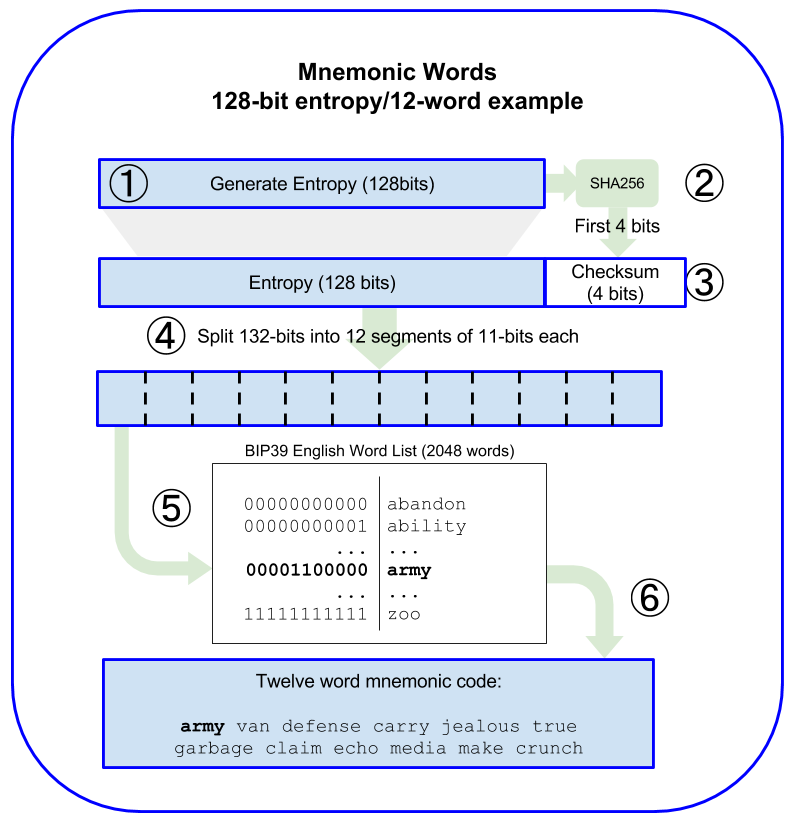
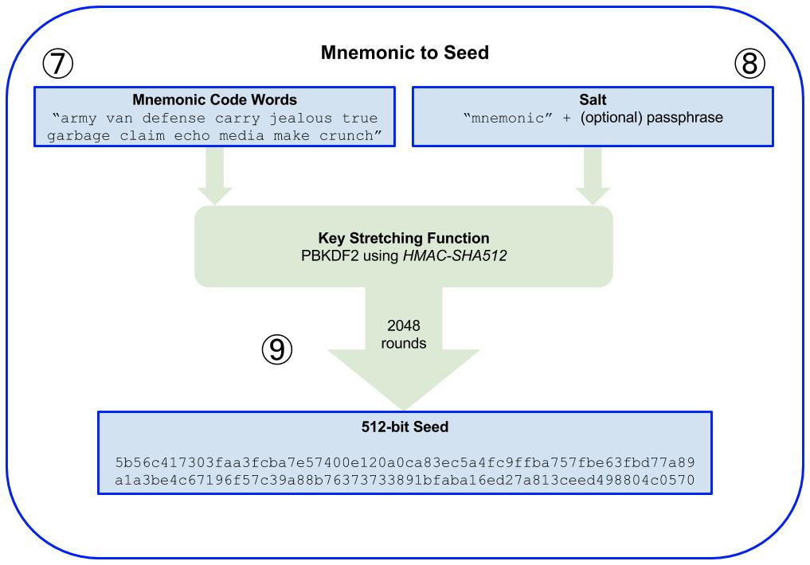
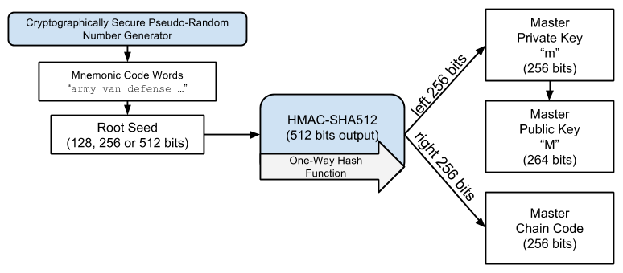

HD钱包中的助记词（Mnemonic Phrase）是一组人类可读的单词，用来表示随机生成的种子。助记词为用户提供了一个易于备份和恢复的钱包方式，极大地简化了复杂的密钥管理。以下是HD钱包助记词的详细技术原理：

### 1. **助记词的定义和作用**
助记词是一串用来帮助用户记忆种子的单词序列。HD钱包使用助记词来生成用于派生密钥的种子，因此只要备份助记词，就可以恢复整个钱包的密钥树。

### 2. **助记词生成的步骤**
助记词生成过程基于BIP39标准，涉及以下步骤：

#### a. **生成熵（Entropy）**
- **熵的定义**：熵是用于随机生成助记词的随机位序列。常见的熵长度有128位、160位、192位、224位和256位。
- **例子**：假设熵为128位，它会生成12个单词的助记词。

#### b. **计算校验和（Checksum）**
- 将熵进行SHA-256哈希，取哈希结果的前 `ENT / 32` 位作为校验和，其中 `ENT` 是熵的位长度。
- **例子**：如果熵是128位，则校验和为 `128 / 32 = 4` 位。

#### c. **组合熵和校验和**
- 将原始熵和校验和组合，形成一个新的位序列。例如，128位熵加上4位校验和形成132位序列。

#### d. **分割为11位块**
- 将132位的位序列分割为多个11位的块，每个块可以表示0到2047之间的一个数字。
- 这些数字用于从一个2048个单词的字典（BIP39单词表）中查找对应的单词。




### 3. **BIP39单词表**
- **固定单词表**：BIP39定义了一个包含2048个单词的标准单词表。这些单词具有以下特点：
  - 每个单词都有明确的拼写，不易混淆。
  - 单词表的不同语言版本保持一致性，但使用的是本地语言词汇。

### 4. **种子生成**
助记词本身并不能直接用于密钥派生。助记词需要经过密码学处理生成一个种子，种子用来生成HD钱包的主私钥和链码。

#### a. **PBKDF2函数**
- 助记词通过PBKDF2-HMAC-SHA512算法与一个盐值组合，生成512位种子。
- **盐值**：通常是 `mnemonic` 加上一个用户提供的密码短语（可选），增强了安全性。
- **算法**：
  ```text
  seed = PBKDF2(mnemonic, "mnemonic" + passphrase, 2048, 64, HMAC-SHA512)
  ```





### 5. **助记词的恢复**
当用户输入助记词进行恢复时，钱包软件会执行以下步骤：
- 将助记词映射回原始熵和校验和。
- 验证助记词是否有效（检查校验和）。
- 使用PBKDF2函数将助记词和用户输入的密码短语（如果有）转换为种子。
- 通过该种子生成HD钱包的主私钥和链码，从而恢复整个密钥树。





### 6. **助记词的优点**
- **易于记忆和备份**：助记词比纯随机的密钥更容易记住和存储。
- **便于恢复**：只要用户保留助记词，就可以在任何支持BIP39的HD钱包中恢复整个钱包。
- **增加安全性**：通过密码短语增强了助记词的安全性。如果助记词被泄露，攻击者仍然需要知道密码短语才能恢复钱包。

### 7. **助记词的安全注意事项**
- **备份和存储**：助记词应以离线方式备份，如写在纸上并存放在安全的地方。不要将助记词存储在联网设备上。
- **密码短语**：使用一个复杂且不易猜测的密码短语可以大大提高安全性，即使助记词被盗，攻击者也无法轻易访问钱包。
- **防止物理和电子威胁**：确保助记词的存储位置防范火灾、盗窃或电子攻击。

### 8. **技术示例**
以下是使用JavaScript库生成助记词和种子的示例代码：

```javascript
const bip39 = require('bip39');

// 生成12个单词的助记词
const mnemonic = bip39.generateMnemonic();
console.log('助记词:', mnemonic);

// 验证助记词是否合法
const isValid = bip39.validateMnemonic(mnemonic);
console.log('助记词是否合法:', isValid);

// 将助记词转换为种子
const seed = bip39.mnemonicToSeedSync(mnemonic, '可选的密码短语');
console.log('生成的种子:', seed.toString('hex'));
```

### **总结**
HD钱包的助记词系统提供了一种安全、便捷的方式来管理和恢复钱包。助记词通过熵、校验和、PBKDF2算法生成种子，从而衍生出一棵密钥树。理解助记词的原理有助于用户更好地保护自己的数字资产，同时也能帮助开发者实现符合BIP39标准的钱包应用。