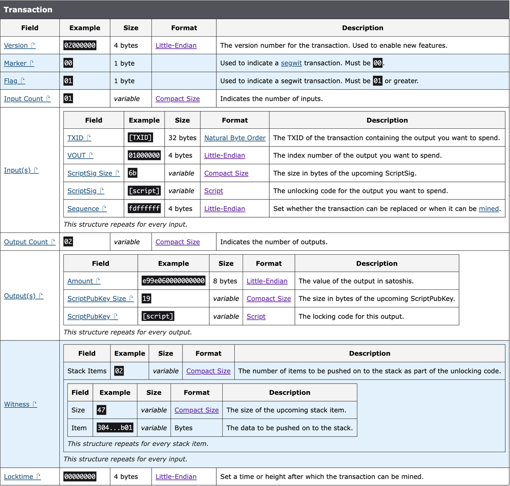

在比特币网络中，“dust” 或 “尘埃交易”指的是非常小的比特币金额，其大小甚至不足以支付发送这笔金额所需的交易费。因为每笔比特币交易都需要支付矿工费以保证交易被网络确认，如果交易中的金额太小，不足以覆盖这笔费用，那么这笔金额实际上就变得无法使用。

# Dust 定义

参考bitcoin中的[定义](https://github.com/bitcoin/bitcoin/blob/160d23677ad799cf9b493eaa923b2ac080c3fb8e/src/policy/policy.cpp#L26-L63)

> "Dust" is defined in terms of dustRelayFee,  
>  which has units satoshis-per-kilobyte.  
>  If you'd pay more in fees than the value of the output  
>  to spend something, then we consider it dust.  
>  A typical spendable non-segwit txout is 34 bytes big, and will  
>  need a CTxIn of at least 148 bytes to spend:  
>  so dust is a spendable txout less than  
>  182*dustRelayFee/1000 (in satoshis).  
>  546 satoshis at the default rate of 3000 sat/kvB.  
>  A typical spendable segwit P2WPKH txout is 31 bytes big, and will  
>  need a CTxIn of at least 67 bytes to spend:  
>  so dust is a spendable txout less than  
>  98*dustRelayFee/1000 (in satoshis).  
>  294 satoshis at the default rate of 3000 sat/kvB

# 交易结构



# 常用地址的计算

## P2PKH - 546

### Output

```js
Size = Amout + ScriptPubKey Size + ScriptPubKey = 8 + 1 + 25 = 34
```

#### ScriptPubKey

```js
// 模版 共25字节
OP_DUP OP_HASH160 <Public Key Hash> OP_EQUALVERIFY OP_CHECKSIG

OP_DUP // 复制栈顶的元素
OP_HASH160 // 弹出栈顶元素，计算其SHA-256散列，然后计算RIPEMD-160散列
OP_PUSHBYTES_20 // 推送20字节到栈顶
18e1fad25b2983d5dbb2e2b96e3ce756a69b3bc2 // 公钥哈希
OP_EQUALVERIFY // 比较栈顶元素
OP_CHECKSIG // 验证数字签名
```

### Input

```js
Size = TXID + VOUT + ScriptSig Size + ScriptSig + Sequence = 32 + 4 + 1 + 107 + 4 = 148
```

#### ScriptSig

```js
// 模版 共107字节
<Singature> <Public Key>

OP_PUSHBYTES_72 // 推送72字节到栈顶
3045022100c233c3a8a510e03ad18b0a24694ef00c78101bfd5ac075b8c1037952ce26e91e02205aa5f8f88f29bb4ad5808ebc12abfd26bd791256f367b04c6d955f01f28a772401 // 签名数据
OP_PUSHBYTES_33 // 推送33字节到栈顶
03480b6822120e9936b43859d84c380583c3d0292409b21453ae962815090f8117 // 压缩公钥
```

### DUST

```js
dust = (input + output) * feeRate = (34 + 148) * 3 = 546
```

## P2SH-P2PKH - 540 1%⬇️

### Output

```js
Size = Amout + ScriptPubKey Size + ScriptPubKey = 8 + 1 + 23 = 32
```

#### ScriptPubKey

```js
// 模版 共23字节
OP_HASH160 <scriptHash> OP_EQUAL
其中
scriptHash = hash160(OP_DUP OP_HASH160 <Public Key Hash> OP_EQUALVERIFY OP_CHECKSIG)

OP_HASH160 // 弹出栈顶元素，计算其SHA-256散列，然后计算RIPEMD-160散列
OP_PUSHBYTES_20 // 推送20字节到栈顶
18e1fad25b2983d5dbb2e2b96e3ce756a69b3bc2 // 脚本哈希
OP_EQUAL // 比较栈顶两个元素相等
```

### Input

```js
Size = TXID + VOUT + ScriptSig Size + ScriptSig + Sequenc = 32 + 4 + 1 + 107 + 4 = 148
```

#### ScriptSig

```js
// 模版 共107字节
<Singature> <Public Key> <redeemScript>

OP_PUSHBYTES_72 // 推送72字节到栈顶
3045022100c233c3a8a510e03ad18b0a24694ef00c78101bfd5ac075b8c1037952ce26e91e02205aa5f8f88f29bb4ad5808ebc12abfd26bd791256f367b04c6d955f01f28a772401 // 签名数据
OP_PUSHBYTES_33 // 推送33字节到栈顶
03480b6822120e9936b43859d84c380583c3d0292409b21453ae962815090f8117 // 压缩公钥
```

### DUST

```js
dust = (input + output) * feeRate = (32 + 148) * 3 = 540
```

## P2WPKH - 294 46%⬇️

### Output

```js
Size = Amout + ScriptPubKey Size + ScriptPubKey = 8 + 1 + 22 = 31
```

#### ScriptPubKey

```js
// 模版 共22字节
OP_0 <pubKeyHash>

OP_0  // 表示版本号，对于P2WPKH是0
OP_PUSHBYTES_20 // 推送20字节到栈顶
18e1fad25b2983d5dbb2e2b96e3ce756a69b3bc2 // 公钥哈希
```

### Input

```js
Size = TXID + VOUT + Sequence + Witness/4 = 32 + 4 + 4 + 108/4 = 67
```

#### ScriptSig

```
// 模版 共107字节
<Singature> <Public Key>

02  // 见证数据的数量
48  // 第一个见证数据的长度72字节
3045022100a5eec95c65d2dd679e8fdcc10668d5d51446f24d1557859cb543e570201257c6022011df04f803a08c97de213ddf211ad193045ff25e59857324a28656de1961351c01  // 签名数据
21  // 第二个见证数据的长度33字节
0295f97f41d0d523bddf39e77e16cc0dda2e56b9bd9fdea10133656635b2c28a39  // 压缩公钥
```

### DUST

```js
dust = (input + output) * feeRate = (31 + 67) * 3 = 294
```

## P2TR(key path) - 300 26.7%⬇️

### Output

```js
Size = Amout + ScriptPubKey Size + ScriptPubKey = 8 + 1 + 34 = 43
```

#### ScriptPubKey

```js
// 模版 共22字节
OP_1 <x-only-pubkey>

OP_1 // 表示版本号，对于P2TR是1
OP_PUSHBYTES_32 // 推送32字节到栈顶
2c3ee7cdb92394e32e82ec5bc8860c8888df6a9910537e90c75079726a2a8469 // tweaked-public-key
```

### Input

```js
Size = TXID + VOUT + Sequence + Witness/4 = 32 + 4 + 4 + 67/4 = 57
```

#### ScriptSig

```js
// 模版 共67字节
[signature] [script] [control block]

01  // Witness 元素的个数
40  // schnorr签名长度
743bbb3df4e95df5e70c2a3e72dd9d05933a018ad1bbd4b700841824ed18bebbc54d1b4d03b252aaa5c373390c68ba119fdf70e0bab71694a4db0da3fe8fefcc  // schnorr签名
00  // 签名类型
```

### DUST

```js
dust = (input + output) * feeRate = (43 + 57) * 3 = 300
```

# 主流库的实现

## Bitcoin

已经添加dust的计算[GetDustThreshold](https://github.com/bitcoin/bitcoin/blob/160d23677ad799cf9b493eaa923b2ac080c3fb8e/src/policy/policy.cpp#L26-L63)  
同时在[IsStandardTx](https://github.com/bitcoin/bitcoin/blob/160d23677ad799cf9b493eaa923b2ac080c3fb8e/src/policy/policy.cpp#L70-L92)中会把包含小于dust的输出交易置为异常交易

## Bitcoinjs

Bitcoinjs 将会在7.0.0中添加[dustAmountFromOutputScript](https://github.com/bitcoinjs/bitcoinjs-lib/pull/2010)的计算，不过计算逻辑只会通过是否是Witness返回546或294
