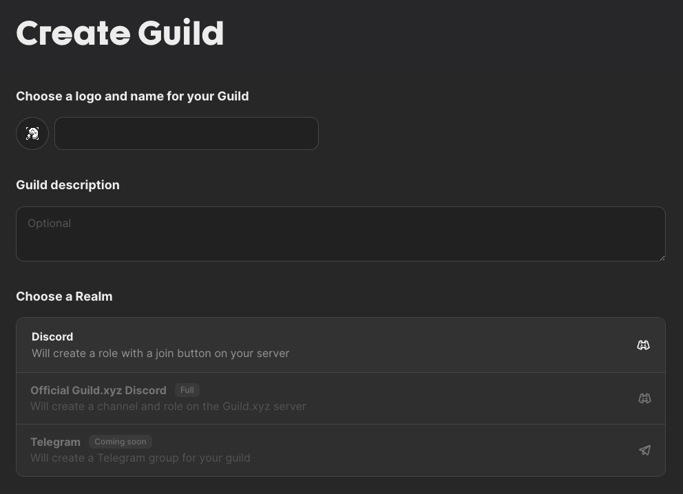
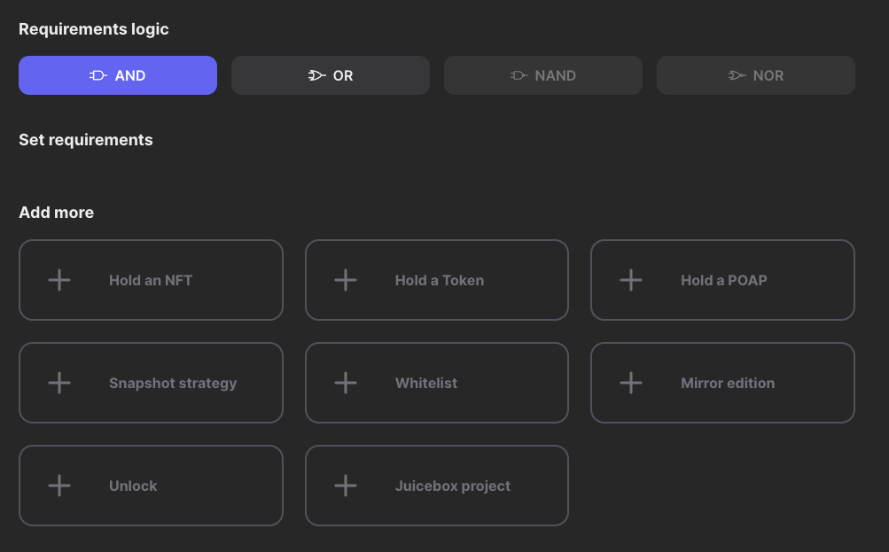

# Agora Space介绍

Agora Space：数字时代的社交互动平台

Agora Space 是一个基于云计算的社交互动平台，旨在为用户提供一个灵活、直观的在线交流环境。随着技术的不断发展，特别是在疫情之后，远程办公和在线学习已经成为常态，Agora Space 的出现正是响应了这一趋势。它不仅仅是一个简单的聊天或视频会议工具，而是一个集成了多种功能的综合性平台，旨在增强用户之间的互动体验。

1. 平台概述
Agora Space 由 Agora 公司开发，利用其在实时音视频技术方面的优势，提供高质量的音视频通话、即时通讯、在线协作等功能。用户可以通过该平台创建虚拟空间，邀请其他用户加入，在空间内进行各种形式的交流和协作。这些空间可以用于教育、企业会议、社交活动等多种场景，极大地丰富了在线互动的可能性。

2. 核心功能
2.1 实时音视频通话
Agora Space 的核心功能之一是实时音视频通话。用户可以轻松发起视频会议，支持多方通话，确保每个参与者都能清晰地听到和看到其他人。该平台采用了先进的音视频编解码技术，能够在各种网络条件下提供稳定的音视频质量，适合教育培训、企业会议以及社交聚会等场景。

2.2 虚拟空间创建
用户可以根据需求创建不同主题的虚拟空间。每个空间都有独特的设置和功能，用户可以自定义背景、布局和可用工具。这种灵活性使得不同类型的活动都能在 Agora Space 中找到合适的呈现方式，从而提升参与者的体验。

2.3 聊天与协作工具
除了音视频通话，Agora Space 还提供即时聊天功能，支持文字、图片和文件传输。这使得用户在会议或活动中可以实时分享信息，增强互动性。此外，平台还集成了协作工具，如白板、文档编辑等，方便用户共同创作和讨论。

3. 应用场景
Agora Space 的应用场景非常广泛，以下是一些典型的例子：

3.1 教育培训
在教育领域，Agora Space 为教师和学生提供了一个理想的在线教学环境。教师可以创建课堂空间，进行实时授课、互动讨论和作业布置，学生则可以在同一空间内进行小组讨论和合作学习。这种灵活的在线学习方式，不仅提高了学生的参与感和学习效果，还能有效克服地理限制。

3.2 企业会议
对于企业而言，Agora Space 是进行远程会议的得力工具。公司可以通过平台组织团队会议、项目讨论和培训课程，减少了差旅成本和时间浪费。企业还可以利用平台的录制功能，保存会议内容，便于后续回顾和分享。

3.3 社交活动
在社交领域，Agora Space 为用户提供了一个虚拟聚会的场所。用户可以创建兴趣小组，组织线上聚会、游戏活动，甚至是虚拟婚礼和生日派对。通过这个平台，用户能够跨越地理限制，与亲友进行更丰富多彩的互动。

4. 技术优势
Agora Space 的成功离不开其强大的技术支持。Agora 公司在实时音视频领域的深厚积累，使得其平台具有以下优势：

低延迟：使用先进的网络算法，确保音视频通话的低延迟体验，适合实时互动需要。
高稳定性：即使在网络条件不佳的情况下，平台也能保持良好的音视频质量，确保用户体验。
可扩展性：平台支持大规模用户同时在线，适合各种规模的活动需求。
5. 未来发展
随着远程工作和在线学习的普及，Agora Space 未来的发展前景广阔。平台可以进一步拓展其功能，如增强人工智能辅助的互动体验、引入更多社交元素、提升用户隐私保护等。通过不断创新，Agora Space 有望成为数字时代必不可少的社交互动工具。

总之，Agora Space 不仅是一个在线交流平台，更是连接人与人之间的重要桥梁。它以其丰富的功能和灵活的应用场景，为用户提供了一个无缝的社交体验，推动了数字化时代的社交方式变革。

Agora 目前开发出第一个工具: https://alpha.guild.xyz/ ，用来创建一个 guild:

并可以指定哪些地址有资格加入，目前支持 8 个条件:

## 参考链接

- 官网: https://agora.space/
- 文档: https://agora-space.gitbook.io/agoraspace/