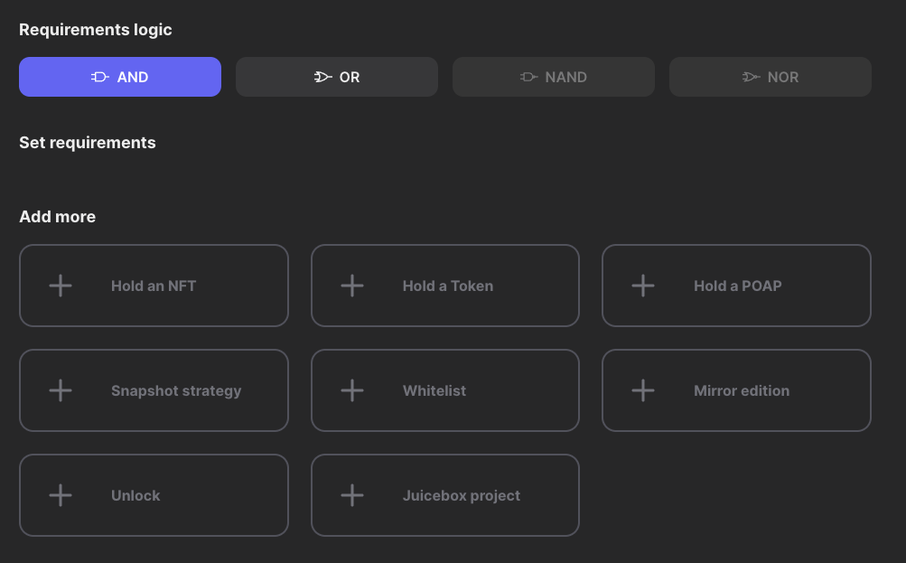

# Agora 介绍

## Agora 是什么

Agora 全称 Agora Space, 希望创建无需 gas、多链、支持多平台的工具，来促进 Web3 被广泛采用。目前他们做的事情主要是基于社交平台如 discord 和 telegram 做一些扩展应用，例如，持有哪些 NFT 的地址可以进入你的 discord server。

## Agora 解决什么问题

可以让 DAO 和一些社区可以更好的管理其中的成员，形成有凝聚力的社区。

## Agora 有哪些功能

Agora 目前开发出第一个工具: https://alpha.guild.xyz/ ，用来创建一个 guild，并可以指定哪些地址有资格加入，目前支持 8 个条件:

## 参考链接

- 官网: https://agora.space/
- 文档: https://agora-space.gitbook.io/agoraspace/