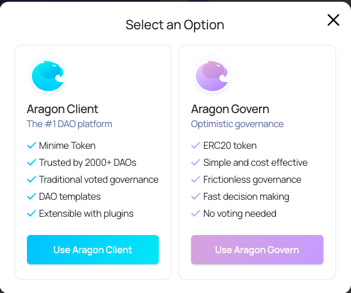
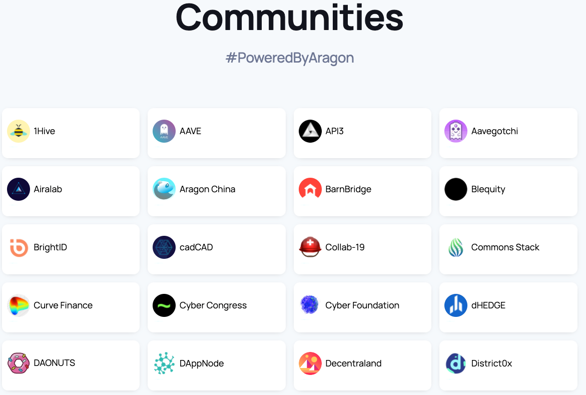
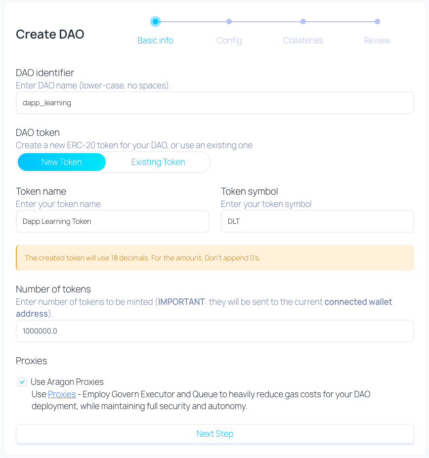
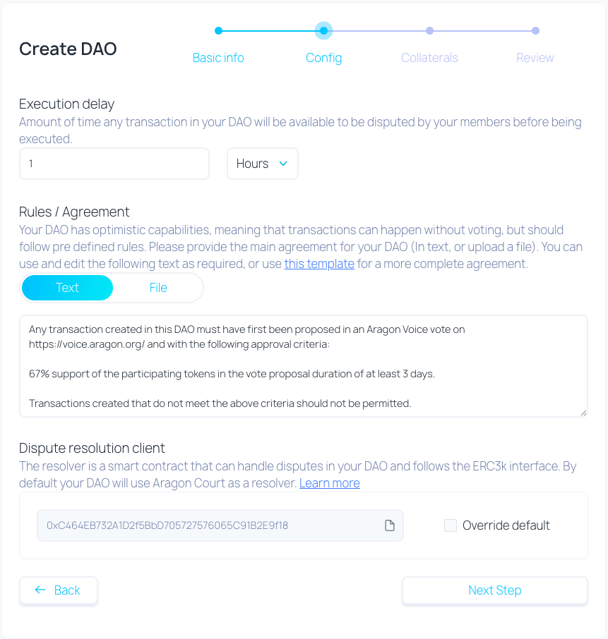
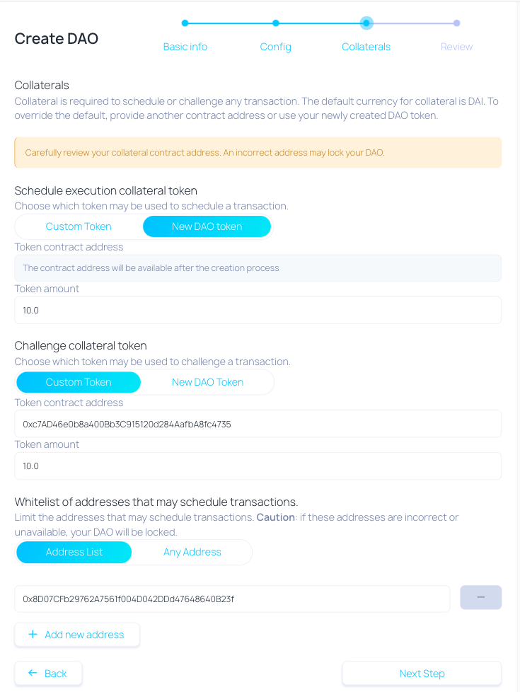
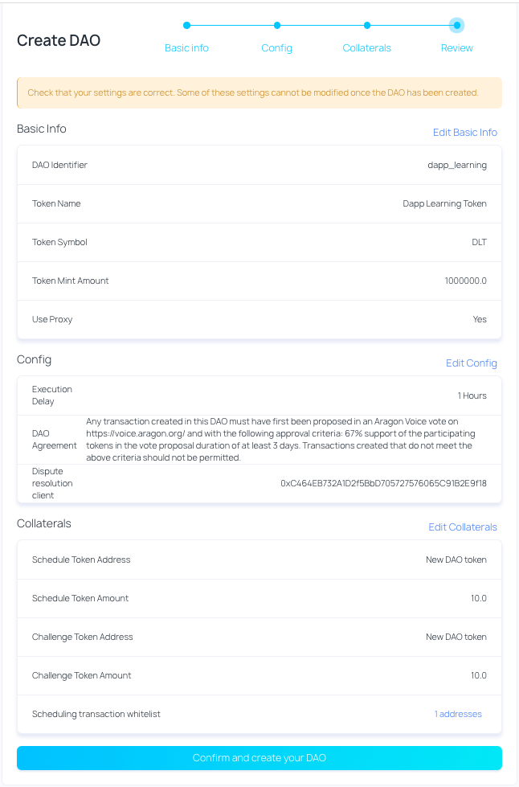
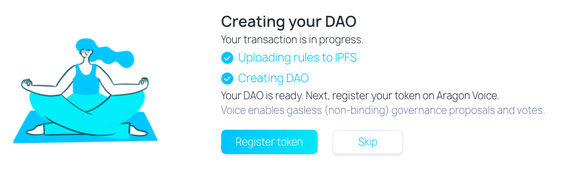
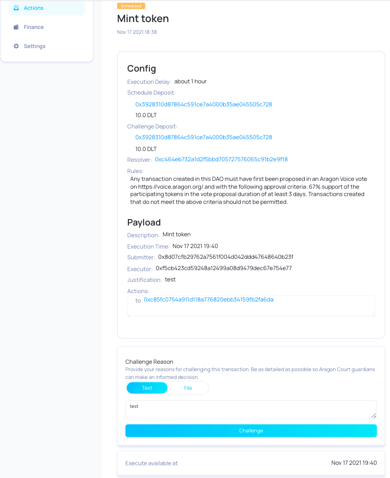
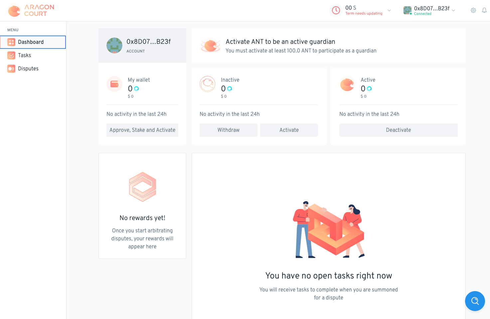
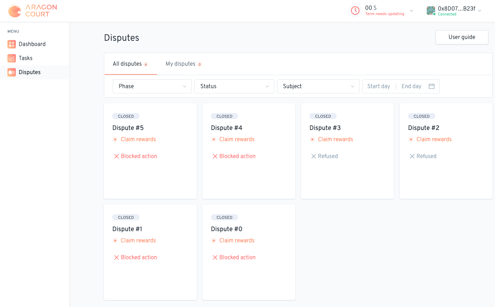

# Aragon

Video version for this article: https://www.bilibili.com/video/BV1gL4y1i7zG/
## What is a DAO?

[https://aragon.org/dao](https://aragon.org/dao)

A DAO (Decentralized Autonomous Organization) is a group of people with no central management that coordinate over the internet around a shared set of rules to achieve a common mission.

A more accurate definition would be:

A DAO is an internet-native entity with no central management which is regulated by a set of automatically enforceable rules on a public blockchain, and whose goal is to take on a life of its own and incentivize people to achieve a shared common mission.

## About Aragon

Aragon is a community-driven project with the mission to empower freedom by creating tools for decentralized organizations to thrive. 

You can create：

* clubs
* companies
* gaming guilds
* cooperatives
* nonprofits
* open source projects
* and any other type of organization

Currently Aragon is running on：

* Ethereum
* Rinkeby
* Ploygon（only v1）

The Aragon project is stewarded by the Aragon Association, a non-profit entity based in Zug, Switzerland, and governed by Aragon Network Token (ANT) holders.

## 2 versions

[https://aragon.org/aragon-govern](https://aragon.org/aragon-govern)

**Aragon Client**(v1)

[https://client.aragon.org/#/](https://client.aragon.org/#/)

* Over 5000 lines of code, it's aragonOS（kernel）
* Vote on chain
* Complex
* High transaction fee

**Aragon Govern** (v2)

[https://govern-rinkeby.aragon.org/#/](https://govern-rinkeby.aragon.org/#/)

* 500 lines of code
* Support vote off chain
* Optimistic Vote
* Aragon Court

## Aragon Client

[https://client.aragon.org/#/](https://client.aragon.org/#/)

[https://help.aragon.org/category/12-templates](https://help.aragon.org/category/12-templates)

Initially launched in 2019，most DAOs use it.

It's recommended to use **Aragon Govern** (v2) for new DAOs

### DAOs created

[https://poweredby.aragon.org/](https://poweredby.aragon.org/)

* 1700+ Organizations created
* $900M+ USD value of assets stored

架构

* aragonOS：Kernel，ACL
* apps：token，voting，finance，agent. There is a Marketplace where you can find more apps, such as Redemption, Payroll, Surveys.

## Aragon Govern

Full-stack, frictionless DAOs: signal on Voice, schedule on Govern, dispute in Court.

### Aragon Voice

[https://help.aragon.org/article/73-what-is-aragon-voice](https://help.aragon.org/article/73-what-is-aragon-voice)

Aragon Voice is a new gasless and universally verifiable voting solution. Proposals are processed on Aragon's layer 2 protocol (Vochain) and vote metadata is stored on IPFS. The result is a completely permissionless, decentralized and highly scalable governance solution for DAOs and other initiatives that make use of ERC-20 tokens (with more token types coming).

Aragon Voice can be used for permissionless signalling but also for dispute resolution and deterministic on-chain execution, when combined with Aragon Court and Aragon Govern.

* Anyone holds ERC20 token can create vote here
* Others can vote
* Use for signal from community

### Aragon Govern

[https://help.aragon.org/article/74-what-is-aragon-govern](https://help.aragon.org/article/74-what-is-aragon-govern)

Aragon Govern is a DAO framework that relies on optimistic governance, empowering digital groups to operate in a frictionless governance model with on-chain execution and easy-to-use dispute resolution.

Landing page：[https://aragon.org/aragon-govern](https://aragon.org/aragon-govern)

App：

* [https://govern-rinkeby.aragon.org/#/](https://govern-rinkeby.aragon.org/#/)
* [https://govern.aragon.org/#/](https://govern.aragon.org/#/)

#### Create a Govern DAO

[https://help.aragon.org/article/102-how-to-create-a-govern-dao](https://help.aragon.org/article/102-how-to-create-a-govern-dao)

#### Schedule an action

The workflow to execute an action is:

* Create action
* Challange(If any)
* Execute

#### Challenging a transaction

[https://help.aragon.org/article/106-challenging-a-transaction](https://help.aragon.org/article/106-challenging-a-transaction)

* Need to specify the collateral, can be changed via DAO's setting page
* Need to pay for 150 DAI，to guardians and actors

Whenever an Aragon Govern transaction is challenged, a new dispute is created in Aragon Court.

### Aragon Court

[https://court.aragon.org/](https://court.aragon.org/)

#### Dashboard

[https://help.aragon.org/article/42-aragon-court-dashboard](https://help.aragon.org/article/42-aragon-court-dashboard)

Activate ANT, will increase the possibility to be chosen as Guardian.

Active tokens serve three main purposes:

* They determine your probability of being drafted as a guardian. The higher the amount, the higher the probability.
* Subscription rewards are directly proportional to active tokens. [Click here](https://help.aragon.org/article/42-aragon-court-dashboard#rewards) to learn more about the different types of rewards.
* In order to incentivize consensus decisions and honest behaviors, a portion of your active tokens are locked when drafted for a dispute and you can get rewarded or penalized depending on the final ruling. [Click here](https://help.aragon.org/article/43-dispute-lifecycle) to learn more about disputes.

As a Guardian，tasks include：

* Summon guardians
* Commit vote
* Reveal vote
* Appeal ruling
* Confirm appeal
* Execute ruling

#### Disputes

[https://court.aragon.org/#/disputes](https://court.aragon.org/#/disputes)

#### Dispute for Guardian

[https://help.aragon.org/article/107-acting-as-a-guardian-for-an-aragon-govern-dispute](https://help.aragon.org/article/107-acting-as-a-guardian-for-an-aragon-govern-dispute)

Whenever an Aragon Govern transaction is challenged, a new dispute is created in Aragon Court. If you get summoned as a guardian for this kind of dispute, this is what you need to know.

* Understanding the content
* Voting
* Revealing vote
* If any appeal，one more round

Reference:

* https://help.aragon.org/
* https://shimo.im/docs/YhJ3whrq3rpRW9Wr
* Aragon白皮书: https://mp.weixin.qq.com/s/5o4ll_Ta1HjQyRgmjzeuJw
