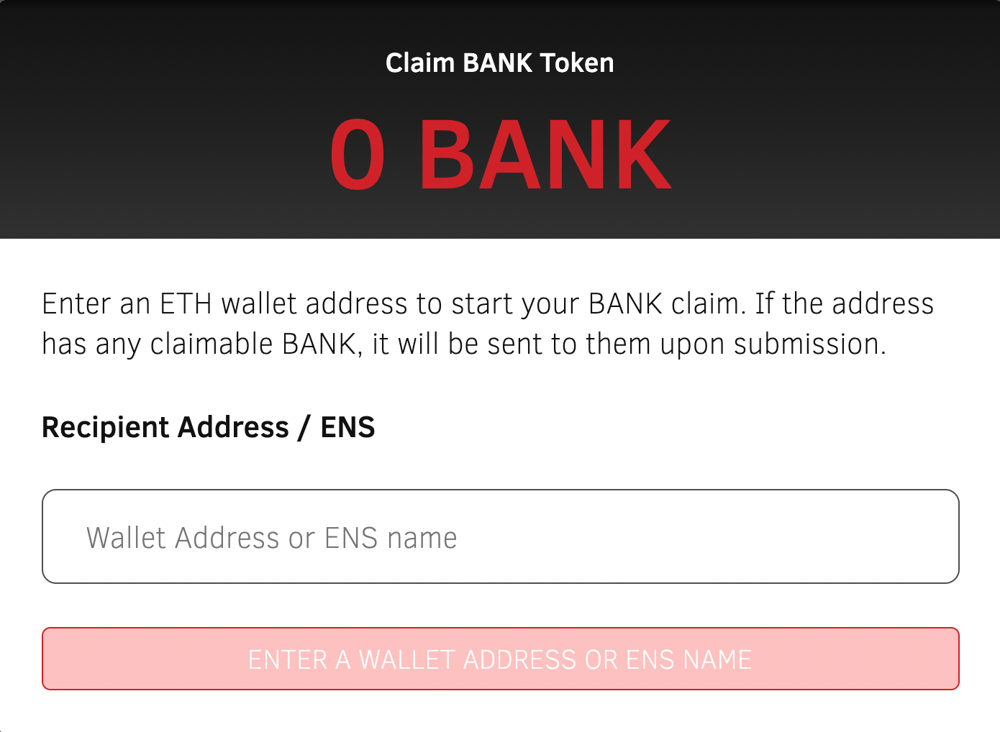
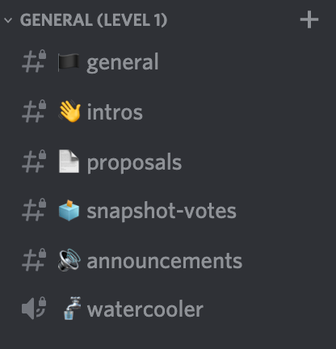
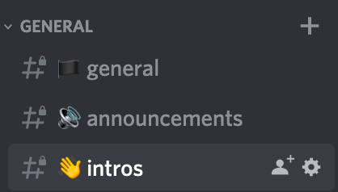

# Getting Started with Bankless DAO

1. 如果你有[BANK](https://etherscan.io/token/0x2d94aa3e47d9d5024503ca8491fce9a2fb4da198)代币，那是因为你参与了Bankless运动。有关如何申领 Bankless 代币以及谁符合条件的更多详细信息，请访问此处。

   一旦您领取了 BANK 代币，就可以参与 DAO。

   这是你的指南。

   # 本指南涵盖的内容：

   1. 如何加入Bankless DAO
   2. 访问Bankless Discord
   3. 添加您的技能并参与其中
   4. 对提案进行投票
   5. 提出新提案

# 1. 如何加入 Genesis 的 Bankless DAO

如果您拥有2020 年或 2021 年的[Bankless 徽章](https://newsletter.banklesshq.com/p/-guide-2-using-the-bankless-badge)，您可以在创世时加入 Bankless DAO。那些过去拥有[BAP](https://newsletter.banklesshq.com/p/introducing-bankless-apparel)或给予[Bankless Gitcoin 赠款](https://gitcoin.co/grants/238/bankless)的人也有能力在创世时加入。

有关创世资格的详细信息，请查看[公告帖子](https://medium.com/bankless-dao/announcing-bankless-dao-133220f5efd8)底部的标准。

PS：最新的加入方法除去持有35000个BANK之外，还有订阅模式，每月

以下是如何加入和参与 Bankless DAO 的创世季节。

**1.**[**阅读公告帖子。**](https://medium.com/bankless-dao/announcing-bankless-dao-133220f5efd8) 滚动到最后，看看您的以太坊地址是否符合*追溯分发*资格标准。（*提示：任何持有*[*2020 或 2021 徽章的*](https://newsletter.banklesshq.com/p/-guide-2-using-the-bankless-badge)*地址**都有资格！*）

**2. 申领 BANK 代币。**如果您的以太坊地址符合公告中的资格要求，请前往[Bankless DAO 网站](https://bankless.community/)，使用 Metamask 或 WalletConnect 连接您的钱包，并领取 BANK 参与代币。

*注意：BANK 代币是无价值的代币——它们仅用于访问 DAO Discord和在 DAO 提案中投票。*

连接符合条件的钱包后，您可以领取 BANK

**3.**[**加入Discord**](https://discord.gg/bjPz2w9Zts)**。**Bankless DAO Discord是 DAO 成员聚集在一起讨论他们可以为 DAO 带来的才能以及围绕治理和提案进行协调的地方。这种Discord需要指定数量的 BANK 代币才能访问所有频道。

使用 35000 BANK，discord 成员部分将神奇地向您开放。

**4. 分享你的技能**

加紧。告诉 DAO 你可以如何帮助它实现使命。当您加入 Bankless Discord 时，请转到 **#intros** 频道并分享您的技能以及您如何为 DAO 做出贡献。我们希望 DAO 需要***开发人员、规划人员、作家、内容制作人、分析师、模因艺术家*和*社区经理***，还有谁知道呢！

加入 discord 后，#intros 频道是你的第一站……不要问 DAO 能为你做什么，而要问你能为 DAO 做什么

**5. 对**[**创世纪提案进行**](https://snapshot.org/#/banklessvault.eth/proposal/QmdoixPMMT76vSt6ewkE87JZJywS1piYsGC3nJJpcrPXKS)**投票****

在claim  BANK 并加入 Discord 之后，您可以对治理提案进行投票。第一个投票项目是由 RSA 和 David Hoffman 提出的创世纪提案。阅读提案并使用 SnapShot 投票赞成或反对。

Should the DAO approve the Bankless DAO Genesis Proposal…YES or NO? [You vote](https://snapshot.org/#/banklessvault.eth/proposal/QmdoixPMMT76vSt6ewkE87JZJywS1piYsGC3nJJpcrPXKS).

## 👉 [**阅读创世提案**](./bankless-genesis-proposal)

# 2. 访问Banklees Discord

Bankless DAO Discord Channel 是该组织的核心沟通和协调中心。加入 Discord 是您帮助 DAO 取得成功的第一步。但是为了访问，你必须持有**35,000 BANK**（[最新价格](https://coinmarketcap.com/currencies/bankless-dao/)）。

加入方法如下：

1. [获取BANK](https://www.bankless.community/)
2. [加入discord](https://discord.gg/bjPz2w9Zts)
3. 按照#Start-Here discord 频道中的说明进行操作
4. 您将需要连接您的钱包并验证您的 BANK 资产
5. 就是这样！你在！

在您以会员身份加入*Discord 后*，请在*#intros*频道中分享您的技能以及您可以为 DAO 做出的贡献。

当您参与 DAO 时，新频道将为您解锁。最初，discord频道访问分为三个级别。

- **级别 1：**会员（35,000 BANK）
- **级别 2：**贡献者（35,000 BANK + Genesis Team 的邀请）
- **级别 3：**鲸鱼（150,000 BANK）

我们希望随着时间的推移添加新的访问级别并重新配置现有级别。discord访问分层的总体目标是奖励参与并将社区管理为对关键可交付成果负责的[较小](https://newsletter.banklesshq.com/p/find-your-squad-and-build-vibes)团队。

# 3. 增加你的技能并参与进来

对于合适的人来说，机会并不缺乏。DAO 将需要**内容创建者、媒体节点、设计师、构建者和人员**来管理所有这些项目。

在创世纪，我们想更多地了解你的技能——你能为 DAO 做些什么？首先向#intros 频道介绍自己并分享有关您的才能的详细信息。

**然后，开始为 DAO 做一些事情。**不要等待被告知该做什么。*开始编写、构建、创建。*当你所做的事情符合[DAO](https://www.bankless.community/mission)的[使命时，](https://www.bankless.community/mission)它会找到奖励你参与的方法。

创世时的一些潜在需求：

- 社区经理（*discord管理 + 支持 + 每周 mtgs*）
- Twitter Meme Lord（*对*[*Bankless DAO twitter 的*](https://twitter.com/banklesshq)*共享控制*）
- 每周 DAO 更新的[*子*](https://banklessdao.substack.com/)堆栈编写器（[*子*](https://banklessdao.substack.com/)堆栈上的*每周更新*）

# 4. 对提案进行投票

BANK 代表对治理提案的投票权。所有提案的头脑风暴、讨论和信号都将在 Discord 的*#proposal*部分进行。您可以在#snapshot-votes 频道中监控任何转移到链上快照投票的新提案。

投票方式如下：

1. 前往[Bankless DAO snapshot](https://snapshot.org/#/banklessvault.eth/)
2. 连接您持有 BANK 的钱包
3. 查看有效提案
4. 阅读、考虑和投票！

# 5. 提出新提案

最初，治理提案将以#proposals 频道中的讨论或通过社区呼吁产生的想法开始。从那里，任何好的初始想法和倡议都可以通过使用 🔥 表情符号以及全面的讨论对消息做出反应来表示支持。

如果围绕该主题有大量支持或讨论，作者可以起草更正式的规范。编写完成后，版主将为讨论、发信号、修改等打开一个特定的渠道。

在发布后的前 30 天内，DAO 的主要重点是第 1 季的创世分配和规划。

我们希望采用其他 DAO 社区的最佳实践，将我们的治理发展为最佳系统。

Reference:https://medium.com/bankless-dao/getting-started-with-bankless-dao-94b0b60e052e

翻译校对：DApp Learning / Survivor