#About DAOhaus
+ 网址：https://daohaus.club/
+ app：https://app.daohaus.club/
## 主要功能
+ 主要功能：只要metamask有一点ETH，就可以创建一个DAO，并且自身也是一个DAO的聚合。
+ 功能细节
### Guilds
+ Work collectively to offer services
+ 最出名的最近是YGG（Yield Games Guild）了，发行了自己的Token，在本次Axie风口显示了实力。
+ 工会、行会，YGG定位帮助普通人利用玩游戏挣钱：Play to Earn。

### Clubs
+ Little to no financial decisions
+ 俱乐部方式，这个比较开放，例如学习某个主题的俱乐部，德州，DeFi等等。
+ 类似同好会的组织形式。

### Ventures
+ Large to XL financial decisions
+ 最早最著名之一是The DAO，志愿者募捐了几千万的ETH，期待能一起合力，投资未来（后来被黑客攻击）。
+ 2021七月最火爆的，是由部分中心化完全过渡到了去中心的MakerDAO，创始人Rune Christensen，抛弃巨大利益，令人钦佩。
+ 一群人组建MakerDAO，通过共识建立了Maker协议，通过联合抵押一组加密资产，铸造了Dai这种去中心化的稳定币。
+ Maker protocol, which uses a combination of crypto assets to operate and maintain DAI without the need for any bank or government. 

### Grants
+ Distribute wealth together
+ 可理解为授权收益分配，主要用来赞助和推动自己认可的项目。

### Products
+ Govern a Product or Protocol
+ 为创造和研发一个产品，聚合在一起的组织，Uni，Sushi，ACryptoS，许多DEX，应该都算这个类型（个人理解）。
+ 不是Venture，而是通过一起打造一个产品聚合的社区。
## 图
+ 创建DAO
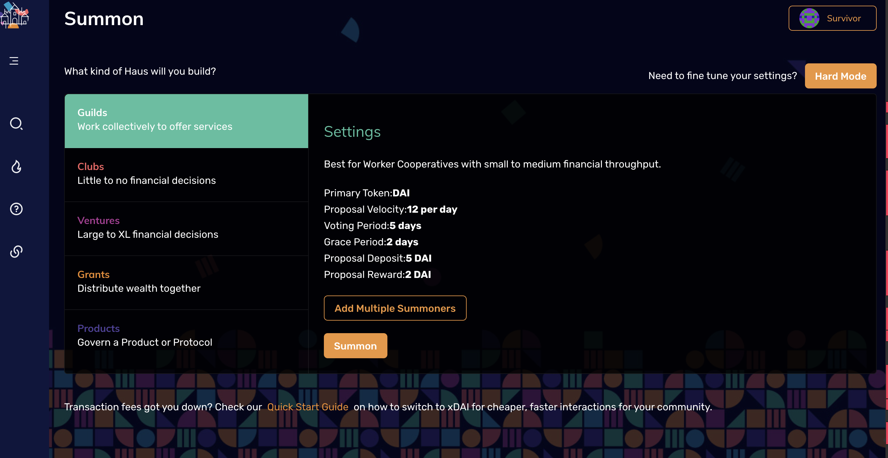
+ 354个DAO lists（包含目前成员只有一个的Asset3，我的社区^_^)
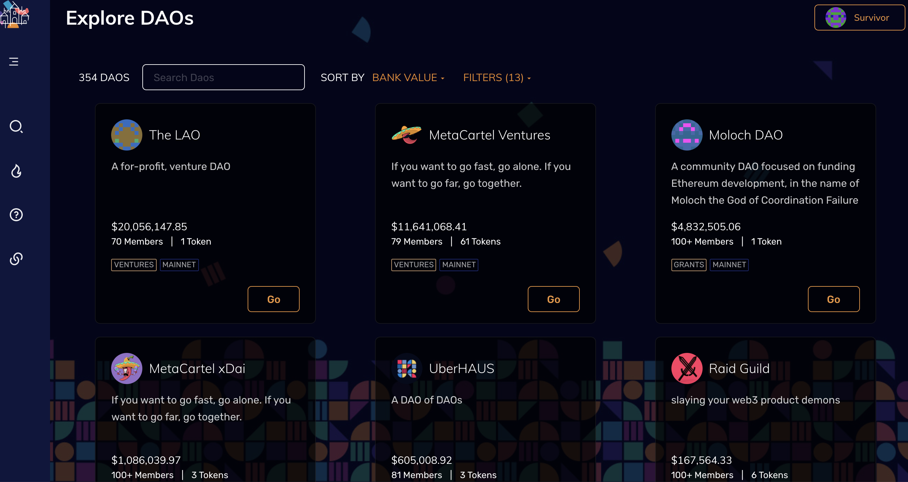

  
## 创建一个DAO
+ 访问https://app.daohaus.club/
+ 选择用哪个钱包接入，注意选择Mainnet，钱包内大约需要0.1以内的ETH余额。
+ 连接后，进入的左侧如图
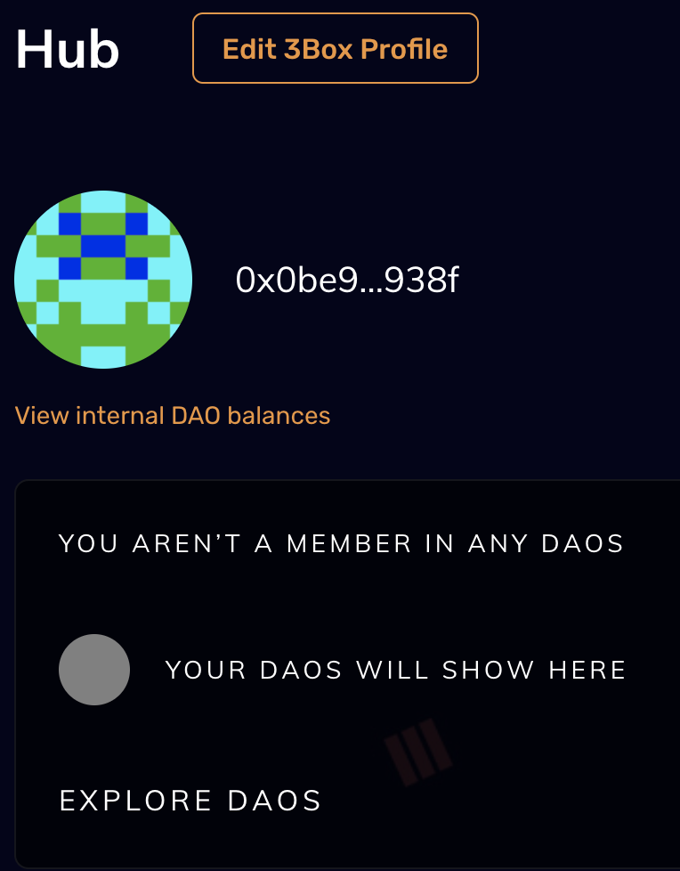
+ 第一次来DAOhaus，有四个选择：
1.	Explore：找到所有的DAO，默认会给列出当下354个DAO。
2.	**Summon**：直译是召唤，呼朋唤友，建立一个DAO。
3.	Help：指向相关文档链接。
4.	Community link：DAOhaus的相关社交媒体等的链接。
+ 左侧上方，有切换到其他DAO的链接（如果你有多个DAO的话）。
+ 右侧如图：
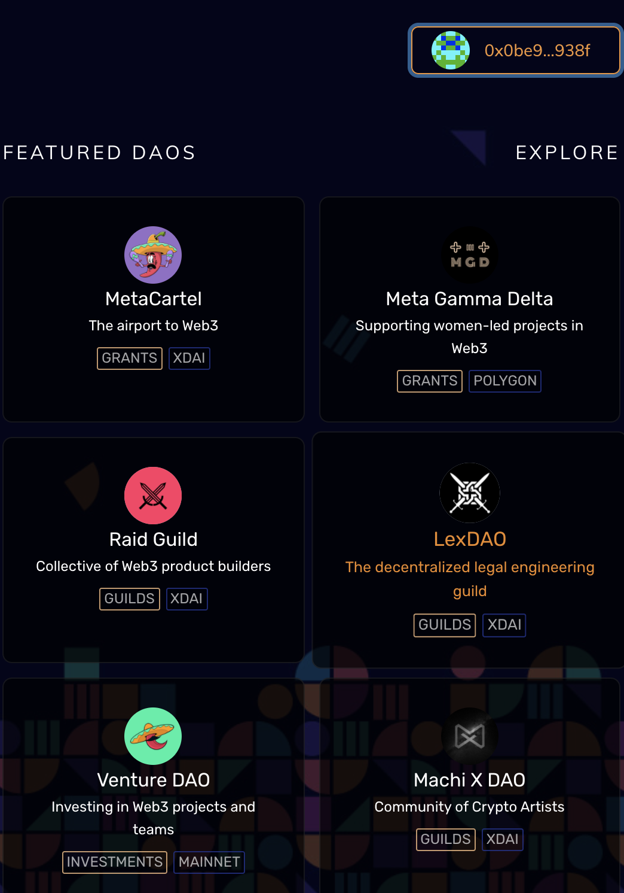
+ 列出了一些热门DAO，例如MetaCartel（元的卡特尔？）等等。
+ 你可以右上角切换你的登录钱包地址和方式。
### Summon =Create a DAO
+ 点击Summon，如上文所示，会让你选择DAO类别，例如工行还是投资组织或者赞助组织等等，我们选择Guilds。
+ 会发现有默认的设置（会传递给链上的Contract）。
+ Primary Token:WXDAI
+ 默认token，选择是wraped xdai，后面可以改。
+ Proposal Velocity:12 per day
+ 提社区提案的速度，默认每天12。
+ Voting Period:5 days
+ 投票通过提案的速度，默认5天。
+ Grace Period:2 days
+ 冷静期：默认两天
+ Proposal Deposit:10 WXDAI
+ 提案存款：10wxdai（如果未通过，则按规则一般罚没，纳入社区财库，也可以设置其他规则处置）
+ Proposal Reward:1 WXDAI
+ 提案奖励：1wxdai（如果通过后）
+ 上述参数，都是传递给molochv3.sol的参数，用来在以太坊主网创建链上数据。
+ 还可以 Add Multiple Summonners（添加多个发起人）。
+ 快速建立的话，点击黄色的Summon即可。
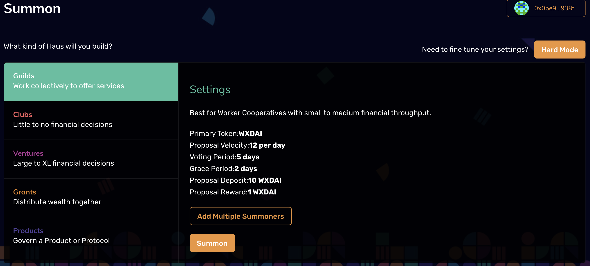
+ 然后钱包确认付费（会有两次确认）。
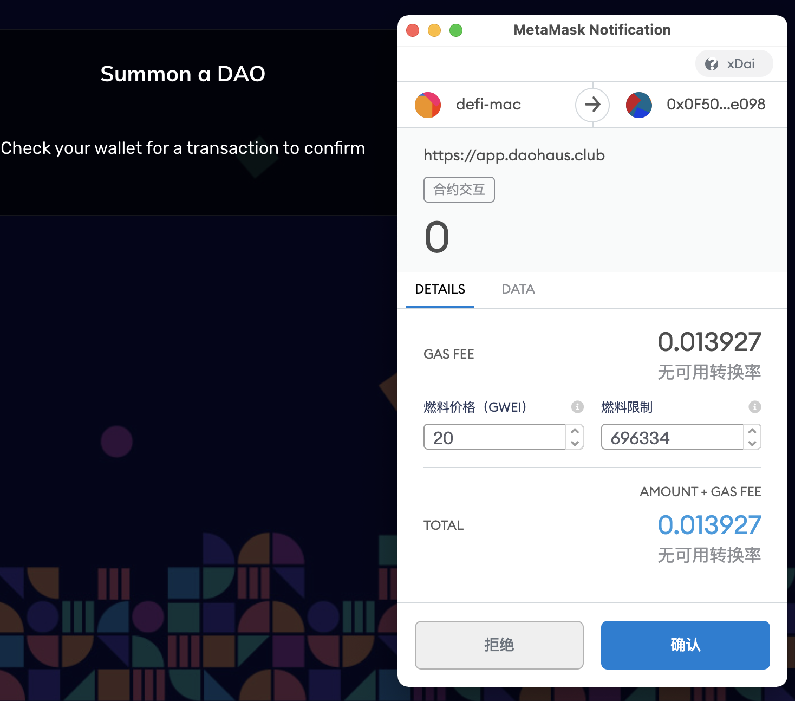
+ 如果想要定制化，例如某DAO的投票通过提案速度要求是3天，冷静期是7天等等，可以点击右上方的“Hard Mode”
+ 会有更多定制内容提供给你，如图：
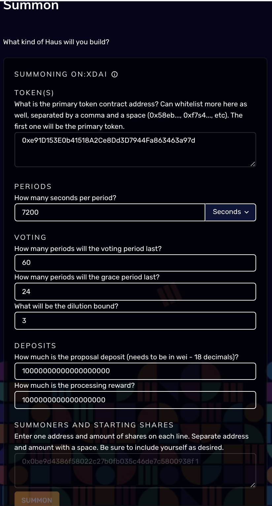
+ 这里跟踪了这个contract（moloch.sol）地址：https://etherscan.io/address/0x38064f40b20347d58b326e767791a6f79cdeddce，可以看到，基于DAOhaus的智能合同，所有的建立记录：
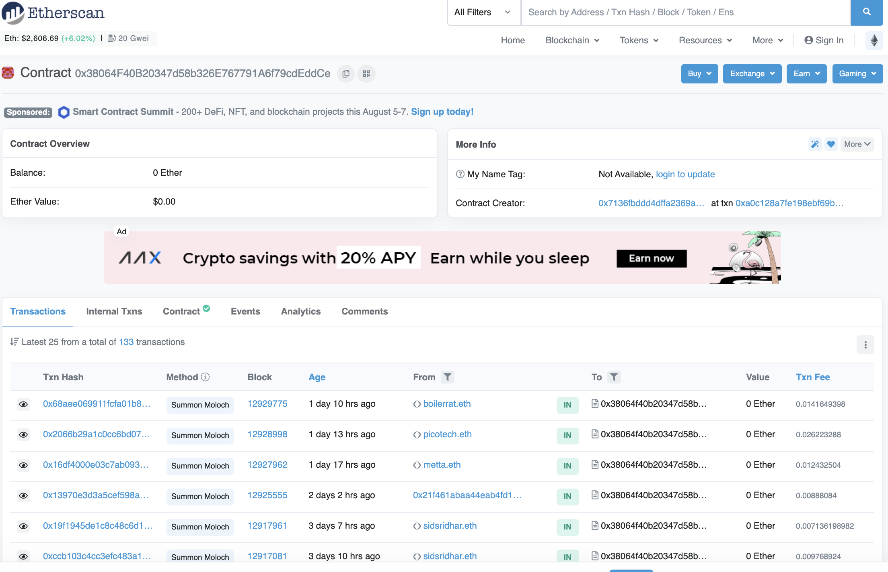
### 管理一个DAO
+ 创建完成后，需要日常管理，链接钱包登录DAOhaus
+ 左侧菜单，除去Change DAO（切换DAO），Community links之外
+ 还增加了：
+ Proposals：提案
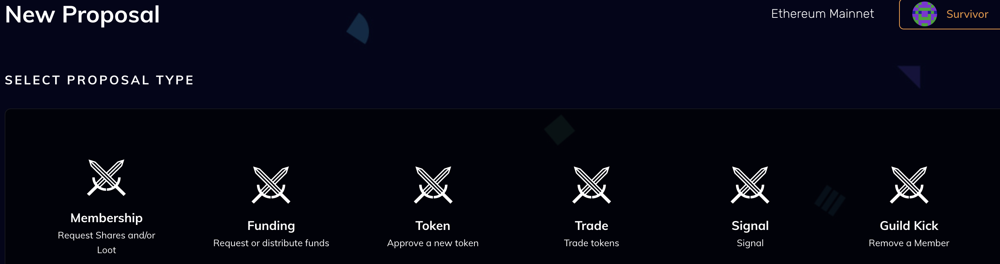
+ 看图可知，有多重提案类型，加入/踢人，交易，发行新token，基金求助/资助，还有个Signal，发出信号？这个不了解，懂的同学补充下信息。
+ Vaults：财库
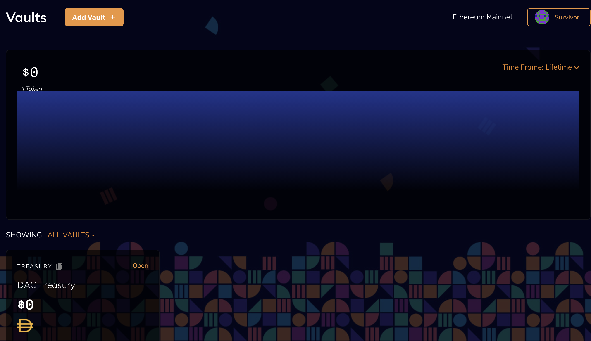
+ 展示属于DAO的相关链上资产，默认WXDAI，可以自己添加多个Vault
+ Members：会员
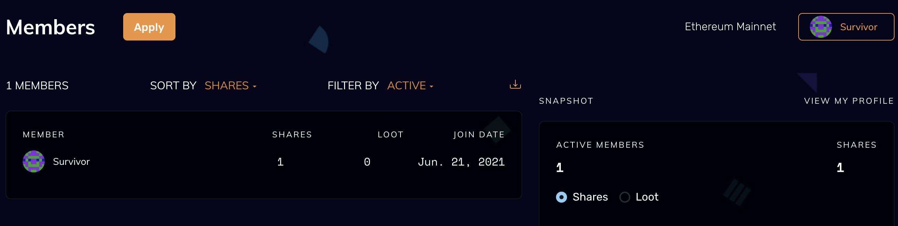
+ 显示你的会员信息，新创建的DAO，初始状态只有Summoner一个人。
+ Settings：设置
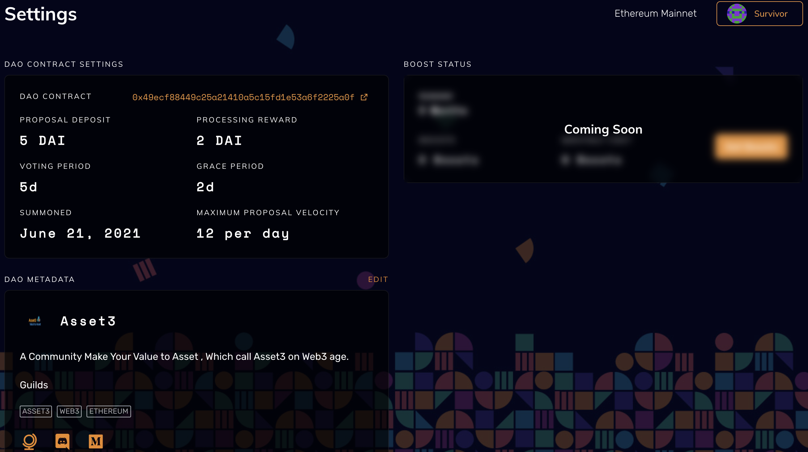
+ 这个不解释了，常规信息设置信息，注意的是，有些是不能修改的，例如提案押金存款等，因为已经是链上数据。
+ Boosts：加速

+ 可以理解为插件，扩展DAO的场景应用能力，例如Discord插件，当有提案通过或者其他DAO事件发生的时候，自动发送Discord社区消息。
+ Allies：联盟
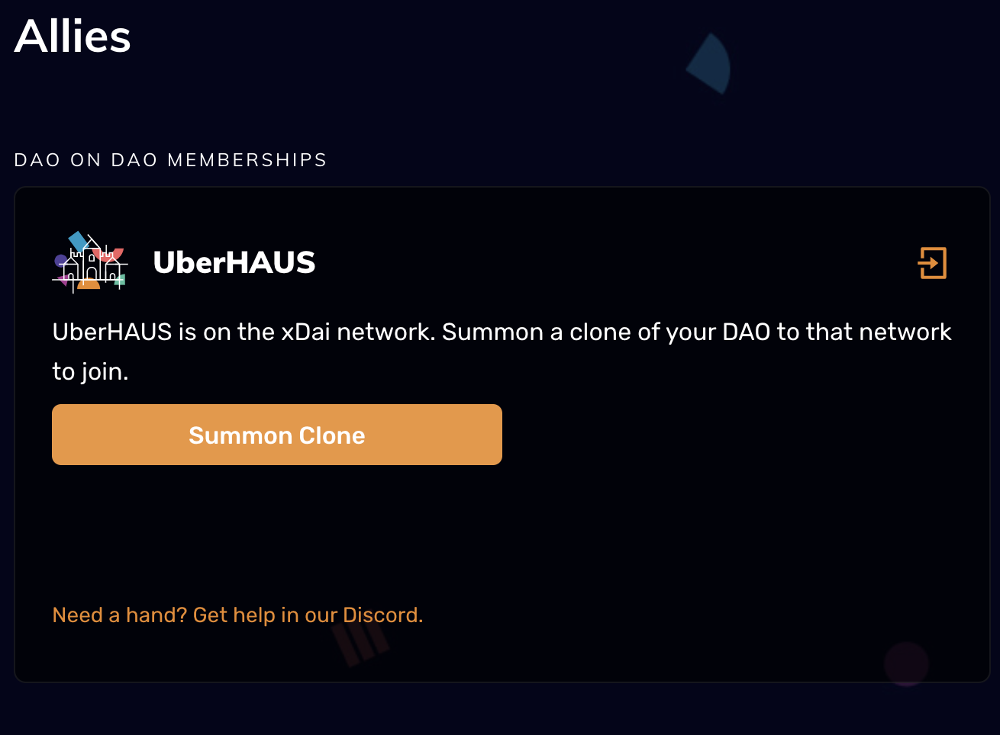
+ 目前看没有创建联盟的入口，猜测是官方建立了一个UberDAO，用来联盟，目前在xDAI网络上。
+ Profile：档案
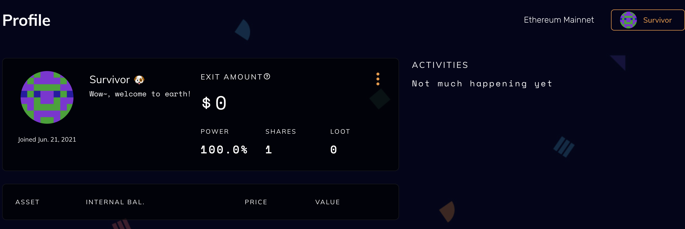
+ 这里指登录钱包（用户）的档案信息。
## 其他

+ DAOhaus由**[Raid Guild](https://raidguild.org/)**（一个研发者组织）投资建立，基于Moloch的基础代码，建立了前端管理页面，以快速建立DAO为目标。

+ DAOhaus推动了许多DAO组织的建立，在易用性上，DAOhaus突出一些。

+ DAOhaus已经发行了自己的Token：HAUS，价格10USDT左右。

+ Token总容量未知（社区决定），Coincapmarket信息：

+ Github代码地址：https://github.com/HausDAO/daohaus-app

+ Medium：https://medium.com/daohaus-club

  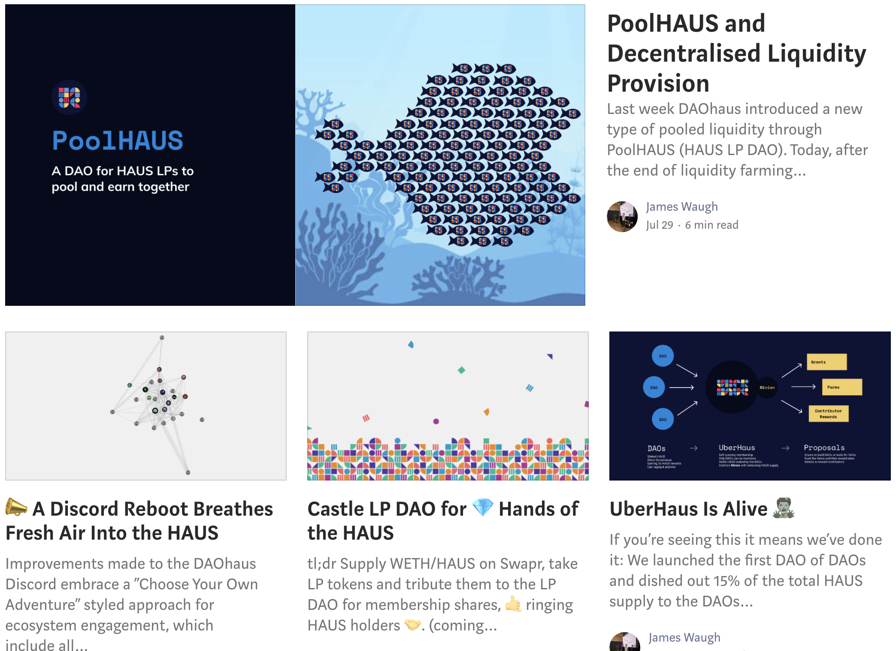

+ ## TODO list

+ launch：https://medium.com/daohaus-club/haus-launch-bd781bbbf13a

+ 目前未找到白皮书，官方Medium有launch近似白皮书的文章，稍后翻译，不在本文范围。