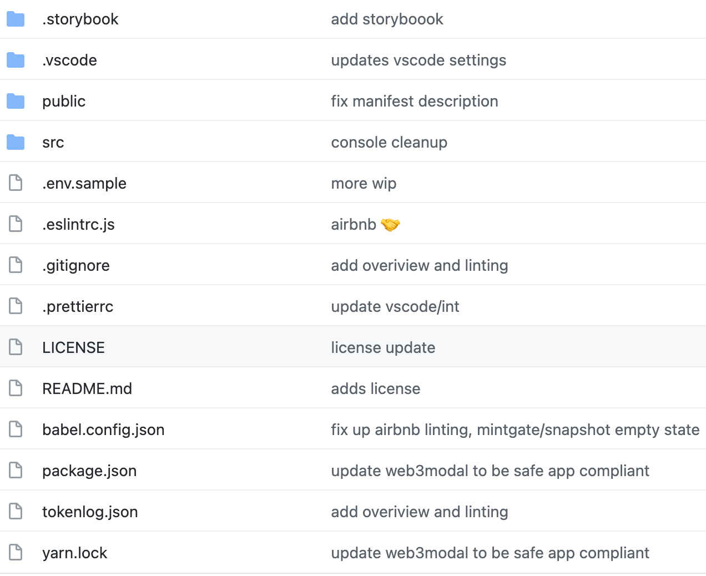

## DAOhaus Code Analysis Frontend
+ DAOhaus前端：https://github.com/HausDAO/daohaus-app（内部代号pokemol项目）
+ DAOhaus后端：https://github.com/MolochVentures/moloch/(Moloch合约代码)
+ 本文分析前端代码
### App结构
+ 这里分析整体目录结构和主要代码实现的功能。

+ 可以看到，主要目录是public、src
+ public目录是index文件、favor icon等页面文件关联内容，无业务流程，略过。
+ src目录非常多子目录，粗粗看了下，结构并不太合理，只能根据页面主要功能找到路径，再结合目录，来分析对应代码。
#### index.jsx
+ react render，应用app，注入app内容。
```
import React from 'react';
import ReactDOM from 'react-dom';

import './index.css';
import { BrowserRouter } from 'react-router-dom';
import App from './App';
import reportWebVitals from './reportWebVitals';
import { InjectedProvider } from './contexts/InjectedProviderContext';
import { CustomThemeProvider } from './contexts/CustomThemeContext';

window.onunload = () => {
  sessionStorage.clear();
};

ReactDOM.render(
  <React.StrictMode>
    <BrowserRouter>
      <CustomThemeProvider>
        <InjectedProvider>
          <App />
        </InjectedProvider>
      </CustomThemeProvider>
    </BrowserRouter>
  </React.StrictMode>,
  document.getElementById('root'),
);
```
+ 如果调试性能：reportWebVitals(console.log))，更多参考https://bit.ly/CRA-vitals
#### app.jsx
+ 应用主要文件，汇集所有关键功能代码，输出app
```
import React from 'react';
import { Switch, Route, Redirect } from 'react-router-dom';

import { UserContextProvider } from './contexts/UserContext';
import { ExploreContextProvider } from './contexts/ExploreContext';
import Hub from './pages/Hub';
import Dao from './pages/Dao';
import Explore from './pages/Explore';
import Summon from './pages/Summon';
import Register from './pages/Register';
import DaoSwitcherModal from './modals/daoSwitcherModal';
import TxInfoModal from './modals/TxInfoModal';
import FourOhFour from './pages/404';
import HubBalances from './pages/HubBalances';
```
+ 可以看到，关键的Hub：聚合功能、Dao本身管理、Explore搜索更多DAO、Summon召唤新建一个DAO等等，都有了，不一一解释，基本和首页对应，我们来探索下。
### 钱包连接
+ 这里分析下链接钱包的过程，包括profile的加载和现实。
+ [欢迎认领~！issue留言即可！](https://github.com/rebase-network/Dapp-Learning/issues/99)
### 获取链上数据
+ 这里分析获取链上的已经存在的DAO信息和其他链上数据。
+ [欢迎认领~！issue留言即可！](https://github.com/rebase-network/Dapp-Learning/issues/99)
### 调用智能合约
+ 这里主要分析调用Moloch智能合约的过程，入口和返回参数等。
+ [欢迎认领~！issue留言即可！](https://github.com/rebase-network/Dapp-Learning/issues/99)
### 新建DAO
+ 这里完整跟进一个建立新DAO的过程。
+ 新建DAO核心是合约参数传递给Moloch线上合约，然后运行，生成新建DAO的配置数据，写入链上，并且发行新建DAOToken的过程。
+ [欢迎认领~！issue留言即可！](https://github.com/rebase-network/Dapp-Learning/issues/99)

### 插件系统
+ 这里分析几个插件系统运作机制：snapshot proposals、Token supply、discord消息三个，如果有新力量加入，欢迎分享、分担一部分分析工作，欢迎认领~！
+ [欢迎认领~！issue留言即可！](https://github.com/rebase-network/Dapp-Learning/issues/99)

### 其他
+ DAOhaus is a no code platform for Moloch DAOs. index.html的meta content标签内容。
