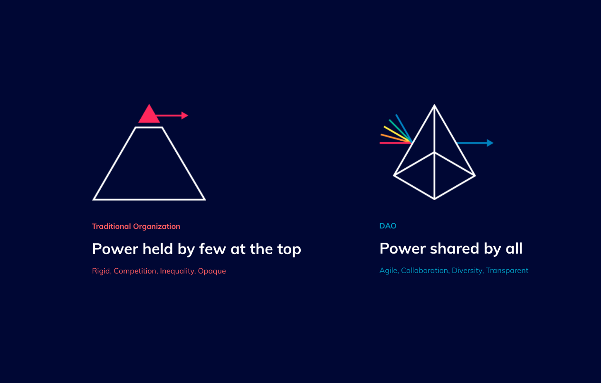
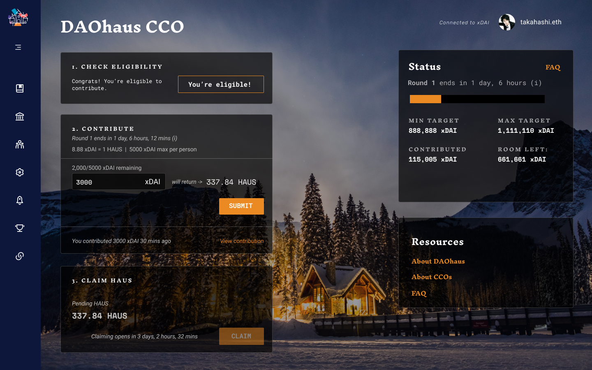
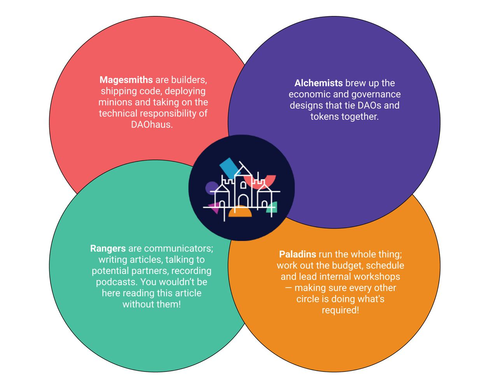
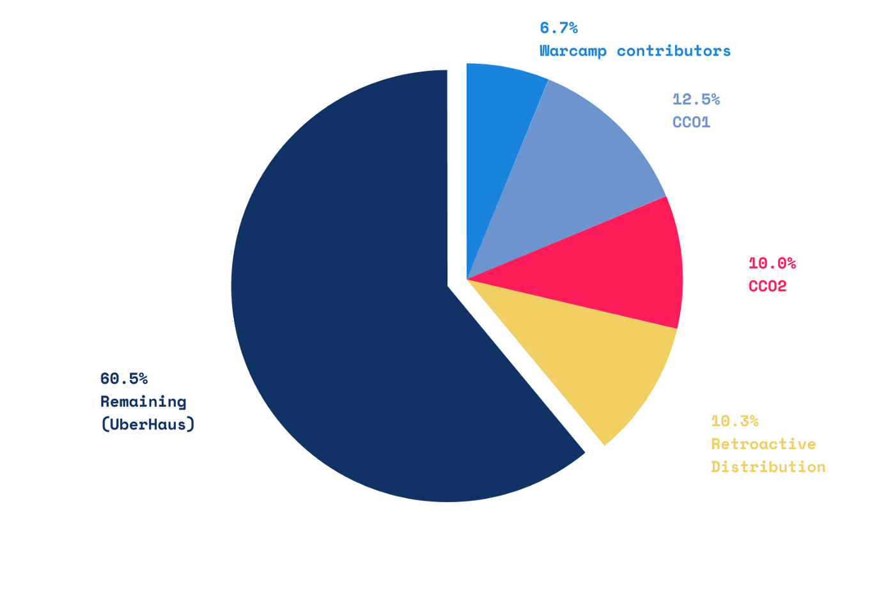
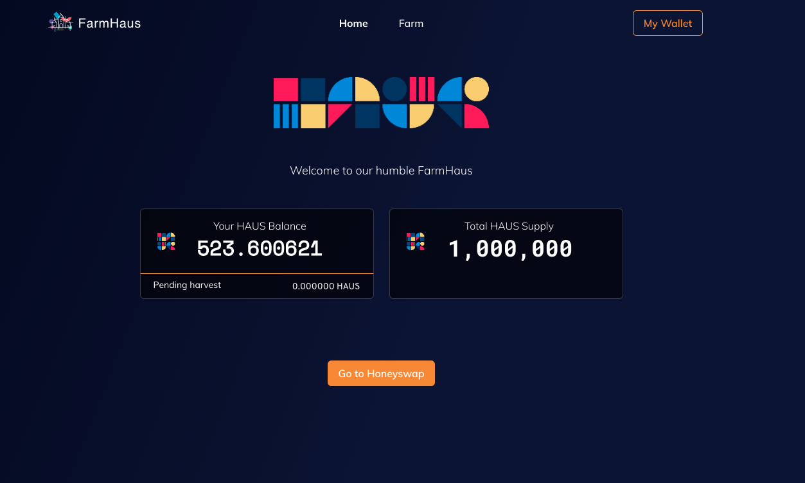
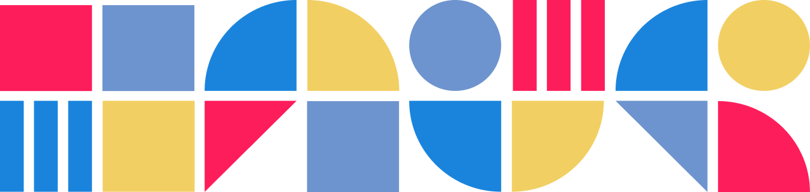

# DAOhaus Launch- 中文翻译+解读

+ James Waugh，DAOhaus发起者之一（RaidGuild成员）。
+ 在2021年3月份，Medium上发布了一篇文章：https://medium.com/daohaus-club/haus-launch-bd781bbbf13a
+ 主要目标是宣布整体Token空投计划，包括建立了UberDAO这个多个DAO的联盟，把60.5%的Haus代币捐赠到了UberDAO金库。
+ 以下是自动翻译+人工校对后版本：

## 什么是DAOhaus

[DAOHaus](https://daohaus.club/)是[出生于2019 ETHBerlin](https://medium.com/odyssy/daohaus-bauhaus-b855cd9db19e)，一个黑客马拉松项目，旨在更容易（或可能的），与互动[Moloch DAO智能合同](https://github.com/MolochVentures/moloch/blob/master/v1_contracts/README.md)在人类可读的方式。经过几天的时间，Club Mate 引起了狂热，DAOhaus 的第一个构建诞生了！因此，开始了近两年的旅程，重点是为以太坊生态系统带来更多开放的金融协作工具。

## 为什么 DAO 很重要

DAO 强制执行信任并允许人力和资本的协作。**当被剥离时，DAO 只是一组智能合约，它允许人们汇集资本，投票决定如何分配该资本，如果他们愿意，可以按比例退出该资本**。

从历史上看，如果一群人想要将他们的资源集中到一个共同的目标上，则需要选出其中一个人来掌管这笔钱，或者这笔钱需要管理一个特定的账户，从而使该团队走向失败因人为错误、故意盗窃或更广泛的审查的失败状态。现在，我们可以将这一责任委托给一个智能合约，该合约被预先编程为仅根据一组预先确定的标准部署资本。这允许一群人进行协作，而**无需相互了解或信任**。

Moloch DAO在“The DAO”和导致其崩溃的合同错误之后中断了几年，在以太坊生态系统中[重新启动了这种 DAO 心态](https://medium.com/axialabs/relearning-to-dao-craft-b815b3e3f8ef)。**DAO 是以太坊和全球数字社区发展不可或缺的一部分，而 DAOhaus 就是为了实现这一目标。**

## 社区从第一天开始资助

从捐款到社区贡献，DAOhaus 一直由其用户资助。2020 年初，DAOhaus 举办了第一次[社区贡献产品（CCO， Community Contribution Offering ）](https://medium.com/daohaus-club/fair-launch-transmutation-proof-of-contribution-and-haus-2ab93c7727b4) ——允许活跃的社区成员通过承诺不可转让的 DAO 股份（称为 Loot）来播种营运资金。

使用称为**Transmutation**的过程，这些贡献者收到了他们按比例分配的 HAUS 代币，**因为 DAO 花费了资金**。今天，我们很高兴分享HAUS CCO1的成果和HAUS的公开发布！

## 真正的渐进式去中心化

DAOhaus 一直是敢作敢为和社区第一。大约 20 人的“核心 DAO”围绕 HausDAO 进行远程工作和协作，以将[DAOhaus v2](https://app.daohaus.club/)和 HAUS 令牌变为现实。

从来没有任何贡献者获得过薪水，所有的工作都是在提供**价值的基础上**获得奖励的，*沟通*和*透明度是首要*原则。与您在传统公司中可能会发现的僵化部门不同，我们以灵活的**圈子**模式运作，一群人负责 DAOhaus 的不同方面。大多数人属于不止一个，并且没有入门要求——只要出现并提供价值！

- 🧙‍♂️ **Magesmiths**是构建者、发送代码、部署 Minion 并承担 DAOhaus 的技术责任。
- 🏹**游骑兵**是沟通者；撰写文章、与潜在合作伙伴交谈、录制播客。没有他们，你就不会在这里阅读这篇文章！
- ⚗️**炼金术士**酝酿将 DAO 和代币联系在一起的经济和治理设计。
- ⚔️**圣骑士**负责一切；制定预算、安排日程并领导内部研讨会——确保其他每个圈子都在做需要的事情！
- 翻译到这里感觉很好玩，用游戏方式来定位角色和分工，很有代入感~！

## Daohaus发布会

现在是**HAUS**向更广泛的以太坊生态系统启动的时候了，旨在进行新水平的数字协作。在发布时，HAUS 将用于管理 UberHAUS DAO，它只能由其他 DAO 管理，在以太坊和治理空间内建立一个新的实验。

为了**在 DAO 治理上**引导这个**DAO**，DAOHaus 正在向 Moloch 生态系统中的 DAO空投**10.3% 的 HAUS**，包括：[MetaCartel](https://www.metacartel.org/)、[Raid Guild](https://raidguild.org/)、[Meta Gamma Delta](https://twitter.com/metagammadelta)、[Venture DAO](https://metacartel.xyz/)和另外 70 多个 DAO！通过向 DAO 空投 HAUS，DAOHaus 可以在它们之间强制执行某种“最低级别的协作”，让每个 DAO 选择自己的路径。**DAO 协作的新实验！**

在 DAO 分配之外，HAUS 将通过 **社区贡献机会** 进行分配，在那里获得 **“DAO 证明”** 状态的地址将能够向 CCO 贡献多达 5000 个 xDAI。查看[HAUS 页面](https://daohaus.club/token)并[在此处](https://app.daohaus.club/cco)检查[地址资格](https://app.daohaus.club/cco)！

在**3月15日**，HAUS将推出世界，用4天缴款期开放给 **所有符合条件的地址。** HAUS CCO 的目标是收集 888,888 美元的 xDAI，在达到 111 万美元的 xDAI（HAUS 的 12.5%）上限后，或贡献期结束后，销售将结束。然后 HAUS 将分发给所有参与者，他们将能够从几种前进的道路中进行选择。**HAUS 将在 3 月 29 日开始销售两周后分发。**

## HAUS 代币详情

**总供应量：** 1,000,000 HAUS
**流通供应量：** 387,000 HAUS

**Haus 分布：**

### UberDAO 社区金库

**60.5% HAUS** (605k HAUS) 仍然由 UberDAO 持有，UberDAO 是由 HAUS 和其他 DAO 控制的总体 DAO——由社区管理。如何分配剩余的 HAUS 的示例包括：机制农业、委托/投票激励、流动性激励、治理挖矿等。

### 追溯分发

**10.3% HAUS
7% HAUS** (70k HAUS) 分配给现有的 Moloch DAO，基于多种因素；价值吞吐量（WETH/DAI 输入/输出）、总体使用情况（gas 消耗）和唯一成员。

**3.3% HAUS** (33k HAUS) Moloch DAO 用户空投——*更多细节即将推出！*

### CCO1 分配

**12.5% HAUS** (125k HAUS) 分配给 CCO1 贡献者，参与 CCO1 的 Moloch DAO 社区核心成员，250,000 DAI 贡献给 HausDAO，发生HAUS[嬗变](https://medium.com/daohaus-club/fair-launch-transmutation-proof-of-contribution-and-haus-2ab93c7727b4)！

### CCO2 分配

**10–12.5% HAUS** (100k-125k HAUS) 通过下面描述的“DAO 证明”机制分配给符合条件的 CCO2 贡献者。

### Warcamp 贡献者分配

**6.7% HAUS** (67,000 HAUS) 分配给“Warcamp”贡献者，即围绕该项目成立的 DAOhaus 社区成员。

## 社区贡献2：DAO的证明

DAOhaus 开始将 HAUS 分发给更广泛的 **以太坊治理参与者**群体。**“DAO 证明”** 是将 HAUS 分发给愿意协作的人的最佳方式之一，确保项目在启动后保持参与优先的心态！

**有大约 122k 个地址已经“证明”符合 HAUS 分配的条件，以下所有行为都表明愿意在以太坊生态系统内进行治理，因此包括在内：**

- 所有曾经发送或接收[TheDAO](http://0xbb9bc244d798123fde783fcc1c72d3bb8c189413/)代币的地址
- [快照空间的](https://snapshot.page/)所有成员
- 来自[Aragon](https://aragon.org/)投票模块的所有投票创建者和选民
- 所有带有 VoteCast 或 DelegateChanged 的地址来自[Compound](https://compound.finance/)
- 从所有stakers[向往](https://yearn.finance/)放样事件发出
- 从VoteCast或DelegateChanged所有地址[Uniswap](https://uniswap.exchange/)
- 来自[DXDAO](https://dxdao.eth.link/#)的“收件人或[发件人](https://dxdao.eth.link/#)”字段中的所有地址
- 来自[Aave 的](https://aave.com/)所有带有 VoteEmitted 事件的地址
- 所有[Moloch DAO](https://app.daohaus.club/explore)用户

> 每个已证明合格的地址将能够向 DAOhaus CCO 贡献最多 5,000 DAI。

## 参与 HAUS

HAUS 将在主网上启动，并在贡献窗口桥接到 xDAI。任何参与 HAUS 分发的人都需要加入 xDAI！您需要将 DAI 从主网桥接到 xDAI，有关如何执行此操作的说明将在 HAUS CCO 资格网页上提供。

在 xDAI 上部署 HAUS 会增加协作成本以换取实际成本的降低，将向 CCO 做出贡献所需的总 gas 支出从约 100 美元减少到约 0.10 美元，对于那些驱动足以参与的地址而言，节省了 1000 倍。HAUS 发行版的设计目的是将**积极的社区协调员**作为接收和管理 HAUS 的主要候选人。

## 在启动时使用 HAUS 的不同选项：

在启动时，DAO、DAO 贡献者证明和 HAUS 持有者将通过**三种不同的方式**参与 DAOhaus 生态系统和治理：

- **首先**，HAUS 持有者有机会参与 UberHAUS DAO、HAUS 的主要治理机制和 DAOhaus 协议。UberHAUS DAO 的会员资格仅限于 Moloch DAO，因此如果您想参与；加入一个或召唤你自己的，这很容易！**更多关于 UberDAO 的信息即将推出！**

- **其次**，通过 **“幕府将军”** 质押 HAUS 持有者可以为[HoneySwap](https://honeyswap.org/)上的 ETH/HAUS 提供流动性，并通过快照获得“软”信号能力，以及 HAUS 奖励。
- **最后**，**“Ronin”** 质押允许 HAUS 持有者仅“质押”他们的代币以获得“软”信号能力和 HAUS 奖励。

所有这三种激励结构都将在HAUS 发布后运行**一个月**，届时 HAUS 持有者和 DAO 贡献者将决定下一步的最佳步骤，无论是继续当前的激励措施还是开发新的激励措施！

## 前方的路

DAOhaus 正在为可访问的链上治理铺平道路。

除了 HAUS Launch之外，DAOhaus 将很快推出许多旨在使 DAO 比以往更容易的更新。如果您或您认识的人正在寻求协作数字社区，DAOhaus 适合您。

> **与此同时，请进入**[**Discord**](https://discord.gg/GzQhnuNf)**对上述所有问题和评论。并密切关注**[**DAOhaus Twitter**](https://twitter.com/nowdaoit)**！**
>
> 这只是一场正在进行的数字协作革命的开始，我们期待在这一旅程中扮演一个小角色。

## Haus out！

> 本文和Haus launch的完成和发布，离不开下列这些贡献者的辛苦工作：
>
> [Ven Gist](https://medium.com/u/d363577fdcab?source=post_page-----bd781bbbf13a--------------------------------)
>
> [Sam Kuhlmann](https://medium.com/u/12efc587510?source=post_page-----bd781bbbf13a--------------------------------)
>
> [Dekan Brown](https://medium.com/u/4f43cb946593?source=post_page-----bd781bbbf13a--------------------------------)
>
> [Callum Gladstone](https://medium.com/u/351fa47c3052?source=post_page-----bd781bbbf13a--------------------------------)
>
> [Adam J Kerpelman](https://medium.com/u/480de4b12a56?source=post_page-----bd781bbbf13a--------------------------------)
>
> [Cooper Turley](https://medium.com/u/af8b40222d18?source=post_page-----bd781bbbf13a--------------------------------)
>
> 还有更多！
> 
-----
由Rebase社区 Survivor焦翻译校对，一起拥抱Web3，一起拥有Asset3！

