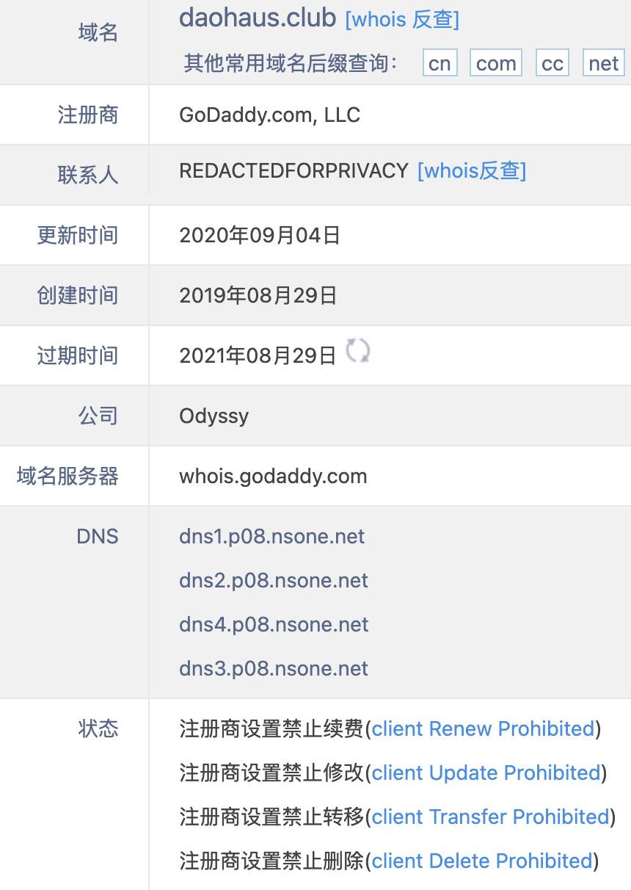
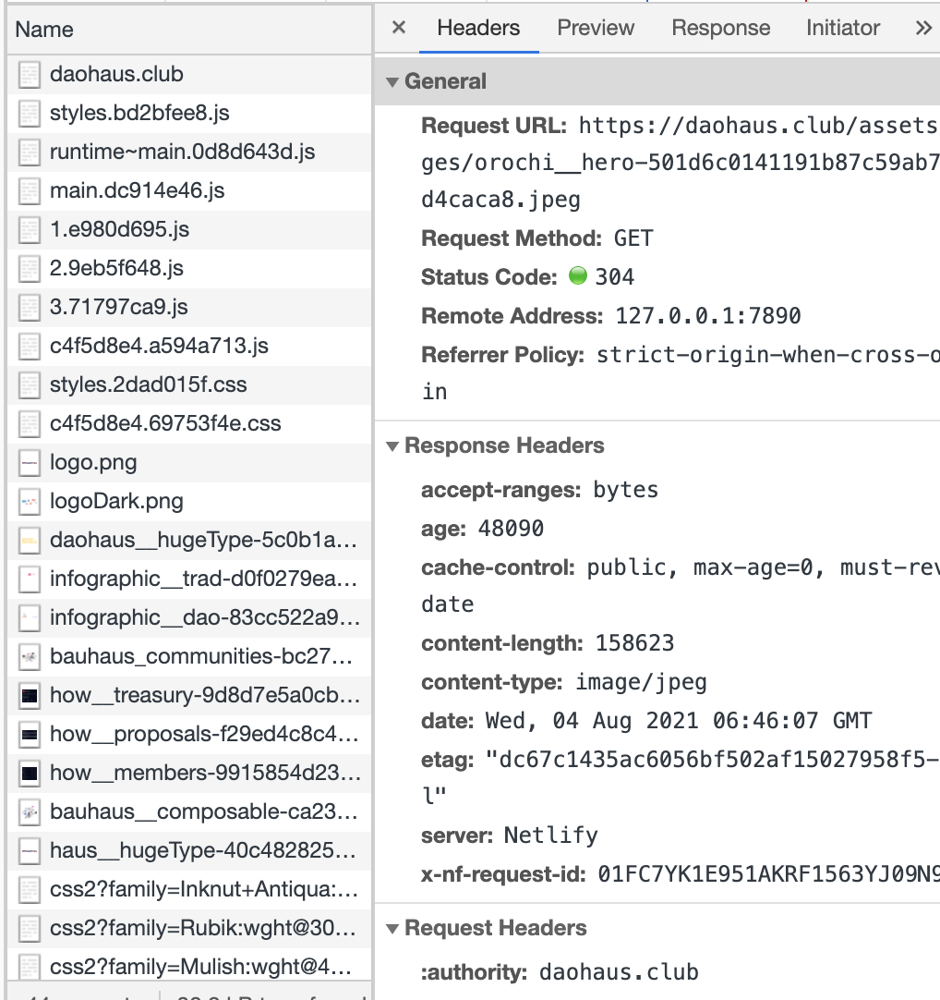
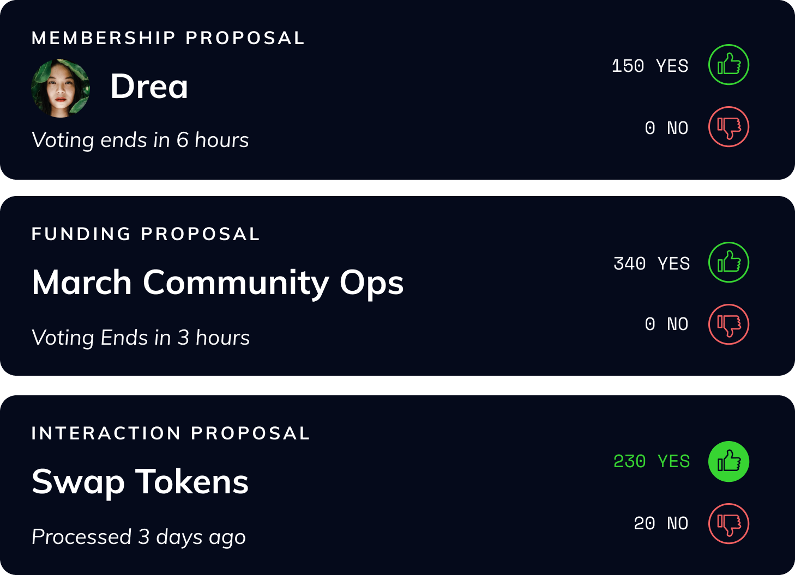
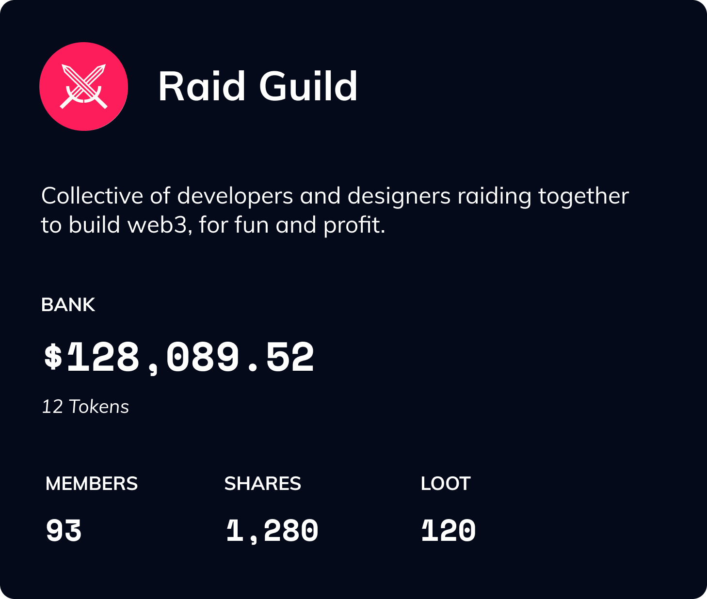
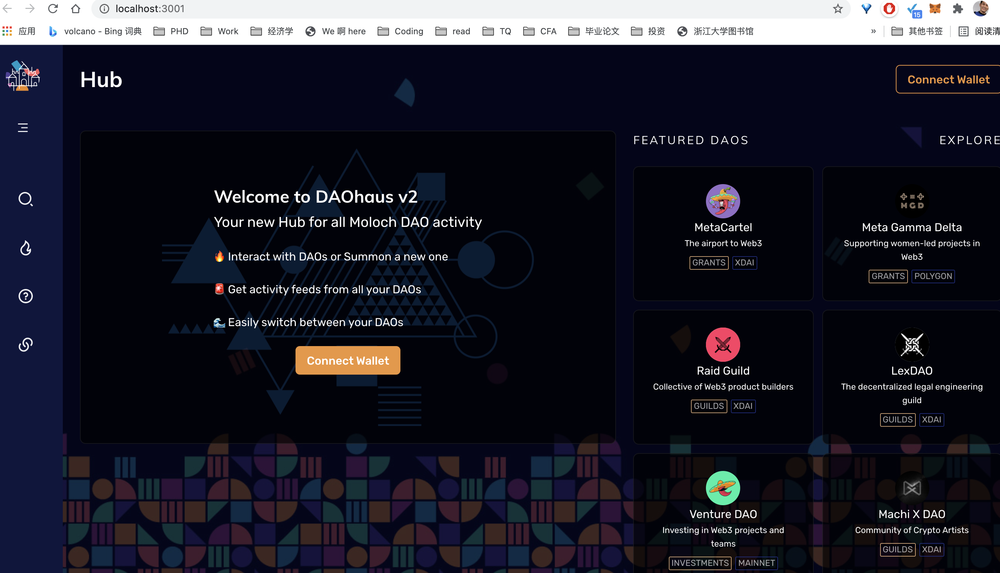
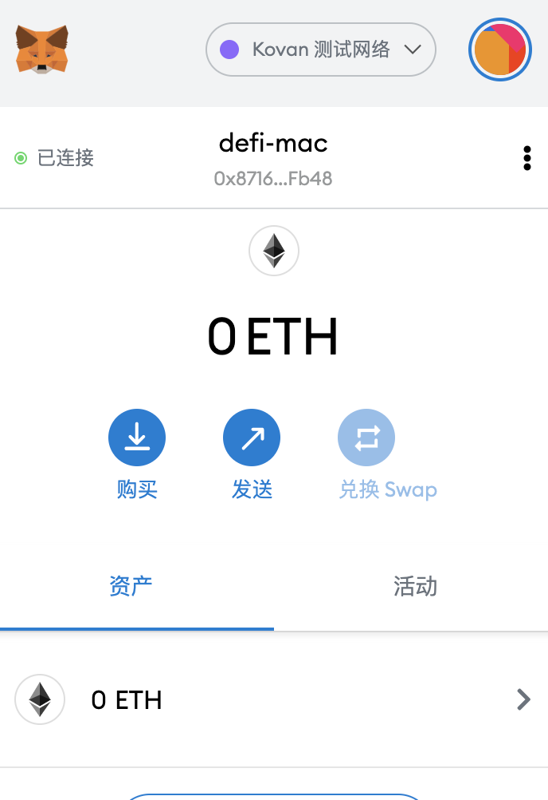
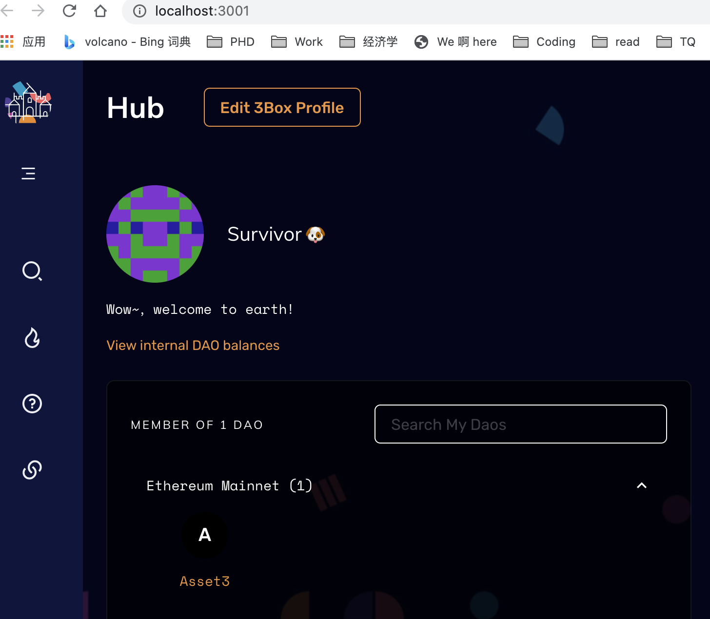

## DAUhaus Code Analysis

## 前言

**请大家指正，一起探讨**

+ 个人习惯，如果不能像**一个Http请求**那样，从头到尾在链路层/应用层都有体会的走一遍，感觉就是不了解这个系统，就不舒服，好奇心而已~！
+ 但公司给每个人做过一些性格分析，当我信息不足是，我会用想象来补足信息，所以有些是个人理解的，会特地指出来，一起探讨。
+ 有人会看的**无聊无趣**，可以直奔主题，下个文档：DAOhaus合约分析。

## 站点分析

### 域名

+ daohaus.club，很明显，中心化（相对于去中心化的区块链）域名，注册于传统的域名机构GoDaddy。

+ 那中心化的传统网站，如何和去中心化的链上世界，做交互的呢？
+ 你会说，肯定是用web3.js了，是的，也对，但不是全部，我们抽丝剥茧来看。

### 服务器

+ 按Http请求的链路，域名会转发给DNS指向的Web服务器。

+ ping daohaus.club（美国俄亥俄州服务器ping的）。

  PING daohaus.club (157.245.242.152) 56(84) bytes of data.

  64 bytes from 157.245.242.152 (157.245.242.152): icmp_seq=1 ttl=44 time=17.1 ms

  64 bytes from 157.245.242.152 (157.245.242.152): icmp_seq=2 ttl=44 time=16.4 ms

  64 bytes from 157.245.242.152 (157.245.242.152): icmp_seq=3 ttl=44 time=16.5 ms

  64 bytes from 157.245.242.152 (157.245.242.152): icmp_seq=4 ttl=44 time=16.5 ms

  64 bytes from 157.245.242.152 (157.245.242.152): icmp_seq=5 ttl=44 time=16.5 ms

+ IP地址对应地址位置：美国Digital Ocean（为何这个不是AWS？）

+ ping daohaus.club(中国杭州ping)

+ PING daohaus.club (52.220.193.16): 56 data bytes

  64 bytes from 52.220.193.16: icmp_seq=0 ttl=43 time=246.879 ms

  64 bytes from 52.220.193.16: icmp_seq=1 ttl=43 time=266.142 ms

  64 bytes from 52.220.193.16: icmp_seq=2 ttl=43 time=301.859 ms

+ ip地址对应地理位置：新加坡Amazon数据中心。

+ ping daohaus.club(从韩国服务器ping)。

  PING daohaus.club (54.211.114.166) 56(84) bytes of data.

  64 bytes from ec2-54-211-114-166.compute-1.amazonaws.com (54.211.114.166): icmp_seq=1 ttl=30 time=11.7 ms

  64 bytes from ec2-54-211-114-166.compute-1.amazonaws.com (54.211.114.166): icmp_seq=2 ttl=30 time=11.7 ms

  64 bytes from ec2-54-211-114-166.compute-1.amazonaws.com (54.211.114.166): icmp_seq=3 ttl=30 time=11.7 ms

+ ip地址对应地理位置：美国弗吉尼亚州阿什本Amazon数据中心。

+ 看起来，使用了DNS轮询机制，一个域名被动态解析到多个Web服务器，估计是使用了AWS的Rout53（一种域名/流量管理套餐）或者其他类似机制产品。

### 页面
+ 每个服务器，都承载了之前文档介绍的各种页面，例如创建DAO、查询DAO、文档介绍、插件选择等等。
+ 我们来分析下，几个典型页面的XHR，jsonp请求，看看背后的链路。
+ 首页：域名相对路径下的一些静态文件加载，js，css，png。

+ 有个奇怪的地方，为何动态的结果，也是图片方式显示，猜测是后端在链上获取数据后，合成的pic？或者仅仅是固定的图片，宣传而非动态展示。
+ 当前社区新会员的提案投票

+ 社区的动态财产数字
+ 
+ app.daohaus.club ip地址： 54.205.240.192，看来和web服务器不重复。
+ https://ipfs.3box.io/profile?address=0x871608cba092105b91e91295a1d****9bfb48
+ 看到个人profile头像，是调用3box存储在ipfs上的头像，通过3box桥的方式获取链上数据。
+ 详细参考下面代码分析

## App代码分析-本地先跑起来
+ 主要分析来源：https://github.com/HausDAO/daohaus-app
+ clone到本地后，进入目录：
+ 先安装依赖包
```
yarn install 
```
+ 注意你的node要再14以上，或者几个LTS版本.
+ 第一次运行会慢点
``` 
yarn start
```
+ 显示如下：
```
Compiled successfully!

You can now view pokemol in the browser.

  Local:            http://localhost:3002
  On Your Network:  http://10.254.64.243:3002

Note that the development build is not optimized.
To create a production build, use yarn build.
```
+ 自动跳转到了Chrome，未登陆界面出现，和官网一致：


+ 连接metamask钱包，试了几个网络，mainnet/rinkeby/kovan可以，Ropsten/Goerli不行。


+ 连接后和官网一致：

+ 猜测是几个测试网络的数据，是从主网真实数据复制过来的，所以测试网络依然存在我在官网主网创建的Asset3 DAO。
+ 后面把
+ DAOhaus前端：https://github.com/HausDAO/daohaus-app（内部代号pokemol项目）
+ DAOhaus后端：https://github.com/MolochVentures/moloch/(Moloch合约代码)
+ 分为两个文档分析，本文算是code分析的开头。


