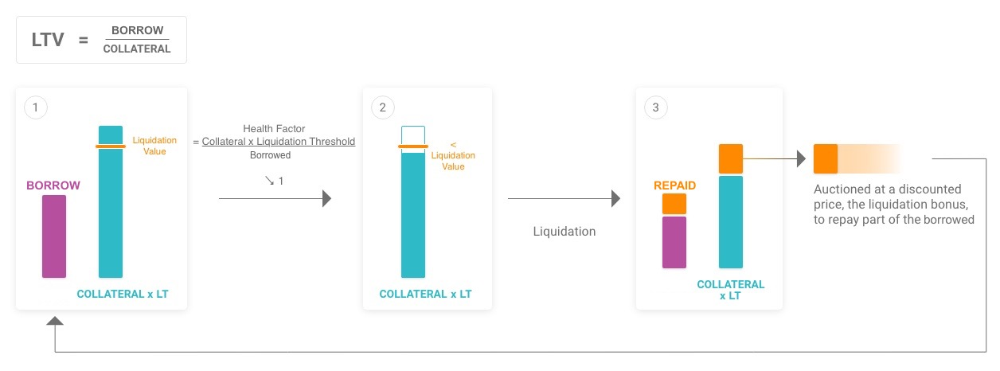
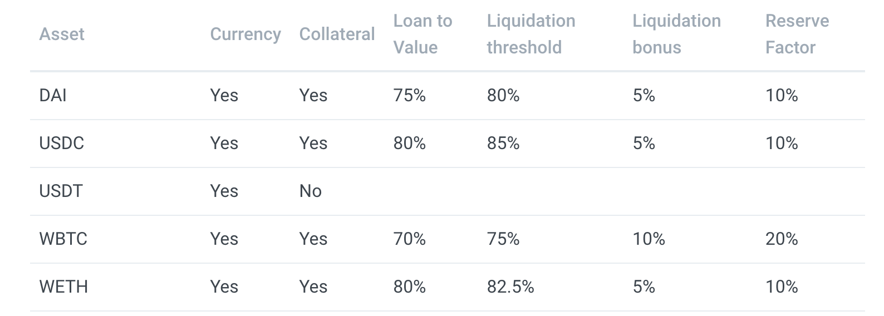

## AAVE

### contract
 
The LendingPool contract is the main contract of the protocol。
**LendingPool**
- function deposit(address asset, uint256 amount, address onBehalfOf, uint16 referralCode)
- function withdraw(address asset, uint256 amount, address to)

- function borrow(address asset, uint256 amount, uint256 interestRateMode, uint16 referralCode, address onBehalfOf)

  interestRateMode ：Stable: 1, Variable: 2

- function repay(address asset, uint256 amount, uint256 rateMode, address onBehalfOf)

- function setUserUseReserveAsCollateral(address asset, bool useAsCollateral)

- function liquidationCall(address collateral, address debt, address user, uint256 debtToCover, bool receiveAToken)   

  Liquidate positions with a health factor below 1；  
  Liquidators can only close a certain amount of collateral defined by a close factor. Currently the close factor is 0.5；  
  To check a user's health factor, use getUserAccountData(). 

- function flashLoan(address receiverAddress, address[] calldata assets, uint256[] calldata amounts, uint256[] modes, address onBehalfOf, bytes calldata params, uint16 referralCode)  

  Your contract which receives the flash loaned amounts must conform to the IFlashLoanReceiver 

-  function getUserAccountData(address user)
    totalCollateralETH  
    totalDebtETH  
    availableBorrowsETH  
    currentLiquidationThreshold  
    ltv  
    healthFactor

**LendingPoolAddressesProvider**

Addresses register of the protocol for a particular market. This contract is immutable and the address will never change

**AToken**
1. aTokens are interest-bearing tokens that are minted and burned upon deposit and withdraw ;
2.  The aTokens' value is pegged to the value of the corresponding deposited asset at a 1:1 ratio,  
3.  All interest collected by the aTokens reserves are distributed to aTokens holders directly by continuously increasing their wallet balance.  

- function permit(address owner, address spender, uint256 value, uint256 deadline, uint8 v, bytes32 r, bytes32 s)

  Allows a user to permit another account (or contract) to use their funds using a signed message. This enables gas-less transactions and single approval/transfer transactions.

**Debt Tokens**

Debt tokens are interest-accruing tokens that are minted and burned on borrow and repay, representing the debt owed by the token holder. There are 2 types of debt tokens:
1. Stable debt tokens, representing a debt to the protocol with a stable interest rate
2. Variable debt tokens, representing a debt to the protocol with a variable interest rate

### interest rate

Calculating rates in Aave is somewhat complicated due to the interest bearing nature of aTokens.
1. liquidity of aTokens constantly changes which is making utilization based rates extremely dynamic (it's changing every second)
2. depositor interest is not only based on interest, but also includes factors like flash premiums (so it's usually "a little more")

- Rate: The rate is a purely utilization based metric which represents the current rate at a specific point in time.
- Index: The index keeps track of reserve growth also incorporating things like the flash premium.
To calculate correct historically archived deposit rates you should use index based rate calculation.

**TIPS**
- All rates queried on chain or subgraph, are expressed in RAY units i.e. 10^27.
All emmissions are expressed in WAD unists i.e. 10^18.
- APY: Compounding interest accrued by deposit or borrow on LendingPool
- APR: Non Compounding rewards earned as part of LiquidityMinig

### Liquidations
When the 'health factor' of an account's total loans is below 1, anyone can make a liquidationCall() to the LendingPool contract, paying back part of the debt owed and receiving discounted collateral in return

**Executing the liquidation call**
1. Use getUserReserveData() on the Protocol Data Provider contract (for Solidity) or the UserReserve object (for GraphQL) with the relevant parameters.
2. Max debt that can be cleared by single liquidation call is given by the current close factor (which is 0.5 currently).
debtToCover = (userStableDebt + userVariableDebt) * LiquidationCloseFactorPercent
You can also pass in type(uint).max as the debtToCover in liquidationCall() to liquidate the maximum amount allowed.
3. For reserves that have usageAsCollateralEnabled as true, the currentATokenBalance and the current liquidation bonus gives the max amount of collateral that can be liquidated 👇🏻
maxAmountOfCollateralToLiquidate = (debtAssetPrice * currentATokenBalance * liquidationBonus)/ collateralPrice

 maximum LTV is calculate as the weighted average of the LTVs of the collateral assets and their value:

LTV（loan to value ）
MaxLTV = $ {\frac{\sum(TotalCollateral_iin ETH * LTV_i)} {  TotalCollateralinETH} } $

LiquidationThreshold = $ {\frac{\sum (Collateral_iinETH * LiquidationThreshold_i)}{TotalCollateralinETH}} $

$ H_f ={\frac{\sum (Collateral_iinETH * LiquidationThreshold_i)}{TotalBorrowinETH}}  $
​
 
​
 
Liquidation Threshold
LTV < liquidation threshold  （delta is a safety cushion for borrowers.）

liquidation threshold : 50%-85%

**reserve factor**
The reserve factor allocates a share of the protocol's interests to a collector contract as reserve for the ecosystem.

The overall risk rating is used to calibrate the Reserve Factor with factors ranging from 10% for the less risky assets to 35% for the riskiest. （10%-35%）

The less volatile currencies are the stablecoins followed by ETH, they have the highest LTV at 75%, and the highest liquidation threshold at 80%.  
The most volatile currencies REP and LEND have the lowest LTV at 35% and 40%. The liquidations thresholds are set at 65%

### Borrow Interest Rate

Aave’s interest rate strategy is calibrated to manage liquidity risk and optimise utilisation. The borrow interest rates come from the Utilisation Rate . 

- When capital is available: low interest rates to encourage loans.
- When capital is scarce: high interest rates to encourage repayments of loans and additional deposits.

The interest ratefollows the model:
     
​if $ \ U < U_{optimal}:  \hspace{1cm}  
R_t = R_0 + \frac{U_t}{U_{optimal}} R_{slope1} $

if $\ U≥ U_{optimal}: \hspace{1cm}  
R_t = R_0 + R_{slope1} + \frac{U_t- U_{optimal}}{1- U_{optimal}} R_{slope2} $
​
**stable rate**

Hence stable loans, that maintain their interest rate at issuance until the specific rebalancing conditions are met. For rebalancing the stable rate down, the loans stable rateneeds to be greater than the current stable rate plus a delta equal to 20%: .
For rebalancing the stable rate up, these two conditions need to be met:
- Utilisation Rate:  $\ U_t> 95\%  $
- Overall Borrow Rate, the weighted average of all the borrow rates:  $\ R_O< 25\% $
​
### Deposit APY
The borrow interest rates paid are distributed as yield for aToken holders who have deposited in the protocol, **excluding a share of yields sent to the ecosystem reserve defined by the reserve factor**. This interest rate is paid on the capital that is lent out then shared among all the liquidity providers. The deposit APY Dt：

$\ D_t = U_t(SB_t*S_t+VB_t*V_t)(1-R_t) $

- SBt the share of stable borrows;
- St, the average stable rate
- VBt, the share of variable borrows
- Vt, the variable rate
- Rt, the reserve factor
   

## AMM
The new Aave AMM Liquidity Pool enables liquidity providers (“LPs”) of Uniswap and Balancer to use their LP tokens as collateral in the Aave Protocol. 

## reference linking
- <https://azfuller20.medium.com/lend-with-aave-v2-20bacceedade>
- <https://github.com/austintgriffith/scaffold-eth/blob/lender-swap/packages/hardhat/contracts/AavEth.sol>
- [V1-whitepaper](https://cryptorating.eu/whitepapers/Aave/Aave_Protocol_Whitepaper_v1_0.pdf)
- [V2-whitepaper](https://cryptorating.eu/whitepapers/Aave/aave-v2-whitepaper.pdf)
- aave v1文档：https://azfuller20.medium.com/lend-with-aave-v2-20bacceedade
- aave v2 doc: https://docs.aave.com/risk/asset-risk/adding-an-asset
- 原理： https://bbs.huaweicloud.com/blogs/detail/243235
- 原理知乎： https://zhuanlan.zhihu.com/p/351383037
- comp aave 对比： https://www.mgcj.net/35503.html
- mediun aave: https://azfuller20.medium.com/lend-with-aave-v2-20bacceedade 