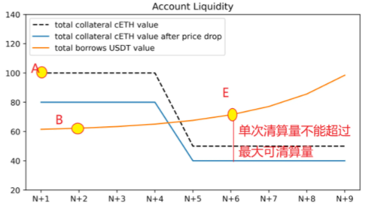
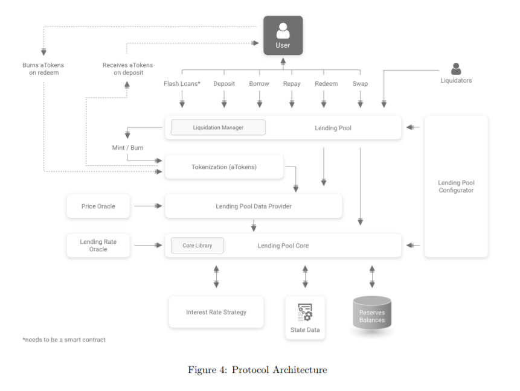

# AAVE whitepaper V1

受迫于周六的分享:laughing: ，故需要先把AAVE 的V1版的白皮书整理出来。先不要求一下子就完全理解AAVE中的设计取舍，按照白皮书的目录，逐项阅读，逐项理解，把自己的一点浅薄的理解写出来，也好过最后看完了，理解完了，跟人一说就这里不确定，那里不明白。:fish:

## 介绍

AAVE是一个著名的借贷协议，其源自之前的ETHlend项目，将P2P的借贷模式改为P2Protocol模式。跟Compound的借贷机制有点类似。笔者之前研习过compound的借贷机制，这里会对比下compound和AAVE在借贷机制的相同之处和不同之处。

### 基础概念

AAVE中的借贷池的核心是金库的概念，即每一个资金池都持有数总不同Token的余额，这些所有Token以ETH计价则得到该资金池的总流动性。每一个金库接受流动性提供者的存款，同时为借款人提供要借出的Token。借款人需要先在金库中有一定的存款，然后以这笔存款作为抵押，获得另一种或者同种Token作为借款。

#### LTV: `loanToValue`:

每一个金库都有一个特定的LTV，即总贷款与总价值的比率，是由该金库中每一个Token的LTV经过加权平均得到。

>这里与compound比较的话，Compound也会有一个借贷池，即cToken。用户向某一个cToken池子中提供Token获得相应的cToken. 当用户需要借贷的时候，compound会计算出用户所持有的所有不同种类的cToken的价值，根据此时预言机拿到的Token的价格来计算，然后判断此时用户的流动性如何，是否允许借贷。而从AAVE的白皮书来看，它的一个reserve里包含多种Token，即一个借贷池由多种Token组成。用户提供某一种Token到这个reserve里? 不确定是否理解正确

#### 清算

>compound中的清算机制是用来保护cToken资金池出现系统性风险，及时将用户资不抵债的部分清算掉，并给清算者提供奖励。

清算通常来自于被抵押Token的价格波动，通常是向下波动，导致用户的抵押品价值低于债务的价值，如图E点。此时超过的部分就会被清算。

#### 清算阈值Lq

这里的清算阈值Lq需要进一步看代码明确含义。

#### 账户健康度

AAVE提出了一个账户健康度的概念，其实就是一个账户的总抵押品价值与清算阈值的乘积与总债务与债务产生的费用之和的比例，即：
$$
H_f=\frac{TotalCollateralETH\times L_Q^a}{TotalBorrowsETH+TotalFeesETH}
$$
健康度简单来讲是一个账户的总抵押品的可借款价值总和与总债务连同利息总和的比例。如果账户健康度小于1，说明资不抵债，需要被清算。

>可以看到，AAVE是以ETH作为计价单位，而compound则是以USD作为计价单位。

### 形式化定义

形式化定义很多，这里挑选几个比较由意思的写一下：
$$
T,当前时间戳 = block.timestamp
$$
>compound里面是以block.blocknumber作为时间计量单位，AAVE则是以block的时间戳作为计量单位，uniswap V2也是以block的时间戳作为预言机计算时间平均价格的计量单位 :)
$$
Bs,固定利率借贷总额
$$

$$
Bv,浮动利率借贷总额
$$

$$
Bt,总借贷=Bs,固定利率借贷总额+Bv,浮动利率借贷总额
$$

>AAVE中的固定利率借贷总额Bs这个概念在Compound中没有，compound中的所有借贷利率都是浮动的，按照每一个块的资金利用率来确定此时的借贷利率。

$$
\begin{equation}
U,资金利用率=\left\{
\begin{aligned}
0 & , & if\ L_t=0, \\
B_t/L_t & , & if\ L_t >0.
\end{aligned}
\right.
\end{equation}
$$

>这里可以看到，AAVE中的资金利用率的定义是总借贷总额除以资金池的总流动性，而compound的资金利用率是
>$$
>资金利用率：U_a = \frac {Borrows_a} { (Cash_a + Borrows_a - Reserves_a) }
>$$
>总的借贷总额与资金池中的所有现金与借贷总额之和再减去保证金的差值的比率
>
>这里就需要明白AAVE的Lt到底是一个什么值，什么叫做总流动性？

$$
R_{v0},基础浮动利率
$$

$$
R_{slope1},拐点前浮动利率
$$

$$
R_{slope2},拐点后浮动利率
$$

$$
R_v，浮动利率=\left\{
\begin{aligned}
R_{v0}+U/U_{optimal}\times R_{slope1} & , & if\ U<U_{optimal}, \\
R_{v0}+R_{slope1}+\frac{U-U_{optimal}}{1-U_{optimal}}\times R_{slope2} & , & if\ L_t >0.
\end{aligned}
\right.
$$

>AAVE中的浮动利率其实质跟compound中的拐点型借贷利率模型是一样的，即当利用率超过某个特定的值之后，其利率会陡然提升，急剧增加用户的借贷成本，提高用户的存钱利率，鼓励用户存款，抑制借款而达到降低资金池资金利用率的目的，进而达到降低资金池流动性枯竭的风险

$$
C_i^t,累计流动性指数=C_i^{t-1}\times (1+R_l\times \Delta T_{year})
$$

$$
C_i^0=1\times10^{27}=1\ ray
$$

>这里的定义很像Compound中利率指数的定义，也就是compound计算复利的关键公式：
>$$
>\frac{Index_B}{Index_A}=(1+borrowRate[A]\cdot \Delta Blocks)
>$$
>compound中的利率指数：当前块B的利率指数IndexB与之前记录块A的利率指数IndexA的比例为1+记录块A点的借贷利率与之间间隔块的数目乘积。
>
>简单来讲就是一段时间间隔[A,B]间的利率指数之比等于1+前一点的借贷利率与间隔时间的乘积，再简单来讲是[A,B]这段时间的利息积累反映到B点的利率指数与A点的利率指数比中

$$
B_{vc}^t,累积浮动借贷利率指数=(1+\frac{R_v}{T_{year}})^{\Delta T_x}\times B_{vc}^{t-1}
$$

累积浮动借贷利率指数是指浮动利率借贷总额$B_{v}$在借贷利率$R_v$的情况下，所累积产生的利息。是利率还是利息？需要进一步明确

>在compound中，计算债务的复利是通过利率指数Index来计算的，即A点的总债务$Borrows_a$，经过一段时间后到达时间点B，则B点时的总债务$Borrows_B=Borrows_A \times Index_B / Index_A$ 
>
>不是很理解这里的乘方是什么意思？

需进一步理解的有：
$$
R_l,C_i^t,I_n^t,B_{vc}^t,B_{vcx}^t,B_x,B_{xc},R_{sa}^t,M
$$

## 合约架构

从架构图来看，AAVE的架构还是很复杂的。但简单来理解，AAVE存在四方角色：普通用户（提供流动性，移除流动性），清算者，资金池，预言机。作为流动性提供者的普通用户，向资金池中提供流动性(Deposit)，获得aToken. 

### 借贷池核心

### 借贷池数据提供者

### 借贷池

### 借贷池配置

### 利率模型

### 治理

## 借贷池合约

### 存款

### 取款

### 借款

### 还款

### 兑换利率

### 清算

### 闪电贷

### 代币化

## 稳定利率模型

### 借贷利率预言机

### 当前稳定借贷利率Rs3

### 对稳定利率头寸的限制

### 稳定汇率再平衡

### 再平衡过程

## 结论

