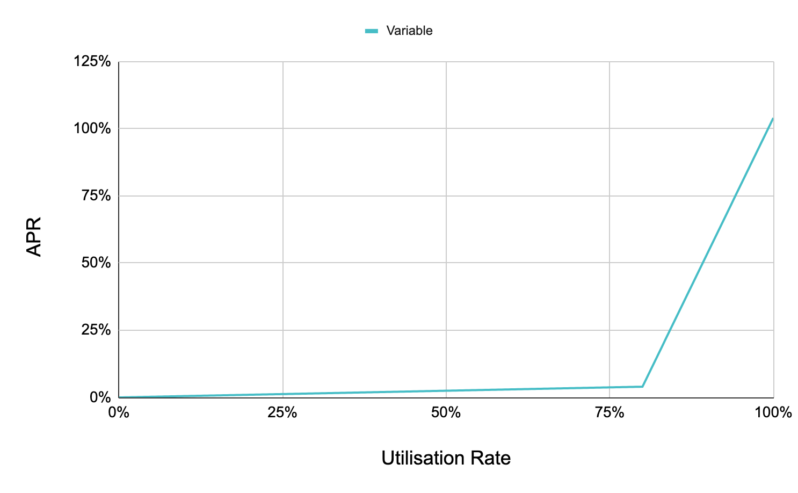

# AAVE 利率

利率模型和风险控制是借贷协议的核心, 在AAVE中，利率的更新可以分为三个部分:
1. 存币利率
2. 活息借款利率
3. 定息借款利率

至于风险控制，在后面的章节中，我们单独讨论。

## ReserveData 结构体

ReserveData 是 AAVE 利率变动的核心数据结构。ReserveData 在 `contracts\protocol\libraries\types\DataTypes.sol` 文件中定义，相关代码如下：

```
  // refer to the whitepaper, section 1.1 basic concepts for a formal description of these properties.
  struct ReserveData {
    // stores the reserve configuration
    // 各种配置, 就是一个 uint256, 不同的配置项使用不同为, 简单的 bitmask 算法
    ReserveConfigurationMap configuration;
    // the liquidity index. Expressed in ray
    // 存币利率: aToken 与 token 的换算关系
    uint128 liquidityIndex;
    // variable borrow index. Expressed in ray
    // 活息借款利率
    uint128 variableBorrowIndex;
    // the current supply rate. Expressed in ray
    // 活息借款利率与定息借款利率的加权平均
    uint128 currentLiquidityRate;
    // the current variable borrow rate. Expressed in ray
    // 活息借款利率
    uint128 currentVariableBorrowRate;
    // the current stable borrow rate. Expressed in ray
    // 定息借款利率
    uint128 currentStableBorrowRate;
    uint40 lastUpdateTimestamp;
    // tokens addresses
    address aTokenAddress;
    address stableDebtTokenAddress;
    address variableDebtTokenAddress;
    // address of the interest rate strategy
    address interestRateStrategyAddress;
    // the id of the reserve. Represents the position in the list of the active reserves
    uint8 id;
  }

```
ReserveData 是借贷关系最核心的结构体, 每个市场上可以借贷的币种，都有一个对应的 ReserveData , 用来记录该币对的各种利率。

与利率相关的变量:
1. liquidityIndex: 存币利率
2. variableBorrowIndex: 活息借款利率
3. currentLiquidityRate: 流动率, 用于更新 liquidityIndex
4. currentStableBorrowRate: 定息借款率
5. currentVariableBorrowRate: 活息借款率, 用于更新 variableBorrowIndex

## 两段式利率

利率的核心是供求关系。每当资金发生变化时，AAVE 都会自动调整利率. 利率的调整是基于供求关系，在 AAVE 或 Compound 中，反映资金供求关系的变量是资金利用率。资金利用率的定义是：
```
Utilisation = 总借款 / (总存款+总借款)
总借款 = 活息借款 + 定息借款
```

利率随供求关系变化的示意图：



这个图很清晰的说明了利率的变化:
1. 当使用率不超过最佳使用率时, 利率 = 基本利率 + 使用率 * slope1-rate
2. 当使用率超过最佳使用率时, 利率 = 基本利率 + slope1-rate + (使用率-最佳使用率) * slope2-rate

从图中可知, 当使用率超过最佳使用率时，利率上涨的速度非常快, 这促使借款人尽快归还借款，否则，就很有可能被清算。

## liquidityIndex

这是指标是 token/atoken 的存币利率

主要用到的地方:

1. 存币 deposit

将用户的token转入合约，mint aToken并转给用户.

将 token mint 为 atoken，换算关系为:

```
atoken 数量  = token 数量 / liquidityIndex
```

2. 取回 withdraw

将用户的 aToken 转入合约并销毁, 将对应的 token 转给用户

```
token 数量  = atoken 数量 * liquidityIndex
```

由于 `liquidityIndex` 在不断增长, 由上面两个公式就可以算出用户的存币利息所得。

## variableBorrowIndex 借款利率

1. 活息借款

当用户借款时, 系统会给用户 mint 借款的代币, 用来记录用户的借款, 已经随时间变化产生的利息.

```
varDebtToken 数量 = token 数量 / variableBorrowIndex
```
2. 活息还款

当用户还款时，需要还的数量通过以下公式计算:

```
token 数量 = varDebtToken 数量 * variableBorrowIndex
```

3. 清算

清算是风控的核心，在风控章节详细讨论。


## 定息借款

定息借款与活息借款类似，但有所不同。由于使用定息借款的比例非常少, 这里暂时跳过对定息借款的分析


## 利率的计算过程

利率的计算主要在文件 `contracts\protocol\lendingpool\DefaultReserveInterestRateStrategy.sol` 中，函数名为 `calculateInterestRates`. 

计算的大概过程是:

1. 总借款 = 活息借款 + 定息借款
2. 资金利用率 = 总借款 / (总存款+总借款)
3. 计算活息利率和定息利率。这两个利率都是两段式计算, 每一段的变化都是线性的。
  a. 活息利率 = 基本活息利率 + 资金利用率 * slope1活息 (如果超过第一段, 还需要计算第二段的利率)
  b. 定息利率 = 基本定息利率 + 资金利用率 * slope1定息
4. 加权平均借款利率 = (活息借款*活息利率 + 定息借款*平均定息利率) / 总借款， 这里的平均定息利率是函数入参，不再这里计算
5. currentLiquidityRate = (加权平均借款利率/总借款) * 资金利用率 * (1-储备率)

可以看到, currentLiquidityRate 的计算最复杂, 那么这个变量的用途是什么呢? 答案是用来计算存款利率(liquidityIndex)
