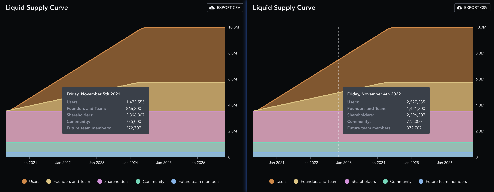

# Compound 代币和价格预言

白皮书和核心代码，大佬们已经写得很详细了

这里补充下周边： COMP 代币 和 价格预言

## COMP

### 投放计划

为了激励用户，用户每次存款或者借款，Compound 都会奖励 COMP 代币，可以用于治理投票

COMP 每日总产出约为 2312 枚，各市场的分布见 [文档](https://compound.finance/governance/com)，部分市场如下

| Market | Per Day |
| :- | -: |
| DAI | 880.38 |
| Ether | 141.25 |
| USDC | 880.38 |
| USDT | 126.80 |

每个市场，借款和贷款产出的 COMP，分别占 50%

以 USDC 市场为例，每日共产出 880.38 枚 COMP，其中通过借款的方式投放 440.19 枚 COMP，借款用户按其借款额度占总借款额度的比例分配；贷款同理

### 配置

如上所述，根据各市场每日产出的 COMP 数量，按每 15 秒一个区块的假设，可以得到每个区块产出的 COMP 数量，记录在 `ComptrollerV6Storage` 中

``` js
contract ComptrollerV6Storage is ComptrollerV5Storage {
    // https://compound.finance/governance/comp

    /// @notice The rate at which comp is distributed to the corresponding borrow market (per block)
    mapping(address => uint) public compBorrowSpeeds;

    /// @notice The rate at which comp is distributed to the corresponding supply market (per block)
    mapping(address => uint) public compSupplySpeeds;
}
```

`compBorrowSpeeds` 和 `comSupplySpeeds` 为 `cToken` 到每区块产出 COMP 数量的映射

比如对 `cUSDC` 来说，它在两个映射表中的值都为 67000000000000000 (COMP 的精度为 ${10}^{18}$ <!---->)

<!---->
$$
\frac{2 \times 67000000000000000 \times 86400}{15} \approx 880.38 \times {10}^{18}
$$

### 存款挖矿

用户每次操作，只要可能更新存款，如存款操作，会触发 `mintAllowed()`，它进一步

- 调用 `updateCompSupplyIndex()` 更新当前市场的 COMP 存款指数
- 调用 `distributeSupplierComp()` 分发当前用户此前未结算的存款产出的 COMP

``` js
function mintAllowed(address cToken, address minter, uint mintAmount) external returns (uint) {
    // Keep the flywheel moving
    updateCompSupplyIndex(cToken);
    distributeSupplierComp(cToken, minter);

    return uint(Error.NO_ERROR);
}
```

--

当前市场的 COMP 存款指数更新逻辑如下

``` js
/**
* @notice Accrue COMP to the market by updating the supply index
* @param cToken The market whose supply index to update
* @dev Index is a cumulative sum of the COMP per cToken accrued.
*/
function updateCompSupplyIndex(address cToken) internal {
    CompMarketState storage supplyState = compSupplyState[cToken];
    uint supplySpeed = compSupplySpeeds[cToken];
    uint32 blockNumber = safe32(getBlockNumber(), "block number exceeds 32 bits");
    uint deltaBlocks = sub_(uint(blockNumber), uint(supplyState.block));
    if (deltaBlocks > 0 && supplySpeed > 0) {
        uint supplyTokens = CToken(cToken).totalSupply();
        uint compAccrued = mul_(deltaBlocks, supplySpeed);

        Double memory ratio = supplyTokens > 0 ? fraction(compAccrued, supplyTokens) : Double({mantissa: 0});

        supplyState.index = safe224(add_(Double({mantissa: supplyState.index}), ratio).mantissa, "new index exceeds 224 bits");
        supplyState.block = blockNumber;
    } else if (deltaBlocks > 0) {
        supplyState.block = blockNumber;
    }
}
```

首先判断距离上次更新指数，经过了几个区块 `deltaBlocks`，另外根据 `supplySpeed` 判断当前市场是否产出 COMP (0x, Aave 等配置为 0，表示不产出)

条件都满足后，计算 COMP 产出数量，除以 `cToken` 总供给，得到这几个区块间，平均每个 `cToken` 对应的 COMP 产出，即代码中的 `ratio`

也就是说，`ratio` 可以理解为每持有一个 `cToken` ，可以得到多少 COMP

最后将 `ratio` 累加进 COMP 存款指数

--

当前用户此前未结算的 COMP 分发逻辑如下

``` js
/**
* @notice Calculate COMP accrued by a supplier and possibly transfer it to them
* @param cToken The market in which the supplier is interacting
* @param supplier The address of the supplier to distribute COMP to
*/
function distributeSupplierComp(address cToken, address supplier) internal {
    // TODO: Don't distribute supplier COMP if the user is not in the supplier market.
    // This check should be as gas efficient as possible as distributeSupplierComp is called in many places.
    // - We really don't want to call an external contract as that's quite expensive.

    CompMarketState storage supplyState = compSupplyState[cToken];
    uint supplyIndex = supplyState.index;
    uint supplierIndex = compSupplierIndex[cToken][supplier];

    // Update supplier's index to the current index since we are distributing accrued COMP
    compSupplierIndex[cToken][supplier] = supplyIndex;

    if (supplierIndex == 0 && supplyIndex >= compInitialIndex) {
        // Covers the case where users supplied tokens before the market's supply state index was set.
        // Rewards the user with COMP accrued from the start of when supplier rewards were first
        // set for the market.
        supplierIndex = compInitialIndex;
    }

    // Calculate change in the cumulative sum of the COMP per cToken accrued
    Double memory deltaIndex = Double({mantissa: sub_(supplyIndex, supplierIndex)});

    uint supplierTokens = CToken(cToken).balanceOf(supplier);

    // Calculate COMP accrued: cTokenAmount * accruedPerCToken
    uint supplierDelta = mul_(supplierTokens, deltaIndex);

    uint supplierAccrued = add_(compAccrued[supplier], supplierDelta);
    compAccrued[supplier] = supplierAccrued;

    emit DistributedSupplierComp(CToken(cToken), supplier, supplierDelta, supplyIndex);
}
```

首先获取市场最新的 COMP 存款指数，以及用户此前结算时的指数，相减得到 `deltaIndex`

然后乘以用户持有的 `cToken` 数量，得到用户这段时间应该获得的 COMP

--

需要说明的是，这里结算的是用户之前的存款，占当前总供给的百分比，不会算入用户接下来马上将改变的存款

换句话说，存款余额的修改，要在至少一个区块之后才会被用于结算 COMP，即用户操作与 COMP 结算是跨区跨的

算是降低了被闪电贷攻击的风险

### 借款挖矿

与存款挖矿大同小异，稍微复杂一些，这里不再赘述

### 通胀

根据 messari，COMP 的 Inflation Rate 为 [27.50%](https://messari.io/asset/compound/metrics/supply)

我没找到其确切公式，不过我们可以自行计算，根据 2021-11-05 和 2022-11-04 的 [流动性投放计划](https://messari.io/asset/compound/profile/supply-schedule) ，简单相除得到通胀系数为 27.34%；和 messari 数据相比，算是大差不差了



| -| 2021-11-05 | 2022-11-04 | Inflation Rate |
| :-: | -: | -: | -: |
| User | 1,473,555 | 2,527,335 | |
| Founder and Team | 866,200 | 1,421,300 | |
| Shareholders | 2,396,307 | 2,396,307 | |
| Community | 775,000 | 775,000 | |
| Future team members | 372,797 | 372,797 | |
| SUM | 5,883,859 | 7,492,379 | +27.34% |

但是，这里有个统计陷阱：Founders & team 分批 vest 且 Future team members 也未兑现，部分流动性没有进入市场，因此分母偏大了

也就是说，实际通胀率还要高出不少

不管怎样，通胀率接近甚至超过 30% 的资产，价格稳定在 $100 ~ $300；我看不懂，但我大受震撼～

### 安全

9月29日 Compound 发生一起安全事件，详见 [[事件分析] 9月29日 Compound 62号提案 所引发的可怕Bug](https://github.com/Dapp-Learning-DAO/Dapp-Learning/blob/main/defi/Compound/contract/%5B%E4%BA%8B%E4%BB%B6%E5%88%86%E6%9E%90%5D%209%E6%9C%8829%E6%97%A5%20Compound%2062%E5%8F%B7%E6%8F%90%E6%A1%88%20%E6%89%80%E5%BC%95%E5%8F%91%E7%9A%84%E5%8F%AF%E6%80%95Bug.md)

其中，Robert Leshner 提到的 `Reservori` 合约 ([地址](https://etherscan.io/address/0x2775b1c75658Be0F640272CCb8c72ac986009e38))，就是上面投放计划中 `User` (借贷挖矿) 的 COMP 来源

## 价格预言机

Compound 同时使用 Uniswap v2 和 Chainlink v2 作为价格预言机

Chainlink 价格以 Uniswap 价格为锚，前者作为实际价格，后者作为基准价格

Chainlink 价格需要在 Uniswap 价格的某段浮动范围内，才能作为有效价格被更新到预言机

### 代码

[compound-finance/open-oracle](https://github.com/compound-finance/open-oracle) 中只有 Uniswap 相关代码，我找遍 branches 和 tags 都没找到 Chainlink 部分

最后在 Compound 社区找到这个关于添加 ChainLink 预言机提案的精彩讨论 [Oracle Infrastructure: Chainlink Proposal](https://www.comp.xyz/t/oracle-infrastructure-chainlink-proposal/1272)

成果是 Chainlink 团队在 Compound 原有 Open Price Feed 的代码基础上，集成了 Chainlink 聚合器的报价，并进一步做了部署和测试；Compound 社区通过治理，应用了新的预言机

然而，Chainlink 提交的 PR：[Oracle Improvement (Chainlink Price Feeds) #150](https://github.com/compound-finance/open-oracle/pull/150)，改动较多，还卡在审核阶段，未被合并..

因此，最新代码不在官方仓库中

审计报告见 [Trail of Bits: Chainlink Open-Oracle Summary Report](https://drive.google.com/file/d/1TsOXhBLenStjdd2mxF1Sfmmh_Na9X527/view)

以下分析基于 Chainklink fork 的仓库 [smartcontractkit/open-source](https://github.com/smartcontractkit/open-oracle/blob/master/contracts/Uniswap/UniswapAnchoredView.sol)

### 实现

``` js
/**
 * @notice This is called by the reporter whenever a new price is posted on-chain
 * @dev called by AccessControlledOffchainAggregator
 * @param currentAnswer the price
 * @return valid bool
 */
function validate(uint256/* previousRoundId */,
        int256 /* previousAnswer */,
        uint256 /* currentRoundId */,
        int256 currentAnswer) external override returns (bool valid) {

    // NOTE: We don't do any access control on msg.sender here. The access control is done in getTokenConfigByReporter,
    // which will REVERT if an unauthorized address is passed.
    TokenConfig memory config = getTokenConfigByReporter(msg.sender);
    uint256 reportedPrice = convertReportedPrice(config, currentAnswer);
    uint256 anchorPrice = calculateAnchorPriceFromEthPrice(config);

    PriceData memory priceData = prices[config.symbolHash];
    if (priceData.failoverActive) {
        require(anchorPrice < 2**248, "Anchor price too large");
        prices[config.symbolHash].price = uint248(anchorPrice);
        emit PriceUpdated(config.symbolHash, anchorPrice);
    } else if (isWithinAnchor(reportedPrice, anchorPrice)) {
        require(reportedPrice < 2**248, "Reported price too large");
        prices[config.symbolHash].price = uint248(reportedPrice);
        emit PriceUpdated(config.symbolHash, reportedPrice);
        valid = true;
    } else {
        emit PriceGuarded(config.symbolHash, reportedPrice, anchorPrice);
    }
}
```

核心代码如上所示

`validator()` 由 Chainlink 调用，参数 `currentAnswer` 表示 Chainlink 链下统计的价格，单位由 Chainlink 控制

以 DAI 为例，假设 `currentAnswer` 为 100055330

为了方便处理，`convertReportedPrice()` 将其转为内部单位，得到 1000553

`calculateAnchorPriceFromEthPrice()` 通过向交易对询价得到链上 Uniswap 交易所的价格，比如为 1001190

接下来判断 `failoverActive`，这是由社区投票决定的一项配置，表示当前市场 (DAI) 是否忽略 Chainlink 价格，以 Uniswap 价格为准

否则，通过 `isWithAnchor()` 确认 Chainlink 价格在 Uniswap 价格浮动范围内 ([85%, 115%])

--

``` js
/**
 * @notice Calculate the anchor price by fetching price data from the TWAP
 * @param config TokenConfig
 * @return anchorPrice uint
 */
function calculateAnchorPriceFromEthPrice(TokenConfig memory config) internal returns (uint anchorPrice) {
    uint ethPrice = fetchEthAnchorPrice();
    require(config.priceSource == PriceSource.REPORTER, "only reporter prices get posted");
    if (config.symbolHash == ethHash) {
        anchorPrice = ethPrice;
    } else {
        anchorPrice = fetchAnchorPrice(config.symbolHash, config, ethPrice);
    }
}

/**
 * @dev Fetches the current eth/usd price from uniswap, with 6 decimals of precision.
 *  Conversion factor is 1e18 for eth/usdc market, since we decode uniswap price statically with 18 decimals.
 */
function fetchEthAnchorPrice() internal returns (uint) {
    return fetchAnchorPrice(ethHash, getTokenConfigBySymbolHash(ethHash), ethBaseUnit);
}

/**
 * @dev Fetches the current token/usd price from uniswap, with 6 decimals of precision.
 * @param conversionFactor 1e18 if seeking the ETH price, and a 6 decimal ETH-USDC price in the case of other assets
 */
function fetchAnchorPrice(bytes32 symbolHash, TokenConfig memory config, uint conversionFactor) internal virtual returns (uint) {
    (uint nowCumulativePrice, uint oldCumulativePrice, uint oldTimestamp) = pokeWindowValues(config);

    // This should be impossible, but better safe than sorry
    require(block.timestamp > oldTimestamp, "now must come after before");
    uint timeElapsed = block.timestamp - oldTimestamp;

    // Calculate uniswap time-weighted average price
    // Underflow is a property of the accumulators: https://uniswap.org/audit.html#orgc9b3190
    FixedPoint.uq112x112 memory priceAverage = FixedPoint.uq112x112(uint224((nowCumulativePrice - oldCumulativePrice) / timeElapsed));
    uint rawUniswapPriceMantissa = priceAverage.decode112with18();
    uint unscaledPriceMantissa = mul(rawUniswapPriceMantissa, conversionFactor);
    uint anchorPrice;

    // Adjust rawUniswapPrice according to the units of the non-ETH asset
    // In the case of ETH, we would have to scale by 1e6 / USDC_UNITS, but since baseUnit2 is 1e6 (USDC), it cancels

    // In the case of non-ETH tokens
    // a. pokeWindowValues already handled uniswap reversed cases, so priceAverage will always be Token/ETH TWAP price.
    // b. conversionFactor = ETH price * 1e6
    // unscaledPriceMantissa = priceAverage(token/ETH TWAP price) * expScale * conversionFactor
    // so ->
    // anchorPrice = priceAverage * tokenBaseUnit / ethBaseUnit * ETH_price * 1e6
    //             = priceAverage * conversionFactor * tokenBaseUnit / ethBaseUnit
    //             = unscaledPriceMantissa / expScale * tokenBaseUnit / ethBaseUnit
    anchorPrice = mul(unscaledPriceMantissa, config.baseUnit) / ethBaseUnit / expScale;

    emit AnchorPriceUpdated(symbolHash, anchorPrice, oldTimestamp, block.timestamp);

    return anchorPrice;
}
```

接下来，简单看下 Uniswap 询价逻辑

首先通过 `fetchEthAnchorPrice()` 从交易对 [USDC-WETH](https://etherscan.io/address/0xB4e16d0168e52d35CaCD2c6185b44281Ec28C9Dc) 获得按 USDC 计价 (单位 ${10}^{6}$ <!---->) 的 WETH 的价格，比如为 4351156768

然后通过 `fetchAnchorPrice()` 从交易对 [DAI-WETH](https://etherscan.io/address/0xA478c2975Ab1Ea89e8196811F51A7B7Ade33eB11) 获得按 WETH 计价 (单位 ${10}^{18}$ <!---->) 的 DAI 的价格，比如为 230097482692738

上面两个价格相乘，得到 1001190219118269813150784

最后，转换单位，得到按 USDC 计价的 DAI 价格，即上面的 1001190

### 代理

`UniswapAnchoredView` 自身可能升级，因此会存在新旧合约实例；升级过程中，我们必须保证两个合约的价格预言同步，且经过一段时间验证后，经由社区投票，用新合约代替旧合约，以此完成升级

然而，依据 Chainlink 的设计，聚合器只能向一个合约地址发送喂价

为了解决这个问题，在 Chainlink 聚合器与 Compound 之间，引入了一层代理合约 `ValidatorProxy`，它将聚合器的报价同时转发给新旧 `UniswapAnchoredView` 合约

由于采用的是 报价 (push) 而非 询价 (pull) 的方式，更新价格的成本由 Chainlink 承担，因此 Compound 用户无须额外支付代理层带来的 gas

审计报告见 [Sigma Prime: Chainlink ValidatorProxy Security Assessment Report](https://drive.google.com/file/d/1u12kitAyQKwe3mJVFh5ePzabTmwhjA2Y/view)

代码在另一个仓库中: [smartcontractkit/chainlink](https://github.com/smartcontractkit/chainlink/blob/develop/contracts/src/v0.8/ValidatorProxy.sol)

``` js
function validate(
    uint256 previousRoundId,
    int256 previousAnswer,
    uint256 currentRoundId,
    int256 currentAnswer
) external override returns (bool)
{
    // Send the validate call to the current validator
    ValidatorConfiguration memory currentValidator = s_currentValidator;
    address currentValidatorAddress = address(currentValidator.target);
    require(currentValidatorAddress != address(0), "No validator set");
    currentValidatorAddress.call(
        abi.encodeWithSelector(
        AggregatorValidatorInterface.validate.selector,
        previousRoundId,
        previousAnswer,
        currentRoundId,
        currentAnswer
        )
    );

    // If there is a new proposed validator, send the validate call to that validator also
    if (currentValidator.hasNewProposal) {
        address(s_proposedValidator).call(
        abi.encodeWithSelector(
            AggregatorValidatorInterface.validate.selector,
            previousRoundId,
            previousAnswer,
            currentRoundId,
            currentAnswer
        )
        );
    }
    return true;
}
```

逻辑非常直白了..
