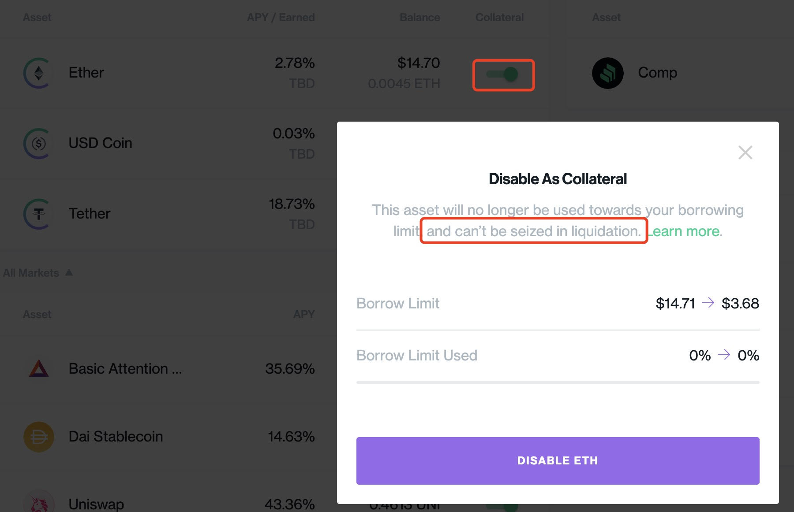
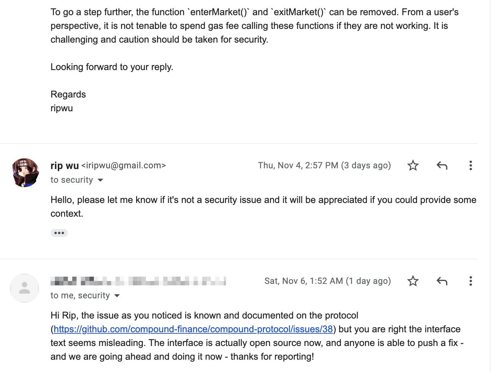

Compound 潜在风险和改进

之前在看 Compound 代码时，感觉存在一些疑问和改进

其中有个疑问昨天得到了回复，趁着这个机会简单整理下笔记

## 退出市场的资产，仍可被清算

### 背景

``` js
// compound-protocol/contracts/Comptroller.sol

function borrowAllowed(address cToken, address borrower, uint borrowAmount) external returns (uint) {
    if (!markets[cToken].accountMembership[borrower]) {
        // only cTokens may call borrowAllowed if borrower not in market
        require(msg.sender == cToken, "sender must be cToken");

        // attempt to add borrower to the market
        Error err = addToMarketInternal(CToken(msg.sender), borrower);
        if (err != Error.NO_ERROR) {
            return uint(err);
        }

        // it should be impossible to break the important invariant
        assert(markets[cToken].accountMembership[borrower]);
    }
}

function addToMarketInternal(CToken cToken, address borrower) internal returns (Error) {
    Market storage marketToJoin = markets[address(cToken)];

    if (!marketToJoin.isListed) {
        // market is not listed, cannot join
        return Error.MARKET_NOT_LISTED;
    }

    if (marketToJoin.accountMembership[borrower] == true) {
        // already joined
        return Error.NO_ERROR;
    }

    // survived the gauntlet, add to list
    // NOTE: we store these somewhat redundantly as a significant optimization
    //  this avoids having to iterate through the list for the most common use cases
    //  that is, only when we need to perform liquidity checks
    //  and not whenever we want to check if an account is in a particular market
    marketToJoin.accountMembership[borrower] = true;
    accountAssets[borrower].push(cToken);

    emit MarketEntered(cToken, borrower);

    return Error.NO_ERROR;
}
```

Compound 在借款时会通过 `borrowAllowed()` 检查用户是否已经进入 `cToken` 市场

如果未进入，会调用 `addToMarketInternal()` 将 `cToken` 添加到用户接触的资产列表 `accountAssets[borrower]` 中

我查了下 `accountAssets[borrower]`，似乎只在 存款，借款，和计算用户健康度时使用

其中前面两个操作 (存款，借款) 更多是类似声明的逻辑，没有什么疑点

``` js
// compound-protocol/contracts/Comptroller.sol

function getHypotheticalAccountLiquidityInternal(
    address account,
    CToken cTokenModify,
    uint redeemTokens,
    uint borrowAmount) internal view returns (Error, uint, uint) {
    // For each asset the account is in
    CToken[] memory assets = accountAssets[account];
    for (uint i = 0; i < assets.length; i++) {
        CToken asset = assets[i];

        // Too Long Not Listed.
        // ...
    }
}
```

用户健康度计算代码如上，在计算 `account` 健康度时，遍历的是 `accountAssets[account]`

如果用户此前发起退出某个资产市场的交易，如 USDC，则这个资产不在 `accountAssets[account]` 中

这时，计算健康度会跳过用户的 USDC 资产

### 清算

上面梳理了背景逻辑，即：退出市场的资产，不会参与清算时用户健康度的计算

内在含义是：该资产可以作为存款收取利息，但由于退出了市场，不会做为抵押物

而在实际清算代码时，我没有找到有关清算交易指定的资产，是否不在用户的 `accountAssets` 列表中的判断

即已经退出市场，不会作为抵押物的资产，可以被清算..

``` js
// compound-protocol/contracts/CToken.sol

function liquidateBorrowFresh(address liquidator, address borrower, uint repayAmount, CTokenInterface cTokenCollateral) internal returns (uint, uint) {
    /* Fail if repayBorrow fails */
    (uint repayBorrowError, uint actualRepayAmount) = repayBorrowFresh(liquidator, borrower, repayAmount);
    if (repayBorrowError != uint(Error.NO_ERROR)) {
        return (fail(Error(repayBorrowError), FailureInfo.LIQUIDATE_REPAY_BORROW_FRESH_FAILED), 0);
    }

    /* We calculate the number of collateral tokens that will be seized */
    (uint amountSeizeError, uint seizeTokens) = comptroller.liquidateCalculateSeizeTokens(address(this), address(cTokenCollateral), actualRepayAmount);
    require(amountSeizeError == uint(Error.NO_ERROR), "LIQUIDATE_COMPTROLLER_CALCULATE_AMOUNT_SEIZE_FAILED");

    /* Revert if borrower collateral token balance < seizeTokens */
    require(cTokenCollateral.balanceOf(borrower) >= seizeTokens, "LIQUIDATE_SEIZE_TOO_MUCH");

    // If this is also the collateral, run seizeInternal to avoid re-entrancy, otherwise make an external call
    uint seizeError;
    if (address(cTokenCollateral) == address(this)) {
        seizeError = seizeInternal(address(this), liquidator, borrower, seizeTokens);
    } else {
        seizeError = cTokenCollateral.seize(liquidator, borrower, seizeTokens);
    }

    return (uint(Error.NO_ERROR), actualRepayAmount);
}
```

### 测试

我担心存在理解偏差，于是在 Ropsten 网络上进行了测试：

首先用账户 A 发送 [exitMarket](https://ropsten.etherscan.io/tx/0x7b71d5cf083eca8ab436126953f87573fb9d047dced373394ba2d6ae4621e0a2) 交易，将存入的 cETH 退出市场

然后用账户 A 发送 [setUnderlyingPrice](https://ropsten.etherscan.io/tx/0xbb4691fdf1f81b9634375658862d7b7ec6ff7253e81f3896a6025bba11b1e54c) 交易，操纵预言机，模拟市场价格波动，使得账户 A 资不抵债

最后用账户 B 发送 [liquidateBorrow](https://ropsten.etherscan.io/tx/0xa38099eb44664169e41e36d06ef0d72c241ddd0a4349e3f36f46506667c4c975) 交易，清算账户 A 的债务，指定以 cETH 为抵押物

结论是：退出市场的 cETH 确实可以被清算

### 问题

问题来了：

问题一：已经退出市场的资产，是否应该被清算？

问题二：如果不应该被清算，那么进入市场和退出市场的逻辑，意义何在？

综合考虑，我个人觉得 Compound 原意应该是不允许清算已退出市场的资产；理由如下：

首先，用户在实际存款前必须单独发起进入市场的交易，考虑到 Compound 在以太坊主网运营，交易手续费不可忽视

如果可以被清算，那么进入和退出市场的逻辑没有什么实际用途，在代码中也未找到其他用途

其次，在退出市场前，Compound 提示如下



但是，从另外一个角度来说，退出市场的资产，确实应该支持被清算，否则有损于系统健康度

### 反馈

两个角度都有道理，我没想明白，于是向 Compound 发送了邮件，一周后收到了回复：问题已知，已退出市场的资产可以被清算；提示文本看起来是有误导

不过，我还是没明白：既然可以被清算，为什么要设计进入退出的功能，用户专门发起这两笔交易的手续费呢...



BTW，前两天 Aave V3 似乎也引入了 [资产隔离](https://governance.aave.com/t/introducing-aave-v3/6035) 的概念..

## USDC 钉住 1 美元

前面文章中有举例说明 Compound 价格预言机的流程，以 DAI 为例：首先向 USDC-WETH 交易对查询 WETH 价格，然后向 DAI-WETH 交易对查询 DAI 价格，最后将两者相乘，得到以 USDC 计价的 DAI 价格

换句话说，Compound 中大部分 token 的价格是以 USDC 计价的

这里隐藏了一个假设，USDC 价格是恒定不变的，可以作为计价单位

``` js
// https://github.com/smartcontractkit/open-oracle/blob/master/contracts/Uniswap/UniswapAnchoredView.sol

function priceInternal(TokenConfig memory config) internal view returns (uint) {
    if (config.priceSource == PriceSource.REPORTER) return prices[config.symbolHash].price;
    // config.fixedPrice holds a fixed-point number with scaling factor 10**6 for FIXED_USD
    if (config.priceSource == PriceSource.FIXED_USD) return config.fixedPrice;
    if (config.priceSource == PriceSource.FIXED_ETH) {
        uint usdPerEth = prices[ethHash].price;
        require(usdPerEth > 0, "ETH price not set, cannot convert to dollars");
        // config.fixedPrice holds a fixed-point number with scaling factor 10**18 for FIXED_ETH

        return mul(usdPerEth, config.fixedPrice) / ethBaseUnit;
    }
}
```

实现上，Compound 对 USDC，USDT 等做了特殊处理，其 `priceSource` 配置为 `FIXED_USD`，钉在 1 美元

在 USDC 价格波动时，可能会导致一些问题，比如 [这个提案](https://www.comp.xyz/t/floating-stablecoin-prices/2005) 描述的例子：

假设 USDC 因监管或其他原因不断下跌，比如市场价格为 0.5 美元，而 Compound 仍认为其价值 1 美元

由于存在价差，我们可以从外部市场低价借入 USDC，存入 Compound，将其高价抵押借出其他资产

造成的结果是，市场价格不断下跌的 USDC 涌入 Compound，而其他资产被不断借出

提案提出的问题，已经过去几个月了，没有得到官方回复..

## 抵押率 与 清算阈值

在比较 Compound 和 Aave 时，我发现 Compound 没有 [Aave 清算阈值 (Liquidation Threshold)](http://godorz.info/2021/10/aave-v2/#i-19) 的概念

在用户体验上，这可能会带来一些问题：

如果用户在 Compound 按最大抵押率借款，只要市场价格稍有波动，其抵押资产就会面临清算风险

``` js
// compound-protocol/contracts/Comptroller.sol

function getHypotheticalAccountLiquidityInternal(
    address account,
    CToken cTokenModify,
    uint redeemTokens,
    uint borrowAmount) internal view returns (Error, uint, uint) {

    AccountLiquidityLocalVars memory vars; // Holds all our calculation results
    uint oErr;

    // For each asset the account is in
    CToken[] memory assets = accountAssets[account];
    for (uint i = 0; i < assets.length; i++) {
        CToken asset = assets[i];

        vars.collateralFactor = Exp({mantissa: markets[address(asset)].collateralFactorMantissa});

        // Pre-compute a conversion factor from tokens -> ether (normalized price value)
        vars.tokensToDenom = mul_(mul_(vars.collateralFactor, vars.exchangeRate), vars.oraclePrice);

        // sumCollateral += tokensToDenom * cTokenBalance
        vars.sumCollateral = mul_ScalarTruncateAddUInt(vars.tokensToDenom, vars.cTokenBalance, vars.sumCollateral);
    }
}
```

其中，在计算 `sumCollateral` 时，使用的是抵押率 `collateralFactor`

--

与之相对的，在 Aave 中，贷款时按抵押率计算，而清算时健康度按清算阈值计算；因为清算阈值比抵押率大，因此留出了安全垫

引用链接中的例子：用户抵押价值 2 ETH 的资产，借出 1.575 ETH 的债务，此时健康度为 1.0476

注意例子中的债务，是按资产的最大抵押率借出的；在这种情况下，可以忍受市场价格小范围的波动

比如，市场价格短期波动，导致债务上涨 3% 时，此时健康度仍在 1 以上，用户资产不会面临清算风险

## 隐患

### 不在官方仓库中的代码

比如价格预言机，还未被合并，见 [Compound 代币和价格预言](http://godorz.info/2021/11/compound_comp_and_price_oracles/#i-8)

又如，官方仓库中 `Comptroller`，似乎也是[较老的版本](https://github.com/compound-finance/compound-protocol/blob/master/contracts/ComptrollerStorage.sol)；而主网实际使用的合约，是修复了 9 月底 COMP 安全事件的[版本](https://etherscan.io/address/0xbafe01ff935c7305907c33bf824352ee5979b526#code)

--

对于新入手 Compound 的开发者而言，要找到正确的代码，只能求助于 EtherScan 和搜索引擎，体验有点糟糕

更重要的是，会导致接下来的问题：

### 不同步的主网与测试网络

考虑到链下数据不好维护，为了便于测试，可以在测试网使用模拟预言机作为 mock

比如，最核心的 `Unitroller`，在 [主网](https://etherscan.io/address/0x3d9819210A31b4961b30EF54bE2aeD79B9c9Cd3B#readProxyContract) 与 [测试网络](https://ropsten.etherscan.io/address/0xcfa7b0e37f5AC60f3ae25226F5e39ec59AD26152#readProxyContract) 上部署的代码版本不同

又如 `CErc20Immutable` 是旧代码，会导致 cToken [无法支持社区治理](https://www.comp.xyz/t/legacy-market-migration-wbtc/1333)。主网中这个合约已被废弃，但在测试中仍在使用，比如 Ropsten 中的 [cUSDC](https://ropsten.etherscan.io/address/0x2973e69b20563bcc66dC63Bde153072c33eF37fe#code)

--

主网与测试网络之间的不同步，除了削弱测试网络的意义，也增加了新开发者的理解成本

要解决这个问题，首先要解决前面的问题，确保官方仓库与主网部署的合约代码一致

这也就引出了更关键的问题：

### 测试网络似乎没有发生作用

[COMP 安全事件](https://github.com/Dapp-Learning-DAO/Dapp-Learning/blob/main/defi/Compound/contract/%5B%E4%BA%8B%E4%BB%B6%E5%88%86%E6%9E%90%5D%209%E6%9C%8829%E6%97%A5%20Compound%2062%E5%8F%B7%E6%8F%90%E6%A1%88%20%E6%89%80%E5%BC%95%E5%8F%91%E7%9A%84%E5%8F%AF%E6%80%95Bug.md) 暴露的问题比较严重：考虑到除了公开的测试网络之外，社区中还有不少开发者搭建着私人测试网络，而理论上，这个问题是必现的；

我们似乎可以得出一个结论：Compound 的测试网络和 [测试代码](https://github.com/compound-finance/compound-protocol/tree/master/spec)，没有起到作用

那么，Compound 协议安全如何保证呢？社区成员似乎也在担心，比如最近几天出现的提案 [Auditing Compound Protocol](https://www.comp.xyz/t/auditing-compound-protocol/2543)，[Continuous Formal Verification](https://www.comp.xyz/t/continuous-formal-verification/2557)

--

另外，还有代码与文档/产品之间的不同步，原始的升级模式等；限于个人视野未知全貌，某些理解可能存在局限，因此不做展开

以上，一家之言，欢迎指正～
