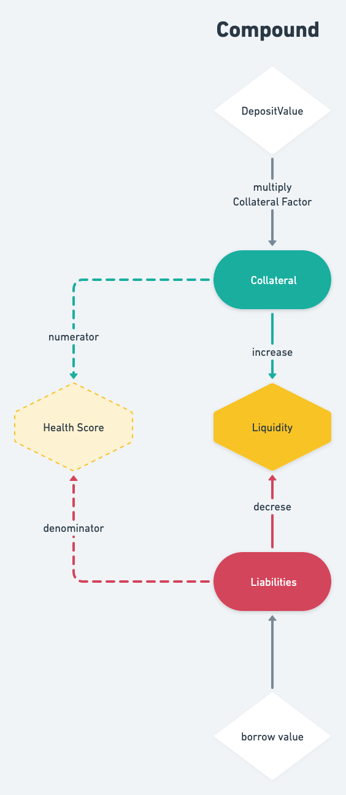
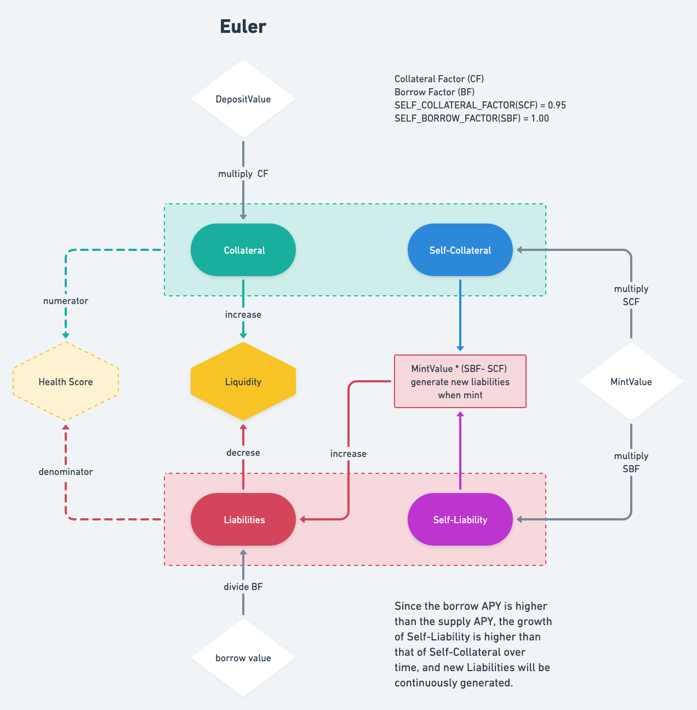

# Euler Protocol

## 原理

- Euler 白皮书： <https://docs.euler.finance/getting-started/white-paper>
- Euler 白皮书（CN）：<https://docs.euler.finance/languages/white-paper-eng-chn>

- Dapp-Learning sharing meetup Euler 白皮书解析:

  - <https://www.youtube.com/watch?v=1pyHuE2qMLE>
  - <https://www.youtube.com/watch?v=mDeoYknMx_M>

## Liquidity

借贷协议中的 Liquidity 概念首先由 Compound 提出 [Account Liquidity](https://compound.finance/docs/comptroller#account-liquidity)，即用户每一种进入 Markets 的资产都需要乘以相应的 Collateral Factor 累加起来，然后扣除用户每一种借贷资产的价值总和。



而 Euler 中的 Liquidity 在 Compound 基础上做改进，不仅抵押资产计算价值时需要乘以 `Collateral Factor`，债务资产也需要除以 `Borrow Factor` 做价值调整；另外由于其特有的 mint 机制，在计算时还需要考虑 `Self-Collateral` 和 `Self-Liability`。



```math
Liquidity = Collateral - Liabilities + (Self-Collateral - Self-Liability)
```

注意流动性的资产价值都需要乘以一个价值调整系数，上述四个部分的调整系数都不同，下文中将详细介绍。

`Self-Collateral` 和 `Self-Liability`，这两者的价值在 Euler 的算法机制下总是会保持一致，即 self 部分的抵押和负债价值会相互抵消，所以实际上流动性的表达最终如下：

```math
Liquidity = Collateral - Liabilities
```

### HealthScore

健康系数，与 Compound 类似，是总抵押价值和负债价值的价值，两者都经过 factor 调整，不同资产的抵押和借贷的 factor 不同（CF, BF）。当抵押与借贷相等，`HealthScore` 为 1，处于临界点，一旦小于 1 则可以被清算。

### Self-Collateralisation

区别于其他的借贷协议，Euler 独有的 Self-Collateralisation 概念，允许用户最多使用 19 倍杠杆做空或者挖矿。

抵押资产分为 `Collateral` (前端页面中命名为 Supply) 和 `Self-Collateral`, 负债资产分为 `Liabilities` 和 `Self-Liability`，四种资产均有不同的价值调整系数 factor 。

| Collateral               | factor | expression    | info                  |
| ------------------------ | ------ | ------------- | --------------------- |
| Collateral(DepositValue) | CF     | value \* CF   | decided by governance |
| Self-Collateral          | 0.95   | value \* 0.95 | constant value        |
| Liabitlies(BorrowValue)  | BF     | value / BF    | decided by governance |
| Self-Liablity            | 1      | value / 1     | constant value        |

- 常规抵押和负债，都会由社区投票决定其系数，CF, BF 都是小于 1 的数，前者比后者小
  - Euler 在 Compound 的 CF 基础上增加了 BF，使得不同资产之间的风险调整更加灵活
  - [Euler risk-factors-list](https://docs.euler.finance/risk-framework/risk-factors-list)
- mint 操作会产生等价值的的抵押和债务，即价值 MintValue 的 DToken 和价值 MintValue 的 EToken （债务凭证与抵押凭证）
- self 部分的资产价值调整系数都是固定值，Sefl-Collateral 固定为 0.95， Sefl-Liabilities 固定为 1，那么经过风险调整后 (Risk-adjusted) 的负债与抵押的资产价值关系是：
  - `Self-Collateral * 0.95 = Self-Liability / 1`
  - `Self-Collateral` 是和 MintValue 等值的抵押，但因为需要乘以 0.95 的风险调整系数，这只能抵消 0.95 倍的债务
  - 而还有 0.05 倍的 MintValue 债务被直接计入了 `Liablities`

### Compute Liquidity

Euler 的所有资产都是以 WETH 计价，并从相应资产与 WETH 组成的交易对的 UniswapV3Pool 中获取 TWAP 价格，WETH 的价格恒等于 1。

假设当下 USDC 的价格是 1/3000 WETH，我们将设想几种不同的场景，从易到难梳理计算流动性的逻辑：

| symbol | CF   | BF   |
| ------ | ---- | ---- |
| USDC   | 0.9  | 0.94 |
| WETH   | 0.88 | 0.91 |

1. 用户只抵押了 3000 USDC，并未产生债务

   - Liquidity 非常好计算，只需考虑 `Collateral`，即为 USDC 的抵押调整后价值
   - `Liquidity = 3000 * p_USDC * CF = 3000 * (1 / 3000) * 0.9 = 0.9`

2. 假设用户抵押了 3000 USDC，并借出 0.5 WETH

   - Liquidity 将是 `Collateral - Liabilities`
   - `Liquidity = 3000 * p_USDC * CF - 0.5 * p_WETH / BF = 0.9 - 0.5 * 1 / 0.91 = 0.3505`

3. 假设用户抵押了 3000 USDC 价值 1 WETH，然后调用 mint 操作， MintValue 为 2 WETH

   - mint 之后的 total-Collateral = 1 + 2 WETH, total-Liablity = 2 WETH
   - Liquidity 将是 `Collateral - Liabilities + (Self-Collateral - Self-liability)`
   - `(Self-Collateral - Self-liability)` 由于 self 部分总是债务和抵押相互抵消的，所以我们真正需要考虑的是，如何从总债务和总抵押中，区分出 Self 部分和原始的债务与抵押
   - 由于 mint 操作会产生等量的债务和抵押，所以用户的债务和抵押将各增加 MintValue 的价值
   - mint 操作首先会生成与 MintValue 等值的 `Self-Collateral`
   - `Self-Collateral` 的调整价值可以借出等价的 `Self-Liability = Self-Collateral * SELF_COLLATERAL_FACTOR` , `SELF_COLLATERAL_FACTOR` 是固定系数 0.95
   - 确定了 self 部分的抵押和负债价值，从总量中分别扣除，即为常规的抵押 `Collateral` 和负债 `Liabilities`
   - `Collateral = total-Collateral - Self-Collateral = 3 - MintValue = 1`
   - `Liabilities = MintValue - Self-Collateral * 0.95 = MintValue * (1 - 0.95)`
   - `Liquidity = Collateral - Liabilities = 1 - 2 * (1 - 0.95) = 0.9`

4. 假设用户抵押了 3000 USDC 价值 1 WETH，然后调用 mint 操作， MintValue 为 2 WETH，之后又 borrow 0.5 WETH

   - 本次在 3 的情况下再 borrow 了 0.5 WETH，只需要按照常规债务计算这部分新增的债务即可
   - `Liquidity = 1 - 2 * (1 - 0.95) - 0.5 / BF = 0.3505`

5. 假设用户抵押了 1500 USDC 价值 0.5 WETH，和 0.5 WETH， mint 出 12 WETH 分别生成了 12 WETH-DToken 和 12 WETH-EToken

   - 12 WETH-DToken 被 12 WETH-EToken \* 0.95 抵消后还剩下 12 \* (1 - 0.95) = 0.6 WETH 的债务，计入 Liabilities
   - 由于 deposit 只存入了 0.5 WETH 其计入流动性的价值为 `0.5 * 0.88 = 0.44`, 而 `Liabilities = 0.6 / 0.91 = 0.6593`
   - Liabilities 的 WETH 部分最终只能承担 0.44 WETH 的债务，剩下的 `0.6593 - 0.44 = 0.2193 WETH` 债务则需要由 Collateral 的 USDC 承担，用户在 WETH 资产上的 Liquidity 已经清零
   - 而 USDC 的流动性则为 `Liquidity = 0.5 * 0.9 - 0.2193 = 0.2307`， WETH 流动性已经为 0，那么这也是总的 Liquidity

#### Short and Max Leverage

Euler 允许最大 19 倍杠杆用于做空，假设使用 WETH 做空 UNI (ShortOn: UNI, Against: WETH)

1. 首先 deposit 1 WETH
2. Mint 价值 19WETH 的 UNI，则会同时产生 19WETH 价值的抵押和债务（UNI-EToken, UNI-DToken）
3. 其中 19 \* 0.95 = 18.05 WETH 价值的 Self-Liability 被 19WETH 价值的 Self-Collateral 抵消
4. 产生了 19 \* (1 - 0.95) = 0.95 WETH 价值的 Liabilities
5. 调用 Euler 的 swap 接口，Euler 合约会将 UNI-EToken 转换成 UNI ，然后去 UNI-WETH uniV3Pool 中兑换成等值的 WETH，最后 Euler 合约转换成 WETH-EToken 转回给用户
6. 一段时间后，当 UNI 价格下降，用户的 UNI-DToken 债务价值下降，此时用户用 WETH-EToken 去兑换 UNI-EToken 将花费更少，会剩下部分 WETH-EToken 作为做空的利润
7. 我们先忽略这段时间借贷利息的成本和抵押的资产收益，假设 UNI-DToken 的价值由于价格下跌减小了 1%，那么用户将获利将是 19 WETH 债务的 1% ，即 0.19 WETH，相较于用户直接做空 1 WETH 的 UNI 获利 0.01 WETH，上述方式获得了 19 倍杠杆的加成

回看第 3 和 4，用户在 mint 之后的 Liquidity 其实已经为 0，HealthScore 已经变成 1，处于将要被清算的临界点，再想提高杠杆率，合约会禁止执行。

为何最大杠杆是 19 倍的原因在于，每次 mint 所产生的相等数量的 EToken 和 DToken 并不能完全相互抵消，因为 `SELF_COLLATERAL_FACTOR = 0.95` 抵押的调整后价值总是比债务要少 (1 - 0.95), 这缺少的 0.05 倍的价值则被计入了 Liabilities，这部分需要使用用户 deposit 存入的抵押价值来抵消，最大不能超过 deposit 资产的调整价值 (需要乘以 CF)。于是有如下关系

```math
Liabilities = MintValue * (1 - 0.95)
```

Liabilities 的最大值就是 DepositValue，则最大 mint 价值则为

```math
MaxMintValue = DepositValue * CF / (1 - 0.95)  = DepositValue * CF * 20
```

其中杠杆部分是 `MaxMintValue - DepositValue * CF = DepositValue * CF * 19` 即是 Leverage 最大值 19 的由来。

#### short scripts

由于 Euler 前端代码暂未开源，我们编写了交互脚本与 Euler 合约交互，模拟使用 Euler mint 特性来使用 WETH 做空 UNI。这里使用 fork-mainnet 网络模拟交易环境。

- Euler-scripts 与合约交互操作的脚本示例: <https://github.com/0x-stan/euler-scripts>

### Dynamic Self Value

Self 部分的资产价值会随着利息累加动态变化

负债的 APY 通常比抵押高，所以负债的利息增长更快，导致 `Self-Liability` 的价值会逐渐超过 `Self-Collateral`，增长的负债会分为两部分。如果我们总是将负债和抵押分为总计四个部分去分别记录，将非常消耗 gas，Euler 对于这里的处理则是先假设所有负债都是 Self-Liability , 用于 self 部分的债务价值调整系数 factor 是恒定的 1，总是大于常规的 BF，利用这个价值计算的差异，则可以实时计算用户每个资产的四个部分的价值部分情况。

- 首先 Euler 在计算单个资产流动性时，会优先将所有负债资产视为 `Self-Liability` ，再由公式推导 `Self-Collateral` 的数量
- `Self-Collater = Self-Liability / 0.95`
- 随着债务利息增长更快 `Self-Collater` 也会随之增长，而总抵押数量此时是没有变化的（不考虑用户 deposit 或者 withdraw），所以 `Collateral` 的数量会随之减少
- 当推导得出的 `Self-Collateral` 未超过用户实际抵押的资产数量时，其常规抵押 Collateral 是总的抵押数量扣除 `Self-Collateral`, 而债务全部认为是 `Self-Liability` 常规债务则为 0
- 当推导得出的 `Self-Collateral` 超过用户实际抵押的资产数量时，将以实际的数量为上限 (balanceInUnderlying) 重设其值
  - 超出的债务部分将持续的被累计入 `Liability`

### Liquidation

Eluer 采用了不同的方式。我们不采用固定折扣，而是采用一个公式来确定某个仓位到底“缩水”多少。这是“一锤子买卖”，清算人从别无选择参与 PGA （priority gas auctions） 变成参与一种荷兰式拍卖。随着折扣慢慢增加，每个有意参与的清算者必须在当前的折扣水平下做出是否参与的决断。清算人 A 也许在 4%折扣时就可以盈利，但是清算人 B 的行动效率可能更高，在 3.5%折扣的时候就会果断出手。荷兰式拍卖会受到 Euler 上 TWAP 预言机的协助，因为一个价格冲击并不会使得价格立刻到达一个每个清算人都会盈利的奇点。随着时间变长，价格只会变得更加平滑，从而产生一系列可以清算的机会，而这还会限制 PGA。总的来说，这个过程会使得折扣价格和清算借款人的边际成本趋同。

#### Stability Pools

暂未实现。

## 参考链接

- dapp learning 分享会：
  <https://docs.google.com/presentation/d/1rOjH4qjVAD-p6Pt8Woc7sFz4iRHdgZB6nt2BrTBICs8/edit#slide=id.p>
- delphi lab，Dynamic interest rates using control theory：
  <https://cdn.delphidigital.io/uploads/2021/06/Dynamic-Interest-Rate-Model-Based-On-Control-Theory.pdf>
- defi 固定利率协议： <https://ethtaipei.mirror.xyz/dWxbQ8pmRGT-OcMR_p_VIEL-OJuqe9HJuP6K4DNTlyY>
- Euler-scripts 与合约交互操作的脚本示例: <https://github.com/0x-stan/euler-scripts>
- monetary mechanics: https://maroonmacro.substack.com/p/issue-50-trade-idea-short-steth?s=r
