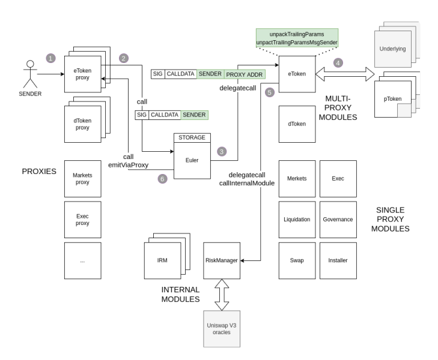
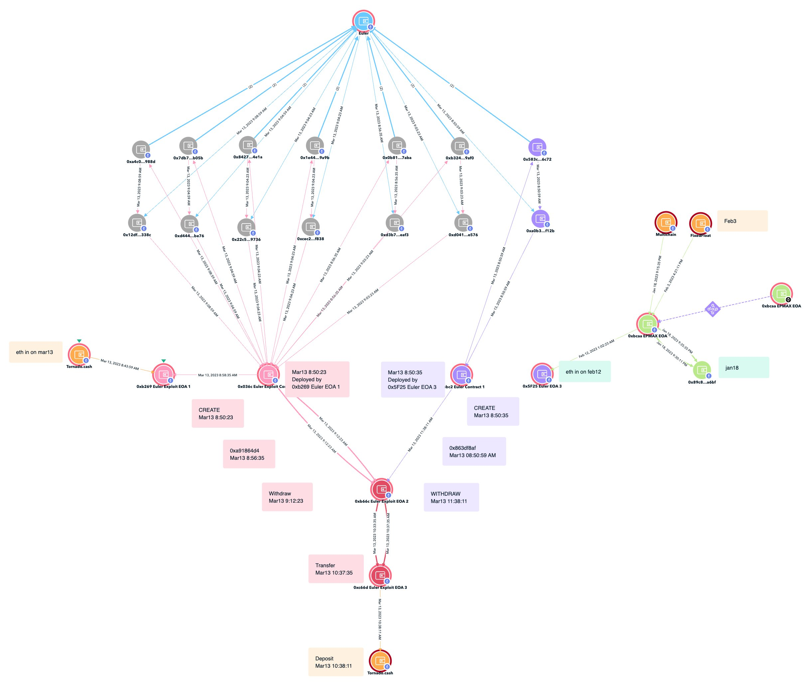

# Euler Attack Post mortem
Euler 在3月13日被攻击，损失了2B USD。攻击者的攻击代码异常简约，但反应出的是我方对于Euler项目的理解层次不同，深度不够。
Euler项目在挖矿前就进行过详细的调研，也组织过相应的学习讨论，当时得出的结论是代码质量高，项目方靠谱。为达到Hacker对于Euler的理解深度，特重新梳理了一遍Euler项目的业务逻辑以及他的智能合约架构，以帮助我方理解其深层次原理。

## 整体架构图

## 业务逻辑流程图
### eToken.deposit:
```sequence
sender -> proxy(eToken): call deposit
proxy(eToken) -> Euler: call dispatch
Euler -> Impl(eToken): delegatecall deposit
sender --> Euler: Dai transfer amountA
Impl(eToken) --> sender: mint eDai amountB
Impl(eToken) -> InterestRate: deleagatecall update IR
Impl(eToken) -> RiskManager: delegatecall check liquidity
Euler -> proxy(eToken): call emitEvent
```

$$
\gamma = \frac{totalBorrow}{poolSize+totalBorrow}
$$
$$
exchangeRate = \frac{poolSize+totalBorrow}{totalSupply}=\frac{amountA}{amountB}
$$
```python
r = (cash + totalBorrow) / totalSupply
r
# deposit
amount = 100
cash = cash + amount
share1 = amount / r
totalSupply = totalSupply + share1
# r = (cash + totalBorrow) / totalSupply
share1
```

### eToken.withdraw
```sequence
sender -> proxy(eToken): call withdraw
proxy(eToken) -> Euler: call dispatch
Euler -> Impl(eToken): delegatecall withdraw
Euler --> sender: Dai transfer amountA
sender --> Impl(eToken): burn eDai amountB
Impl(eToken) -> InterestRate: deleagatecall update IR
Impl(eToken) -> RiskManager: delegatecall check liquidity
Euler -> proxy(eToken): call emitEvent
```

### eToken.mint
```sequence
sender -> proxy(eToken): call mint
proxy(eToken) -> Euler: call dispatch
Euler -> Impl(eToken): delegatecall mint
Impl(eToken) --> sender: mint eDai amount * 19
Impl(dToken) --> sender: mint dDai amount * 19
Impl(dToken) -> InterestRate: deleagatecall update IR
Impl(eToken) -> InterestRate: deleagatecall update IR
Impl(eToken) -> RiskManager: delegatecall check liquidity
Euler -> proxy(eToken): call emitEvent
```
mint本质上是一个放大杠杆的操作，它允许用户最大放大到19倍杠杆。类似于compound中的循环贷，底层的资产事实上都锁在Euler协议里，并没有transfer出去给到用户。只是给用户记账。
```python
# mint
amount = 100 * 19
debt = amount
share2 = amount / r
totalSupply += share2
totalBorrow += amount
# r = (cash + totalBorrow) / totalSupply
share2 + share1
```
### eToken.burn
```sequence
sender -> proxy(eToken): call burn
proxy(eToken) -> Euler: call dispatch
Euler -> Impl(eToken): delegatecall burn
sender --> Impl(eToken): burn eDai amount
sender --> Impl(dToken): burn dDai amount
Impl(dToken) -> InterestRate: deleagatecall update IR
Impl(eToken) -> InterestRate: deleagatecall update IR
Impl(eToken) -> RiskManager: delegatecall check liquidity
Euler -> proxy(eToken): call emitEvent
```

burn本质上是降低杠杆的操作，是mint的反操作。

### eToken.transferFrom
```sequence
sender -> proxy(eToken): call transferfrom
proxy(eToken) -> Euler: call dispatch
Euler -> Impl(eToken): delegatecall transferfrom
sender --> Impl(eToken): transferfrom eDai to amount
Impl(eToken) -> RiskManager: delegatecall check liquidity From
Impl(eToken) -> RiskManager: delegatecall check liquidity To
Euler -> proxy(eToken): call emitEvent
```

### eToken.donateToReserves
```sequence
sender -> proxy(eToken): call donateToReserves
proxy(eToken) -> Euler: call dispatch
Euler -> Impl(eToken): delegatecall donateToReserves
sender --> Impl(eToken): burn eDai amount
Impl(eToken) --> pool: mint eDai amount
Euler -> proxy(eToken): call emitEvent
```
```python
# donate
delta = 500
share = share1 + share2 - delta
share
```
### dToken.borrow
```sequence
sender -> proxy(dToken): call borrow
proxy(dToken) -> Euler: call dispatch
Euler -> Impl(dToken): delegatecall borrow
Euler --> sender: Dai transfer amountA
Impl(dToken) --> sender: mint dDai amountA
Impl(dToken) -> InterestRate: deleagatecall update IR
Impl(dToken) -> RiskManager: delegatecall check liquidity
Euler -> proxy(dToken): call emitEvent
```
### dToken.repay
```sequence
sender -> proxy(dToken): call borrow
proxy(dToken) -> Euler: call dispatch
Euler -> Impl(dToken): delegatecall borrow
sender --> Euler: Dai transfer amountA
sender --> Impl(dToken): burn dDai amountA
Impl(dToken) -> InterestRate: deleagatecall update IR
Impl(dToken) -> RiskManager: delegatecall check liquidity
Euler -> proxy(dToken): call emitEvent
```
### dToken.transferFrom
```sequence
sender -> proxy(dToken): call transferFrom
proxy(dToken) -> Euler: call dispatch
Euler -> Impl(dToken): delegatecall transferFrom
Impl(dToken) -> Impl(dToken): check allowance[to][from] > amount
sender --> Impl(dToken): transfer dDai amountA to To addr
Impl(dToken) -> RiskManager: delegatecall check liquidity To
Euler -> proxy(dToken): call emitEvent
```
### Liquidation.liquidate
```sequence
liquidator -> proxy(liquidate): call liquidate
proxy(liquidate)->Euler: call dispatch
Euler -> Impl(liquidate): delegatecall liquidate
Impl(liquidate) -> RiskManager: getAccountLiquidity violator
Impl(liquidate) -> Impl(liquidate): calculate
Note right of Impl(liquidate):discount = 1 - healthFactor
Note right of Impl(liquidate):discount <= 0.2, conversionRate = 1/1/(1-discount)
Note right of Impl(liquidate):repay = dToken amount, yield = repay * conversionRate

Impl(dToken) --> liquidator: transfer dToken  from violator to liquidator amount = repay
Impl(dToken) --> liquidator: transfer dToken from violator to liquidator for fee = 0.02 * repay
Impl(eToken) --> liquidator: transfer eToken from violator to liquidator amount = yield
Impl(liquidate) -> RiskManager: delegatecall check liquidity liquidator
Euler -> proxy(liquidate): call emitEvent
```
具体的清算时，其计算方式如下：
```python
# liquidation
discount = 0.02 + 1 - hf
discount = 0.2 if discount > 0.2 else discount
cr = 1/1/(1-discount)

repay = debt
profit = repay * cr

repay = share*r/cr if repay > share*r else repay
profit = share*r if profit > share*r else profit

repay = repay * 1.02
withdrawAmount = profit - repay/0.95
discount,cr,repay, profit,withdrawAmount

```
## Key Process
### Risk Manager Check Liquidity
针对同一种token，即持有eToken又持有dToken的情况，需要按照一下两种来分析：
1. eToken价值低于dToken价值，则折算时，debtVal分为两部分：其一是eToken换算的等值dToken数量 t1, 其二是用户持有的单方向debt头寸差值的价值: (debt-t1)/bf
```python
colVal = share*r*0.95*p
t1 = share*r*0.95
t2 = (debt-t1)/bf
debtVal = (t1+t2)*p
hf = colVal/debtVal
colVal,debtVal,hf
```
2. eToken价值高于dToken价值时，则collVal也分为两部分：其一是dToken换算的等值eToken数量 t1， 其二是差值部分的折算价值: (share*r - t1)*cf
```python
debtVal = debt*p
t1 = debt/0.95
t2 = (share*r -t1)*cf
colVal = (t1+t2)*p
hf = colVal/debtVal
debtVal,colVal,hf
```

### reserve 部分计算：
Euler 选择将reserve换成eToken存放在池子里，这样可以持续的吃利息。类比于compound，就是将compound的reserve部分重新deposit到池子中。
同样的，问题的核心是保证exchange rate不变：

$$
r = \frac{casth+borrow-reserve}{totalSupply_0}=\frac{cash+borrow}{totalSupply_1}
$$

```python
r1 = (cash + borrow - reserve) / totalSupply
r2 = (cash + borrow) / totalSupply'
reserve = (borrow * (1 + IR)^deltaT - borrow) * feeRatio
totalSupply' / totalSupply = (cash + borrow) / (cash + borrow - reserve)
```
```js
uint256 poolAssets = assetCache.poolSize + (newTotalBorrows / INTERNAL_DEBT_PRECISION);
newTotalBalances = poolAssets * newTotalBalances / (poolAssets - feeAmount);
newReserveBalance += newTotalBalances - assetCache.totalBalances;
```

### liquidation process中如果不是同一种token清算，保证用户健康度>1.25的计算公式推导

推导的核心是：

$$ 
 hf = \frac{collVal - \delta \cdot cf \cdot cr}{debtVal - \delta / bf} > 1.25
$$

其中， $\delta$ 是需要偿还的债务价值，即dToken数量 * p， bf是borrow factor，cf是collaterall factory， cr是清算的激励因子
则：

$$
\delta > \frac{1.25 * debtVal - collVal}{1.25/bf - cr \cdot cf}
$$

对应于代码：
```python
borrowAdj = 1.25 / bf
collAdj = cf / (1 - dc) = cf * cr
if borrowAdj <= collAdj :
    repay = MAX
else:
    repay = (1.25 * debtVal - collVal) / (borrowAdj - collAdj) / p
```

### isolated 资产，cross资产
针对isolated资产，比如COMP：
isolated = true, cf = 0, bf = 28 / 40 = 0.7
针对cross资产，比如LUSD:
isolated = false, cf = 0, bf = 28 / 40 = 0.7
具体的判断逻辑在requireLiquidity里面：
如果isolated=true,那么必须要求numBorrow=1
如果isolated=false,则可以借任意多种资产

当借的资产类型是isolated时，此时isolated=true，当Mint时，即放大杠杆时，isolated=true

只有collateral资产的cf > 0

为什么要设计isolated资产类型和cross资产类型？让它无法用作抵押品，降低系统风险。

## 核心漏洞
mint最大可以放大19倍杠杆，而清算最多可以获得0.25倍的利润，所以19*0.25>1 超过了本金，导致只要构造一个可以清算自己的条件，就可以通过放大杠杆后清算自己获利。
而通过donate可以构造一个绝佳的清算自己的情况，即将自己的eToken捐出，此时自己的dToken仍在，所以就资不抵债，符合清算逻辑。

### timeline


https://twitter.com/tayvano_/status/1635368952774950912


2023-03-13 18:05:23 local time - Euler Pause 1st
https://openchain.xyz/trace/ethereum/0xb69b097fb373319659ddd31ac528e471830f50244905f0717cd13bc04f0a88b8
2023-03-13 18:05:23 local time
https://etherscan.io/tx/0xb69b097fb373319659ddd31ac528e471830f50244905f0717cd13bc04f0a88b8
2023-03-13 19:44:23 local time
https://openchain.xyz/trace/ethereum/0x90d26bb5126df219e707093487ba2a48b271e73ddba7e54bb5ae299c48dfc0fa
