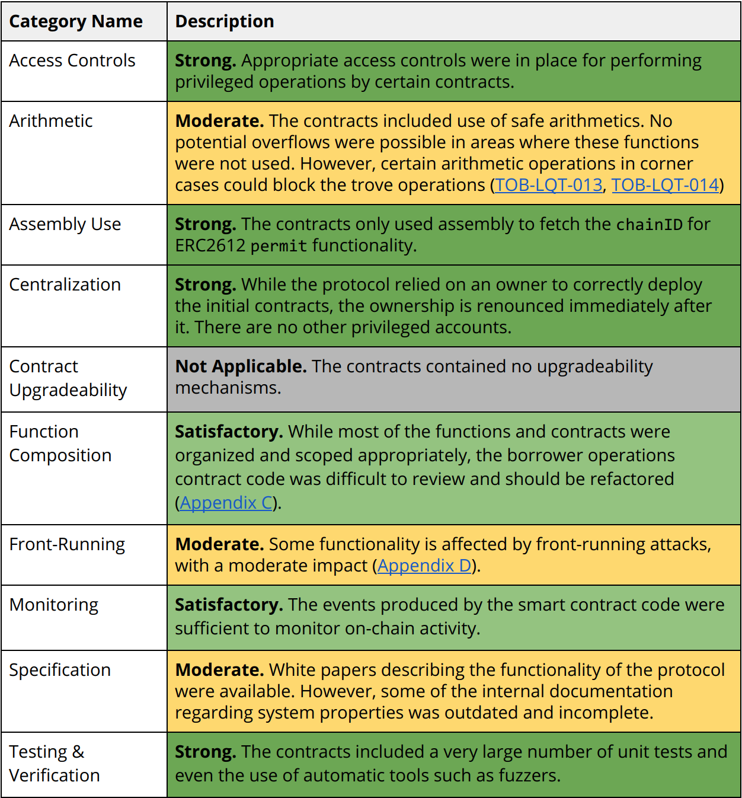

## 0. 摘要

  Liquity是一种去中心化的借贷协议，只用ETH作抵押提取无息贷款。
每个用户需通过链上合约创建一个单独的“金库(Trove)”来实现借贷。贷款以LUSD的形式支付，并要求110%的最低抵押率。LUSD是一种与美元锚定的稳定币，LUSD的持有人可以在任何时刻以美元计价来赎回等值ETH。
除了用户的抵押外，Liquity的贷款还由一个LUETH稳定池和所有借款人集体作为最后担保人提供担保，同时还有算法来保障LUSD和美元的锚定。
  Liquity协议是彻底的去中心化协议，它不可改变，也无需治理，ETH也是去中心化的。
  
## 1. 市场概述

稳定币是市场刚需。
当前稳定币的缺点:
- 当前是抵押类稳定币的都是有息借贷，利息超过20.5% p.a
- 治理机制的引入导致协议费用居高不下
- 无有效清算机制导致抵押率偏高
- 而算法稳定币却无法保证实时赎回。

## 2. Liquity协议的优点:

- 利率为0％——作为借款人，您无需担心不断产生新的债务。
- 110％的最低抵押率——更有效地利用储蓄的ETH。
- 无治理——所有操作都是算法化的和自动化的，并且在协议部署时就已经设置好了协议参数。
- 可直接赎回——LUSD可以随时按面值赎回相关抵押品。
- 完全去中心化——Liquity协议没有管理密钥，并且可以通过由不同前端运营商提供的多个接口进行访问，从而使其不受审查。

## 3. 系统功能
[合约代码位置](https://github.com/liquity/dev/tree/main/packages/contracts)

[trailofbits审计报告](https://github.com/trailofbits/publications/blob/master/reviews/Liquity.pdf)
<!--  -->

#### 3.1 借贷
----
Liquity协议收取一次性借入和赎回费用。这一费用会根据最近的赎回时间在算法上进行调整。例如：如果近期发生更多的赎回（这意味着LUSD的交易价格可能低于1美元），则借贷费用将增加，从而阻碍借贷。

Core Code: packages/contracts/contracts/BorrowerOperations.sol
- 创建金库(Trove):
    >一个EOA和一个金库唯一绑定
    ```ts
    function openTrove(uint _maxFee, uint _LUSDAmount, address _upperHint, address _lowerHint) external payable;
    ```
- 添加抵押品(ETH):
    ```ts
    function addColl(address _upperHint, address _lowerHint) external payable;
    ```
- 提取LUST: 
    >可以提取一定数量的LUSD使您的抵押率不高于110%(Minimum Collateral Ratio (MCR))

    >最低债务为2,000 LUSD，避免

    >此时会收取一次性手续费(5% >= base rate + 0.5% >= 0.5%)，这笔费用直接添加到用户债务中，在结清closTrove时支付；
    
    >200 LUSD的清算准备金(偿还债务后准备金会退还)

    ```ts
    function withdrawLUSD(uint _maxFee, uint _amount, address _upperHint, address _lowerHint) external;
    ``` 
- 偿还LUSD:
    >目的是降低抵押率
    ```ts
    function repayLUSD(uint _amount, address _upperHint, address _lowerHint) external; 
    ``` 
- 关闭金库，结清债务(总借出的LUSD再加上一次性手续费):  
    ```ts
    function closeTrove() external; 
    ``` 
- 恢复模式时，借贷功能失效:


#### 3.2 稳定池(Stability Pool)
----


