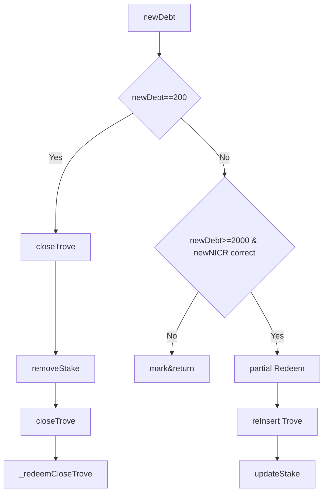
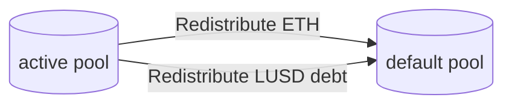
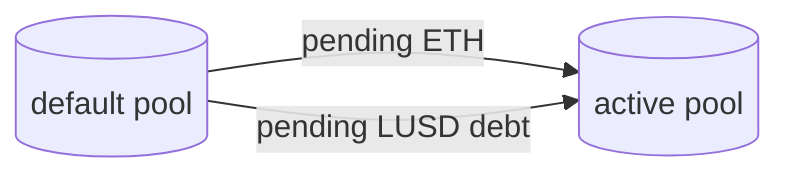
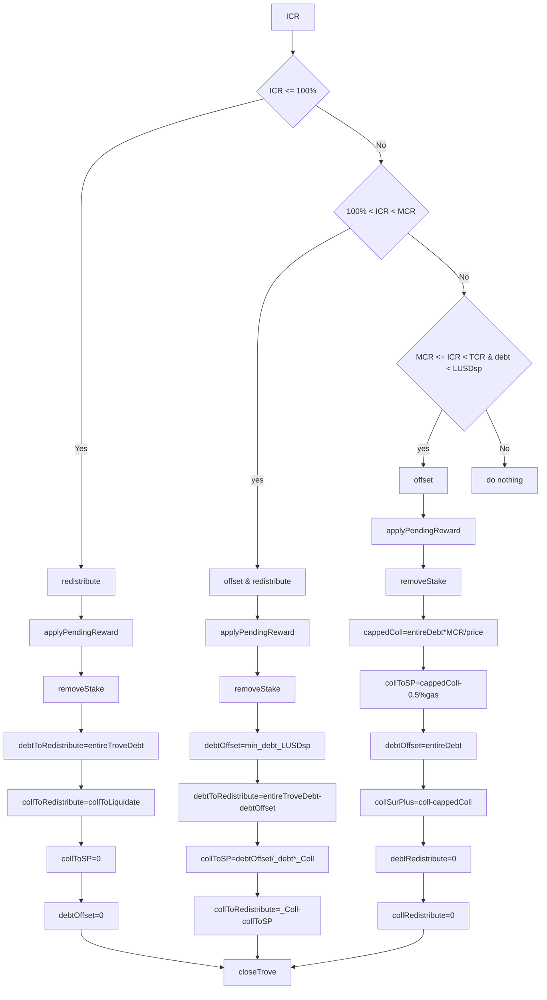
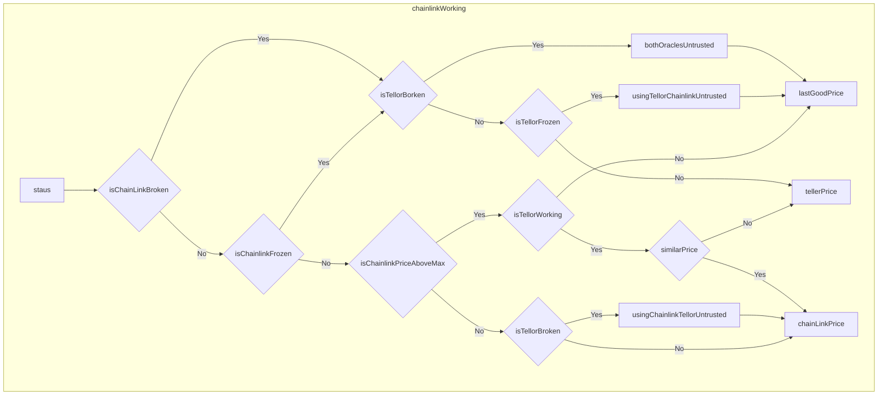
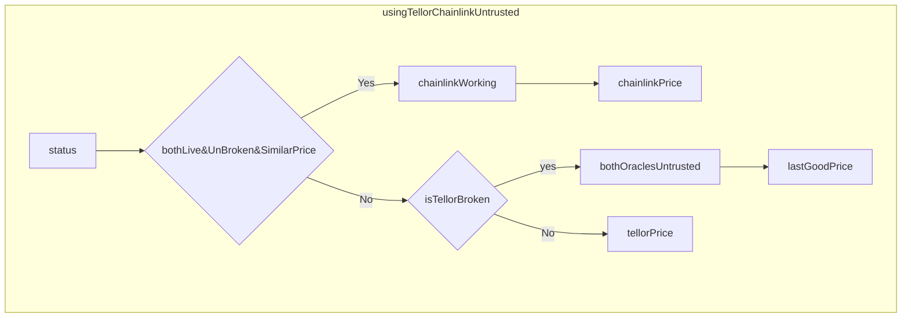
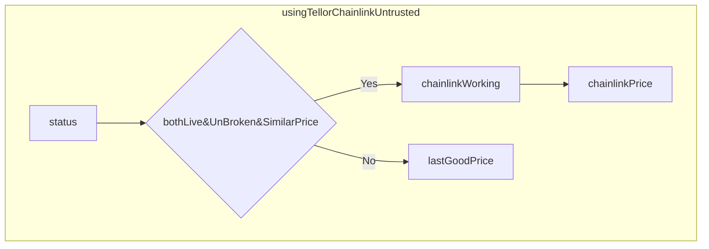
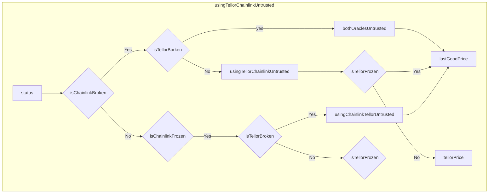

# Liquity Share
主要解决的问题如下：

1. redeem中一个trove里剩余的ETH怎么办？是否可以将一个trove的debt降低到2000刀以下？
- redeem 时允许redeem部分债务，但不允许把一个trove降低到2000刀一下。如果可以全部偿还，会把一个trove给close掉，把剩余的ETH打到surplusPool中让所有者自己去claim。
2. Redeem时，是否可以选择性的去redeem某个或者某几个trove？
- 不可以，但可以设置redeem的最大redeem的trove个数，以及如果需要partial redeem，需要传入partial redeem相关的参数，否则也是不允许partial redeem。
3. redeem时，trove是如何排序？redeem完成后，trove又应该如何排序
- redeem操作时，trove按照NICR从大到小的顺序排列。如果是全部清空了一个trove的债务，会把这个trove从list中删掉。如果部分偿还了一个trove，会把这个trove重新按照新的ICR插入。经过redeem后，保持NICR从大到小的排序
4. redistribute过程中，是所有trove都参与还是部分参与
- redistribute根据新的算法是所有的active trove都会参与。每一个active trove都会在default pool里面有pending reward
5. 恢复模式时，针对110-150%的trove，其清算是部分清算还是全部清算
- 如果稳定池的LUSD数量大于该trove的全部债务，则全部清算，并将剩余的ETH打到surplusPool，由owner自己去claim。如果稳定池的LUSD数量不足，则该trove不参与清算
6. default pool作用
- 用于存放redistribute过程中，被拆分的trove的ETH和LUSD债务。default Pool只在合约里面维护一个总的ETH数量和总的LUSD债务数量
7. redistribute的算法以及流程
- 如下
8. 什么时候去更新链表顺序
- 更新NICR的时候
9. stake 和 collateral 的区别

$$
S_i = \begin{cases} c_i  & \text{ if } C_\phi = 0 \\ 
  c_i \cdot \frac{S_\phi}{C_\phi} & \text{ if } C_\phi >0 
\end{cases}
$$


### Redeem


redeem时，只能redeem那些ICR≥MCR的trove，且当TCR≤MCR时，不允许redeem

涉及到的公式：

$$
\left\{\begin{matrix}
TCR>MCR  & \\
ICR_{next}\ge ICR_{first} \ge MCR  >ICR_{lower} \\
\end{matrix}\right.
$$

```jsx
function redeemCollateral(
        uint _LUSDamount,
        address _firstRedemptionHint, //第一个redeem的trove
        address _upperPartialRedemptionHint, 
        address _lowerPartialRedemptionHint,
        uint _partialRedemptionHintNICR,
        uint _maxIterations, //遍历trove的个数
        uint _maxFeePercentage
    )
第一步：检查_maxFeePercentage是否合法
第二步：_requireAfterBootstrapPeriod，即要求redeem发生在LQTY部署后的14天后。
第三步：拿到最新的ETH价格
第四步：要求TCR>MCR,即如果TCR<=MCR时，无法redeem
第五步：要求redeem的LUSD数量大于0
第六步：要求msgSender有足够的LUSD余额
第七步：拿到系统的总的LUSD债务
第八步：要求msgSender的LUSD余额小于系统的总的LUSD债务
第九步：如果提供了firstRedemptionHint，则检查其是否合法，如果没有提供，则从尾到头遍历sortedTroves，
直到找到第一个ICR>=MCR的trove
第十步：如果_maxIteration=0，则说明用户没有限制遍历的个数。
第十一步：进入循环，遍历次数递减，找到第一个redeem的trove的prev。
第十二步：首先给当前需要redeem的trove加上pending reward，即拿到该trove待分配的coll，debt
第十三步：对当前trove进行redeem
第十四步：如果单个trove的redeem结果返回值cancelledPartial为真，则跳出循环。
说明部分redeem被取消，通常是过时的hint或者redeem后新的债务小于了min债务
第十五步：将总共redeem的LUSD进行累加，总共redeem的ETH进行累加
第十六步：从需要redeem的remainingLUSD中扣除掉redeem的LUSD，并进入下一个循环
第十七步：要求经过redeem后的总的ETH数量大于0
第十八步：计算redeem 费用
第十九步：检查用户的_maxFeePercentage，要求redeem费用满足用户的要求
第二十步：把ETH的redeem费用transfer到LQTY 的staking池中
第二十一步：把剩余的ETH打给msgSender，burn掉用户账户中实际redeem的LUSD，降低activePool中LUSD的债务

```

帮助函数：_redeemCollateralFromTrove

涉及到的公式：

$$
\begin{align*}
LUSD_{lot} & = min(maxLUSD_{amount},LUSD_{debt}-gasFee)\\
ETH_{lot} & = LUSD_{lot}\times Price\\
newDebt&=LUSD_{debt}-LUSD_{lot}\\
newColl&=coll-ETH_{lot}\\
\end{align*}
$$



```jsx
_redeemCollateralFromTrove(
        ContractsCache memory _contractsCache,
        address _borrower,
        uint _maxLUSDamount,
        uint _price,
        address _upperPartialRedemptionHint,
        address _lowerPartialRedemptionHint,
        uint _partialRedemptionHintNICR
    )
第一步：计算该trove中应该redeem的lUSD数量LUSDLot
第二步：计算该trove中应该支出的ETH数量ETHLot
第三步：计算该trove的新的债务，newDebt=debt-LUSDLot
第四步：计算该trove的新的ETH, newCOll=coll-ETHLot
第五步：如果新的债务=gasLUSD，则该池子的所有债务都被redeem了。该池子需要被close
第六步：关闭该trove，首先remove该trove的stake，然后close该trove
closeTrove中做的事情是：与BorrowOperation中不同的是，
这里的closeTrove只将Troves中和rewardSnapshot中关于该trove的记账全部归0.
并从sortedTrove链表里移除该Trove
第七步：在close该trove后，需要从gasPool中burn掉200LUSD，并从activePool中减去200LUSD的债务。
并把剩余的ETH打给CollSurplusPool，并在collSurplusPool中给该trove记账
第八步：如果新的债务>gasLUSD,则该池子的债务会被部分redeem，并且该池子会按照新的NICR排序。
第九步：首先计算部分redeem后，根据新的债务和Coll计算出道新的NICR
第十步：如果新的NICR!=_partialRedemptionHintNICR || newDebt < MIN_NET_DEBT（2000$）
则标记部分redeem失败，直接返回。
第十一步：根据传入的_partialRedemptionHintNICR和上下hint，对该trove重新插入到sortedTroves链表中
第十二步：更新Troves中该trove的债务和coll，更新该trove的新的stake

```

### Redistribute


在清算时，会涉及到重分配债务的问题。

作为liquity的两段式清算的重要一段：重分配债务，在liquity的清算中起着至关重要的作用。

- 最为简单的O(n)复杂度想法：

  每一次redistribute时，都按照ETH的比例来分配相应的reward。(reward 指的是将拆掉的trove中得到的ETH和相应的债务，按照剩余trove的ETH比例分配的基数)。由系统为每一个trove都去添加一下trove的奖励

$$
  (x_i,y_i) = (\frac{c_i}{C}\cdot c_k , \frac{c_i}{C}\cdot d_k)
$$
    
  ICR定义为:
    
$$
\gamma _i=\frac{c_i}{d_i} 
$$
    
  需要保证的一个问题是：经过redistribute之后，剩余所有trove的顺序不能发生变化。
    
  证明如下：
    
  设 $\gamma _i，\gamma _j$ 分别是trove i，trove j的ICR，且：
    
$$
\gamma _i>\gamma _j
$$
    
  进行redistribute的时候，每个trove需要分配得到的reward是
    
$$
\begin{align*}
  (x_i,y_i) & = (\frac{c_i}{C}\cdot c_k,\frac{c_i}{C}\cdot d_k)\\
  (x_j,y_j) & = (\frac{c_i}{C}\cdot c_k,\frac{c_i}{C}\cdot d_k)
\end{align*}
$$
    
  在得到分配的reward之后，新的ICR分别是：
    
$$
\begin{align*}
  \gamma _i^` & = \frac{c_i+x_i}{d_i+y_i} \\
  \gamma _j^` & = \frac{c_j+x_j}{d_j+y_j} \\
\end{align*}
$$
    
  其中 $\gamma _i^`，\gamma _j^`$ 可以变形为：
    
$$
  \begin{align*}
  \gamma _i^` & = \frac{1+\frac{c_k}{C} }{\frac{d_i}{c_i}+\frac{d_k}{C}} \\
  \gamma _j^` & = \frac{1+\frac{c_k}{C} }{\frac{d_j}{c_j}+\frac{d_k}{C}} \\
  \end{align*}
$$
    
  由于公式中， $\frac{c_k}{C} ，\frac{d_k}{C}$ 都是一个定值，且 $\gamma _i>\gamma _j$，所以新得到的 $\gamma _i^` > \gamma _j^`$. 故按照按比例分配reward的方式，可以保证trove在分配之后的顺序不变。
    
- 降低复杂度为O(1)的算法
    
    
    > **Redistributions and Corrected Stakes**
    > 
    
    > When a liquidation occurs and the Stability Pool is empty or smaller than the liquidated debt, the redistribution mechanism should distribute the remaining collateral and debt of the liquidated Trove, to all active Troves in the system, in proportion to their collateral.
    > 
    
    > For two Troves A and B with collateral `A.coll > B.coll`, Trove A should earn a bigger share of the liquidated collateral and debt.
    > 
    
    > In Liquity it is important that all active Troves remain ordered by their ICR. We have proven that redistribution of the liquidated debt and collateral proportional to active Troves’ collateral, preserves the ordering of active Troves by ICR, as liquidations occur over time. Please see the [proofs section](https://github.com/liquity/dev/tree/main/packages/contracts/mathProofs).
    > 
    
    > However, when it comes to implementation, Ethereum gas costs make it too expensive to loop over all Troves and write new data to storage for each one. When a Trove receives redistribution rewards, the system does not update the Trove's collateral and debt properties - instead, the Trove’s rewards remain "pending" until the borrower's next operation.
    > 
    
    > These “pending rewards” can not be accounted for in future reward calculations in a scalable way.
    > 
    
    > However: the ICR of a Trove is always calculated as the ratio of its total collateral to its total debt. So, a Trove’s ICR calculation **does** include all its previous accumulated rewards.
    > 
    
    > **This causes a problem: redistributions proportional to initial collateral can break trove ordering.**
    > 
    
    > Consider the case where new Trove is created after all active Troves have received a redistribution from a liquidation. This “fresh” Trove has then experienced fewer rewards than the older Troves, and thus, it receives a disproportionate share of subsequent rewards, relative to its total collateral.
    > 
    
    > The fresh trove would earns rewards based on its **entire** collateral, whereas old Troves would earn rewards based only on **some portion** of their collateral - since a part of their collateral is pending, and not included in the Trove’s `coll` property.
    > 
    
    > This can break the ordering of Troves by ICR - see the [proofs section](https://github.com/liquity/dev/tree/main/packages/contracts/mathProofs).
    > 
    
    > **Corrected Stake Solution**
    > 
    
    > We use a corrected stake to account for this discrepancy, and ensure that newer Troves earn the same liquidation rewards per unit of total collateral, as do older Troves with pending rewards. Thus the corrected stake ensures the sorted list remains ordered by ICR, as liquidation events occur over time.
    > 
    
    > When a Trove is opened, its stake is calculated based on its collateral, and snapshots of the entire system collateral and debt which were taken immediately after the last liquidation.
    > 
    
    > A Trove’s stake is given by:
    > 
    
    > `stake = _coll.mul(totalStakesSnapshot).div(totalCollateralSnapshot)`
    > 
    
    > It then earns redistribution rewards based on this corrected stake. A newly opened Trove’s stake will be less than its raw collateral, if the system contains active Troves with pending redistribution rewards when it was made.
    > 
    
    > Whenever a borrower adjusts their Trove’s collateral, their pending rewards are applied, and a fresh corrected stake is computed.
    > 
    
    > To convince yourself this corrected stake preserves ordering of active Troves by ICR, please see the [proofs section](https://github.com/liquity/dev/blob/main/papers).
    > 
    
    在理解该算法之前，需要先理解liquity中给存款人设定的两个概念：stake和collateral。
    
    stake的定义如下：
    
$$
    S_i = \begin{cases} c_i  & \text{ if } C_\phi=0 \\
    c_i \cdot \frac{S_\phi }{C_\phi }   & \text{ if } C_\phi > 0
    \end{cases}
$$
    
  从公式的定义中，可以看到，如果totalCollateralSnapshot=0时，stake就是collateral，即该trove中的ETH数值。如果totalCollateralSnapshot>0,则stake是collateral按照比例缩放得到的值。
    
  而totalCollateralSnapshot这个值在每一次系统进行清算时都会更新，其更新的逻辑为：
    
$$
  C_\phi = ETH_{activePool}+ETH_{defaultPool}-ETH_{gas}
$$
    
  这里需要减去ETH_gas的原因是：作为补偿的 ETH 必须排除在外，因为它总是在清算序列的最后发出.
    
  totalStakesSnapshot这个值的更新也在每一次系统进行清算时进行更新，其更新的逻辑为：
    
$$
    S_\phi = \sum stake_i
$$
    
  而stake的更新是清算，Redeem和remove stake中都会更新。
    
  liquity中，为了将redistribute过程的O(n)复杂度降低为O(1),其采取了类似于masterchef的思想，即维护一个全局变量，然后在需要redistribute的时候，计算一个全局的reward 参数，该reward中包含了此次redistribute的ETH和债务。
    
  即系统维护了一个全局变量 Qt：
    
$$
  \begin{array}{c}\frac{R_t}{S_t} = \begin{bmatrix}\frac{c_k}{S_t}  , &\frac{d_k}{S_t} \end{bmatrix} \\
    Q_t = \sum_{k = 0}^{t} \frac{R_t}{S_t}
  \end{array}
$$
    
  针对单个trove，其应该分配得到的reward为：
    
$$
  r_i = s_i\times (Q-Q_{t1})
$$
    

涉及到的方法有：

*redistributeDebtAndColl: 该方法中根据重分配的Coll和debt更新了全局变量Q_t, 并将重分配的ETH和LUSD 债务转移到default pool中*

该方法由系统每次清算时，自动出发。

该方法涉及到的公式为：

$$
\begin{array}{c}
(x_i,y_i)=(\frac{c_i}{C}\cdot c_k,\frac{c_i}{C}\cdot d_k) \\
\frac{R_t}{S_t} = \begin{bmatrix}\frac{c_k}{S_t}  , &\frac{d_k}{S_t} \end{bmatrix} \\
r_i = s_i\times \frac{R_t}{S_t} \\
Q_t = \sum_{k = 0}^{t}\frac{R_t}{S_t}
\end{array}
$$

涉及到的Token transfer为



```jsx
_redistributeDebtAndColl(IActivePool _activePool, IDefaultPool _defaultPool, uint _debt, uint _coll)
第一步：如果debt为0，则直接返回
第二步：拿到此次需要重分配的ETH和债务LUSD数量
第三步：计算ETHRewardPerUnitStaked和LUSDDebtRewardPerUnitStaked,即c_k/S_t,d_k/S_t
第四步：将ETHRewardPerUnitStaked累加到L_ETH中
第五步：将LUSDDebtRewardPerUnitStaked累加到L_LUSDDebt中
第六步：从activePool中降低debt数量的债务，并在defaultPool中增加debt数量的债务
第七步：从activePool中transfer coll数量的ETH到defaultPool中。
```

第二个方法为：applyPendingRewards



```jsx
applyPendingRewards(address _borrower)
第一步：检查调用者必须是borrowOperations合约
第二步：调用_applyPendingRewards方法
_applyPendingRewards(IActivePool _activePool, IDefaultPool _defaultPool, address _borrower)
第一步：首先检查trove是否有待分配的reward
第二步：如果该trove里面有待分配的reward，则首先要求该trove必须active
第三步：根据trove计算pending的ETH reward和LUSD 债务reward
第四步：给该trove的帐上加上待分配的ETH和LUSD debt
第五步：更新该trove的reward的snapshot
第六步：从default Pool中降低debt数量的债务，并在active pool中增加debt数量的债务
第七步：从default Pool中transfer coll数量的ETH到active Pool中。
```

第三个方法为：hasPendingRewards

作用是判断一个trove是否有待分配的reward，其思路是：L_ETH是一个全局变量，其会随着每一次redistribute都会增加。而对于单个trove，如果它applyPendingRewards，会更新它自身的snapshot。故只需要比较该trove中的snapshot的值和L_ETH的值就可以判断该trove是否还有pending的reward

涉及到的公式有：

$$
Snapshot_{trove}^{ETH} < Q_t^{ETH}
$$

```jsx
hasPendingRewards(address _borrower)
第一步：判断该trove的状态是否是active
第二步：拿到rewardSnapshots中该trove的ETH值，如果该ETH数值小于L_ETH，则返回true
```

第四个方法为：getPendingETHReward

用于计算单个trove中，应该得到的待分配的ETH reward

涉及到的公式：

$$
\begin{align*}\delta ETH_{perStake} & = Q_t^{ETH}-Snapshot_{trove}^{ETH} \\ 
\delta ETH & = \delta ETH_{perStake} \times Stake_{trove}\end{align*}
$$

```jsx
getPendingETHReward(address _borrower)
第一步：首先拿到rewardSnapshots中该trove的ETH数量
第二步：用L_ETH减去ETH得到待分配的rewardPerUnitStaked
第三步：如果rewardPerUnitStaked == 0,或者该trove的状态不为active，则返回0
第四步：拿到Troves中该trove对应的stake数量
第五步：由stake数量乘以rewardPerUnitStaked得到待分配的ETH数量
```

第五个方法为：getPendingLUSDDebtReward

与上面类似

### Liquidation


清算过程中，liquidateTrove有如下三种清算接口：

1. liquidateTroves(uint _n) ⇒ 按照数量n，从左到右依次清算，最多清算n个Trove
2. liquidate(address _borrower) ⇒ 清算某一个特定的trove
3. batchLiquidateTroves(address[] memory _troveArray) ⇒ 批量清算某几个特定的trove

针对liquidateTroves方法：

```jsx
function liquidateTroves(uint _n) external override
第一步：拿到ETH的价格
第二步：从稳定池中拿到LUSD的总量
第三步：根据当前的ETH价格，判断是否需要进入恢复模式
第四步：如果是需要进入恢复模式，则按照恢复模式定义的清算来计算所需要的LUSD清算量，预期的ETH收益，预期需要重分配的债务，预期需要重分配的ETH
第五步：如果不需要进入恢复模式，则按照正常模式定义的清算来计算所需要的LUSD清算量，预期的ETH收益，预期需要重分配的债务，预期需要重分配的ETH
第六步：要求经过计算后的需要清算的总的债务totalDebt>0
第七步：调用稳定池的offset函数，传入总共需要清算的债务，总过预期获得的ETH进行清算
第八步：调用redistributeDebtAndColl方法，将需要重分配的债务和ETH进行重分配
第九步：如果计算中得到的totalCollSurplus>0,说明清算后剩余部分ETH在trove中，则将该collSruplus从activepool中转移到SurplusPool
第十步：更新系统的快照
第十一步：给清算调用者发放gas费用补偿。
```

涉及到的方法：_getTotalsFromLiquidateTrovesSequence_RecoveryMode

这个方法是用来计算在恢复模式时，清算序列的一些参数

```jsx
_getTotalsFromLiquidateTrovesSequence_RecoveryMode(
        ContractsCache memory _contractsCache,
        uint _price,
        uint _LUSDInStabPool,
        uint _n
    )
第一步：拿到稳定池中的LUSD总量
第二步：拿到系统中总的债务LUSD数量
第三步：拿到系统中总的ETH数量
第四步：从sortedTroves中拿到最左侧的trove，即最危险的一个
第五步：从sortedTroves中拿到最右侧的trove，即最安全的一个
第六步：进入for循环，从最危险开始依次迭代n个：
第七步：拿到下一个trove，nextuser
第八步：计算当前torve的ICR
第九步：如果backToNormMode=false，则如果ICR >= MCR && 稳定池中的LUSD=0，退出循环。即恢复模式中，针对110%-150%之间的Trove，只用稳定池的资金来清算。不会拆分
第十步：计算TCR
第十一步：在恢复模式中，清算该trove
第十二步：更新变量：
				remainingLUSDInStabPool-=debtOffset;
				entireSystemDebt -= debtOffest;
				entireSystemColl -= (collToSendToSP+collGasCompensation+collSurPlus)
第十三步：更新backToNormalMode的值，根据最新的entireSystemDebt和entireSystemColl来计算
第十四步：如果backToNormalMode=true && ICR < MCR, 此时已经退出恢复模式，按照普通模式来清算该trove
第十五步：按照普通模式清算该trove
第十六步：更新变量：
				remainingLUSDInStabPool-=debtOffset;
第十七步：进入下一个trove
```

帮助方法：_getTotalsFromLiquidateTrovesSequence_NormalMode

方法作用是：在普通清算模式下，进行清算。每一次清算时，都会把清算的那个trove给delete掉。

```jsx
function _getTotalsFromLiquidateTrovesSequence_NormalMode
    (
        IActivePool _activePool,
        IDefaultPool _defaultPool,
        uint _price,
        uint _LUSDInStabPool,
        uint _n
    )
第一步：拿到稳定池中的LUSD数量
第二步：从sortedTroves中拿到最左侧的trove，即最危险的一个
第三步：进入FOR循环，从最危险的一个开始清算
第四步：循环体里面每次都拿到最左侧的trove
第五步：计算该trove的ICR
第六步：如果该ICR < MCR, 则对该trove进行清算，
第七步：更新变量：
			remainingLUSDInStabPool-=debtOffset;
第八步：进入下一个trove
```

帮助方法：_liquidateNormalMode

方法作用：在普通模式下，清算一个trove，会把该trove给删除掉

```jsx
function _liquidateNormalMode(
        IActivePool _activePool,
        IDefaultPool _defaultPool,
        address _borrower,
        uint _LUSDInStabPool
    )
第一步：拿到该trove所有的debt，coll和pending debt和pending coll。
第二步：把该trove对应的pending的debt和coll转移到active Pool中
第三步：移除该trove的stake，即清空stake账本上该trove的值为0
第四步：计算给到清算人的ETH奖励0.5%和LUSD gas奖励
第五步：扣除掉0.5%后计算要清算的LUSD数量，预期收益的ETH数量，需要redistribute的ETH数量，需要redistribute的LUSD数量
第六步：调用_closeTrove方法，偿还债务，获取ETH，关闭该torve。
```

帮助方法：_getOffsetAndRedistributionVals

方法作用是：再一次full liquidation中，计算需要清算的LUSD数量，预期收益的ETH数量，需要redistribute的ETH数量，需要redistribute的LUSD数量

涉及的数学公式为：

$$
\begin{align*}
debt_{offset} & = min(debt,LUSD_{sp})\\
coll_{sp} & = coll \times \frac{debt_{offset}}{debt}\\
debt_{distribute} & = debt-debt_{offset}\\
coll_{distribute} &= coll-coll_{sp}
\end{align*}
$$

```jsx
function _getOffsetAndRedistributionVals
    (
        uint _debt,
        uint _coll,
        uint _LUSDInStabPool
    )
第一步：首先判断稳定池中是否有LUSD，只要稳定池还有LUSD，就执行如下计算：
第二步：根据稳定池中的LUSD数量和此次需要清算的LUSD债务，求出一个最小值，作为实际需要清算的LUSD数量
第三步：按照比例算出实际清算获利的ETH数量
第四步：将剩余的债务作为重分配的债务，剩余的ETH作为重分配的ETH
第五步：如果稳定池此时没有LUSD，则所有的债务都作为重分配债务，所有的ETH都作为重分配的ETH
```

帮助方法：_liquidateRecoveryMode

方法作用是：在恢复模式中去清算一个trove



```jsx
function _liquidateRecoveryMode(
        IActivePool _activePool,
        IDefaultPool _defaultPool,
        address _borrower,
        uint _ICR,
        uint _LUSDInStabPool,
        uint _TCR,
        uint _price
    )
第一步：判断是否是最后一个trove，如果是最后一个trove，则不进行清算 :(最后一个也没法去清算了
第二步：拿到该trove对应的总的Coll，debt，和系统中的pending coll，pending debt
第三步：计算给到清算人的ETH奖励0.5%和LUSD gas奖励
第四步：扣除掉0.5%后计算要清算的LUSD数量，预期收益的ETH数量
第五步：按照如下三种情况进行分别处理：
ICR<100% => redistribute;
	1：把该trove对应的pending coll和pending debt移动到active pool中，实际上相当于执行applyPendingRewards，只是由于后面这个trove需要被close，故就不执行update操作
	2：移除该trove的stake
	3：将该trove的所有债务和剩余ETH数量返回给上层等待分配
	4：closeTrove中做的事情是：与BorrowOperation中不同的是，
			这里的closeTrove只将Troves中和rewardSnapshot中关于该trove的记账全部归0.
			并从sortedTrove链表里移除该Trove
ICR>100 && ICR < MCR => offset as much as possible, redistribute the remainder
	1：把该trove对应的pending coll和pending debt移动到active pool中，实际上相当于执行applyPendingRewards，只是由于后面这个trove需要被close，故就不执行update操作
	2: 移除该trove的stake
	3: 返回需要offset的debt和offse对应的ETH数量，需要redistribute的debt和ETH数量
	4: closeTrove：这里的closeTrove只将Troves中和rewardSnapshot中关于该trove的记账全部归0.
			并从sortedTrove链表里移除该Trove
ICR>=MCR && ICR <TCR && debt < LUSD_stable  稳定池中的LUSD足以覆盖该Trove的全部债务
	1：把该trove对应的pending coll和pending debt移动到active pool中，实际上相当于执行applyPendingRewards，只是由于后面这个trove需要被close，故就不执行update操作
	2: 要求稳定池中的LUSD数量大于0
	3：移除该trove的stake
	4: 按照最大清算比例MCR来计算需要返回给稳定池的ETH数量，这个数量也需要减去0.5%gas。
			需要offset的debt就是这个池子的最大债务，计算超出MCR部分的ETH数量。
			返回redistribute的数量为0

ICR>=MCR && (ICR >=TCR || debt > LUSD_stable) 稳定池中的债务不足以覆盖该Trove的全部债务
	1： 返回空值，即跳过该trove，不清算。

```

### 链表插入删除


作为一个双向有序链表，其为NICR从大到小排序，其数据结构的设计为：

```jsx
struct Data {
	address head; //head of list
	address tail; //tail of list
	uint256 maxSize; //max size of list
	uint256 size; //curr size of list
	mapping(address=>Node) nodes; //id->Node
}
struct Node {
	bool exists; 
	address nextId; //next id
	address prevId; //prev id
}
Data public data;
```

在如上的数据结构中，并没有保存NICR这一个排序的依据。原因是NICR会随着清算或者用户的borrow，adjust而改变。该链表的顺序就只依赖于调用方保持有序。

核心方法：

validInsertPosition

确认插入位置有效

```jsx
_validInsertPosition(ITroveManager _troveManager, uint256 _NICR, address _prevId, address _nextId)
第一步：如果prevId=0&nextId=0,则检查该链表是否为空，要求聊表必须为空
第二步：如果prevId=0,则检查nextId必须是链表头，且该Node的NICR必须大于等于nextId对应的NICR
第三步：如果nextId=0，则检查prevId必须是链表尾，且该Node的NICR必须小于等于prevId对应的NICR
第四步：如果prevId和nextId都不为空，则要求prevId.nextId=nextId,即两个node紧密相连，且插入的Next.NICR<=NICR<=Prev.NICR, 
```

findInserPosition

给定NICR的情况下找到插入位点

```jsx
_findInsertPosition(ITroveManager _troveManager, uint256 _NICR, address _prevId, address _nextId)
第一步：如果给定的prevId hint不为空，则如果prevId现在不存在了，或者prevId的NICR比插入的NICR小，
说明prevId数据失真，则设定prevId=0
第二步：如果给定的nextId hint不为空，则如果nextId现在不存在了，或者nextId的NICR比插入的NICR大
则说明nextId数据失真，则设定nextId=0
第三步：如果prevId=0&&nextId=0，则有序链表从头到尾，以链表头为出发点依次查找。O(n)
第四步：如果prevId=0&&nextId!=0,则有序链表从尾到头，以nextId为出发点开始查找。O(n/2)
第五步：如果prevId!=0&&nextId=0,则有序链表从头到尾，以prevId为出发点开始查找。
第六步：如果prevId!=0&&nextId!=0,则有序链表从头到尾，以prevId为出发点开始查找。
```

### oracle Price feed


liquity里面的价格预言机主要来自chainLink，另外使用了Tellor作为备用。

整体的设计思路是：根据上次获取到的价格，确定预言机当前的状态。共分为如下五个状态：

```jsx
enum Status {
        chainlinkWorking, 
        usingTellorChainlinkUntrusted, 
        bothOraclesUntrusted,
        usingTellorChainlinkFrozen, 
        usingChainlinkTellorUntrusted
    }
```

然后再分别拉取chainLink和tellor的ETH/USD 的价格，并对拉取到的价格进行评价，根据当前状态的不同，进行不同的处理。

针对chainlink，需要进行的处理有：

1. 拉取到当前时刻的ETH/USD的价格 chainlinkResponse
2. 拉取到上一轮中ETH/USD的价格 preChainlinkResponse
3. 同时检查这一轮和上一轮中的/USD价格response，判断response有无损坏，从而判断chainlink是否broken
4. 检查这一轮的ETH/USD价格中的时间戳与当前的时间戳，看是否超过阈值 4h，判断chainlink是否frozen
5. 比较两轮chainlink的报价，看其差值占最值的比例是否超过阈值 50%，判断chainlink报价是否正常

而针对Tellor，需要进行的处理有：

1. 拉取到当前时刻的ETH/USD的价格
2. 判断ETH/USD的返回值是否broken，从而判断tellor是否broken
3. 判断ETH/USD的报价返回值中的时间戳与当前时间戳，看是否超过阈值 4h，从而判断Tellor是否frozen

针对chainLink和Tellor的报价都可信时，需要比较两家报价的差异，即两家报价的差值占最值的比例不能超过阈值，5%。

针对状态1: chainlinkWorking



针对状态2: usingTellorChainlinkUntrusted



针对状态3: bothOraclesUntrusted



针对状态4: usingTellorChainlinkFrozen

