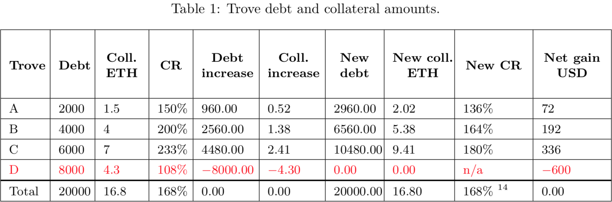
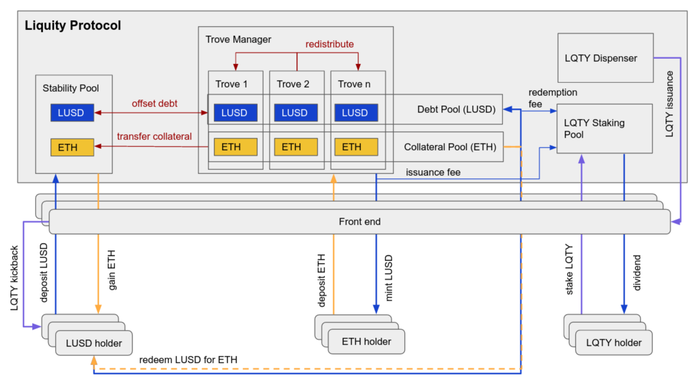

## 0. 摘要

Liquity 是一种去中心化的借贷协议，只用 ETH 作抵押提取无息贷款。
每个用户需通过链上合约创建一个单独的“金库(Trove)”来实现借贷。贷款以 LUSD 的形式支付，并要求 110%的最低抵押率。LUSD 是一种与美元锚定的稳定币，LUSD 的持有人可以在任何时刻以美元计价来赎回等值 ETH。
除了用户的抵押外，Liquity 的贷款还由一个 LUETH 稳定池和所有借款人集体作为最后担保人提供担保，同时还有算法来保障 LUSD 和美元的锚定。
Liquity 协议是彻底的去中心化协议，它不可改变，也无需治理，ETH 也是去中心化的。

## 1. 市场概述

稳定币是市场刚需。
当前稳定币的缺点:

-   当前是抵押类稳定币的都是有息借贷，利息超过 20.5% p.a
-   治理机制的引入导致协议费用居高不下
-   无有效清算机制导致抵押率偏高
-   而算法稳定币却无法保证实时赎回。

### 1.1 清算流程：

Liquity 按优先级别排序的三重清算方案：

-   稳定池  
    稳定池属于优先级别最高，即抵押借贷的用户需开启 Trove 提供高于 110% 的抵押品可发行 100% 的 LUSD。而一旦用户抵押品 ETH 价值低于 110% 会被触发清算，此时充斥着 LUSD 的稳定池即会发挥作用，稳定池会销毁对应量的 LUSD 而获得相对应的抵押品 ETH，因为只要低于 110% 即会被清算而 110%>100%，相当于稳定池会获得 10% 折扣的 ETH。
-   债务再分配  
    第二阶段债务再分配，可理解为稳定池 LUSD 不足的情况下的 Plan B。假如稳定池里 LUSD 数量不足以覆盖系统债务，则会触发债务再分配，简单来讲就是把被清算的债务分配到抵押率较充足的 Trove 持有者头上。
-   Recovery Mode （复原模式）  
    系统存在一个关键抵押率 =150%，当系统的总抵押率不足 150% 时，则会触发 Recovery Mode，此时，系统会依据抵押率由低到高，不管你的抵押率是否大于 110%，只要低于 150% 就有可能被清算，直到系统总抵押率为 150% 为止。针对 Trove 来说，不会有额外的损失，也就是说如果你的抵押率为 140% 被触发清算，你的 Trove 会被关闭，110% 抵押品被清算，30% 的抵押品则依旧 Claimable，因此该 Trove 的净损失已然为 10%，但对系统来说减少了很多有风险的 Trove 从而提升了系统总抵押率。

### 1.2 LUSD 价格稳定：硬锚定+软锚定

Liquity 的抵押品可赎回，且 1 枚 LUSD 可始终保持可赎回价值 1 美金的 ETH。此谓「硬锚定」， 任何时候都可以按面值赎回 eth.

-   如果 LUSD 溢价，LUSD>1.1 的情况几乎不可能发生，因为假如高于 1.1，由于抵押率 110%，套利者可瞬时套利。而高于 1 美金，由于铸造成本为 1 美金，则可铸造出成本 1 美金的 LUSD 以高于 1 美金的价格卖出，折价同理。
-   软锚定是基于硬锚定而产生的对 LUSD 稳定于 1USD 的长期愿景借此影响人们对 LUSD 未来价格走势的预期从而作出的决定（1LUSD=1U 的谢林点）。 低于 1 美元时，仍然可以按 1 美元价格赎回 eth。 ？有没有 eth 下跌更快的情况？
    也就是说 1 美金以下会激励还款，1 美金以上会激励借款达成套利。

## 2. Liquity 协议的优点:

-   利率为 0％——作为借款人，您无需担心不断产生新的债务。
-   110％的最低抵押率——更有效地利用储蓄的 ETH。
-   无治理——所有操作都是算法化的和自动化的，并且在协议部署时就已经设置好了协议参数。
-   可直接赎回——LUSD 可以随时按面值赎回相关抵押品。
-   完全去中心化——Liquity 协议没有管理密钥，并且可以通过由不同前端运营商提供的多个接口进行访问，从而使其不受审查。

## 3. 系统功能

[合约代码位置](https://github.com/liquity/dev/tree/main/packages/contracts)

[trailofbits 审计报告](https://github.com/trailofbits/publications/blob/master/reviews/Liquity.pdf)

<!--  -->

#### 3.1 借贷

---

Liquity 协议收取一次性借入和赎回费用。这一费用会根据最近的赎回时间在算法上进行调整。例如：如果近期发生更多的赎回（这意味着 LUSD 的交易价格可能低于 1 美元），则借贷费用将增加，从而阻碍借贷。

Core Code: packages/contracts/contracts/BorrowerOperations.sol

-   创建金库(Trove):

    > 一个借贷人的钱包地址(EOA)和一个金库唯一绑定
    > Code: packages/contracts/contracts/BorrowerOperations.sol

    ```ts
       function openTrove(uint _maxFeePercentage, uint _LUSDAmount, address _upperHint, address _lowerHint) external payable override{
           // 将借贷费用作为加入借贷总额中，偿还债务时一并归还
            if (!isRecoveryMode) {
            vars.LUSDFee = _triggerBorrowingFee(contractsCache.troveManager, contractsCache.lusdToken, _LUSDAmount, _maxFeePercentage);
            vars.netDebt = vars.netDebt.add(vars.LUSDFee);
        }
           // 加入$200的被清算时gas补偿(LUSD_GAS_COMPENSATION)，这笔钱会计入债务，却打到GasPool池子里
           vars.compositeDebt = _getCompositeDebt(vars.netDebt);
           // 生成新的金库(Trove)节点
           sortedTroves.insert(msg.sender, vars.NICR, _upperHint, _lowerHint);

           emit TroveCreated(msg.sender, vars.arrayIndex);

       }
    ```

    > Code: packages/contracts/contracts/SortedTroves.sol

    ```ts
        function insert (address _id, uint256 _NICR, address _prevId, address _nextId) external override {
        ITroveManager troveManagerCached = troveManager;

        _requireCallerIsBOorTroveM(troveManagerCached);
        _insert(troveManagerCached, _id, _NICR, _prevId, _nextId);
    }
    ```

    > Code: packages/contracts/contracts/TroveManager.sol

    ```ts
        function addTroveOwnerToArray(address _borrower) external override returns (uint index) {
        _requireCallerIsBorrowerOperations();
        return _addTroveOwnerToArray(_borrower);
    }
    ```

-   添加抵押品(ETH):
    ```ts
    function addColl(address _upperHint, address _lowerHint) external payable{}
    ```
-   提取 LUSD:

    > 可以提取一定数量的 LUSD 使您的抵押率不低于 110%(Minimum Collateral Ratio (MCR))

    > 最低债务为 2,000 LUSD，避免坏账

    > 此时会收取一次性手续费(5% >= base rate + 0.5% >= 0.5%)，这笔费用直接添加到用户债务中，在结清 closTrove 时支付；

    > 200 LUSD 的清算准备金(偿还债务后准备金会退还)
    > Code: packages/contracts/contracts/Dependencies/LiquityBase.sol

    ```ts
    vars.compositeDebt = _getCompositeDebt(vars.netDebt);
    ```

    ```ts
    function withdrawLUSD(uint _maxFee, uint _amount, address _upperHint, address _lowerHint) external;
    ```

-   偿还 LUSD 债务:
    > 目的是降低抵押率
    ```ts
    function repayLUSD(uint _amount, address _upperHint, address _lowerHint) external;
    ```
-   关闭金库，结清债务(总借出的 LUSD 再, $200, 加上一次性手续费):
    ```ts
    function closeTrove() external {};
    ```

#### 3.2 稳定池(Stability Pool)

---

目的: 保持系统偿付能力的第一道防线
Core Code: packages/contracts/contracts/StabilityPool.sol

-   存入 LUSD: 拥有者通过某一前端(\_frontEndTag)把 LUSD 存到池子里
    > Code: packages/contracts/contracts/StabilityPool.sol
    ```ts
    function provideToSP(uint _amount, address _frontEndTag) external override;
    ```
-   清算金库: 池中 LUSD 将被用于清算金库（抵押率低于 110%的金库）
    > Code: packages/contracts/contracts/TroveManager.sol
    ```ts
    function batchLiquidateTroves(address[] memory _troveArray) public override {
        // 这里判断是否可以清算以及金库的清算顺序
        if (vars.recoveryModeAtStart) {
            totals = _getTotalFromBatchLiquidate_RecoveryMode(activePoolCached, defaultPoolCached, vars.price, vars.LUSDInStabPool, _troveArray);
        } else {  //  if !vars.recoveryModeAtStart
            totals = _getTotalsFromBatchLiquidate_NormalMode(activePoolCached, defaultPoolCached, vars.price, vars.LUSDInStabPool, _troveArray);
        }
    }
    ```
-   清算结果: 被清算金库的 LUSD 会被销毁(burn)，对应的 ETH 会被返回 Stability Pool 里，然后按(LUSD 提供的)比例分配给 LUSD 的提供者

-   Liquity 提供者激励：清算时低折扣购入 ETH，持续获得 LQTY

-   提供者可以随时把 LUSD 撤出，除非当前系统存在待清算的金库
    > Code: packages/contracts/contracts/StabilityPool.sol
    ```ts
    function withdrawFromSP(uint _amount) external override;
    ```
-   LQTY 介绍:

    1. LQTY 的权益

    -   LQTY 持有者可以质押他们的代币来赚取贷款发行和 LUSD 赎回时产生的费用

    2. 三个渠道获取:

    -   将 LUSD 存入稳定池。
    -   通过您的前端促成稳定池存款。
    -   为 LUSD:ETH Uniswap 池提供流动性

    3. 释放方式:

    -   创世分配
    -   社区分配: 按时间释放 32,000,000\*(1–0.5^year)

    3. 用户提供 LUSD，撤出 LUSD，提取 ETH 和 池子清算会发生(\_triggerLQTYIssuance)
        > Code: packages/contracts/contracts/StabilityPool.sol

    ```ts
    function _triggerLQTYIssuance(ICommunityIssuance _communityIssuance) internal {
        uint LQTYIssuance = _communityIssuance.issueLQTY();
       _updateG(LQTYIssuance);
    }
    ```

    4. 支持 EIP 2612, 可以进行离线签
        > Code: packages/contracts/contracts/LQTY/LQTYToken.sol

    ```ts
        function permit
    (
        address owner,
        address spender,
        uint amount,
        uint deadline,
        uint8 v,
        bytes32 r,
        bytes32 s
    )
        external
        override
    ```

#### 3.3 赎回机制(Redemption mechanism)

---

目的: [增强系统稳定性(1LUSD = 1$)](https://www.coingecko.com/en/coins/liquity-usd)

Core Code: packages/contracts/contracts/TroveManager.sol

-   赎回原理:

    -   LUSD 可以随时基于当前从 Chainlink 预言机获取的 ETH:USD 价格(Face Price)， LUSD 面值(Face Price)和基础费率(base rate)，直接兑换 ETH。除非系统处于 Total Collateral Ratio(TCR)低于 150%的复原模式。

-   当前基础费率(base rate)计算方法:通过两步获得

    1. 基础费率(base rate)随时衰减, 计算公式为:
       b(t) := b(t−1) × δ^△t
       δ: 衰减因子(半衰期为 12 小时), △t: 上一次赎回或者 inssuarance 发生到现在的的时间间隔,
    2. 基础费率(base rate)随每次赎回会增加，计算公式为:
       b(t):=b(t−1)+α×(m/n)  
       b(t): 当前时间的费率, b(t-1): 上一次赎回发生时的费率, α: 0.5, m: 待兑 LUSD 数量, n: 当前 LUSD 总供应量.

-   套利过程： 以低于 1$购入 LUSD，再用 LUSD 赎回 ETH

    -   背景:当前 LUSD 价格为$0.95, 当前基础费率为 1.4%. 套利者准备赎回 150,000 LUSD，当前总 LUSD 供应量为 1000 万. 上一次赎回是 2 小时 前，中间无新的流动性被添加(issued ?)。 δ 衰减因子为 0.94.

    -   首先: 按照衰减公式计算: b(t):=b(t−1)×δ^△t =0.014×0.94^2 =0.01237

    -   其次: 按照赎回公式算: b(t):=b(t−1)+0.5×m=0.01237+0.5× 150000/10000000 =0.01987

    -   再次：套利者获得价值 147,019.44 USD [ = 150, 000 × (1 − 0.01987)] 的 ETH

    -   最后: 因为按照当前 LUSD 价格，150,000 LUSD = 142,500 USD, 所以套利者净利润为: $4,519.44

-   赎回对象: 为系统判定的风险最高金库(即使 ICR>110%)

    > Code: packages/contracts/contracts/TroveManager.sol

        ```ts
            function redeemCollateral(
                uint _LUSDamount,
                address _firstRedemptionHint,
                address _upperPartialRedemptionHint,
                address _lowerPartialRedemptionHint,
                uint _partialRedemptionHintNICR,
                uint _maxIterations,
                uint _maxFeePercentage
            )
                external
                override {
            //搜索优先清算金库(Rickiest)
            if (_maxIterations == 0) { _maxIterations = uint(-1); }
            while(currentBorrower != address(0) && totals.remainingLUSD > 0 && _maxIterations > 0){}
            // 计算基础费率
            _updateBaseRateFromRedemption(totals.totalETHDrawn, totals.price, totals.totalLUSDSupplyAtStart);

            // 把赎回费打入LQTY矿池
            contractsCache.lqtyStaking.increaseF_ETH(totals.ETHFee);
            }
        ```

-   价格预言机
    1. 主力：[chainlink ETH:USD](https://feeds.chain.link/eth-usd)
    2. 备用: [Tellor ETH:USD 预言机](https://www.tellor.io/)

## 4. 金库清算机制(Trove liquidation mechanism)

---

目的: 保持偿付能力， 第二道防线
Core Code: packages/contracts/contracts/TroveManager.sol

-   清算对象: 任何抵押率低于 110%的金库
-   清算者: 任何人均可发起清算，清算者将获得交易费补偿（200 LUSD + Trove 抵押品 ETH 的 0.5%）作为这项服务的奖励。
-   清算优先级:
    1. 稳定池清算
    2. 金库余下债务，在活跃金库之间基于 ETH 数量进行重新分配

#### 4.1 稳定池处置(Offset undercollateralized Troves against the Stability Pool)

1. 稳定池清算

    > Code: packages/contracts/contracts/TroveManager.sol

    ```ts
    // 单笔清算
    function liquidate(address _borrower) external override {}

    // 按金库地址批量清算
    function batchLiquidateTroves(address[] memory _troveArray) public override {
        // 这里判断是否可以清算以及金库的清算顺序
        if (vars.recoveryModeAtStart) {
            totals = _getTotalFromBatchLiquidate_RecoveryMode(activePoolCached, defaultPoolCached, vars.price, vars.LUSDInStabPool, _troveArray);
        } else {  //  if !vars.recoveryModeAtStart
            totals = _getTotalsFromBatchLiquidate_NormalMode(activePoolCached, defaultPoolCached, vars.price, vars.LUSDInStabPool, _troveArray);
        }
    }

    // 清算最多 _n 个抵押不足(110%)的金库
    function liquidateTroves(uint _n) external override{}

    ```

#### 4.2 重新分配(Redistribute undercollateralized Troves to other borrowers)

-   分配方法: 把被清算金库的债务(LUSD 和 ETH)，按照活跃金库的 ETH 抵押比例，进行分配
-   举例: 7/(1.5+4+7)\*4.3 + 7 = 9.408
    

#### 4.3 例子

## 5. 复原模式(Recovery mode)

---

第三道防线

-   总抵押品比率 (TCR) < 150%, 复原模式就会启动
    > Code: packages/contracts/contracts/Dependencies/LiquityMath.sol
    ```ts
    uint TCR = LiquityMath._computeCR(vars.entireSystemColl, vars.entireSystemDebt, _price);
    ```
-   判断是否处于复原模式:

    > Code: packages/contracts/contracts/TroveManager.sol

    ```ts
    function checkRecoveryMode(uint _price) external view override returns (bool) {
        return _checkRecoveryMode(_price);
    }
    ```

-   清算方式：

    > ICR = 个人抵押品比率
    > MCR = 最低抵押品比率
    > TCR = 总抵押品比率
    > SP = 稳定池

    | 条件              | 清算行为                                                           |
    | ----------------- | ------------------------------------------------------------------ |
    | ICR<=100%         | 将所有债务和抵押品（减去 ETH gas 费用）重新分配给活跃的 Troves     |
    | 100% < ICR < 110% | 稳定池优先处理，余下进行重新分配                                   |
    | 110%< ICR < TCR   | 由稳定池先清算至 110%水平， 余下可以由债务人自己买回(reclaimable ) |
    | TCR < ICR         | 不可清算                                                           |

-   复原操作: 当用户调用三种 liquidate 方法时，系统会判断是否进入复原模式(RecoveryMode)

    > Code: packages/contracts/contracts/TroveManager.sol

    ```ts
        function _liquidateRecoveryMode(
        IActivePool _activePool,
        IDefaultPool _defaultPool,
        address _borrower,
        uint _ICR,
        uint _LUSDInStabPool,
        uint _TCR,
        uint _price)  internal
        returns (LiquidationValues memory singleLiquidation){}
    ```

-   复原模式允许行为:
    -   添加 ETH
    -   偿还债务
    -   同时添加 ETH 和偿还债务
    -   添加 ETH 和借贷，但是整个交易会提高 TCR 到 150%以上

7. 去中心化前端

-   注册前端运营商：https://github.com/liquity/frontend-registry

    > Code: packages/contracts/contracts/StabilityPool.sol

    ```ts
     function registerFrontEnd(uint _kickbackRate) external override{}

     function _setFrontEndTag(address _depositor, address _frontEndTag) internal{}
    ```

-   回扣(kickback)设置: \_kickbackRate, 一次性设置不可更改

8. 结论
   

## 参考链接

-   liquity 和 maker 对比： https://www.chainnews.com/articles/778907264093.htm
-   创始人解答： https://medium.com/liquity/on-price-stability-of-liquity-64ce8420f753
-   Bingen. (2021,Feb,23). Liquity System Summary. URL: Github:
    https://github.com/liquity/beta/blob/main/README.md#liquidation-and-the-stability-pool

-   CaymanMoore. (2021.2.28). URL: Tether:
    https://tether.to/wp-content/uploads/2021/03/tether-assurance-feb-2021.pdf

-   Kolten. (2021.2). Official Liquity Documentation. URL: Liquity:
    https://docs.liquity.org/
